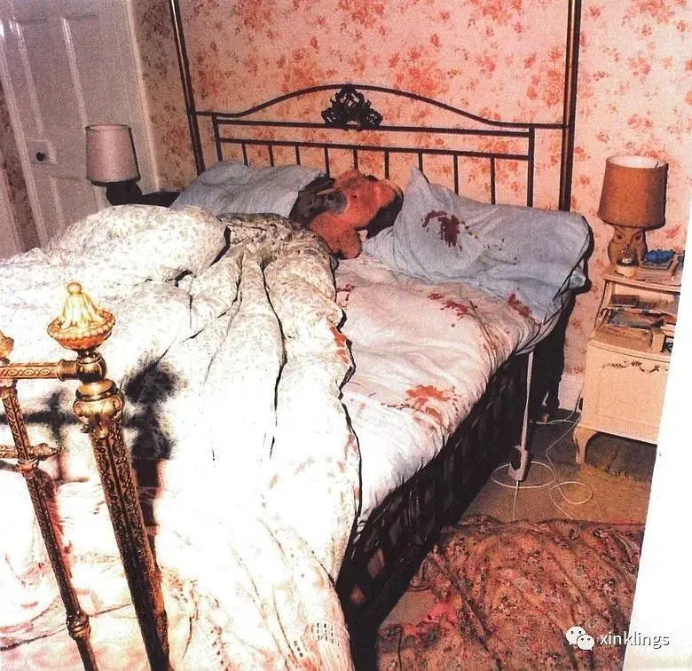
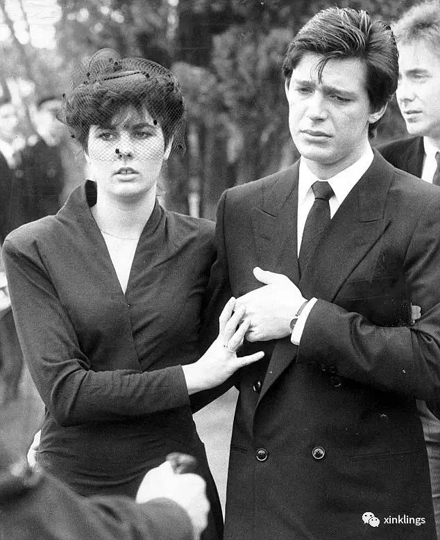
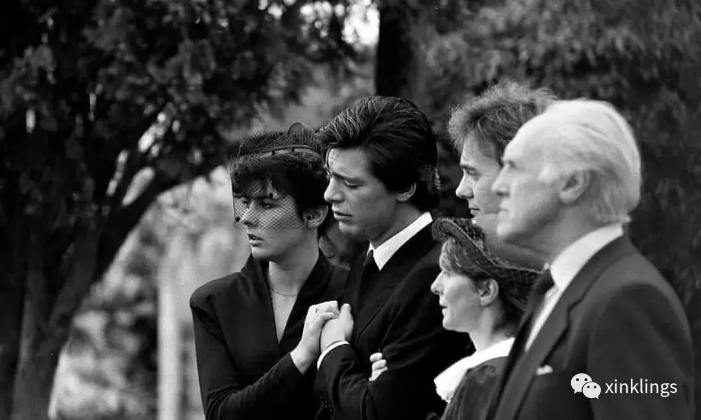
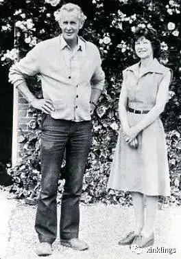
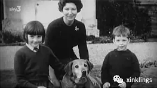
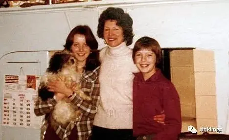
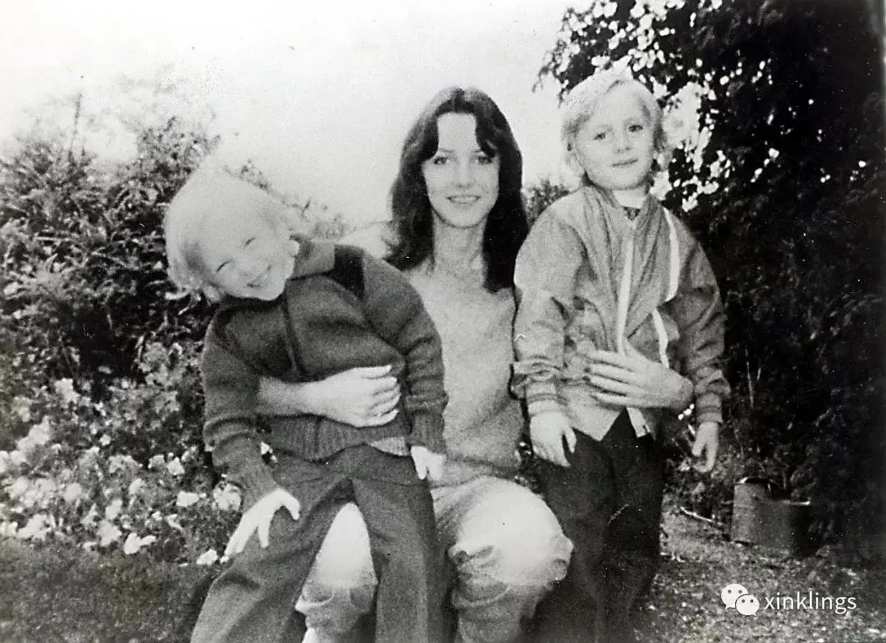
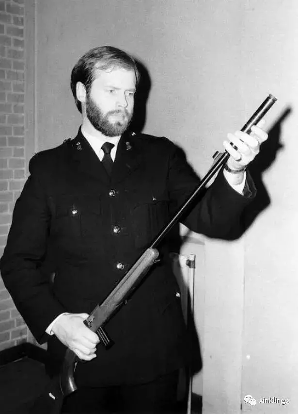
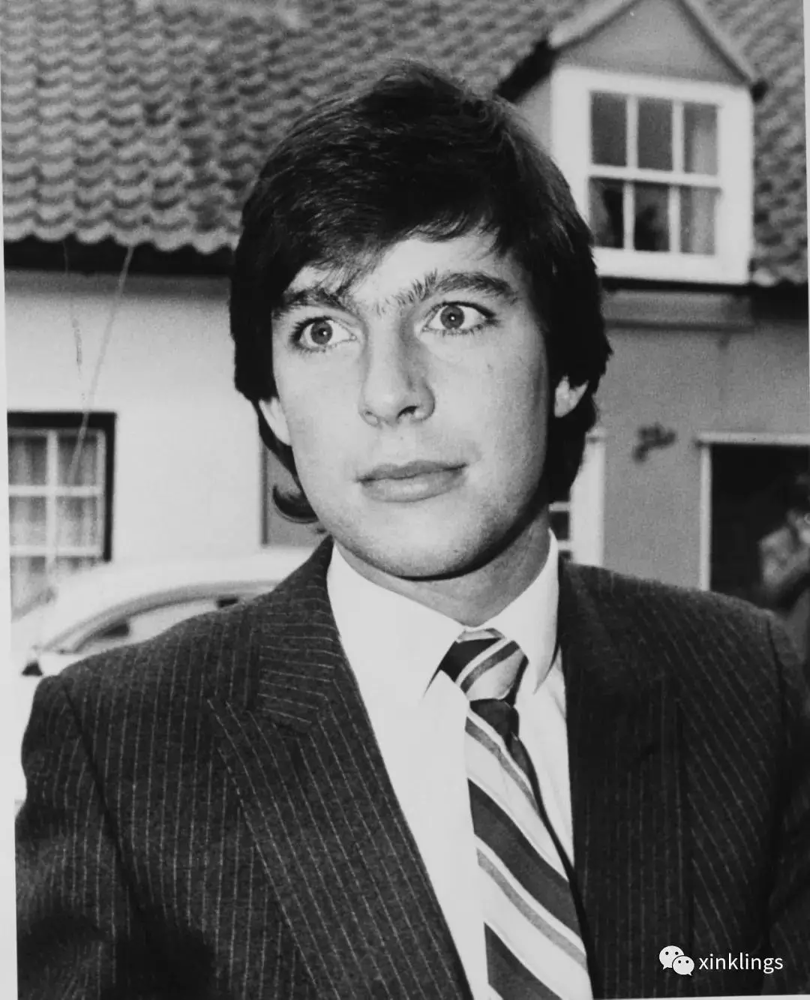
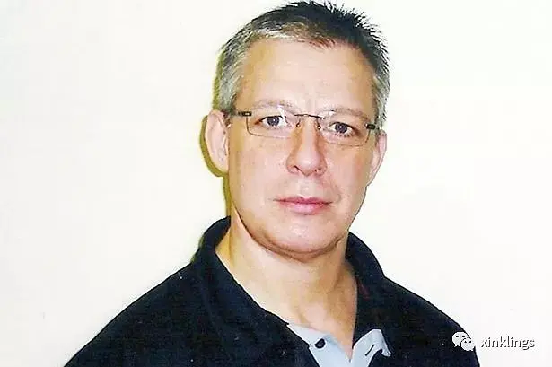

# 白屋农场谋杀案
Haley Haley 2020-01-26 04:39:26

1985年8月7日凌晨3:36警方接到杰里米班伯的报警电话，对方称不久前父亲打电话告知自己的姐姐举着枪发狂，随即电话就断了。杰里米不知道究竟发生了什么，在赶回家之前打电话报警。警方赶到班伯家的白屋农场不久，杰里米也到了，按照他给警察画的房屋平面图，全副武装的警察闯进班伯家，找到了杰里米的养父母内维尔，君，姐姐希拉，还有妹妹的双胞胎儿子丹尼尔和尼古拉斯，五人全部中枪身亡。内维尔显然奋力反抗过，他的血从楼上一直延伸到楼下，身上除了枪伤，还有枪柄猛力击打的伤痕。丹尼尔和尼古拉斯脑后中枪，似乎是在睡梦中被杀。君倒在卧室床边的地上，被攻击时应该已经惊醒。希拉喉部中枪，手边是一把长杆来复枪，不远处还有一本圣经。

据杰里米介绍，希拉患有精神分裂，警方初步判定希拉发病持枪杀害全家后自杀。杰里米强烈要求警方毁掉被血浸透的地毯和床具。鉴证人员在班伯家待了两天，拍了数百张现场照片。班伯家惨案发生三天后，杰里米和他的表亲领回了班伯家的钥匙，得以重新出入。

媒体头条报道了养女发狂杀害全家的新闻。在班伯家的葬礼上，杰里米的女友搀扶着悲痛欲绝的杰里米。

## 班伯一家

内维尔曾是皇家空军的飞行员，1949年和君结婚后继承了家里的300英亩田地，搬到伦敦东北的埃塞克斯县。无法生育的夫妇在1957年领养了三个月大的希拉，三年多后又领养了六个月大的杰里米。君笃信宗教，患有抑郁症，严格管教希拉和杰里米姐弟俩，可是两个孩子各有各的问题，没有按照君的想法长大。希拉两次被学校开除，内维尔和君不得不为她筹划不同的道路，将她介绍给模特公司。起初漂亮的希拉很受欢迎，事业颇有起色，然而不久关于她吸毒滥交，脾气怪异的传闻尘嚣日上，随着她怀孕，模特事业算是无限期搁置下来。

1974年才17岁的希拉怀了科林的孩子，内维尔和君安排她做了流产手术。从那时起，君和希拉的关系迅速恶化，君无法容忍希拉未婚先孕，叫她“魔鬼的孩子”。

1977年希拉和科林结婚，在两次意外流产后，生了双胞胎儿子尼古拉斯和丹尼尔，1980年，两个儿子才一岁，科林出轨，夫妇分居。希拉受到非常大的打击，一次因为科林抛下自己和其他女人幽会，砸碎了玻璃割腕。

事业不顺，婚姻又失败，希拉的精神状况越来越差，不得不入院治疗。她以为魔鬼给了她把其他人变成魔鬼的能力，还以为自己的两个孩子是“魔鬼的孩子”。她告诉医生自己有能力杀死孩子，也可以让他们为自己杀人。

离婚后希拉和科林共同抚养孩子，1985年3月希拉再次入院，孩子们大部分时间都和科林一起。8月尼古拉斯和丹尼尔被安排和母亲希拉一起在外祖父家的农场住一周，接下来就会跟着父亲科林一道去挪威度假。

杰里米是私生子，被内维尔和君领养后在私立学校和寄宿学校学习。他不愿意外人知道自己是被领养的身份，在学校不是受欢迎的小孩。长大后杰里米利用自己的长相吸引了很多人，有男有女。1982年他开始在内维尔的农场工作，工资不高，但内维尔把家族的小屋拨给杰里米居住。小屋离班伯家约5分钟车程。

## 案发前

8月4日希拉和双胞胎丹尼尔和尼古拉斯来到班伯家准备住上一周。6日晚杰里米回家吃晚餐，内维尔和君提到，鉴于希拉的健康，不如把两个孩子送进白天的寄宿家庭，希拉没有反对。当晚九点半左右杰里米离开。内维尔的秘书也在同时打电话给内维尔，内维尔听上去很生气，没说几句就挂了电话，这让秘书很吃惊，因为内维尔平时脾气很好。晚十点君的妹妹也打来电话，她分别和君还有希拉通了话，对话和平常一样，没有什么特别。

按杰里米的说法，他6日在父母家时给来复枪上了膛，本来是打算用来打兔子，最后没用上，就随手把枪和一盒子弹放在厨房的餐桌上了。来复枪是内维尔一年前买来猎杀野兔的，随枪还带着消音器和电子瞄准器。杰里米说6日他给枪上膛时消音器和瞄准器已经被取下了，而杰里米的表兄称他每次拜访班伯家时枪都带着消音器和瞄准器。

## 现场

现场共找到25枚弹壳，意味着假如首次击发前如果枪是满膛的，则需要至少重新上膛两次。枪膛共可装10枚子弹，需要一枚枚把子弹放进去。

内维尔倒在厨房地板上，身着睡衣，现场凌乱，此前似有挣扎。他头部中枪六次，属近距离射击，身上还有两枚约两尺外射击的伤口。警方根据散落的弹壳判断内维尔在楼上被击中4次，随后逃到楼下与凶犯扭打，凶犯又朝他开枪四次。

君穿着睡衣，光着脚，身上和衣服上全是血迹。她倒在主卧室的门边，眉心正中一枪，头部右边另中一枪，颈部，右前臂，右胸，右膝部尚有其他枪口。

双胞胎丹尼尔在床上被杀，脑后共中五枪，均为一至二尺开外射击，尼古拉斯共中三枪，全是近距离射击。

希拉倒在君和内维尔的主卧里，穿着睡衣，光脚，下巴和喉部各中一枪，身上没有防卫伤口。血液集中在她睡衣上半部，证实她被射中时坐着。下巴处的枪伤约为3英寸远射出，而喉部属于枪口直接抵住皮肤射出。病理学家认为希拉下巴的枪伤也是致命伤，但不至于立即致命，希拉应为下巴首先中枪，才导致喉部大量出血，此后喉部中枪立即死亡。希拉的血液中检出了抗精神疾病药物氟哌啶醇，她几天前还服用大麻。

最先检查希拉的枪械专家作证希拉的手脚干净，没有血迹，火药痕迹或污迹。如果希拉是凶犯，必须两次重新为枪上膛，手上必定留有枪膛的润滑油。

取下了消音器及瞄准器的来复枪放在希拉身旁，君的圣经在希拉的右侧，圣经上除了君的指纹，还有另外一些无法辨认的指纹。来复枪上有一枚希拉的右手无名指指纹，枪杆和扳机上有杰里米的右手食指指纹，枪身上还有三枚无法辨认的指纹。

（装上消音器的来复枪以希拉的身高很难完成自杀行为）

## 被捕

因为警方认定是希拉杀害了父母及双生子后自杀，所有人的遗体被交还给杰里米，成年人都被火化，两个孩子被埋葬。最先向警方投诉的是杰里米的表亲，他们在守灵夜上见到曾在葬礼上痛不欲生的杰里米居然边笑边和其他人开玩笑，完全没有一点悲伤的影子。葬礼结束不久，杰里米就和一帮朋友去阿姆斯特丹旅行，买了大量大麻。杰里米父母的财产被陆续卖掉，希拉的裸照也被杰里米以£20,000的代价卖给太阳报。

被允许重新进入班伯家后，杰里米的表兄在枪支柜里找到了来复枪的消音器。他在家人陪同下检查了消音器，发现上面有红色油漆和血迹，表面有磨损。数日后警方得到这把消音器，在表面和内部都找到血迹。

惨案发生一月后，杰里米的女友朱莉修改了证词，称杰里米杀害全家策划已久。起初朱莉全心全意支持男友，在一个月以内，两人就杰里米是否是案犯发生数次争执，杰里米试图分手。朱莉的新证词提到1984年7月至10月间，杰里米数次提到希望除掉家人，他对”老父”，”疯狂的母亲”和”一无所成的姐姐”，还有她的两个”令人讨厌的儿子”都充满厌恶。杰里米谈起要给父母下药，枪杀二人后再纵火烧了房子。

朱莉还说，8月6日，案发前晚杰里米给自己打电话说整天都在想着杀人，“今天就要动手”。次日凌晨三点左右她再次接到杰里米的电话，对方说：“没事了。农场出了事。我整完没睡……晚安亲爱的，我爱你。”朱莉的室友作证她确实接到这个电话。数小时后，杰里米又打了电话给她，告诉她希拉疯了，警察正在赶往班伯家的路上。等朱莉到了杰里米住的小屋，杰里米悄悄把她拉到一边说：“我要是个演员就好了。”

晚上朱莉问杰里米是否作案，杰里米否认，但承认自己一手策划了案子，他花£2,000雇了一个朋友做凶手。

朱莉修改证词的第二天杰里米被捕。她所说的作案的那个朋友在案发时有不在场证明，很快获释。杰里米辩解称朱莉因为自己想要分手，因爱生恨才报复自己。

## 庭审

庭上朱莉成了检方的明星证人。按照检方的理论，杰里米于1985年8月7日凌晨偷偷从自己住处返回父母家中，用父亲合法持有的来复枪杀害了父母姐姐及外甥共五人。失而复得被表亲在班伯家的枪支柜里找到的消音器上的血迹证实属于希拉，而希拉不可能在射中自己下巴和喉部后还有能力把消音器放回楼下柜中。

而辩方的理论自然是希拉精神病突发，用枪射杀四名家人后自尽。

案发现场在第一时间没有得到有效保护，很多关键证据遗失或已经被无关人等接触。例如希拉尸体旁找到的圣经和枪上，警方最初的检验并未在其上找到杰里米的指纹，然而在二次鉴证过程中，杰里米的指纹却又出现了。

杰里米在庭审中一直认为自己能全身而退。没想到的是陪审团以10比2的比例判处他谋杀罪名成立，他被处以五项终身监禁，25年内不得假释。

杰里米现年59岁，声称自己无罪，多年来在律师的帮助下数次提出上诉均被驳回。

