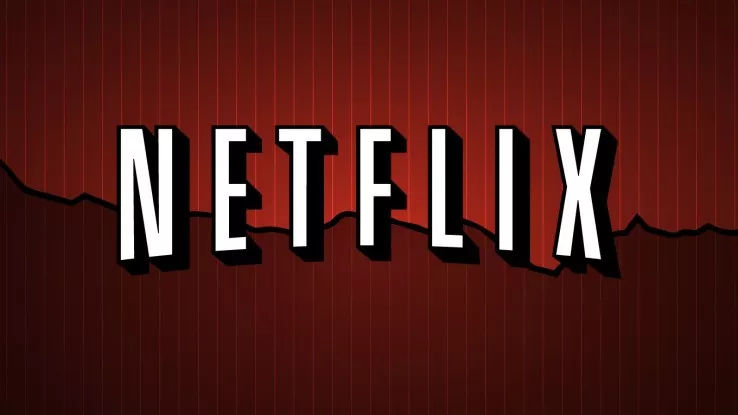
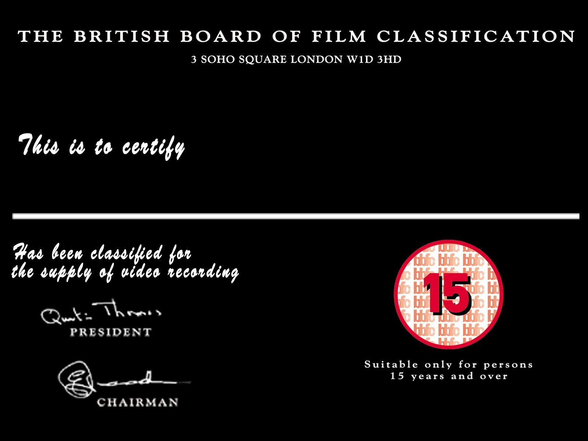
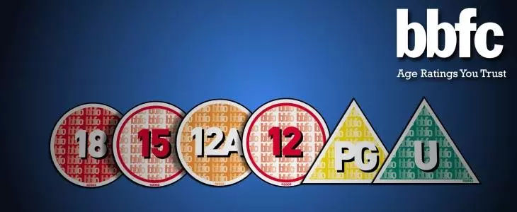
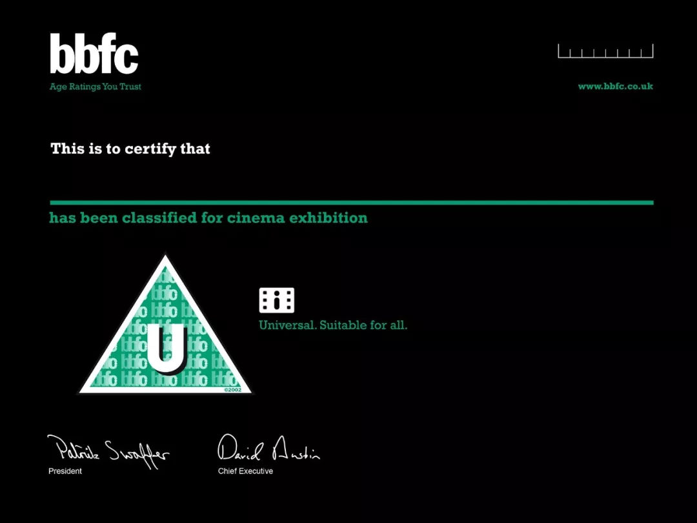
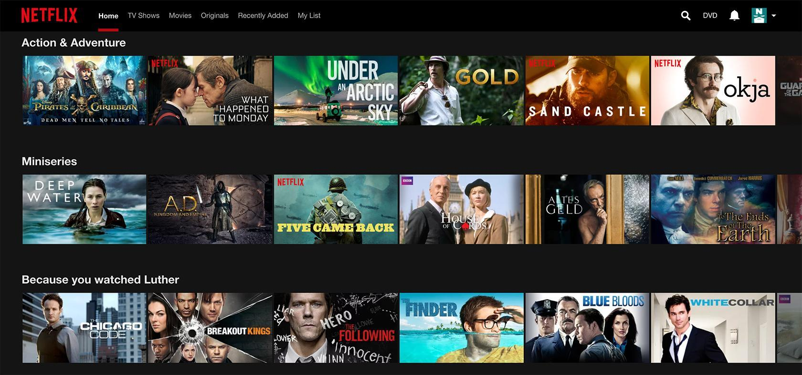

2019-03-14 13:44 来源:[西柚看电影](https://www.sohu.com/a/301195822_100264497?spm=smpc.content.content.1.1583814003477EIED39R)

3月14日，著名的互联网影视在线服务商Netflix宣布与英国电影评级委员会合作，对在英国境内上线的影视内容进行分级！

影视分级主要是要保护18岁以下的青少年不受潜在有害形象的危害，对涉嫌暴力、威胁和恐怖等等不利于青少年的内容进行区分警示家长和潜在观众。比如在2017年英国上映的院线电影《金刚狼3》是当年投诉最高的电影，《金刚狼3》的观众认为影片的暴力太过了，以至于15级分级不够，他们认为18级分级更合适。

最新研究表明，英国80%的家长担心孩子在视频点播服务上看到不合适的内容。在与英国电影分级委员会（BBFC）建立新的合作关系后，Netflix将在其英国服务的视频内容纳入年龄分级制。

根据协议Netflix与BBFC的约定，这家流媒体巨头公司将使用手动标记系统和自动评级算法为其线上内容生成BBFC的年龄评级，而BBFC将承担审查角色。Netflix和BBFC将共同努力，确保Netflix的分级符合BBFC英国电影分级委员会的标准。

**英国电影分级制度目前实行的规则**

"U"级：普通级——适合所有观众。在此级节目中只能偶尔使用"damn"(该死)、"hell"(见鬼、混蛋)这类轻微的咒骂语言，极少使用其他温和的咒骂语言。

### "Uc"级：特别适合儿童观看。

### "PG"级：家长指导级。

### "12"级：适合12岁以上或是成人观看。

### "15"级：适合15岁以上或是成人观看。

### "18"级：适合18岁以上成人观看。

**关于英国电影分级委员会：它是一个独立的组织，它的存在是为了规范和分类在电影院放映和在流媒体上发布的电影内容**。通过颁发一份分级证书来实现这一点，该证书基于其认为对所涉影片适当的年龄限制——并且，如果认为有必要，还要求影片的发行公司对影片进行更改，通常以删减的形式。在大多数情况下，这些删减与对特定年龄类别（性、暴力、毒品和粗口）而言过于极端的情节有关。过去有多部恐怖片就没有通过英国电影分级委员会的审查。

根据研究还表明，90%的家长认为在下载或在线播放电影时显示年龄分级很重要，92%的家长认为视频点播平台显示他们在电影院或DVD、蓝光上预期的相同年龄分级很重要。

**Netflix的编辑创意总监Mike Hastings**说：BBFC是英国一个值得信赖的资源帮助，为家长和消费者提供分类信息，我们很高兴与他们扩大合作关系。我们与BBFC的合作使我们能够确保我们的会员始终在媒体上播放适合他们及其家人观看的内容。”

**英国数字部部长Margot James**补充道：我们的目标是让英国成为最安全的在线场所，这意味着让年龄分级的父母知道并信任所有在线电影和视频游戏。我欢迎Netflix和BBFC今天宣布的创新合作，但还需要做更多工作。”

在上周四3月7日英国伦敦的媒体与电信行业会议上，**英国文化部部长Jeremy Wright**表示将对在线视频内容进行严格监管：英国过去对电视网络的监管因其稳健性和有效性而收到广大消费者欢迎，并为我们如此重视的许多文化和经济利益制定了框架，尤其是在有害及不准确的内容方面，它提供了重要的消费者保护，但是现在随着相对较新的互联网按需随选观看的平台出现，许多领域的规则还不健全。

虽然BBFC的分级仍然是关于电影发行的建议，自从1912年成立以来，但1984年的《录像制品法》首次赋予它法定权力。几乎所有的英国视频发布都必须由BBFC进行审查和分级——**可以说是西方世界任何地方最严格的视频审查制度。**不过，英国的分级制度也难免引起争议并一直存在，另一个副作用是既考虑到艺术价值的分级政策，又考虑到BBFC不断调整这些政策以反映社会和文化的变化。

互联网流媒体观影逐渐成为主流，严格的审查分级制度等规则，也将会慢慢出现在各个地区的影视行业。目前中国还没有实行电影分级制度。[返回搜狐，查看更多](https://www.sohu.com/?strategyid=00001&spm=smpc.content.content.2.1583814003477EIED39R "点击进入搜狐首页")

责任编辑：