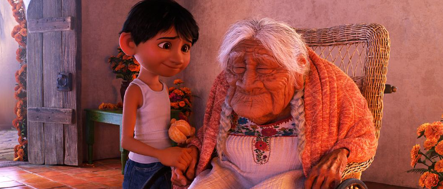

速读摘要

现在虽然一时半会儿又看不着了，但好在等到了皮克斯的最新力作——《1/2的魔法》。巴利对魔法史了若指掌，对远古时期的巫师英雄也如数家珍。伊恩还意外得知，其实巴利因为当年错过见父亲的最后一面，一直懊悔自责，内心比他更渴望见到父亲。在故事最后，当伊恩已经灰心丧气、失去希望时，也是巴利的坚持不懈，才让他们找到了宝石。尤其是父子、兄弟这种家庭温情戏，皮克斯实在是太拿手、太会戳人了。

原文约 2264  字  | 图片 38 张 | 建议阅读 5 分钟 | [评价反馈](https://static.app.yinxiang.com/embedded-web/clipper/#/Evaluating?d=2020-04-07&nu=52f4b187-acb6-4db7-99c0-38deb5f92da1&fr=myyxbj&ud=58b471&v=2&sig=C9BE6DBA3C3AD9D20B5F610F0307242B)

##  创意拉满，眼泪榨干，皮克斯又来催泪了

原创 有部电影 [有部电影]()**
提起好莱坞动画，很多人都会想到以创意著称的皮克斯。

近几年，皮克斯推出的《寻梦环游记》《超人总动员2》和《玩具总动员4》，从未让人失望过。

前段时间，国内院线一度传出恢复营业的消息，感动无数人的《寻梦环游记》也有希望重映。

现在虽然一时半会儿又看不着了，但好在等到了皮克斯的最新力作——**《1/2的魔法》。**

这张海报已经预告了本片涵盖的众多元素：魔法、精灵、异兽、公路冒险，以及兄弟情。

值得一提的是，在片中为主角巴利和伊恩兄弟俩配音的，正是“星爵”克里斯·帕拉特和“小蜘蛛”汤姆·赫兰德。

故事发生在一个由精灵、巨魔、异兽等神奇生物组成的魔法世界。

在远古时代，魔法力量非常强盛，人们热衷于学习和使用魔法，用来生产生活、进行娱乐活动，以及抵御恶龙。

但随着时间推移，简单高效的科技迅速普及，取代了魔法。

由于魔法对巫师的天分要求很高，往往还需要勤学苦练，所以渐渐地，学习魔法的人越来越少。

到了现在，魔法几乎已经从世界上消失了。

但男主尹恩从小就对魔法很痴迷，因为父亲在他出生不久就病逝了，他一直希望能用魔法和父亲再见上一面。

对父亲的思念，让尹恩成了一个内向的书呆子，他常常在家里对着收音机跟父亲聊天。

而他的哥哥巴利，更是一个狂热的魔法痴迷者。

巴利对魔法史了若指掌，对远古时期的巫师英雄也如数家珍。不过他性格热情开朗，跟伊恩一点都不搭，对父亲也似乎没什么深厚的感情。

每次伊恩想让巴利讲讲父亲的故事，他都嘻嘻哈哈地避而不谈，因此尹恩心里有点讨厌这个哥哥。

刚好今天还是伊恩的18岁生日，为了庆祝成年，他穿上了父亲的衣服，在心里暗暗许下几个小愿望。

比如，请同学参加生日聚会，有朝一日和爸爸见面向他学习驾驶技术，一起徒步旅行，一起分享生活点滴……

可他刚许下愿望，生日的好心情就被巴利给毁掉了。

巴利先是不小心弄破了伊恩身上父亲的衣服；接着，又把他鼓起勇气邀请同学参加聚会的事情搞砸了。

晚上回家后，尹恩沮丧无比，却没想到自己意外收到了父亲生前留给他的生日礼物——

一把魔杖、一颗宝石，和一句咒语。

据说这三样东西可以让父亲复活一天，跟家人共度一日。

于是伊恩立马拿起魔杖，念动咒语，父亲的身形也瞬间出现在了房间里。

但他法力微弱，很快就把宝石的能量耗尽，最后只悲催地变出了“一半”父亲：有双腿，但没有上半身。

这把兄弟俩吓了一大跳，但转念一想，这一半的父亲也有一天的生命。如果能尽快找到宝石补充能量，那么跟“完整的父亲”见面的愿望，还有机会实现。

就这样，兄弟二人带着“一半”父亲，踏上了一场寻找宝石的冒险之旅。

说起来，本片的英文名Onward是“前进”和“旅途”之意，而中文片名译为《1/2的魔法》也很贴切——**两个半吊子的魔法兄弟，和“半个”父亲的奇妙组合。**

影片接下来的剧情，也正如我们期待的那样惊险刺激——

为了弄一张地图，他们在一间古老的巫师商店里遭遇了火海逃生；

为了练习魔法给汽车加油，伊恩一不留神把巴利变成了小小人；

还因为得罪了一群暴躁的精灵小飞侠，上演了一出生死时速的追车大逃亡。

这场戏最有趣的地方，就是因为巴利变小了，所以伊恩这个对车一窍不通的毛头小子，不得不现学现卖地飙车：

而按照地图指示，之后的旅途更加凶险难料，因为他们必须途径一条遗失了千年之久的神秘古道。

在进入古道前，还有一个巨大的考验——意念之桥，即用“坚信有桥”的意念走过一道天堑空桥，而桥下就是无底深渊。

只要一步信心不足，就会万劫不复。

在有惊无险地过桥之后，兄弟俩又产生了分歧。

伊恩想要按地图的指示走，但地图又说要遵从内心，恰好巴利发现了一条偏离地图的线索……

伊恩最终拗不过，只好将信将疑地跟着巴利继续前进。

他们按照“乌鸦指路”的线索，走进了一条神秘幽暗的河谷隧道，一路上，见证了远古时期的魔法圣地上古之渊；

也经历了《夺宝奇兵》式的机关解密冒险。

但等他们抵达终点、推开命运之门时，却突然回到了家乡小镇——仿佛命运给他们开了一个玩笑，九死一生的冒险到头来只是一场空。

看到这里，估计很多小伙伴也会陷入疑惑，但稍加思索便不难理解——

**其实很多伟大的冒险旅途，最终都未必能抵达目的地，但整个旅途中遇到的艰险、与同伴共同应对的经历，还有自己得到的成长，这些才是最大的意义。**

这次旅途，就让伊恩了解到巴利这个平时大大咧咧的哥哥，内心也有柔软的一面。

比如在追车的危急时刻，尹恩早已手足无措，而巴利会在旁边冷静耐心地鼓励他；

当伊恩忧心忡忡、犹疑不决时，巴利也会想方设法地用尬舞来放松心情，给弟弟打气。

伊恩还意外得知，其实巴利因为当年错过见父亲的最后一面，一直懊悔自责，内心比他更渴望见到父亲。

在故事最后，当伊恩已经灰心丧气、失去希望时，也是巴利的坚持不懈，才让他们找到了宝石。

但他们没想到，宝石被取走后，一头恶龙也被唤醒了。

这时24小时的时限将尽，一边需要有人抵御恶龙，一边是与父亲见面的最后时机，兄弟俩会如何取舍抉择呢？

最后，是伊恩拿起魔杖抵御恶龙，把跟父亲见面的机会留给了哥哥巴利。

而他自己，只是透过缝隙远远地看到了父亲的背影。

这样的结局其实也在意料之中，因为伊恩早就意识到，在成长过程中，虽然缺少了父亲的陪伴，但一直有一个亦兄亦父的大哥哥，守护在自己身边。

而他许下的跟父亲学开车、一起旅行、一起分享生活的愿望，也都一一在哥哥这里得到了实现。

总体来看，这部动画在皮克斯的作品序列里，可能不算很亮眼，魔法世界、寻宝冒险的故事也不新鲜，但皮克斯在制作层面和情感细节方面的把控，总有化腐朽为神奇的力量。

尤其是父子、兄弟这种家庭温情戏，皮克斯实在是太拿手、太会戳人了。

最后兄弟相拥的那一幕，让人心里咯噔一下，忍不住瞬间泪目。

有人说，皮克斯的泪点简直是长在了观众身上。

这话一点都没错，从1995年推出影史第一部电脑CG动画《玩具总动员》开始，皮克斯至今陪伴我们走过了整整25年，虽然作品数量不多，却都是精心打磨的诚意之作——

从《怪兽电力公司》《海底总动员》《机器人瓦力》，到《飞屋环游记》《头脑特工队》和《寻梦环游记》……这一部部耳熟能详的作品，都曾给我们带来无数感动。

瓦力&伊娃两口子

感谢有这样的皮克斯，也期望在疫情过后，我们还能看到更多皮克斯作品，带来新的创想和新的感动。

也许电影的职能并不是治愈人心，但我相信，能够治愈人心的电影一定很伟大。

也许是国内最认真的电影自媒体
