## 穿越和悬疑混搭的韩剧，每集甩出一个高能

原创 有部电影 有部电影 *今天*

最近给大家安利了不少高分韩剧，题材类型各不相同，或许你已经入了医疗剧《机智医生生活》的坑，或者正打算围观“抓奸大戏”《夫妻的世界》。

  

如果以上两部都没有戳到你，那么还可以看看今天聊的这部悬疑剧——**《365：逆转命运的1年》。**

  

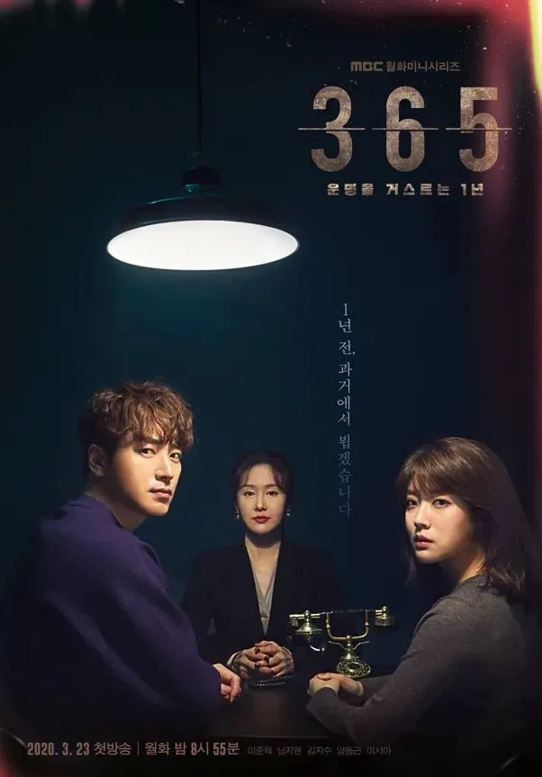

  

准确来讲，这是一部带有穿越设定的奇幻悬疑剧。

  

剧中有个叫李辛的精神科医生，随机选取了一批人，邀请他们参加一次时空穿越。

  

通过一个时空缝隙，她可以将人们当下的记忆送回到一年前的身体内，给大家提供一次重置人生的机会。

  

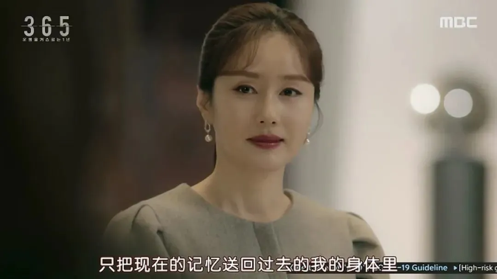

  

为了让人们相信自己有穿越能力，李辛会给接到电话的人“预言”一个即将发生的事件，比如重大事故的发生地点和伤亡人数，下一期彩票的开奖号码等等。

  

最终，有十个人相信了李辛，决定穿越回一年前改变自己的人生。

  

比如有人专门背下了彩票号码，为的就是回到过去成为土豪。

  

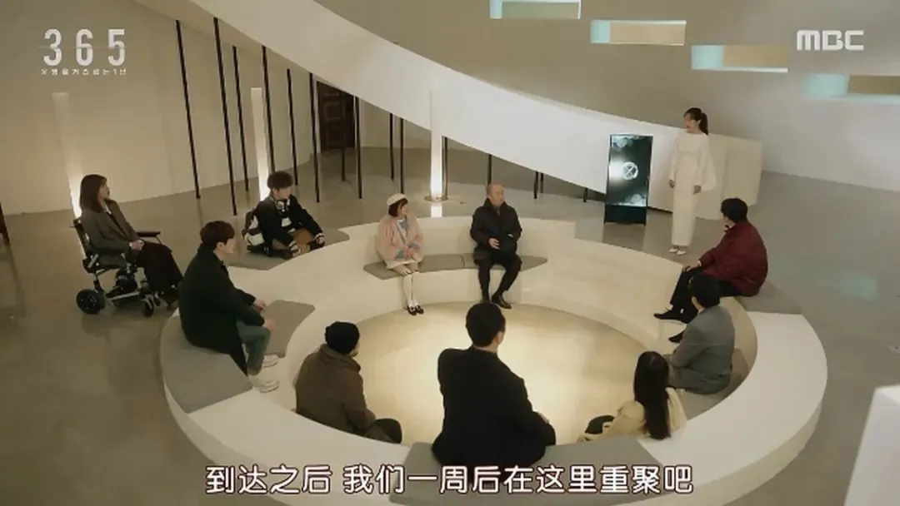

  

不过在这其中，身为刑警的男主池亨洙，回去却不是为了中彩票。

  

一年前，他被一个出狱的犯人寻仇报复，导致他最尊敬的前辈被连累，惨死在自己家中。

  

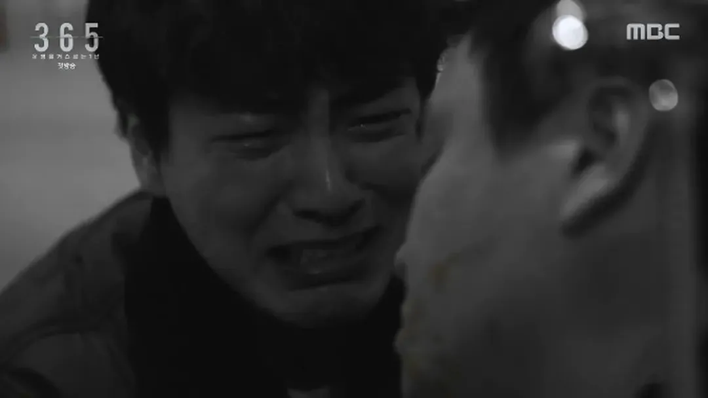

  

那之后的一年里，男主都无法摆脱负罪感，变得无心工作，甚至想要辞职了之。

  

而这次穿越的机会，恰好可以帮他救回前辈的性命。

  

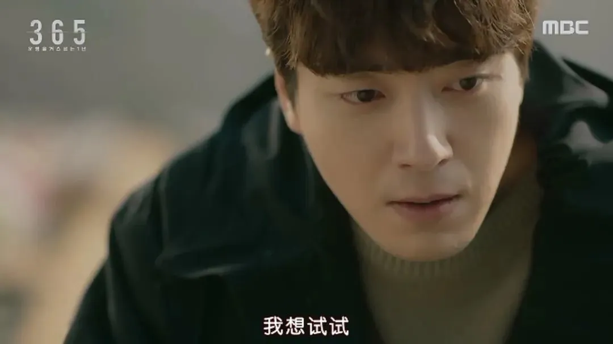

  

经过一阵晕眩般的穿越体验，男主发现自己真的回到了一年前，前辈还活得好好的。

  

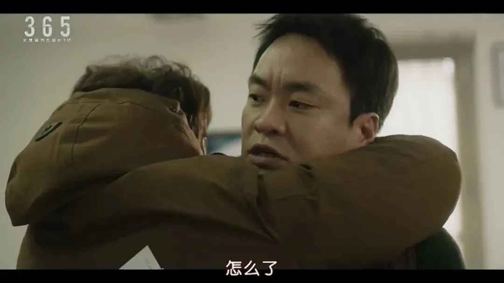

  

为了不让前辈惨遭毒手，男主利用“预知”外挂，展开了一系列的魔幻操作。

  

他先是神速抓捕了一个诈骗案的逃犯，借此向上级申请了半天休假，并强烈要求前辈代替自己值夜班。

  

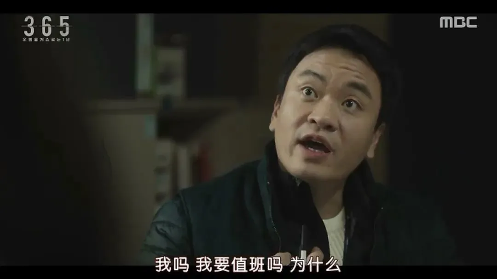

  

然后，男主跟踪了那个想要寻仇的犯人，在他伺机向当年的法官寻仇时将人当场逮捕，完美避免了前辈被杀。

  

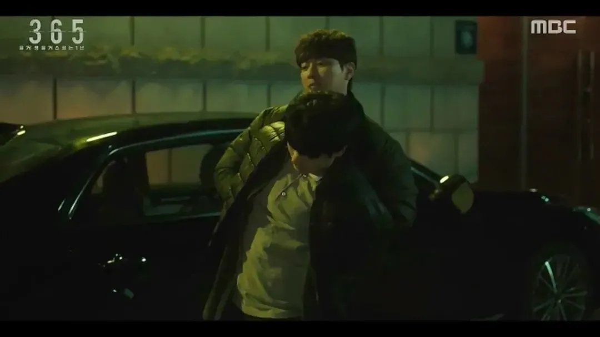

  

于是，不明真相的前辈当晚吃着男主买来的炸鸡，平安无事地度过了这一天。

  

男主也凭借穿越，弥补了一生的遗憾。

  

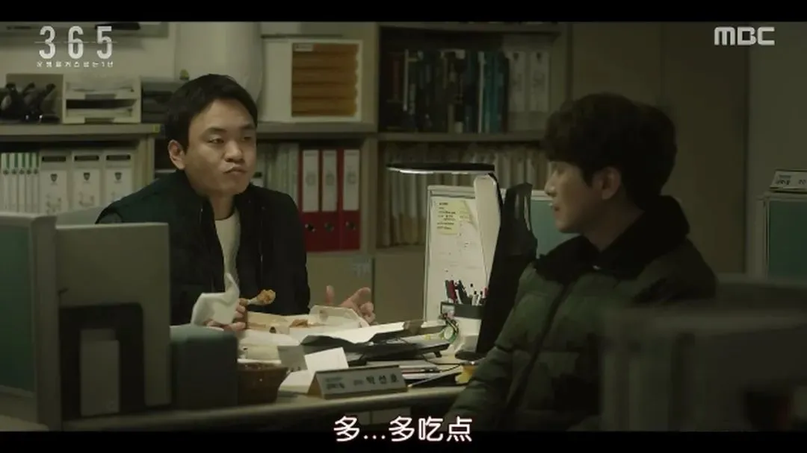

  

和男主一样，其他穿越回一年前的人，都多多少少完成了自己的心愿，有人买了彩票，迅速变成了土豪；有人把握住了股市变化，即将去国外发展；还有人利用这次机会，准备重考名牌大学。

  

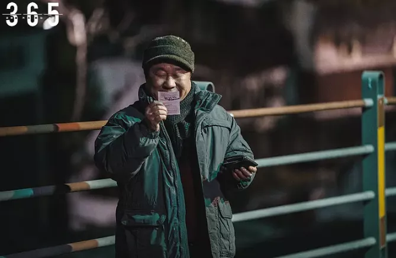

  

等他们按照约定在李辛医生那里重聚时，每个人看上去都精神焕发，仿佛重生了一般。

  

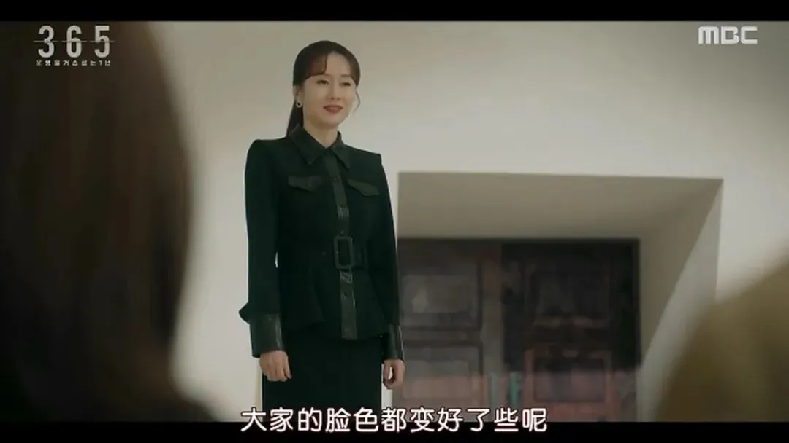

  

但在这其中，有一个人却没有那么开心，那就是女主申佳贤。

  

她在一年前是个小有名气的漫画家，事业正处于上升期，即将与经纪人男友完婚。

  

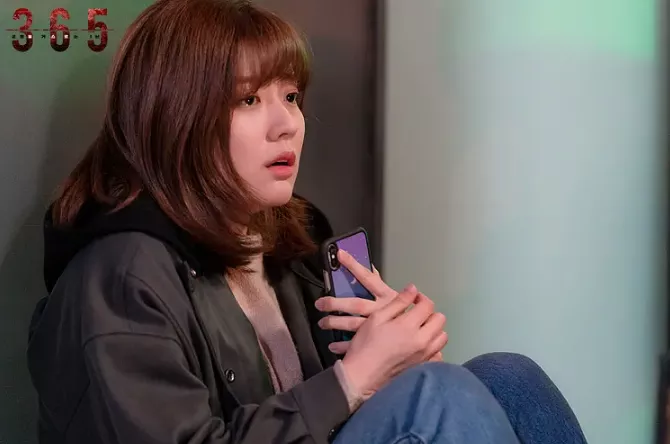

  

然而后来却不幸遭遇了一起车祸，导致双腿残疾。

  

这个变故给女主带来巨大打击，在进行康复训练的过程中，她变得日渐消沉，甚至打算与男友分手。

  

  

而通过这次穿越，她躲过了那场车祸。

  

恢复了健康的女主无比欣喜，决定借用这个机会，让自己变成更好的人。

  

她改变了不与粉丝合影的习惯，对待闺蜜助手和男友也更加和善。

  

  

但就在一切顺风顺水的时候，女主意外发现男友出轨了闺蜜，还没高兴上几天，就又陷入了情伤中。

  

痛苦之余，女主意识到穿越的结果好像并没有自己想象的完美，虽然恢复了行走的能力，但又陷入了新一轮的挑战。

  

  

从这个角度就能看出，这部剧通过穿越引发的蝴蝶效应，展开了延伸思考。

  

相信每个人都曾做过这样一种假想，**在人生的某个特定阶段，如果换一个选项，之后的人生会不会变得更好？**

  

**早知道现在如此，当初我就不应该…**

  

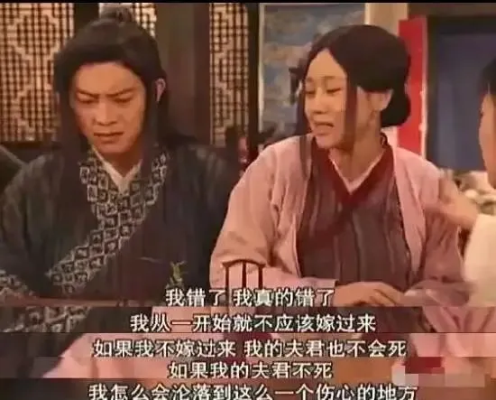

  

正是因为有这样的假想，穿越题材才会如此受人欢迎，它本质上就是通过虚构的故事，去满足人们的好奇心，让人们看到尽可能多的人生发展方向。

  

  

但这部《365：逆转命运的1年》与众不同的地方在于，它的剧情并不是简单粗暴的白日梦套路。

  

比如剧中穿越回去的一个保安大叔，确实买了彩票中了大奖，但他并没有立刻挥霍无度，而是继续上班，准备找到合适的接班人才离职，因为自己的性格就是这样，喜欢按照契约办事。

  

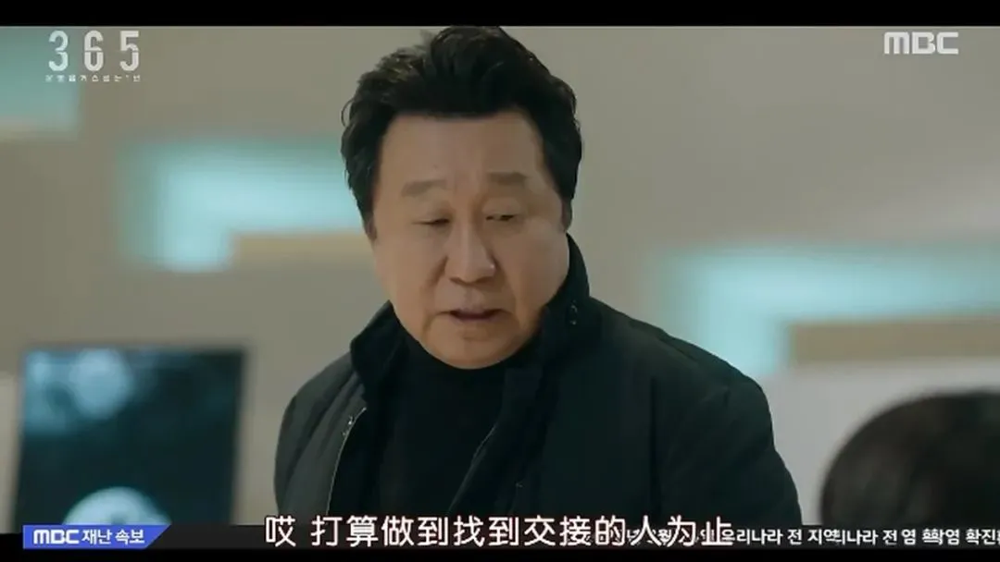

  

所以这部剧带有明显的思辨意味，它向观众抛出的问题是——**当你拥有了重来一次的机会，会让自己彻底改头换面，还是会坚守自我？**

  

剧中主角的经历让人看到，即便能够穿越，但每次选择之后，等待我们的仍然是未知，人生有可能变得更好，也有可能会迎来更糟糕的结果。

  

  

在参加穿越的那十个人中，并不是所有人都过上了更好的生活。

  

比如其中一个快递小哥，就因为穿越晕眩的副作用，在车祸中当场丧生。

  

人生还没来得及重启，就戛然终止。

  

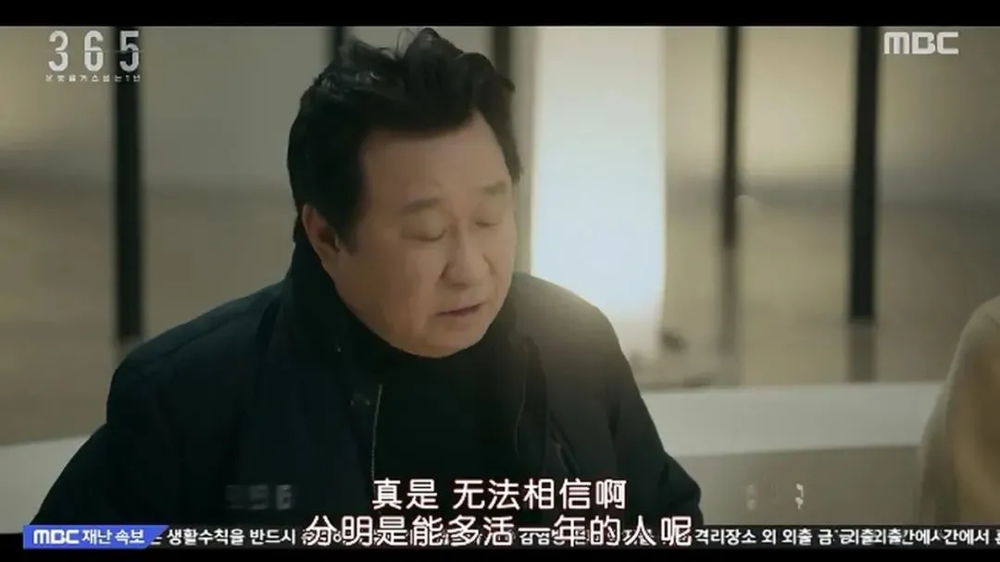

  

李辛医生也没有料到这个意外，她自感责任重大，于是向其他人保证，如果有需要帮助的时候，一定要来找她。

  

对于这个承诺，她也说到做到。

  

比如经历情伤的女主，因为无法承受男友出轨的事实，开始后悔参加了穿越。

  

李医生就为她进行心理疏导，劝她集中精力去想想如何利用重启的人生，做一些更有意义的事情。

  

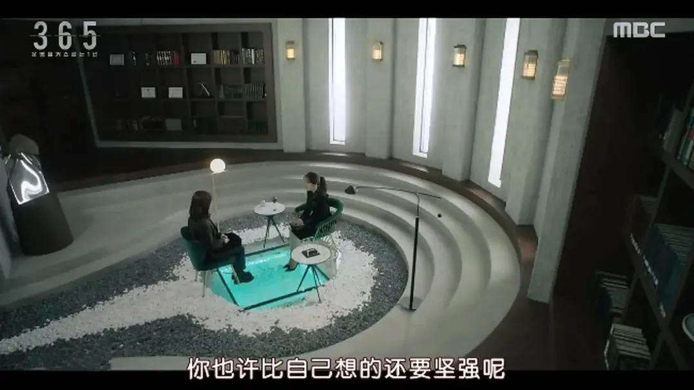

  

然而，这个李医生也并非一个单纯的大好人。

  

就在女主成功躲过车祸的那天晚上，她接到闺蜜打来的道歉电话，两人正说着，闺蜜那头就传来巨大的声响。

  

等女主赶到现场，才发现闺蜜居然被人撞死了，时间、地点跟自己的那次车祸几乎一模一样……

  

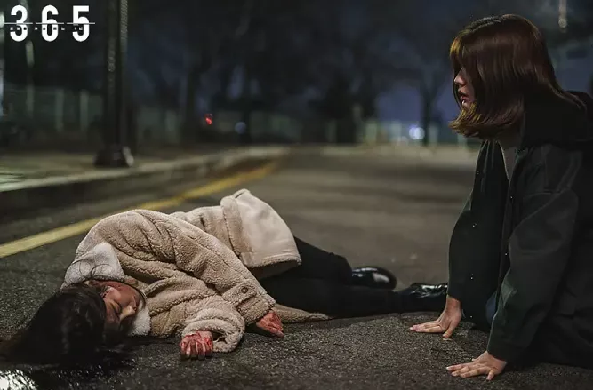

  

这让女主意识到，或许车祸根本无法避免，只不过自己通过穿越逃过一劫，害得闺蜜丧了命。

  

与此同时，一同穿越的一个电竞小哥，也发现了一个不可告人的秘密——**其实大家并不是被随机选中的，而是冥冥之中有着微妙的联系。**

  

在他看来，穿越后最先身亡的快递小哥，就是一个死亡预告，在警告大家：自己不是中了穿越大奖，而是被邀请到了一个死亡笔记般的游戏中。

  

  

就在每个人满足于重启人生的喜悦中时，电竞小哥已经开始暗中猜测这场穿越的死亡顺序。

  

他曾告诉男主，快递小哥之后，女主和保安大叔很可能就是下一个遭遇意外的人。

  

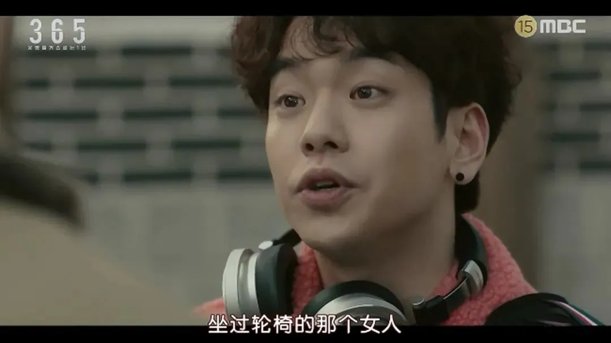

  

很快，他的猜测得到了印证，女主的闺蜜车祸身亡后，保安大叔也突然心脏病发，死在了回家的路上。

  

而随着剧情推进，穿越的十个人就像《无人生还》中的人物一样，开始一个接一个地离奇死亡……

  

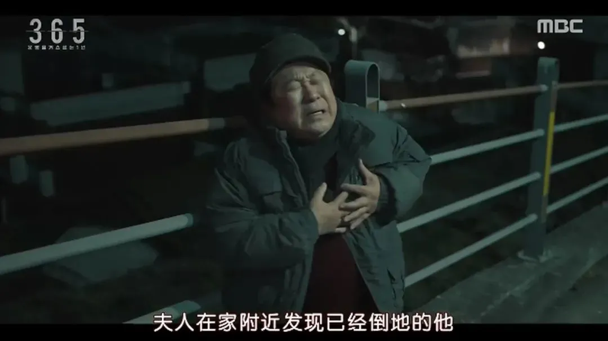

  

这是因为，他们确实不是被随机选中，而是被有意组织到一起的。

  

之前造成女主瘫痪的那个肇事司机，也在这十人之中。她还曾警告女主，不要把李医生想得太好……

  

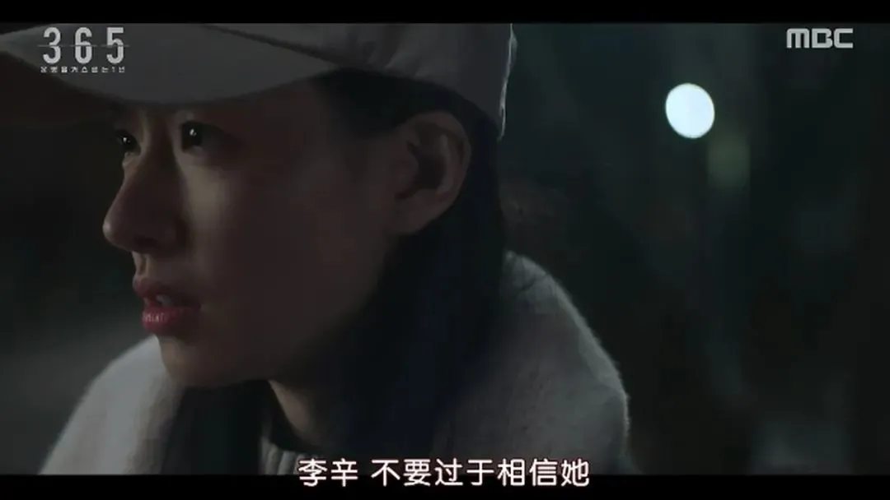

  

从目前更新的几集来看，虽然背后的阴谋还没揭晓，但节奏上基本是每集一高能，每个穿越者的身上都留下了不少伏笔，让人忍不住期待后续的发展。

  

最值得一提的是，这部改编自日本推理小说的韩剧，已经将日本本国的改编版远远甩在了身后。随着剧集播出，评分还在持续增长，目前已达豆瓣8.7。

  

对这个题材感兴趣的小伙伴，可以赶紧跳坑了！

  

也许是国内最认真的电影自媒体

长按扫描二维码关注 
