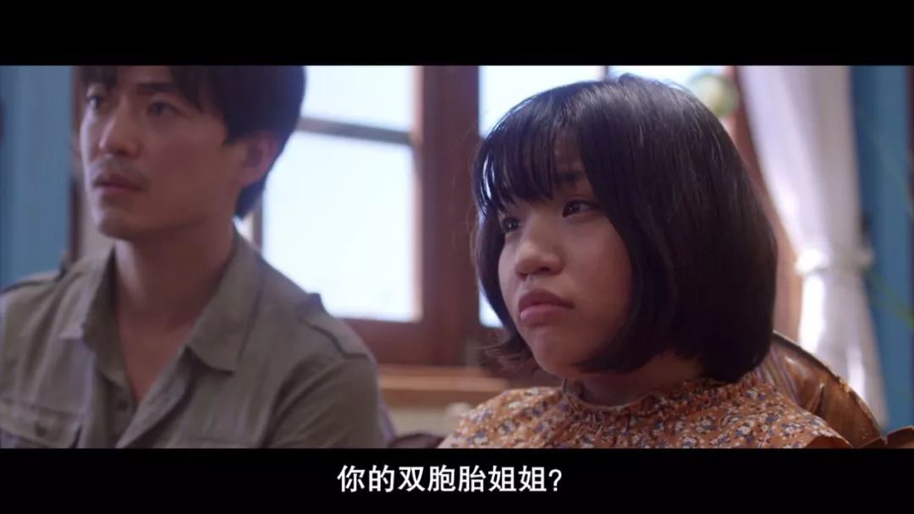

##  为画成人漫画找男妓，岛国尺度果然不一般

原创 有部电影 [有部电影]()**
前段时间，咱们聊了一部探讨残疾人群生理需求的印度片《向死而生》。在那部电影里，爸爸为了帮助患有脑性麻痹的女儿解决性需求，一度去给女儿招妓。

巧的是，最近岛国也出了一部类似题材的电影，不仅尺度更大，而且风格非常有日本特色——**《37秒》。**

故事的女主名叫梦马，已经23岁。因为患有脑瘫，她的身体发育出了问题，只能使用轮椅出行，多年来一直与妈妈相依为命。

不过，女主并非完全靠妈妈照顾。虽然只能拿起一支笔，但她有极强的漫画天赋。

目前，她在一个工作室为网红漫画家彩香做“影子画手”。

看着彩香通过自己的作品被人们喜爱，女主的心里渐渐变得沮丧起来。

她渴望有一天，自己能以真实的身份发表作品。

但讽刺的是，当她主动联系漫画杂志、送出作品时，却被对方吐槽“风格和彩香太像”，屡屡遭到拒绝。

就在这个时候，女主偶然发现了几本成人漫画。

她觉得自己也可以试试这个方向，于是便认真画了些作品，并联系了出版商。

这一回，对方没有果断地拒绝女主，但觉得漫画中的开车场面不太真实，建议她在拥有过性经验之后再来。

想也知道，像女主这样的状况，获得性经验并不是一件容易的事。

一开始，女主为了“取材”，只能观看成人影片，描摹其中的人物状态。

结果没想到，在看片的过程中，她不仅性意识被唤起，还发现了一个约会软件，开始和上面各种各样的人面基。

但女主的情况毕竟还是特殊，常常被放鸽子。有一次，当她倍感失落地一个人在街上闲逛时，走着走着，不知不觉就来到了红灯区。

她的心头忽然不由自主地涌现出了一个想法——叫个男妓。

一开始，事情进行得很顺利。男妓表现出了极强的专业素养，对待女主既温柔又体贴。

但没想到，女主因为太过紧张而小便失禁，场面一时极为尴尬，男妓也瞬间没了兴致……

虽然这个事发偶然的“破处计划”以失败告终，但因祸得福的是，女主在这里遇到了一个为残疾人提供性服务和陪伴的女人——阿舞，并与之成为了好朋友。

在得知女主的状况后，阿舞又是给她讲述残疾人为爱鼓掌的故事，又是带她去买成人玩具，陪她逛街、参加派对，让女主体验到了从未有过的自由和快乐。

只可惜好景不长，没过多久，妈妈就发现了这些事，并与女主大吵了一顿。

女主因为受不了妈妈的过度保护，选择离家出走，投奔了阿舞和她的助手小俊。

在此之后，妈妈开始终日奔波，寻找女儿；而女主，却开始寻找多年以前就离开了她们母子的爸爸。

事实上，女主对爸爸并没有清晰的记忆，她只是一直拿着一张收到的父女明信片，幻想着自己缺失的美好父爱。

趁着这次离家出走，她决定让小俊带着自己去明信片上的地址，寻找爸爸的下落。

可到了地方，她才知道，爸爸早在五年前就因病去世了。此前，他每年都会寄明信片给女主，但都被妈妈扣下了。

更出人意料的是，女主还得知自己有个被爸爸带走的双胞胎姐姐，现在在泰国当老师。

于是，她决定和小俊去泰国寻找姐姐，继续自己的旅程。

可以说，影片的前后两段讲的是两件不同的事，前半段是漫画少女的转型和破处故事，后半段则是一程接一程的寻亲之旅。

在故事的最后，女主见到了姐姐，终于了解了父母的过去。

她明白了父亲并非薄情地抛弃了她们，也体谅到妈妈保护欲的背后，是出于对自己的担心和爱。

所以，出走多日的她最终回到了家里，与满面憔悴的妈妈相拥在一起。

虽然女主并没有获得性经验，但经历了这一切之后，她与妈妈达成了和解，自我得到了成长。

当她把自己的经历画成漫画，交给当初那个成人漫画的主管时，对方深受感动，并决定推荐她的作品。

显然，这个故事的结局是温暖而阳光的，拥有着日式温情小品中一贯的治愈效果。

回过头来看，片名中“37秒”，其实指的是女主在出生时发生的状况——当时，在双胞胎姐姐顺利出生后，女主状况十分危险，一共缺氧了整整37秒。

如果没有这37秒，女主可能不会患上脑瘫，也不会承受常人无法想象的苦难和限制。

所以，“37秒”所指向的，是以女主为代表的残疾人，对爱与自由的强烈渴望，对现实无能为力的痛苦挣扎。

平心而论，在影片中，女主所面临的外部环境，整体来说是友好而充满善意的。所有与她交往的人，都没有表现出明显的歧视。

但即便如此，在文明的言谈举止背后，人们仍然隐藏着实实在在的偏见和各种小心思。

比如，有人建议漫画家彩香让女主做她的助理。不过这并不是为了帮女主圆梦，而是想让彩香利用她的残疾人身份，博取公众的好感：

比如兢兢业业的男妓，在得知女主是脑瘫之后，表面上不说，背地里也是一顿牢骚：

**尽管影片中的大多数人，表面上都做到了足够的尊重，但可以看到，残疾人群想要被人以平等的眼光看待，仍然难于登天。**

事实上，片中真正掏心掏肺对女主的，只有缘于亲情或友谊羁绊的妈妈和阿舞他们。

作为先天不平等的受害者，女主和所有人一样，向往美好的爱情，拥有自己的梦想，希望能实现自我的独立。

但残疾的身体却从客观上阻碍了她，使她在人生的道路上比一般人要面对更多的荆棘，出于人性本能的需求，也会受到压制和阉割。

好在，影片并没有沿着这个方向着力刻画一个边缘人的残酷悲歌，而是在延续成长主题的前提下，将故事核心转向为对自我、人生和亲情的和解，包含了关于爱与性、社会价值与自我实现等一系列的议题，展现出残疾人作为普通人共性的一面。

这种处理，一方面，使影片探讨的内容显得有些杂乱而点到即止，既不够统一，也不够深入，削弱了本来可以抵达的力度；

但另一方面，也使得影片没有走向灰暗、窒息的绝望，给整个故事增添了一抹温情的底色，让观众可以在暖心的故事中得到愈疗。

其实，这也是我今天把这部影片推荐给大家的原因所在。

因为，现实中已经上演了太多残忍的悲剧。在日常生活中，残疾人群要担负普通人难以想象的困难与压力；而当灾难来临时，他们又常常会沦为最无助、最容易被忽视的那群人。

要想避免这样的悲剧，无疑需要整个社会的共同进步与努力。

**而对于普通人来说，即便身体健全，我们也同样有可能被禁锢在各种由金钱、权力、价值取向等等构筑的躯壳之内，千万别让自己成为心灵的残疾。**

也许是国内最认真的电影自媒体
长按扫描二维码关注

在看