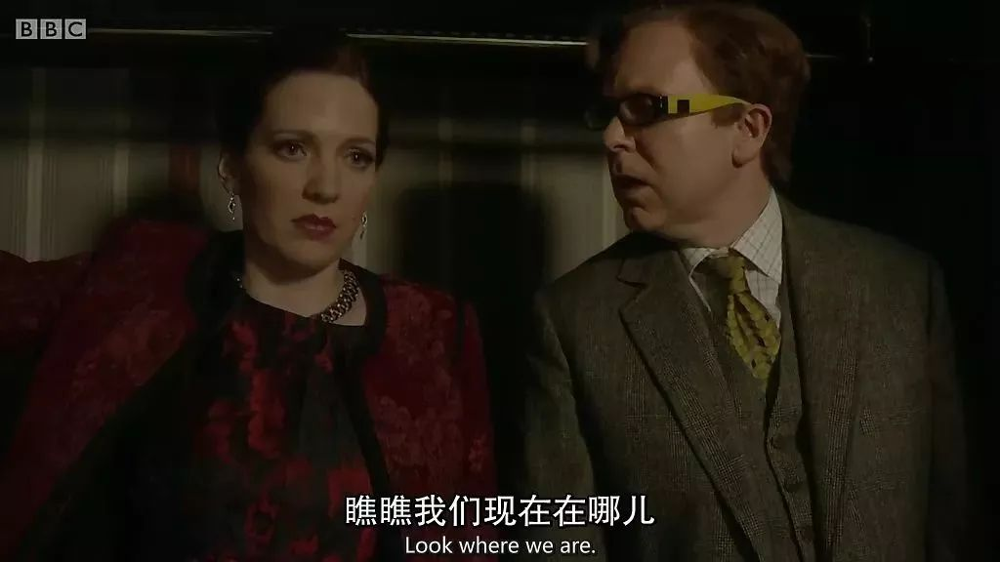
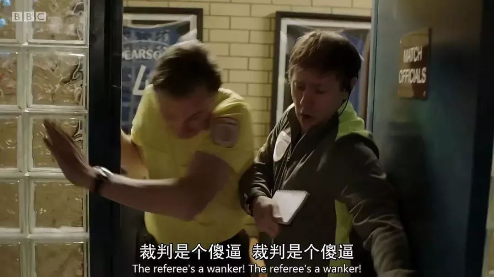

#  不可描述的腐国神剧又来了

原创 有部电影

从2014年的第一季到现在，《9号秘事》在豆瓣锁定了"神剧"标签，每季评分不低于9.0，而且口碑连年攀升。故事开场时，瑞贝卡发现了藏在衣柜里的伊恩，于是和他一块躲了进去。比如第二季的《卧铺车厢》那集，故事的起承转合就集中在一个比卧室还小的9号列车包厢里。故事发生在足球裁判的更衣室，男主马丁是个主裁，即将迎来职业生涯的最后一场比赛。熟悉《9号秘事》套路的小伙伴们肯定看得出来，这并不是故事的最终结尾——看似失去一切的马丁，其实是整场风波的幕后制造者。

开门见山，今天聊聊刚刚更新的腐国神剧《9号秘事》第五季。

老朋友们都知道，我曾不止一次给大家安利这部剧。

从2014年的第一季到现在，《9号秘事》在豆瓣锁定了“神剧”标签，每季评分不低于9.0，而且口碑连年攀升。第五季开播之前，BBC就已经火速续订了第六季。

《9号秘事》最突出的特点，是每集故事独立，都与数字9有关，剧情短小精悍、结尾反转精彩，有的故事脑洞大开，有的则针砭时弊。

最难能可贵的是，这个特色从第一季第一集就已树立起来，从一开始就让粉丝们心甘情愿跳进了坑。

这集名叫《沙丁鱼游戏》，故事发生在一个门牌号是9的家族豪宅中。

这天家里举行瑞贝卡和杰瑞米的订婚仪式，大家按照家族规矩，玩起了“沙丁鱼游戏”。这个游戏规则类似捉迷藏，不同之处就是要求每个人要与找到的人继续藏在一起。

故事开场时，瑞贝卡发现了藏在衣柜里的伊恩，于是和他一块躲了进去。

随后的剧情，便是玩游戏的人一个接一个地找到这里。他们像沙丁鱼罐头一样，一块挤进了狭小的衣柜。

这过程中，产生了不少抓马和笑料。

比如瑞贝卡发现，未婚夫杰瑞米对前女友念念不忘，甚至一不小心就会叫错她的名字。

比如大家在躲藏时，客人马克和妻子进入房间，差点在众目睽睽之下发生不可描述。

好在衣柜里的老保姆及时喊了一句“吉拉尼莫”，才化解了尴尬。

再比如，大家都嫌弃客人“臭约翰”身上的气味，一度合力扒着门，不让他挤进衣柜里“污染环境”……

虽然这些情节看似琐碎平常，但几个人物的对白，却时不时爆出表象下的隐情。

比如，瑞贝卡的哥哥发现老保姆也来到这个房间时，瞬间露出惊恐的表情，提醒瑞贝卡“瞧瞧我们现在在哪儿”；

比如老保姆化解尴尬时，喊完一句“吉拉尼莫”，还小声嘟囔“别问我为什么这么喊”；

最后，瑞贝卡的爸爸也挤进了衣柜，大家开始回忆当年玩这个游戏的情景，当爸爸唱起“沙丁鱼之歌”时，哥哥开始变得更加不安和愤怒……

之后，随着爸爸与老保姆的对白，这个家族的陈年往事和“沙丁鱼游戏”的隐情，一下子被全部揭开——

原来，爸爸是个恋童癖，以前经常打着办趴体的旗号，在浴室对做客的男童进行猥亵，哥哥和老同学“臭约翰”都是其中的受害者。

衣柜所在的主卧，便是当年的“作案现场”，老保姆则是爸爸的同伙，“吉拉尼莫”就是她给爸爸打掩护的暗号。

他们的行径给受害男童带来了不可磨灭的心理阴影，“臭约翰”之所以后来不爱洗澡、浑身发臭，正是心理障碍的外在表现。

而在众多受害者里，只有一个叫皮普的男孩站出来告发爸爸，但这事后来被爸爸花钱摆平。

而就在这些不堪的往事被揭晓时，衣柜突然被人锁住了……下手的，就是最开始进入衣柜、后来又藏去浴室的伊恩。

原来，他就是当年的小男孩皮普，这个“沙丁鱼游戏”是他策划已久的纵火复仇。

整体看来，这个故事包含了《9号秘事》系列的全部特点——

一切从数字9开始，铺垫部分的剧情看似平淡，但密集的对白暗藏了高能预警；

高潮段落通常带有一个大反转，以呼应前面的暗示，而结尾处还会有意想不到的二次反转，揭露人性最阴暗的一面。

从制作规模来看，《9号秘事》算不上大手笔，它的故事经常发生在场景单一的封闭空间内，剧情推动全凭演员的演技和对白，可以说十分“省钱”。

但恰恰是单一场景下人物间的密切互动，才更能营造出信息量巨大的抓马和反转。

比如第二季的《卧铺车厢》那集，故事的起承转合就集中在一个比卧室还小的9号列车包厢里。

坦白来说，在这样的空间设定下讲好一个故事并不容易，连构图取景都会因为空间狭小而变得束手束脚。

但编剧们还是极力把各种戏剧化的情节，融进了9号车厢。

这趟旅程中，男主原本想要安稳睡一觉，好应对第二天一个特别重要的面试，但他偏偏遇上了一群吵闹的“室友”。

有人咳嗽、放屁一个不落，弄出各种声响；有人进来就煲电话粥，出门也不随手关门；还有对夫妻一直喋喋不休，把车厢当成自家客厅和卧室……

可想而知，男主的内心是崩溃的，不管他吼了多少次，睡眠总是被各种人打断。

但这个故事并不是乘客间的小摩擦——没过多久，大家就发现一直睡在中铺的男人居然跌落下床，看上去已经死亡多时。

这集的真相我就不给大家剧透了，可以说的是，结尾部分的反转依旧让人大呼过瘾，又细思极恐。

而最近更新的第五季第一集，整体看来依然保持了《9号秘事》原有的味道。

故事发生在足球裁判的更衣室，男主马丁是个主裁，即将迎来职业生涯的最后一场比赛。

虽说是最后一场，但马丁丝毫不敢怠慢，因为这场比赛对于对决的两个球队——联队和流浪者队来说，都至关重要。

如果联队获胜，他们便能直接晋级英超，随之而来的是1.5亿的丰厚奖励；若是流浪者队赢了，就能摆脱降级的命运。两队的球迷对这场比赛也是屏息凝视，都盼着自家球队获胜。

所以，马丁在赛前就反复叮嘱其他裁判，务必要做到公平公正。

但让人没想到的是，口口声声喊着公平公正的马丁，其实私下里与联队的9号球员库克有基情……

更让人没想到的是，马丁还不是裁判队伍里唯一一个有问题的。

助理裁判奥吉，因为赛前受贿，在比赛进行到26分钟时就误判了一个界外球，导致流浪者队进球得分。

这是一个非常明显的黑哨，原本就情绪激昂的球迷们，直接被戳中怒点。

到中场休息时，“裁判是个傻*”的骂声已经在球场中不绝于耳。

而就在大家想着如何处理这个丑闻时，联队的库克怒气冲冲地闯入更衣室，和裁判组发生了争执，还殴打了助理裁判。

于是，马丁在情急之下给库克亮了红牌。

这下，落后一球的联队瞬间又少了库克这个关键球员，比赛局面更加失控。

库克直接暴走，当着所有人的面，捅破了他和马丁的基情……

为了挽回这个糟糕的局势，马丁决定在下半场做点手脚，尽可能寻找让联队进球的机会，让两个球队重回“公平的局面”。

但这个决定反而弄巧成拙，联队在马丁的操作下虽然进了一球，但也彻底点燃了球场上的怒火，比赛随后因为大规模斗殴而被宣告无效。

马丁和库克的基情也被传得沸沸扬扬，职业生涯因为这场比赛尽毁。

不过，熟悉《9号秘事》套路的小伙伴们肯定看得出来，这并不是故事的最终结尾——看似失去一切的马丁，其实是整场风波的幕后制造者。

原来，马丁和替补裁判都是另一个球队城市队的铁杆粉丝，这个信息在剧集开头就有对白提到过。

为了让自己支持的球队获得晋级英超的机会，马丁不惜以职业生涯和个人名誉作筹码，制造了这起闹剧。

最终，联队因为斗殴事件被扣分，城市队则顺理成章地成为第一名……所以这个发生在更衣室的球场故事，其实说的是“一个疯狂粉丝如何助攻自己的球队晋级”。

就像我在前面说的，这集《裁判是个傻*》保留了《9号秘事》系列的特点，同样是单一场景内的极端矛盾，反转依旧让人始料未及。

同时，故事里也夹带了编剧对于足球运动趋向娱乐的吐槽，风格依然犀利讽刺。

最难能可贵的是，《9号秘事》这次在国内的网站就能在线观看，虽然某些镜头和对白出于某些技术原因遭到了魔改，但并不妨碍观众理解剧情。

**如果在我的N次安利下，你还没入《9号秘事》这个坑，那可真是亏大了！**

