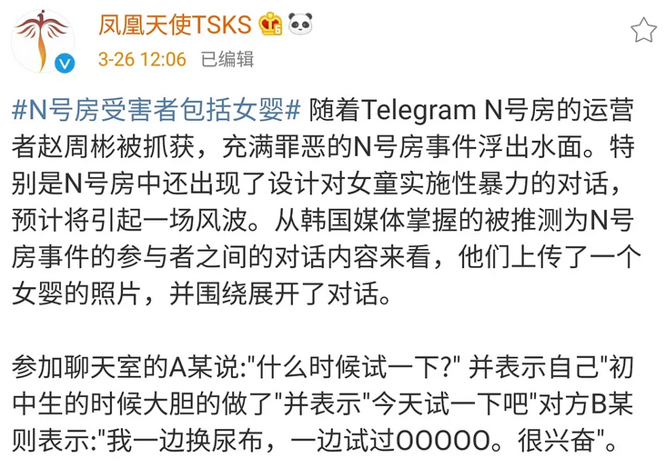
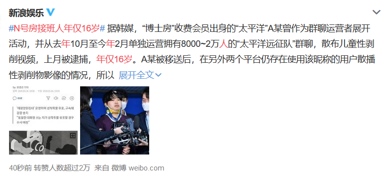
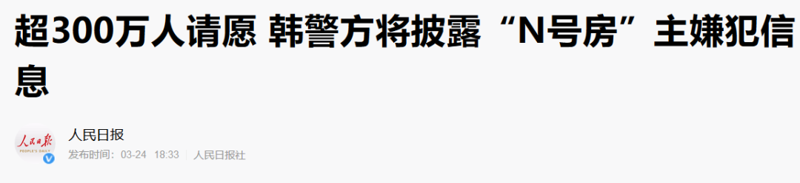
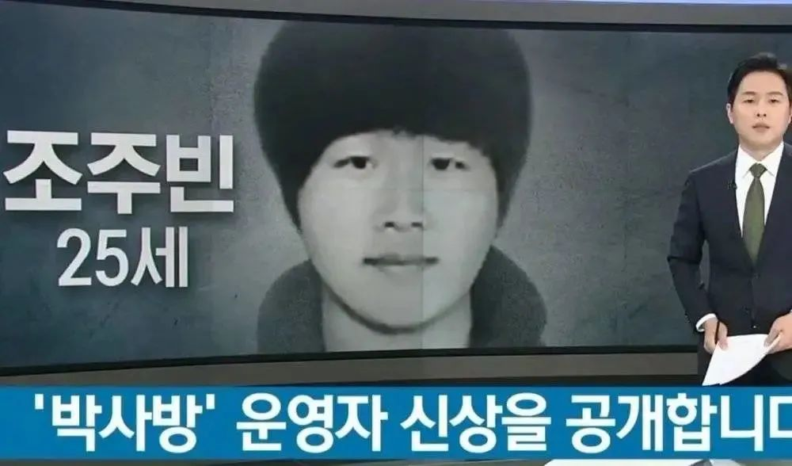
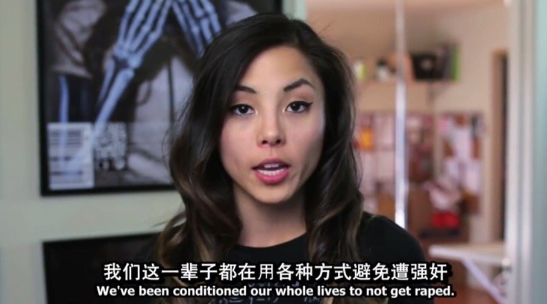
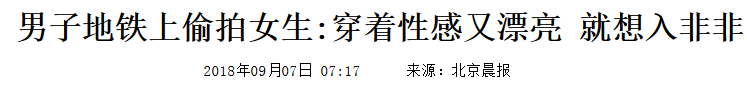
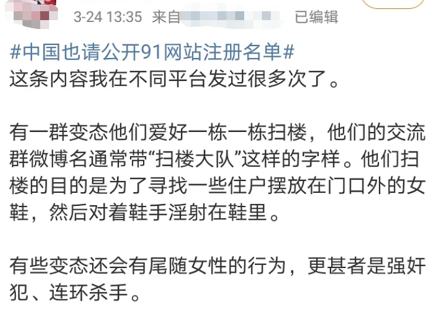

##  26万人围观的网络性侵案，离我们很远吗？

原创 有部电影 [有部电影]()**
最近韩国闹得轰轰烈烈的N号房间事件，相信小伙伴们都有所耳闻，昨天我也刚通过一部纪录片，跟大家聊过这个话题。

而今天，我想回归事件本身，从另一个角度来聊聊：我们跟“N号房间”的距离，到底有多远？

这个答案，也许比你想象中要近得多。

N号房事件，可能是人类有史以来，规模最大的儿童性犯罪。受害者多为未成年人和年轻女性，有事件受害人发声表示，其中的未成年人要多过成年人。

遭到N号房毒手的，甚至还有婴儿和三四岁的孩子。

而N号房的运营者中，也存在年仅16岁的未成年人。

这起事件的恶劣性质和影响到底如何，不言自明。

在N号房播出的视频中，孩子们遭受的性虐待，光看文字描述就已经触目惊心。

而高达26万观看视频的人数，更是远远超出了我们的认知范围。

而且，因为案件时间跨度长，聊天室应用了“阅后即焚”、电子货币交易等难以追踪的手法，给警方追查带来了难度，这26万的人数也还存在争议。

就算只能追踪到26万用户，也不能排除会有人共享视频给其他人观看的可能性，所以实际上看过这些淫秽视频的人，应该要比26万更多。

这是一个令人毛骨悚然的数字。

在N号房开播的一年多以来，所有的观看者都对面前的性犯罪实录无动于衷，一个站出来发声报警的人都没有。

后来还是两个大学生潜入卧底调查，才最终将N号房中发生的一切大白于天下。

事件曝光后，韩国群众产生了前所未有的愤怒与恐惧。

很多韩国知名艺人，包括边伯贤、郑容和、李惠利在内都为此发声，希望警方彻查此事。

针对此事的青瓦台请愿人数，也很快创下了历史新高。

请愿的发起人表示：**只处罚管理者、视频供应者根本没用，因为还有需求者存在，如果不对购买这些视频的人进行处罚，这一切一定会再次发生。**

同样的道理，我在上一篇文章中也讲过，正是因为那些藏匿于黑暗中的视频购买者存在，才让现实中的罪恶有了滋生的土壤。

正因如此，不少人都在强烈要求重判主犯的同时，公布26万观看直播者的名单，在昨天文章的留言下面，大家也都提出了同样的呼喊。

小伙伴们应该还记得，去年我跟大家聊过素媛案罪犯出狱的事情。

碍于法律规定，在韩国，罪犯的长相一般不能被公开。

素媛案后过了十几年，才有电视台冒着违法的风险，勇敢地曝光了那个丧心病狂强奸犯的长相。

**而今天，N号房的事件刚报道，主犯之一的长相信息，就已经被公开了。**

**这一方面体现了事件影响之恶劣、民众情绪之激动，都是史无前例。**

另一方面，也体现出一种进步，对于受害者和担惊受怕的其他群众来说，似乎是个积极的信号。

这会不会代表着韩国对性犯罪绝不姑息、严加惩罚的意向？

**说实话，我对于N号房案件的后续处理，仍然有种悲观的预感。**

想到韩国那些曾经轰动一时，最后却又不了了之的性犯罪案，**想到含恨而死的张紫妍、全身而退的李胜利、被抵制的金智英，我就对韩国能彻底拔除N号房的罪恶根源持怀疑态度。**

目前来看，别说公布26万人的名单了，**能把参与运营的主犯全都揪出来，都非常有难度。**

N号房事件被广泛报道后，有不少网友评论“韩国真是刷新了我的下线”、“韩国为什么总是发生这种事”。

但我们在感到痛心失望的同时，也应该意识到，N号房不仅是韩国的孤立事件，也是世界范围内暗流涌动的性犯罪中，露出的冰山一角。

类似的事情，可能正发生在你我身边。

两年前，我国警方破获了一起偷拍案。

犯罪男子王某雷多年来通过骗取女性信任，与其发生关系，偷拍视频后在网上贩卖牟利，每年获利上百万，受害女性超过百位。

光看这惊人的的获利金额，就能想象出背后的色情产业链有多庞大。

而像王某雷这样的偷拍者，远不止一两个，躲在屏幕后购买观看视频的人数，更是无法计算。

这起案件，使得国内最大的色情偷拍网站91网浮出水面，也让更多偷拍者落入法网。

而91网和那些助纣为虐的偷拍网站，其实还隐藏着许多更令人发指的罪行记录。

比如，被媒体多次曝光、却始终难以斩断源头的迷奸产业链：

直到现在，仍有大量中国女孩被性侵的视频在网络传播，这些不堪入目的罪行记录，却成了某些人取乐、牟利的来源。

有义愤填膺的博主在推特发起了#China Wake Up#（叫醒中国）的话题，希望能引起女孩子们的重视：

比如，屡禁不止的偷拍现象，直到今天，还是每时每刻都在发生。

无孔不入的摄像头，可能出现在酒店、民宿、试衣间、卫生间，和我们能想象到的任何一个角落。

甚至，女孩子们走在路上，都要警惕被路人偷拍裙底的风险。

比如，有博主曝光的“扫楼”变态，会寻找住户摆放在门外的鞋子，做出不可描述的举动，更有甚者会借此尾随跟踪女性：

不少网友现身说法表示，自己家里真的遭遇过类似的事件，这些变态往往还不好追踪，搞得最后只能自认倒霉，再也不把鞋子放到门外：

再比如，更让人难以防范、也难以从法律上定罪的PUA，无论男女，都可能因此被欺骗身心，人财两失。

在最极端的案例中，还有女孩因此崩溃自杀，年轻的生命戛然而止。

**看完这些，你真的还觉得，N号房间离我们很远吗？**

当我们谴责视频房间运营者性侵少女、虐待儿童的时候，却发现，类似的事情也发生在我们周围。

当我们对部分韩国男性百般狡辩的样子怒不可遏的时候，却发现，国内竟然悄悄出现了打着N号房旗号，传播贩卖淫秽物品的账号。

当我们看到那些为N号房视频叫屈、试图为性虐行为洗地的评论，感到心凉的时候，却发现，91网的偷拍者落网后，还有大量评论称之为“英雄”、“大哥”、“艺术家”，为他受到的法律惩罚而扼腕叹息。

**N号房，离我们真的不远。**

目前，N号房事件已经掀起了席卷网络的巨大风浪，但还远没有结束，依然不断有新的事件内幕被曝光。

它就像是一个深不可测的漩涡，每当人们向内多探索一步，所看到的景象就更惊悚一分。

一个很简单的道理是，社会对于性犯罪的容忍度越高，罪恶产生的可能性就越高，而每个人所能拥有的安全感也就越低。

最终会受到伤害的人，并不仅仅是案件的受害者，也是无数个因此而恐惧的女性和孩子。

他们可能是我们身边的家人、爱人，是我们的母亲、儿女、兄弟姐妹和朋友，也可能，就是我们自己。

**而坚持曝光，持续发声，呼吁问责，就是我们现在能做的事情。**

就像以前给大家推荐过的韩剧里曾经说的——**在这件事上，我们敏感一点也无妨。**

感觉到不对的时候，及时反抗，不管是旁观者还是受害者，都勇敢地指出来，就算最后是一场误会，也好过就这么放过一个潜在的罪犯。

要知道，每一次对犯罪行为的容忍，都是在酝酿着更大的祸患。

如果恐慌的情绪继续在人群中蔓延，人们会渐渐接收到心理暗示，认为再亲密的人都可能侵害自己。

当所有人都这样认为时，亲密关系，也就将不复存在。

所以，唯有对性犯罪坚持零容忍态度，不让自己成为冷漠的帮凶，才是不让N号房重演的最佳方式。

小伙伴们应该记得，文中提到的种种事例，我几乎都写过详细的文章，也一遍遍地提醒男孩女孩们注意人身安全。

而在保护好自己的同时，也别忘了，不要做旁观者。

也许有人会问，你写了这么多次，违法的案例却还在发生，令人气愤的性犯罪也还在继续，有什么用呢？

**之所以坚持发声，是因为我相信，也许多一个人看到，下次在地铁性骚扰事件中，就会少一个沉默者；也许多一个人转发，下次在性犯罪视频传播过程中，就会多一个举报者。**

**世界上还存在着许多个N号房间，而我们的坚持，正是那些受害者所能抓住的希望。而这，就是我们不该选择放弃的原因。**

也许是国内最认真的电影自媒体

在看