速读摘要

参与犯罪的注册用户高达26万，占韩国男性总数的1%，也就是说每100个韩国男人中至少有一个看过。这集故事，要从一个名叫大卫的加拿大男人说起。在现实中，想要消除儿童网络色情交易，往往就跟打击毒品犯罪一样困难。它们都是针对女性(包括未成年)群体的性剥削犯罪，都以隐秘性极强的网络工具作为交易媒介，都要求参与者触犯法律、缴纳投名状。正因为平日里道貌岸然，当他背后的丑恶被揭开时，才让人感到前所未有的冲击，也让韩国女性越来越细思极恐。

原文约 2582  字  | 图片 30 张 | 建议阅读 6 分钟 | [评价反馈](https://static.app.yinxiang.com/embedded-web/clipper/#/Evaluating?d=2020-03-25&nu=69088090-371a-47d8-9d79-e9dab66f9cb3&fr=myyxbj&ud=58b471&v=2&sig=DAF0B07F81E8D20FEBD5C546BA1883F9)

##  韩国“N号房间”背后的世界，更黑暗更可怕

原创 有部电影 [有部电影]()**
最近，韩国媒体揭露了一起名为“N号房间”的性剥削案件，其性质之恶劣、规模之庞大，足以让所有有良知的人出离愤怒——

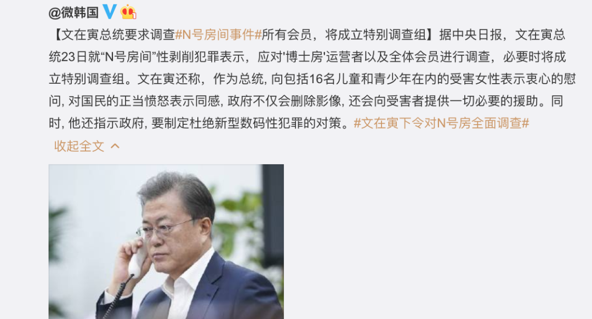

所谓“N号房间”，是指通过某款“阅后即焚”APP建立多个私密聊天房间，用户将被威胁的女性作为性奴役对象，在房间内共享非法拍摄的性视频及照片。

这个案件的受害者有不计其数的女性，包括未成年人，甚至小学生和婴幼儿；

而参与犯罪的注册用户高达26万，占韩国男性总数的1%，也就是说每100个韩国男人中至少有一个看过。

此事一经曝光后，立刻引发了舆论海啸。

截止目前，已有超过370万韩国民众、明星及各界人士，在青瓦台留言板上请愿，要求公布N号房间所有会员的身份信息。

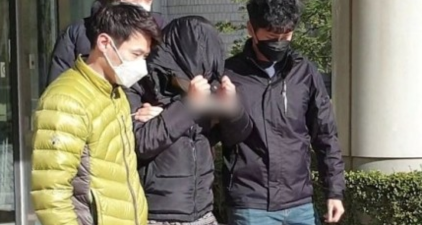

关于这件事，我也在密切关注进展，准备单独写一篇文章与大家分享看法。

而今天，我想先给大家推荐一部关于暗网的纪录片剧集，里面专门提到了借助新型工具，对女性及未成年人进行性犯罪的问题——**《暗网》第一季。**

.jpg)

这部纪录片共有八集，每集一个主题，时长在30分钟左右。

别看它篇幅不长，但话题细思极恐、内容信息量极大，涉及到生物黑客、BDSM网恋、儿童色情交易、小片片成瘾、电磁过敏等方面内容，分分钟颠覆你的认知。

.jpg)

在每集片头，都有这样一段直入主题的台词——

**“网络将真实的我们转变成数据代码，上传至一个称之为“云端”的禁锢地方。只有使用正确的工具，你才能在噪音中找到特定的信号。”**

也就是说，这部剧虽然名叫“暗网”（Dark Net），但它不光探讨狭义上的“洋葱网络”，而更像是揭露互联网不为人知的真实一面。

.jpg)

今天咱们重点来聊的，就是其中名为“剥削”的第三集。

这集故事，要从一个名叫大卫的加拿大男人说起。

大卫曾是受人尊敬的报纸编辑，拥有圆满家庭和亲密挚友，直到2012年被警方拘捕，才揭开他隐藏多年的恋童癖身份。

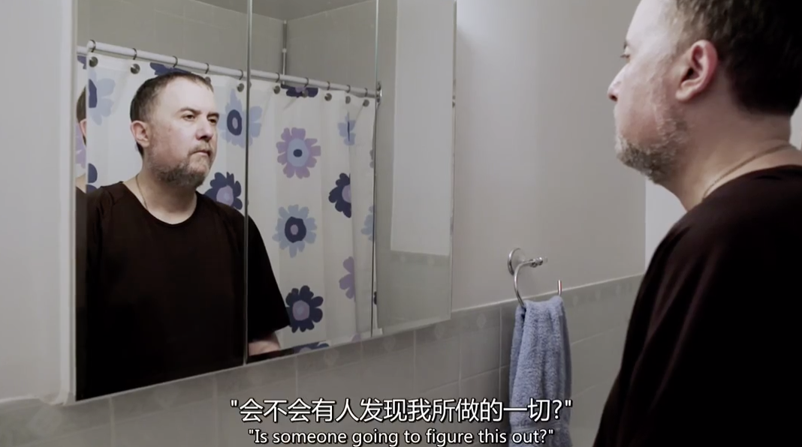

早在十五六岁时，大卫就对孩子产生过性欲。

他明知这种欲望违背法律和道德，却一步步任由自己堕落沦陷，从搜索儿童裸露图片，到观看含有儿童性行为的色情片。

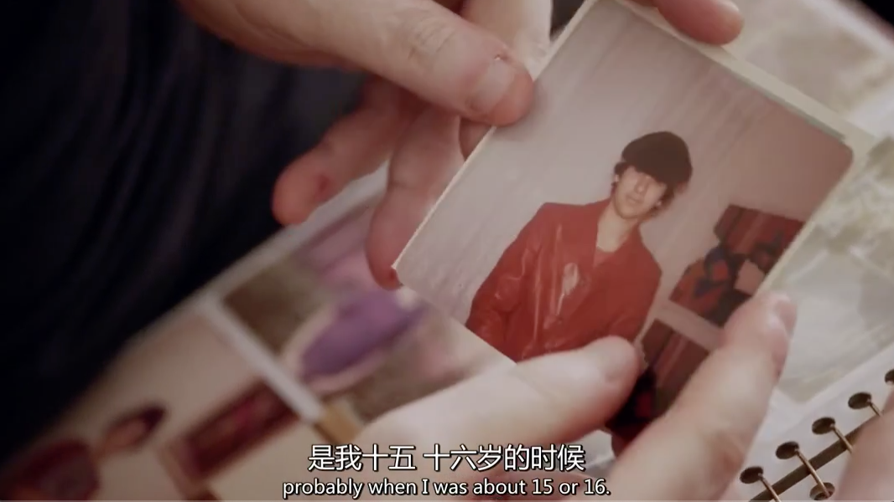

后来，大卫因购买并持有儿童色情作品，受到法律的制裁。

在获得假释后，他被禁止使用电脑或网络，不能去任何孩子多的地方，包括公园、娱乐中心、公共游泳池等等。

与此同时，他提出了一种质疑——如果人们不生产儿童色情片，我们不就不会看、不会犯法了吗？

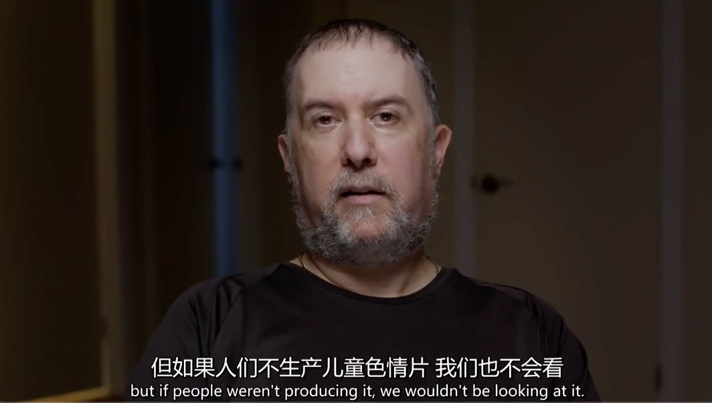

但事实上，就如同环保主义者倡导的“没有买卖，就没有杀害”一样，在网络性剥削的案件中，消费者并不无辜。

相关统计显示，世界上约有1%的男性是恋童癖者，他们会不由自主地被青春期前的儿童吸引。

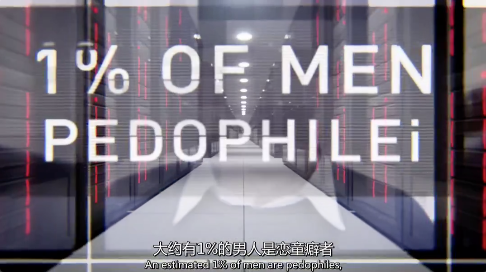

在这一部分人中，有的人会在道德和法律的约束下学会自制，也有人选择像大卫一样，通过多层加密的洋葱路由器进入暗网，获取非法信息。

可以说正是因为这些人的需求，包含儿童色情在内的性犯罪视频，才源源不绝。

.jpg)

讽刺的是，这款路由器和暗网，最初是由美国海军研究实验室发起，用来保障政府内部的通讯交流以及各国异见人士的在线联络。

但当这项技术经过推广后，它却很快被应用于非法交易，诸如儿童色情、毒品、枪支、假钞、伪造护照等。

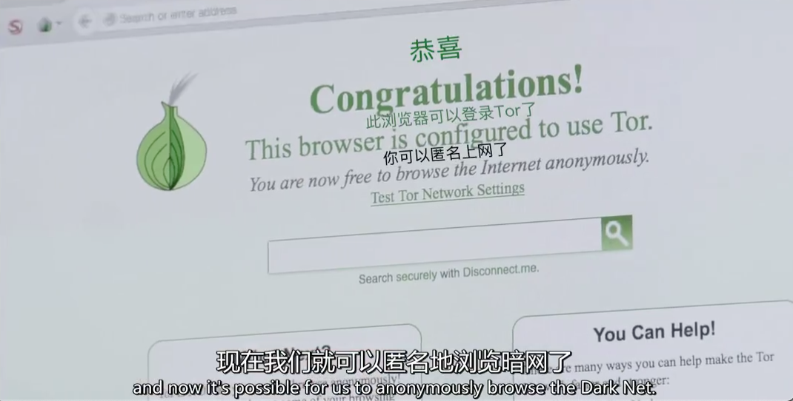

在暗网中，提供儿童色情交易的一端，往往是经济落后的发展中国家或地区，比如片中讲到的菲律宾宿务岛。

由于廉价劳动力过剩、失业现象普遍，儿童网络色情产业在这个岛上泛滥。

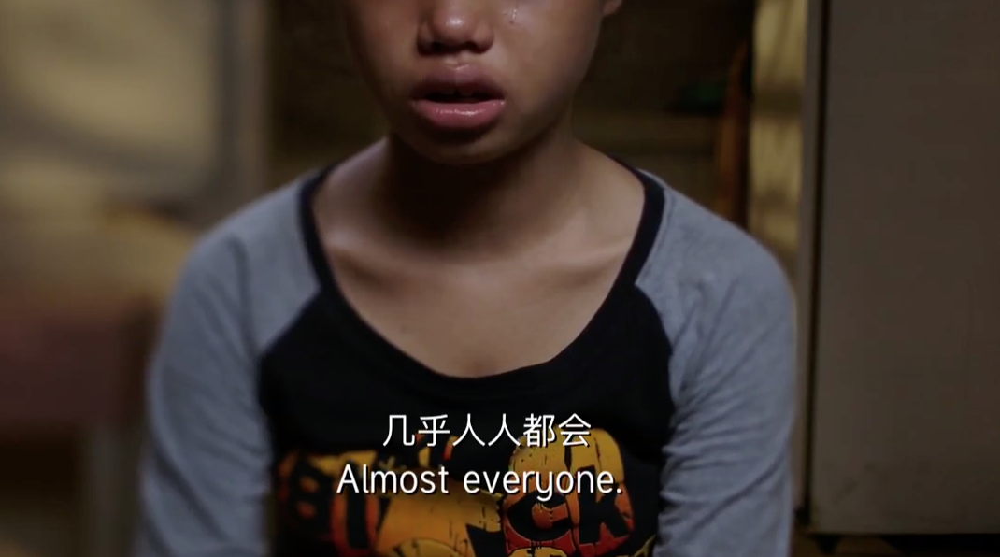

根据当地的非政府组织社工描述，不光许多女童为了养家糊口，被迫在摄像头前脱去衣服、展示身体；甚至还有些丧心病狂的父母，会亲自实施性侵犯、性虐待行为，吸引观看赚取收益。

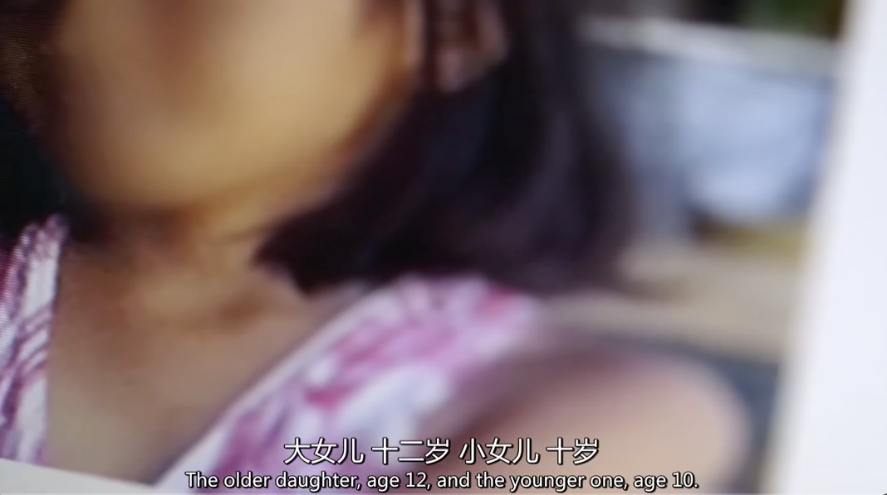

为了避免更多孩子经历类似遭遇，当地的儿童法律机构不断收集证据，并交由警方来缉拿涉罪父母。

但警方却对此睁只眼闭只眼，连罪犯的邻居也因为被金钱收买，要么保持沉默，要么相互包庇，看着孩子沦为牺牲品。

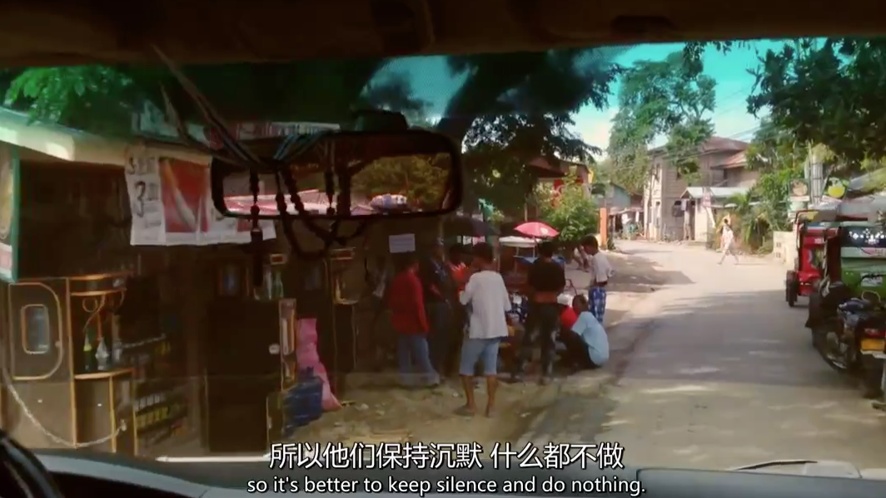

片中还讲到有家来自荷兰的无政府组织，曾通过虚拟的菲律宾女童形象“甜心”，套取网络上的犯罪证据。

结果在短短两周内，就有来自71个国家的两万多名用户上套。

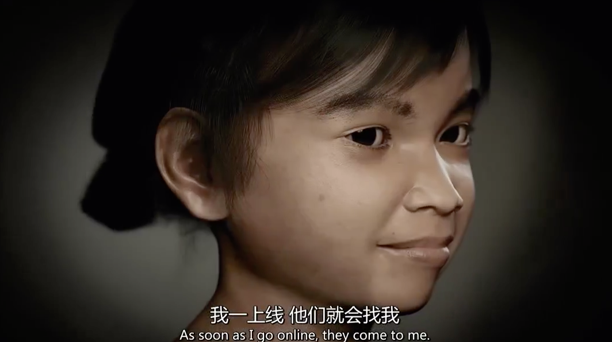

但即便如此，对于打击暗网中的儿童色情产业也没什么帮助。

这一来是因为仅凭无政府组织的“钓鱼执法”，很难从法律上给购买者定罪；二来，“甜心”所触及的儿童色情聊天室，只是整个产业链的冰山一角。

更重要的是，随着互联网与法律制裁手段的进步，色情产业也在“道高一尺，魔高一丈”。

除了借助暗网本身的多层加密技术，许多网站会要求用户上传原创视频，用触犯法律、缴纳投名状的方式换取登录权，把所有人变为联系更加紧密的利益共同体。

同时，为了满足大量用户的消费需求，它们在隐秘性与封闭性上的进步，甚至远超网络安全技术的发展速度。

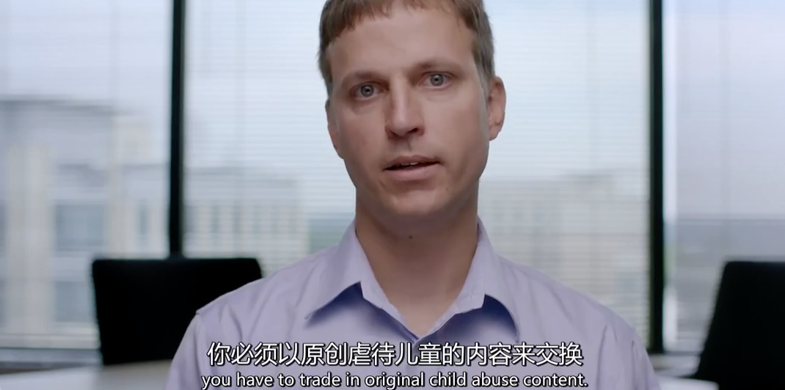

面对这些日益猖狂的性剥削案件，菲律宾女社工一度为孩子感到痛心疾首，忍不住在镜头前咒骂——

为何要把别人家孩子当做商品使用？难道只因为你们有钱、消费得起吗？难道你们不知道她们只是孩子吗？

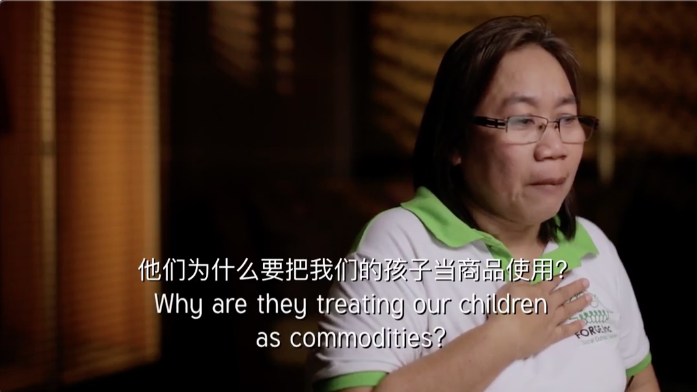

在现实中，想要消除儿童网络色情交易，往往就跟打击毒品犯罪一样困难。

这不仅是因为有些成年人丧失人性，为牟取利益，不惜让孩子们遭受摧残；更重要的原因，就是扭曲变态的需求催生了这个市场。

只要购买行为依旧存在，就很难让孩子们彻底摆脱这种梦魇。

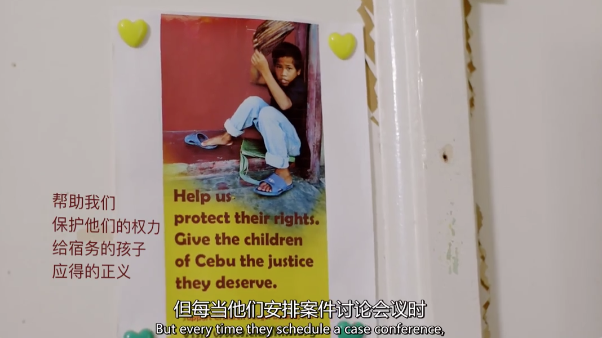

而这一点，也适用于“N号房间”案件。

它们都是针对女性（包括未成年）群体的性剥削犯罪，都以隐秘性极强的网络工具作为交易媒介，都要求参与者触犯法律、缴纳投名状。

“N号房间”案之所以引发韩国女性的恐慌与震怒，不仅是因为视频内容丧心病狂，更因为案件参与者数量庞大，而且大多都拥有正常的职业、学业，禽兽就隐藏在普通人群之中。

比如韩媒披露的“N号房间”主犯赵主彬，年仅25岁，是信息通信专业的大学毕业生，多次获得奖学金、担任过学报编辑部局长，还经常去保育院当志愿者。

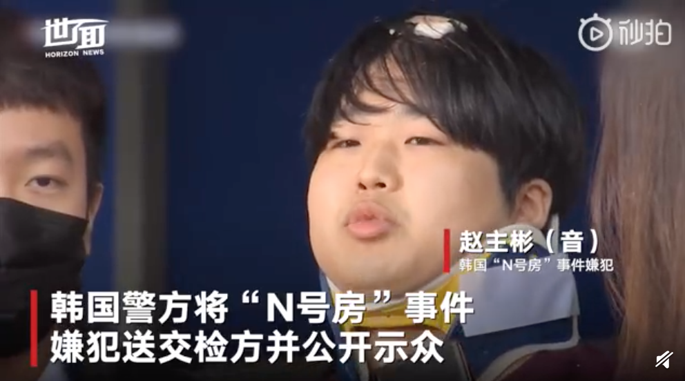

看起来是个善良优秀的五好青年对吧？

正因为平日里道貌岸然，当他背后的丑恶被揭开时，才让人感到前所未有的冲击，也让韩国女性越来越细思极恐。她们不得不为了保护自己，重新审视身边的男性同事、朋友、甚至家人。

.jpg)

**而与此同时，韩国男性对此事件的反应却普遍令人失望。**

一方面，“N号房间”的涉事者们为了自保，一边抵制公开注册用户信息，一边忙着“毁尸灭迹”，想方设法注销账号。

甚至在社交平台上发表甩锅言论，将自己定位为“无辜受害者”，宣称视频中的女性犯有淫乱、诈骗罪……

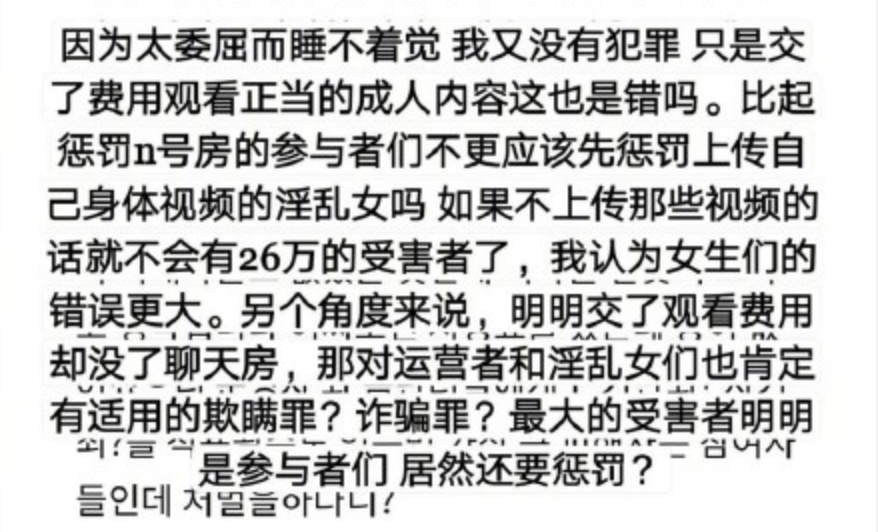

**另一方面，旁观者们不仅做不到声讨罪犯，反而急于撇清关系，对受害者的苦难无法共情，却生怕污水溅到自己身上，让自己身为男性的利益受损。**

可以说，从“张紫妍案”、“胜利门”、“偷拍妈妈风潮”到“N号房间”，无一不呈现出韩国社会对女性的物化，许多人始终无法意识到——无论是付费加入N号房间、观看或是传播视频，都是将受害者推入深渊的犯罪行为。

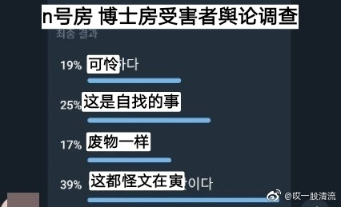

更有甚者，不仅对这类犯罪冷眼旁观，还将女权发声视为无差别攻击，在两性之间掀起新一轮的骂战。

这让我想到喜剧演员Daniel Sloss在一场脱口秀表演中说过的话——

**“我相信大部分男人是好的，但只要十个里有一个是禽兽，其他熟视无睹的九个人都是帮凶。善良只有在做出实际行动时才有价值。”**

.jpg)

**所以面对这类案件，就别扯什么性别对立了，这原本应该是善良人性与禽兽行为的对立，也是法制与犯罪的对立，不分男女。**

**作为一个有良知的普通人，在面对如此丧心病狂的犯罪行为时，支持受害者发声，不让每一个涉案者躲在网络的背后逍遥法外。这有什么需要质疑的吗？**

