#  韩版《恐怖游轮》，设定高能出人意料

原创 有部电影 

男主甚至在一次循环中记下了出租车司机的手机号，还是不能阻止对方遭遇车祸，每次赶到时，女儿都已被撞飞。民哲也和男主角一样陷入了时间循环，接连多次目睹老婆在车祸中丧生。也就是说，本片中被困在同一天里的人有三个，司机在每次循环中都会杀掉男主的女儿和民哲的妻子，而男主他们几乎无法阻止。男主为救女儿，伪造了器官捐献申请，让还在昏迷中的那个父亲按了手印，把他儿子的心脏移植给了男主女儿。对于失去儿子的李康石来说，时间循环也是对他杀人的一种惩罚，虽然他嘴上说作为一个父亲，只要有机会就会给儿子复仇。

今天给大家聊的这部韩国悬疑片，开场十分钟就能让你想起很多部电影：《土拨鼠之日》《明日边缘》《忌日快乐》《源代码》……还被网友称为“韩版《恐怖游轮》”。

没错，这又是一部有关时间循环的电影，不过影片在套路中玩出了新花样——**《一天》。**

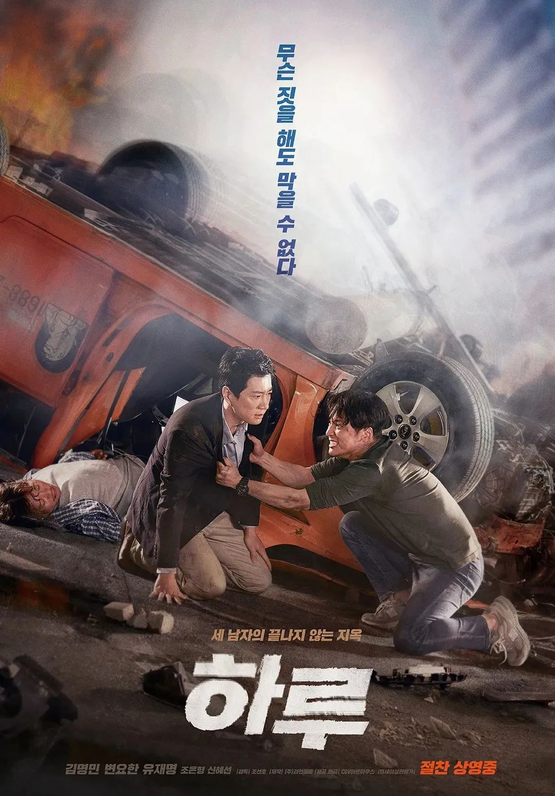

片中的男主金俊勇是个医学专家，过去三年一直随联合国赴战争前线工作。

他平日低调节俭，认为能做好治病救人这一项工作就已经足够。

影片开场时，他乘飞机回到韩国，和女儿恩静约好中午12点见面，准备给她好好过个生日。

落地后，男主角接受了媒体的采访，还顺手给一个被糖果卡喉的男孩实施了急救，随后便开车前往见面地点。

没想到，男主在途中又发现了一起交通事故，一辆出租车将一名女学生撞飞之后冲到路边，司机和车上女乘客受伤严重。

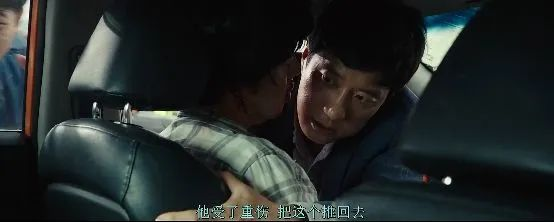

就在男主上前抢救时，他震惊地发现那个被撞的女学生，竟然是自己的女儿……

然而，男主还没反应过来，就突然像从噩梦中惊醒一般——发现自己正坐在回国的飞机上。

但等男主落地后，才发现刚才那一切并不是噩梦，并且又重新发生了一次——记者赶到机场来采访，擦身而过的小男孩被糖果卡喉……

同样地，他还是在路上遇到了那起车祸，又一次见到女儿倒在血泊中……随后，男主再一次从飞机上惊醒。

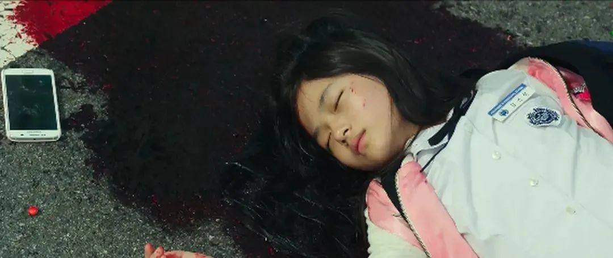

男主意识到，自己这是陷入了某种时间循环。如果不做点什么，就要不断目睹女儿去世。

于是这一次，男主火速取消了记者采访，抢走了男孩手里的糖果，一路全速飙车，只为赶在车祸发生前与女儿汇合。

但无论他尝试多少次，路上如何抄近道，都无法阻止车祸的发生。

男主甚至在一次循环中记下了出租车司机的手机号，还是不能阻止对方遭遇车祸，每次赶到时，女儿都已被撞飞。

剧情讲到这，其实都还在时间循环的套路之中。但接下来的情节，则让人万万没想到。

就在男主为女儿伤心不已时，人群中突然冒出来一个年轻人，慌慌张张地抓着他不放。

这个年轻人是当时车祸后，赶到现场的急救人员民哲。

他在和男主一块抢救伤员时，意外发现出租车里的女乘客，竟是自己的妻子。她因为伤情太重，在车祸中当场死亡。

之后，民哲也和男主角一样陷入了时间循环，接连多次目睹老婆在车祸中丧生。

他为了救妻子，也在几次循环中疯狂尝试，想要从一开始就阻止她上出租车，但因为妻子一直不接电话，屡次尝试都相继失败。

这期间，民哲发现在时间循环里，所有人都在相同的地点、相同的时间出现，唯独男主赶到车祸现场的时间点各不相同，这才恍然大悟——**男主也和自己一样陷入了循环。**

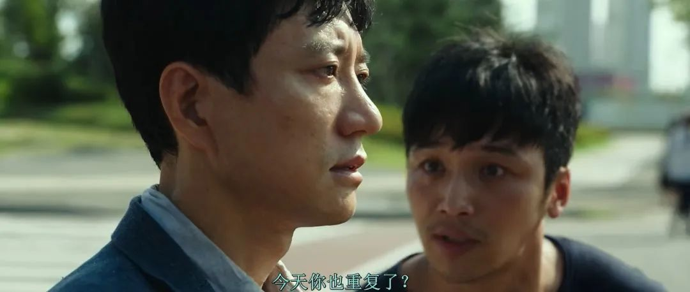

在以往的时间循环故事里，被困的通常是主角一人，是循环时间段里的唯一“变量”。

但在这部《一天》里，不断经历时间重启的，不止男主一人。

表面看，时间循环里的“变量”增加了，打破循环应该更容易，但实际并非如此。

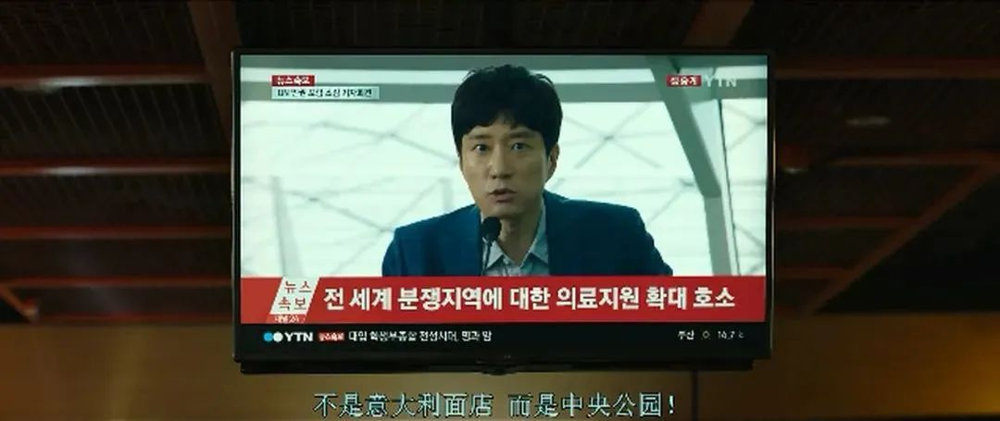

几次失败后，民哲想到了当警察的朋友，于是故意弄伤自己，假装是遭遇了肇事逃逸，举报了那辆出租车。

这一招总算是有效了，到了12点，那个路口一片平静，出租车也没有出现。男主的女儿及时看到了他在采访中的喊话，去了新的约定地点。

但就在男主放下心来，打算去和女儿汇合时，却接到了一通诡异的电话——“不管怎样，都没有用，她现在就要死了。”

随后，男主就发现远处一辆出租车突然冲开人群加速行驶，直接冲着女儿撞了过去。

男主为了保护女儿，立马也冲过去，飞身挡在了车前。

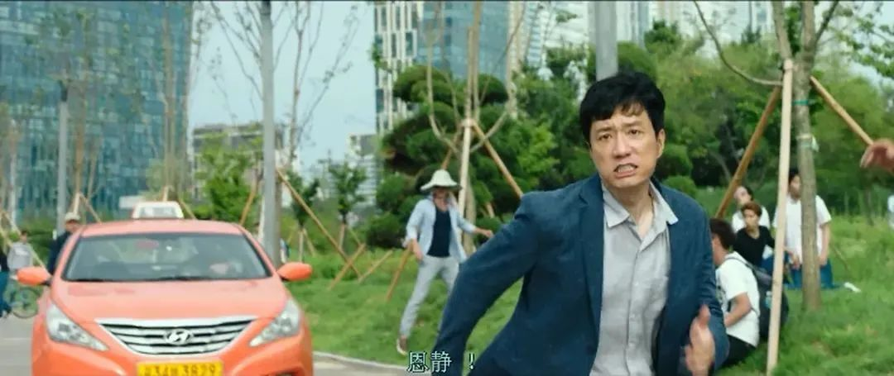

而等他反应过来后，时间又回到了最开始。

这一次，民哲告诉男主，这不是一个单纯的意外，而是一次有预谋的故意杀人。

因为在男主被出租车撞倒后，民哲发现车里的妻子在遭遇车祸前，就已经被司机掐死了。

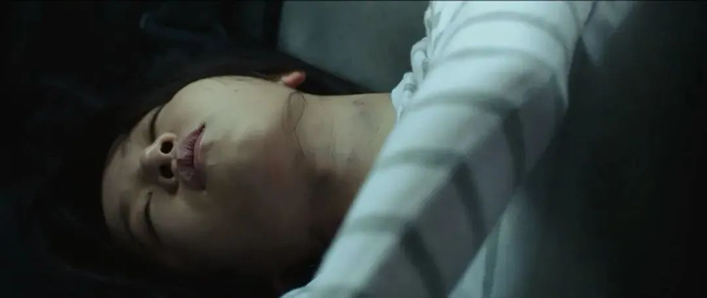

**而司机之所以在男主改变约会地点的情况下，依旧能找到他女儿、制造车祸，是因为他也是这个时间循环中的“变量”。**

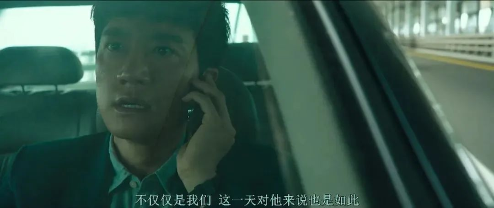

也就是说，本片中被困在同一天里的人有三个，司机在每次循环中都会杀掉男主的女儿和民哲的妻子，而男主他们几乎无法阻止。

之后，民哲在警察朋友那里，查到了这个司机的真实身份——李康石。

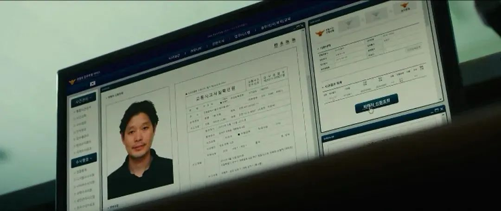

这个人其实之前就与男主和民哲发生过交集，也是这次时间循环的真正起因。

原来，三年前男主的女儿患有严重的心脏病，急需心脏移植手术，他们好不容易等到了可用的心脏，却在最后一刻被捐赠家属拒绝了。

也是在那一晚，男主发现医院里送来一对父子，两人遭遇车祸受伤，其中的儿子脑损伤严重，几乎没有生还的可能。

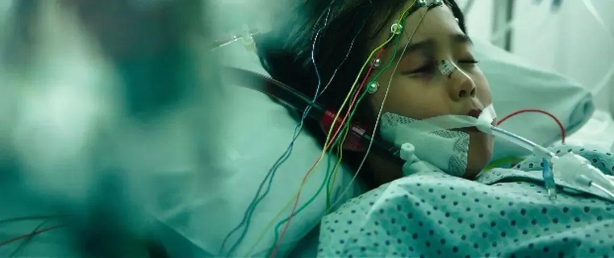

男主为救女儿，伪造了器官捐献申请，让还在昏迷中的那个父亲按了手印，把他儿子的心脏移植给了男主女儿。

之后男主良心不安，辞去国内的职务，做了战地医生。而那个昏迷中失去儿子的父亲，就是李康石。

当年，他和儿子之所以会出车祸，正是民哲造成的。而且当时的民哲没有及时进行施救，才造成他儿子脑损伤严重。

为了复仇，李康石计划杀掉男主的女儿和民哲的妻子，让他们也饱尝失去亲人的痛苦。

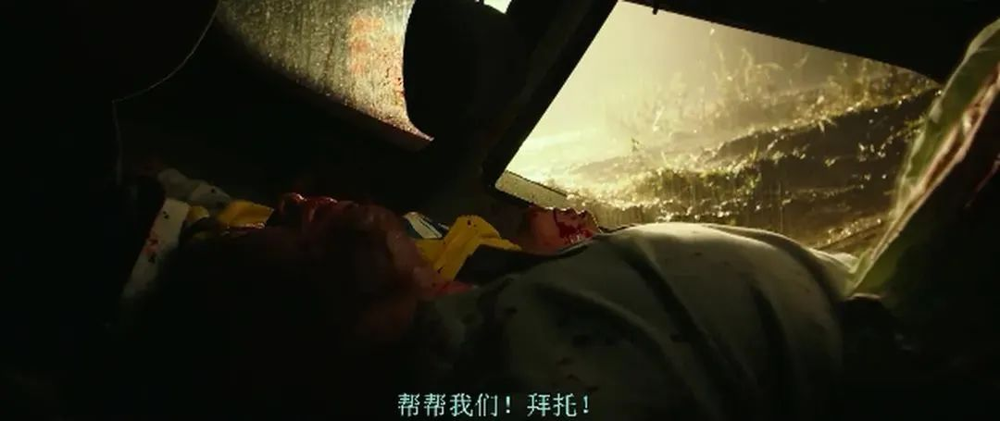

**片中依次揭晓三人同时陷于循环的设定，让这部电影在同类影片中脱颖而出，同时也让其主题带上了因果轮回和自我救赎的色彩。**

男主和民哲之所以被困，正是因为当年一念之差下的自私和逃避，造成了如今的恶果。一次次让他们经历同一天的悲剧，某种程度上也是让他们自我反思。

男主虽然通过伪造文件让女儿活了下来，但之后却不断受到良心折磨，不得不通过做战地医生的方式进行偿还。

为此他失去了与女儿相处的机会，在循环中答应女儿以后会陪在她身边。

民哲则在循环中渐渐发现，原来自己对待妻子是那么冷淡，甚至把即将出生的孩子当成生活的负担。

同样地，对于失去儿子的李康石来说，时间循环也是对他杀人的一种惩罚，虽然他嘴上说作为一个父亲，只要有机会就会给儿子复仇。但每次循环杀人时，他也在一次次经历内心的煎熬。

这一天之所以会不断重启，正是因为李康石每次都进行了自杀式复仇，却忘了男主的女儿体内跳动的正是自己儿子的心脏。

从这个角度看，《一天》中的时间循环，正是给片中三个父亲的一次自我救赎机会。如果他们不肯承认自己犯下的错误，如果继续被仇恨蒙蔽双眼，这场循环将会永无止境。

好在，影片并没有如此悲观。

故事结尾，男主在循环中面对媒体，将三年前自己的违法操作公之于众，民哲在医院找到了妻子，答应她会做一个好父亲。

而一度被仇恨驱使的李康石，也放下了执念，去看望男主的女儿，与死去的儿子重新建立起宝贵的亲情关系。

**这也正是在告诉每个人，人生就是一次不可逆的时间旅行，我们虽然无法回到过去弥补过错，但可以从当下开始，把未来的期望变为现实，为自己的人生留下美好的过往。**

