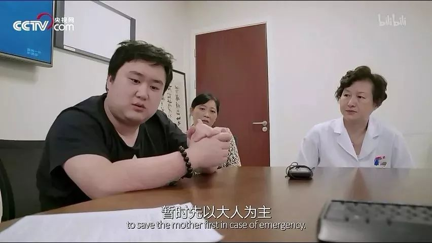
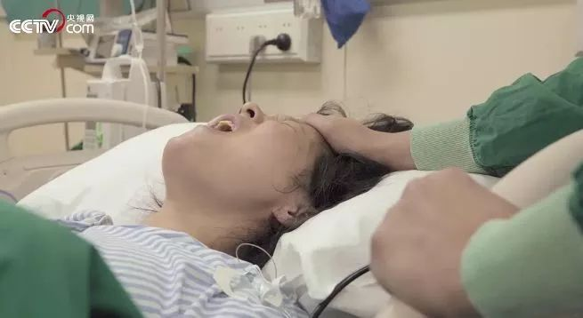
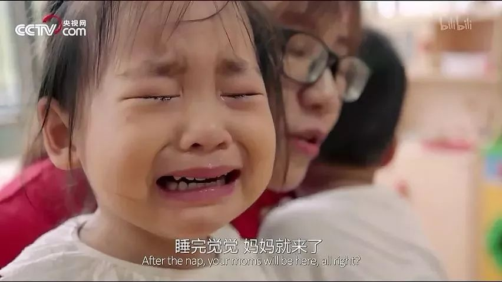
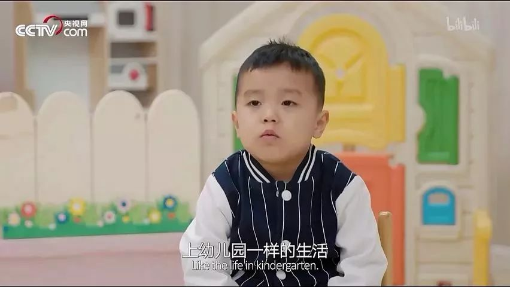

速读摘要

你不知道如何应对焦虑情绪，那么一定要看看我今天安利的这部国产人文纪录片，它不仅幽默、治愈，还特别解压——《人生第一次》。还有的家庭，正面临人生中第一次添丁，产房里的准妈妈和产房外的家属，通通透着些许焦虑和期待。但真等去了幼儿园，小朋友们会发现，《我爱幼儿园》《幼儿园里我不哭》《幼儿园里不用妈妈陪》这些童话都是骗人的!而每个小朋友在应对人生的第一次焦虑时，也表现出了不同的姿态。而这些有关人生第一次的片段，也深深打动了几位故事讲述人，开始分享起自己人生中难忘的第一次。

原文约 2324  字  | 图片 34 张 | 建议阅读 5 分钟 | [评价反馈](https://static.app.yinxiang.com/embedded-web/clipper/#/Evaluating?d=2020-03-20&nu=e050e4e5-1c89-43aa-97f6-917623bdfff9&fr=myyxbj&ud=58b471&v=2&sig=BBA931F99C4F7912EEEA2E850FC5C93F)

##  这部国产良心，不应该无人知晓

原创 有部电影 [有部电影]()**
今年的春节，估计是每个人人生中最难忘的一次假期，每天手机里有关疫情的消息和新闻，时不时让人感到伤心、揪心和愤怒。

所以开头想特别提醒一下有部电影的各位小伙伴，如果你最近感到焦虑、心慌，甚至影响了食欲和睡眠，一定要适时停止刷新闻，不要被过载的信息压垮。在这个特殊时期，保持个人的心理健康也同样非常重要。

如果你不知道如何应对焦虑情绪，那么一定要看看我今天安利的这部国产人文纪录片，它不仅幽默、治愈，还特别解压——**《人生第一次》。**

这部纪录片把镜头对准一个个普通人，记录了他们出生、上学、成家、立业、养老等不同人生阶段的“第一次”。

每集请来一位明星讲述人，通过他们的旁白，把寻常人的故事和处世哲学娓娓道来。

第一集名叫《出生》，讲述了妇产医院里三个家庭迎接新生命的过程。

有的家庭迎着二胎政策，等来了第二个健康的宝宝，一儿一女凑成了“好”。人生第一次的见面，孩子使劲哭，爸妈使劲笑。

随着二宝的诞生，家里的大宝也经历了人生中第一次眼泪汪汪的吃醋，撒泼打滚死活不想让奶奶抱着妹妹。

还有的家庭，正面临人生中第一次添丁，产房里的准妈妈和产房外的家属，通通透着些许焦虑和期待。

与宝宝的第一次亲密接触，让这个感性的新晋奶爸，一边喜笑颜开，一边泪流不止。

但并不是每个家庭在迎接新生命时都那么顺利。

比如这集提到的第三个准妈妈周婷，怀了一对双胞胎，但因为患有先天性心脏主动脉瓣二叶畸形，她要先过一道鬼门关，接受心脏外科手术。

这个手术对于27周大的胎儿来说，有高达30%的死亡风险，但如果不先修复周婷的心脏，她很有可能在生产时承担更大的风险。

虽然手术凶险，但医生们还是尽全力做了准备，最终周婷平安地度过了这道坎。

这个准妈妈虽然看起来瘦得让人心疼，但她内心却对即将出生的两个孩子无比期待，甚至早就“梦”到了孩子们的名字：春和、景明。

而在准备迎接新生命的这几个月来，准爸爸王翔过得也并不轻松。在与医生了解心脏手术方案的时候，他一直攥着手心，内心焦虑不安；

但转头进了病房，他却故作轻松，给妻子周婷讲笑话，让她不要想太多。

几个月后，到了生产的日子，王翔看上去又因为焦虑胖了不少，但不变的是他依旧在手术室外挂念着妻子。

最终，这个经历困难的家庭，迎来了期待中的“后福”，春和和景明顺利降生，妻子周萍平平安安。

《出生》这集的故事，因为深入产房拍摄记录了准妈妈的生产过程，引发了不少年轻父母的共鸣。随便翻翻评论区，就能看到不少人开始回忆自己的经历：

这便是《人生第一次》这部纪录片的特点——它没有多少戏剧化的波澜，更多的是平淡生活的点滴。但正是一个个有关“第一次”的瞬间构成了人的一生，唤起每个人的记忆，引发了内心深处的共鸣。

到了第二集《上学》，共鸣感会更加强烈。这集开篇就用一段逗趣的话，概括了每个人的惨痛童年回忆——

每当九月临近，有一类工具书就会被卖到脱销，向全国1800万准备上幼儿园的小朋友们，传递着同一个道理：**幼儿园是一个好地方。**

但真等去了幼儿园，小朋友们会发现，《我爱幼儿园》《幼儿园里我不哭》《幼儿园里不用妈妈陪》这些童话都是骗人的！

原因很简单，小朋友们无论事先经过怎样的童书“洗脑”，都会在入园第一天，把大门口变成与爸妈生离死别的惨烈现场：

而每个小朋友在应对人生的第一次焦虑时，也表现出了不同的姿态。

有的小朋友锲而不舍地强调，“回家是给父母最好的礼物”，声泪俱下地求老师放自己走；

有的小朋友表面故作镇定，但心思已经被一片哭闹声扰乱，努力让自己睡着，忘掉世间的一切……

不过，等到这种焦虑过去，小朋友们便会把注意力转移到别处，开始总结起自己的人生经验——

**老师怎么样？****很好，都不错，都蛮凶的。**

**蛋炒饭好吃还是白饭好吃？****蛋炒饭，有饭也有菜。**

相比起幼儿园的新生，小学一年级的小朋友们，明显多了几分淡定和成熟，甚至开启了吐槽模式。

有人在学校一边大嚼午餐，一边抱怨**“真难吃，能退学费吗？****”**

有人回到家后放飞自我地抱怨，妈妈对自己太严格，总是让做作业，没得喘息机会。结果转头就遭遇妈妈的“降维打击”……

这些爆笑的片段，让网友不禁想起了自己的童年，纷纷感叹**“太真实了！****”：**

值得一提的是，导演施筱青在准备“上学”这个选题时，原本计划是想偏严肃画风的。

但在实际拍摄中却发现，每个孩子身上都有属于自己的独特气质，他们面对镜头时，总能说出让大人们自愧不如的人生哲理——

比如谈到勇敢，对孩子们来说这并不是一个抽象的概念，而是体现在实际行动中：**“去幼儿园千万不能哭，你就大步地，不要家长陪，这就是勇敢”。**

比如谈到交友，孩子们也十分坦诚开放：**“调皮的小朋友我也喜欢，因为我自己就很调皮”。**

再比如谈到童年和长大，有的小朋友回答，童年就是现在幼儿园里的生活，长大就是转到中班和大班……

而这些有关人生第一次的片段，也深深打动了几位故事讲述人，开始分享起自己人生中难忘的第一次。

比如讲述《出生》的涂松岩，看完片子就立刻回想起自己儿子出生时的情景，自己作为奶爸进入产房，整个人都是慌的，只能机械地听从医生的指挥。

比如韩童生老师，至今都记得自己第一份工作的通知函内容，详细到具体日期和地址门牌号。当他把33块钱月薪中的28块上交给父母时，第一次感觉自己真的长大了。

再比如演员郎月婷印象最深的“第一次”，是与导演林兆华、演员濮存昕合作出演话剧。

排练期间，她一直觉得整个过程“很不真实”，但直到第一场演出结束，郎月婷才意识到，“既然我能演完第一场，就能演完后面的”……

人的一生正是由无数个“第一次”组成，对于第一次的回忆，虽然并不都是美好圆满，但不得不说，经历“第一次”就是我们认识世界、认识自我的过程。

从这个角度看，最近的疫情也最终会给我们带来很多难忘的第一次——

你可能第一次发现，自己的泪点居然那么低，普通人的善良与坚强，就能让你泪流满面；

你也可能正在第一次经历人生中最艰难的时刻，面对突如其来的误解和不公，内心一点点被绝望和失望所吞噬；

你还有可能，第一次发现自己是那么爱发脾气，每当在手机上刷到某些令人不解的魔幻操作，都恨不得亲自冲上前口吐莲花，教对方做人……

人有多大胆，地有多大产？

但不要忘了，正在经历第一次的我们，也可以用实际行动，去创造更好更圆满的第一次。

