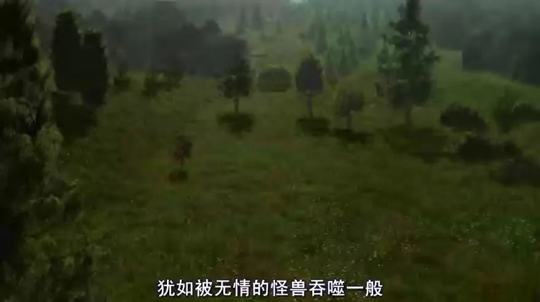

#  人类消失后，地球会变好吗？《人类消失后的世界》

原创 有部电影 

本片只是以此为假设，来探讨人类消失后的世界究竟是何模样。一旦没有了人类的照看和食物来源，这些宠物将不得不走出家门。人类消失一千年后，地表或许再也无法找到人类活动过的踪迹。在自然力量的作用下，你曾经居住的街道，也许会变成一条河流。而如果没有人类存在，地球依然会转动，甚至会变得更好。

前段时间，我刷到这样一则新闻：有网友在四川省国道上，偶遇了野生的国宝大熊猫！

一时间，很多人表示羡慕，但也就此带出了另一个话题——

人类受困于肺炎无法出门的这段时间，熊猫在国道上悠然漫步；若是人类不存在，“地球之癌”是不是就能不药而愈了？

恰好，我最近刚看了一部脑洞清奇的纪录片，可以用来回答这个问题——**《人类消失后的世界》。**

说到底，人类会以什么样的方式灭绝呢？

这似乎是一个科幻电影才会涉及的问题，也确实并非本片讨论的重点。本片只是以此为假设，来探讨人类消失后的世界究竟是何模样。

人类消失后的第一天，“时间”这个概念，将变得毫无用处。

由于没有人来为电力系统提供运行动力，若干个小时后，灯光会陆续熄灭，整个星球渐渐将沉寂到无限的黑暗当中。

这是自从人类学会使用火之后，从未经历过的黑暗。

而一旦电力枯竭，其它相关系统也会很快崩溃。想想看，现在靠电力支撑运转的系统还少吗？

比如在纽约地铁隧道的深处，就有超过700台水泵不停工作，以保证地铁站不会被地下水所淹没。一旦水泵停工，那么地铁在36小时内，就会浸泡在水中。

人类消失十天后，超市内的食物正一点点腐烂。

电冰箱也变成了存放着一堆腐烂食物的铁皮盒子。

从电冰箱里融化出来的水，成了家养宠物临时的生命保障。一旦没有了人类的照看和食物来源，这些宠物将不得不走出家门。

然而，外面几乎没有适合它们生存的环境，大量宠物会因不适应捕猎生活而走向死亡。

而老鼠、蟑螂等依附人类吃剩的食物残渣生存的动物，也会很快活不下去。

人类消失半年后，城市将变成一片荒野。原先被人类赶走的猎食动物，便会夺回这些地方。

先前生活在城市边缘的小型猎食动物将首先回归，等大型猎食动物有了足够的猎物时，它们也会慢慢涌入。

人类消失一年后，城镇虽然还能勉强辨认，但自然的力量将会逐渐占据上风。

在任何有阳光的地方，植物都会生长。人行道的各个角落，都将被生命力顽强的野草占领。

时间一长，先前修剪整齐的花园，会变成小鹿的牧场。

野生动物也开始逐渐适应城市生活，在城里悠闲地散步。

在没有人类的世界，强大的自然力量会一点点夺回其主宰地位：闪电会引发森林大火，而城市及周边遗弃的建筑、野草和废弃物，又成为野火的主要燃料。

世界将时不时地陷入一片火海，但火燃尽后，生命又将找到出路。

人类消失的第五年，全球的公路都会隐没于一片绿色，大自然将无边无界，再也看不出曾经的模样。

公园将变成森林，城市宛如一个大型动物园。

人类消失二十年后，因为没人粉饰墙壁、修补裂缝，钢筋混凝土建筑开始土崩瓦解。

无人照看的城市，将活生生变成一座废弃的空城，动物们在断壁残垣上安家筑巢。

事实上，这一切并非凭空想象——在切尔诺贝利事故之后，乌克兰的普里皮亚季就从苏联最繁华的城市之一，迅速变成了一座静谧的鬼城，人类直到今天还不能在那里居住。

学校被灰尘覆盖，球场被树木替代，植物在楼房攀爬，挤满砖石间的缝隙……

人类消失二十五年后，自然正在抹掉所有的人类足迹。

水泥公路已经很难辨认，地势低的地区将会被潮水淹没，窗户开始破损并慢慢滑落，楼顶的铜制避雷针也已生锈……一场暴风雨，就能让整座城市都变成人间炼狱。

而重新统治大陆的，将会是快速繁殖的动物们，比如让人闻风丧胆的狼。

人类消失五十年后，因为缺乏照看和维护，高楼大厦会慢慢腐蚀倒塌，坚固的桥梁也会慢慢腐蚀生锈，开始分崩离析。

人们用以代步的汽车，将只剩下空壳。

人类消失一百年后，大型建筑全都会毁于一旦。

就连看似坚固的保险柜，也逃不过此劫。

而纸质文件和影像资料，则将在高温与湿气的作用下化为泡影。

人类消失一百五十年后，高楼大厦已全部被绿色植物覆盖，动物们也已发生了新一轮进化。

人类消失的两百年后，钢铁结构的标志建筑物也处于崩溃的边缘，比如埃菲尔铁塔。

人类消失的五百年后，将是一个腐蚀和毁灭的时代，再坚固的混凝土也将不复存在。

就像人死后，尸体会慢慢腐败，直到回归自然，城市也是如此。

人类消失一千年后，地表或许再也无法找到人类活动过的踪迹。

所见之处除了丛林，什么都没有。

在自然力量的作用下，你曾经居住的街道，也许会变成一条河流。

大自然会重新掌控这片土地，赋予其绿色的心脏，直至将地球完全变为一个蓝色和绿色交织的星球。

人类消失一万年后，也许很少还有能证明人类存在过的事物了。

动物又开始了新一轮的进化，但要想进化成能独立思考的智慧生物，得依赖于运气和更长的时间。

也许再过一段时间，象征着人类文明最后一点遗产的万里长城，也会灰飞烟灭……

要知道，地球迄今已经存在了45亿年。如果把45亿年当作一天，那么一万年的时间也不过是零点几秒；而人类历史所存在的时间，也不过只有半分钟而已。

这部影片的风格极简而冷静，但给人带来的震动却无法言喻。它用无法回避的镜头，让人看到自然的强悍与人类的渺小，一场灾难就能带走数以万计的生命。

**而如果没有人类存在，地球依然会转动，甚至会变得更好。**

在人类出现之前已有生命存在，在人类消失之后，生命也会继续存在。

有意思的是，有科学家曾预测，我们的文化和历史能通过无线电波和电视广播永远继续下去，向着广袤的宇宙无限延伸。

但实际上，这些电波在经过2光年后就会永远变成噪音，它们到不了离太阳系最近的行星。

更讽刺的是，现代人保存资料的方式，比如书籍或是硬盘，其实根本经不起时间的考验，不像古代人的石刻壁画能延续千年。

**也就是说，我们所谓的先进技术，其实在自然的维度上很脆弱，甚至不堪一击。**
**直到现在，人类还未能找到一种比石刻更持久的保存信息的方式。**

