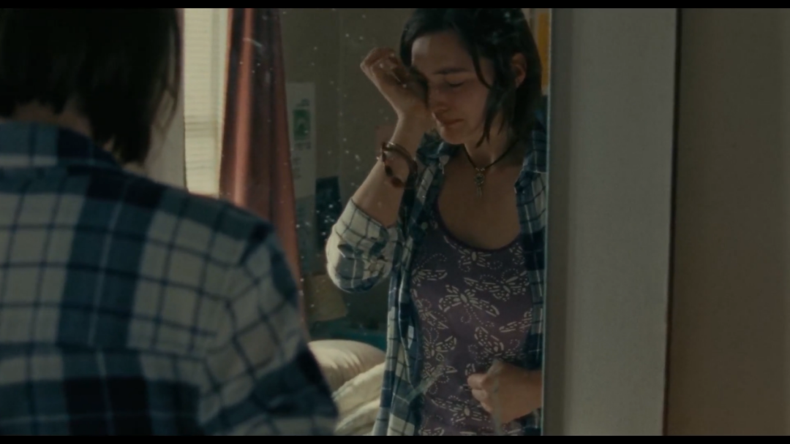
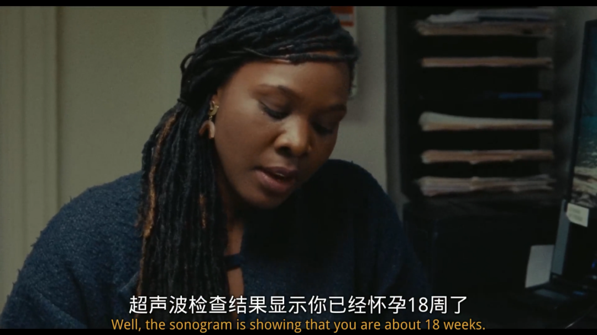
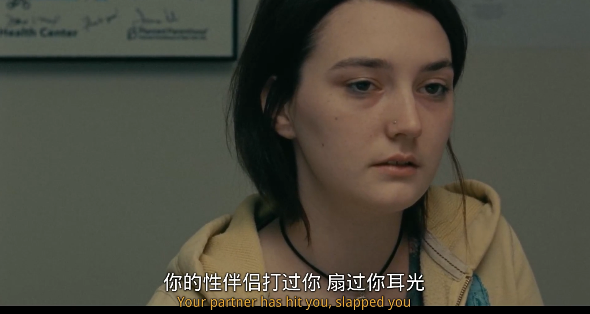

速读摘要

当女主来到纽约的诊所后，被告知已经怀孕18周，而非家乡诊所检测的10周。当她们来到曼哈顿诊所后，医生又告知她整个过程要两天，因为第一天需要在子宫颈里放扩张器，以便于第二天的手术顺利进行。试想一下，如果继父是一个值得信赖的男人，女主或许就会向他和母亲坦白怀孕的事，也就不必同表姐偷偷摸摸跑到纽约堕胎了。另外就是整个事件的始作俑者，那个让女主怀孕的男人。所以不难猜测，这个在影片中缺席的男性，曾经对女主做过什么。

原文约 2348  字  | 图片 47 张 | 建议阅读 5 分钟 | [评价反馈](https://static.app.yinxiang.com/embedded-web/clipper/#/Evaluating?d=2020-04-13&nu=428deee6-b121-47f5-8699-4383966f8652&fr=myyxbj&ud=58b471&v=2&sig=BDBC18F39EE725B4221B35FC78078298)

##  被养父欺凌、秘密堕胎，这个少女的故事是年度最佳之一

原创 有部电影 [有部电影]()**
最近，一则“上市公司高管被指性侵养女四年”的报道引发舆论轩然大波，爆料人称其自2015年14岁以来，遭“养父”鲍某明连续性侵4年至今。

在南风窗的报道中，披露了大量令人毛骨悚然的细节。而受害者报案多次，不仅结果石沉大海、还受到警方恐吓的经历，更是让无数网友感到难以置信。

我周五已经在秘密基地专门写了一篇文章，探讨了我对这个事件的担心。

.jpg)

今天就先给大家聊一部与此相关的新片——**《从不，很少，有时，总是》。**

从海报就不难看出，这是一部女性题材的电影。

这部电影在外网可以说是获得专业媒体人的一致认可，**烂番茄****98%新鲜度**，**Metascore评分92，妥妥的年度最佳之一。**

故事的主角名叫奥秋，是一个生活在美国宾州小镇的17岁少女。

最近，她发现自己意外怀孕，对此手足无措，倍感困扰。

因为不想让父母知道这事儿，她只能独自到小诊所去检查，寻找解决问题的办法。

但是，根据宾夕法尼亚州的法律规定，未成年人必须在父母陪同下才能堕胎。

于是，女主只能试图通过网上搜来的办法，在家自行堕胎。

但她没有成功。

万般无奈之下，她找来同在超市打工的表姐陪自己偷偷去纽约。

因为在那里，未成年人堕胎不需要父母陪同。

她们本打算在一天之内完成手术，然后神不知鬼不觉地返回家里。

但当女主来到纽约的诊所后，被告知已经怀孕18周，而非家乡诊所检测的10周。

这意味着，该诊所也不能为她提供堕胎服务，因为他们只接受12周以下的。

女主只能根据医生的建议，和表姐先在纽约待上一晚，第二天一早赶去可以为她服务的曼哈顿诊所。

然而，当她们来到曼哈顿诊所后，医生又告知她整个过程要两天，因为第一天需要在子宫颈里放扩张器，以便于第二天的手术顺利进行。

这就使得，她们必须在纽约再待上一晚。

可两人所带的钱所剩无几，已经住不起旅馆，只能在纽约的大街上茫然无措地游荡。

这个时候，表姐想起了之前在大巴上跟自己搭讪、后来还发短信给她的男孩。

这个男孩看上去很热心，不仅出来和她们见面，还带她们去吃了饭。

虽然看得出来，男孩对表姐似乎有所企图，但他并没做出什么出格的举动。

于是，等到三人要分开的时候，表姐便向男孩表达了希望对方借钱给自己坐车回家的想法。

谁曾想，男孩虽然答应得好好的，但却有诸多理由，先是说希望带表姐到市里去取，见她不同意，又说服她一起到外面找提款机。

很明显，男孩并不想白白借钱给两姐妹。

过了一会儿，见表姐和男孩始终没有回来，女主心里有些忐忑，遂即去寻找表姐。

而当她找到之时，男孩正在一个柱子后面与表姐接吻。

女主明白，表姐和男孩的行为，只不过是一场看似你情我愿的交易。

但面对眼下的情况，她也无能为力，只能走到柱子后面，默默勾住了表姐的手指。

好在，男孩兑现了承诺。姐妹俩拿到了钱，女主也最终顺利完成了手术。

在影片的结尾，女主和表姐坐上了返程的大巴，黑夜里斑驳的灯光在她们青涩的脸上流动，她们的眼神里写满了困顿和迷茫。

总的来说，这是部极具沉浸感的女性题材电影。

片中的故事并不复杂，所有的情绪也都非常节制，通过一种近乎白描的日常化呈现，配合着清淡的色调和叙事，营造出不动声色的忧伤与颓丧。

从少女堕胎这个核心事件来看，影片很容易让人联想到《四月三周两天》。

那部电影采用生猛冷峻的长镜头，通过一个女孩与室友联系医生秘密堕胎的故事，以女性的处境指向制度性的社会压迫，让人揪心失语，悲从中来。

与之相比，本片并没有强烈的政治性映射，它所聚焦的，是女性在日常生活中所受到的冒犯和伤害。

比如女主在台上唱着情歌，忽然有人冲她大喊“荡妇”，女主备感屈辱，但台下的男生们看着她不知所措的反应，却显得非常得意、捂嘴偷笑。

比如在她工作的超市里，男顾客和老板喜欢动不动就嘴上占她便宜，也从不觉得有什么问题。

哪怕是看上去热心的路人男孩，实际上的行为初衷也带着并不单纯的目的。

影片通过他与表姐搭讪时的细节，比如过于亲近的距离、突如其来的身体接触等暧昧的镜头刻画，传递出一种冒犯的意味。

值得一提的是，不仅陌生男性如此，熟人的伤害更加严重。

首先是女主的继父，无论女主心情或身体有什么状况，他都会冷嘲热讽，还当着女主的面，管一只狗叫“小婊子”。

试想一下，如果继父是一个值得信赖的男人，女主或许就会向他和母亲坦白怀孕的事，也就不必同表姐偷偷摸摸跑到纽约堕胎了。

另外就是整个事件的始作俑者，那个让女主怀孕的男人。

影片并没有把这个角色置于镜头之前，甚至从头到尾都没有提及他的身份，以及他和女主的关系。

我们只能通过医生与女主在手术前的对话，将他的轮廓勾勒出来。

在诊所里，医生向女主提出了这样一连串问题——

*在过去的一年里，你的伴侣是否有拒绝使用避孕套？*

*你的伴侣是否妨碍你避孕，或试图在你不想怀孕的时候让你怀孕？*

*你的伴侣是否威胁或恐吓过你？*

*你的伴侣是否曾动手打你，扇你耳光？*

*你的伴侣是否曾违背你的意愿，强迫你与之发生性行为？*

这些问题的答案，总共有四个选项，也就是本片片名中的那四个词——**从不，很少，有时，总是。**

在这段剧情里，导演使用了固定的长镜头来表现女主的情绪变化。

我们可以清晰地看到，随着问题恶劣程度的加深，女主的表情从平静自然慢慢变得压抑痛苦，直到最后开始哭泣。

所以不难猜测，这个在影片中缺席的男性，曾经对女主做过什么。

在这里，他的缺位，其实与《大红灯笼高高挂》中不曾露脸的老爷，有着异曲同工的效果。

他是一个符号，代表的是在两性关系中，男性对女性隐蔽而普遍的倾轧。

诚然，影片中的男性形象偏向负面，并不能够代表所有男性皆是如此，但片中所反映的问题却是广泛存在的。

最近因为居家隔离，全球各地家暴激增的现象，就是一个很好的证明。

值得一提的是，除了对男性的批判以外，影片还进一步探讨了**女性身体自主权**的问题。

片中有这样一个情节——

女主在得知自己怀孕之后，忍着疼痛，硬生生地给自己打了鼻钉。

**这个表面上看起来离经叛道的行为，实际上是一种夺回身体自主权的宣誓，暗示着她要掌控自己的身体和命运，也意味着她选择堕胎的必然。**

我们都知道，自打特朗普上台之后，美国社会的反堕胎运动愈演愈烈。

去年有几个州还相继出台了反堕胎法案，有的地方，女性连在强奸和乱伦的情况下都不能堕胎。

导演在这种情况下，拍摄这样一部电影，也可以说是对特朗普的一种回击，捍卫女性对身体的自主权。

而我今天和大家聊这部电影的理由也非常简单看来，那就是：**在我看来，没有人有权干涉、强迫女性，做她不想做的事。情侣不行，夫妻不行，“养父女”更不行。**

也许是国内最认真的电影自媒体
长按扫描二维码关注

在看