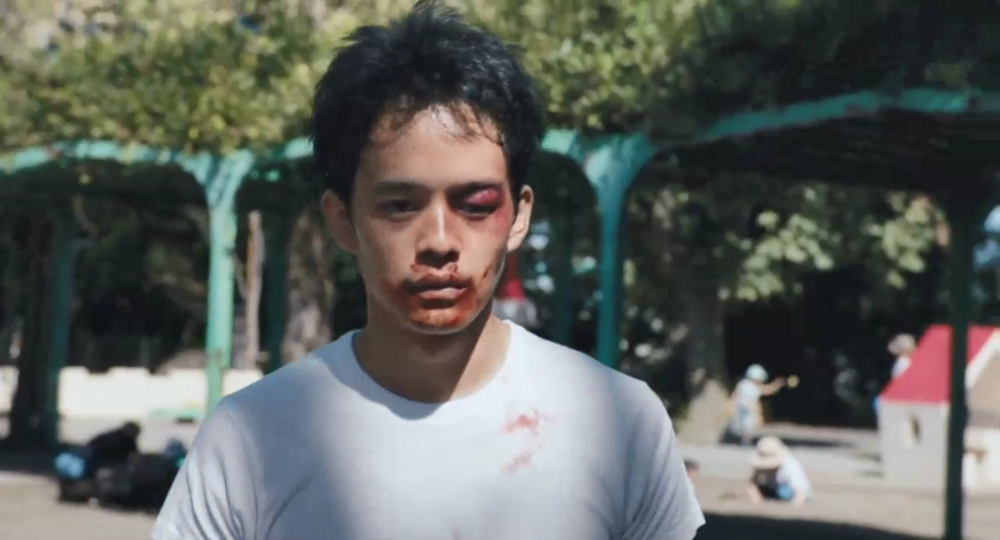
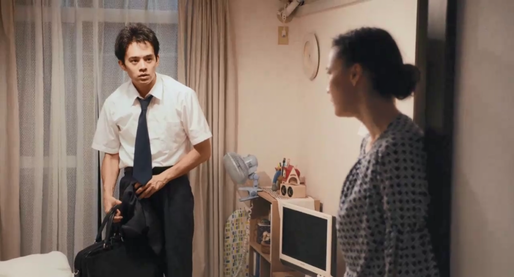
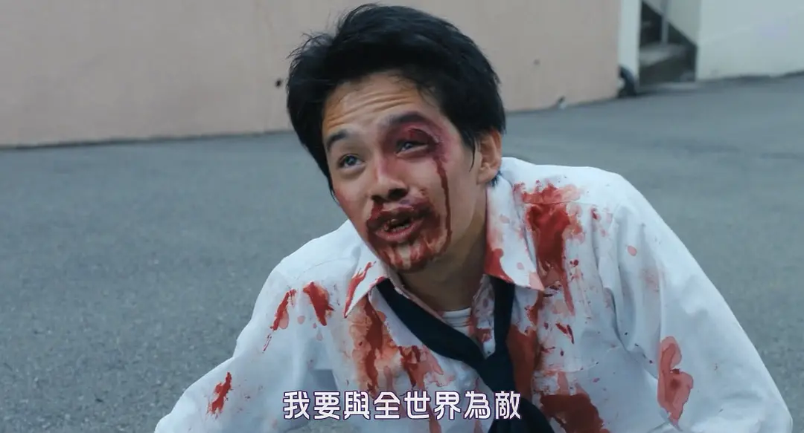

速读摘要

剧集讲述了一个名叫宫本的年轻人，在进入职场成为社畜之后，遭到现实的暴击，奋起反抗的丧燃故事。这个男人名叫拓马，他身材高大强壮，是橄榄球球队教练的儿子，男主和女主在由教练组织的酒局上认识了他。在这种情况下，女主对男主愤怒而失望是必然的。被强暴之后，她甚至一度绝望地想要杀掉无能的男主。这种依靠暴力来建立秩序的方式，只会激发人的兽性。

原文约 2308  字  | 图片 48 张 | 建议阅读 5 分钟 | [评价反馈](https://static.app.yinxiang.com/embedded-web/clipper/#/Evaluating?d=2020-04-06&nu=522b6d2b-d04f-44dd-81eb-a82b91db91b3&fr=myyxbj&ud=58b471&v=2&sig=E15806CB078E659BB92DCD1ADD0A1A19)

##  暴力、血腥和性，这部岛国新片扎心了

原创 有部电影 [有部电影]()**
2018年，有一部根据同名漫画改编的日剧《从宫本到你》，曾引发无数人的共鸣。

剧集讲述了一个名叫宫本的年轻人，在进入职场成为社畜之后，遭到现实的暴击，奋起反抗的丧燃故事。

今天咱们要聊的，就是这部剧的剧场升级版，它的口碑颇高，去年还入围了日本旬报的年度十佳——**《从宫本到你》。**

电影由剧版的原班人马制作，故事延续了剧版的基本架构，导演依旧是真利子哲也，男主宫本也依然由池松壮亮饰演。

相比剧版，电影版给人的感受更加绝望而癫狂。

影片一开头，就是男主被人打得鼻青脸肿、掉了几颗牙后，来到洗手间里，对着镜子狂抽自己嘴巴的情景。

这到底是怎么一回事？

一切的一切，要从他认识了苍井优饰演的女主靖子讲起。

男主是一个老实本分的职场菜鸟，他胆小怕事，对人毕恭毕敬，工作能力一般，也没什么高超的智商和情商，一直都不清楚自己活在世上的意义是什么。

直到认识了女主之后，他的生命仿佛拥有了色彩，两人没事就以朋友的身份到对方家约饭。

然而，他不知道的是，女主当时其实正深陷于前男友的骚扰之中。

某天晚上，他正在女主家吃饭，碰上了前男友前来找事，吓得他本能地选择了退缩，拎起手提包就想要逃跑。

女主对他大失所望，前男友也忍不住对他一通嘲讽，还肆无忌惮地暴打了女主一顿。

结果没想到，这一下子激起了男主的斗志，他鼓起勇气，说出了这样一句中二的台词：这个女人由我来守护！

那一瞬间，女主被他打动。

于是，前男友离开后，两人顺理成章地为爱鼓掌，并开启了一段温馨美好的幸福时光。

只可惜好景不长，虽然前男友没有再来捣乱，但一个更可恶的男人出现了。

这个男人名叫拓马，他身材高大强壮，是橄榄球球队教练的儿子，男主和女主在由教练组织的酒局上认识了他。

万万没有想到的是，在酒局之后，拓马假装好意送喝得不省人事的男主回家，一到家里就对女主实施了强暴。

而那时候的男主在半米之外的床上睡得死死的，任凭女主怎样哭喊求救，他都没有反应。

显然，这个时候，男主曾经说出的保护，已经成为了一个笑话。

这使得女主对男主失望至极，第二天，当男主还在一脸懵逼之时，女主就发出了撕心裂肺的哭诉，要和他分手。

得知真相后，男主也陷入了深深的自责，感觉自尊受到了严重伤害。

他死缠烂打不肯离开女主，表示自己一定会去找拓马报仇雪恨。

可是说起来容易，做起来哪有那么简单。

当身体羸弱、性格唯诺的男主第一次去找拓马时，瞬间就被打趴了，于是便有了影片开头的那一幕。

只是，男主并没有因此放弃，想要战胜拓马的心反而变得更加强烈。

为此，他决定暂时不再纠缠女主，每天拼命练习打拳，整个人的精神开始处于暴走状态。

没过多久，他又得知女主怀孕了。

在求婚遭拒之后，他的整个心态彻底崩溃了。打败拓马，也成为了他此时唯一的信念。

终于，在悲愤交加的情况下，他再一次去找拓马决斗。

起初因为战斗力悬殊，尽管男主卯足了劲，还是被拓马打到跪地喷血。

但后来，由于他的锲而不舍，捕捉到了一个反败为胜的机会。

在厮打的过程中，他先是用力撕掉拓马的短裤，使他有了顾及；接着又顺势吐到对方身上，在拓马大呼卧槽之际，为自己争取到了致命一击的时机。

最终，男主乘胜追击，把拓马彻底打废……他终于维护了自己的尊严，也向女主证明了自己的能力。

在见到男主带着被打垮的拓马来到自己面前后，女主泪眼朦胧，同意了与男主重归于好。

总的来说，这是一部中二狗血、癫狂浮夸的日式电影。

相比剧版而言，影片的故事更加压抑，传递出的情绪也更加强烈。

它集愤怒、绝望、暴躁、疯魔于一身，给人以极强的沉浸感，让人得到充分的宣泄和释放。

表面上看，本片所探讨的是男性尊严这个问题，**“尊严”**是整部影片中被提到次数最多的一个词汇。

当男主向女主表示要找拓马报复的时候，女主不以为然，对他发出的灵魂质问就是——**你是因为我，还是因为自己的尊严被践踏不甘心？**

当男主战胜了拓马来找女主时，她的这个疑虑仍然没有打消，还表示男主这么做并不是为了她，而是为了自己。

片中，一个劝男主罢手的人也说过这样一段台词：**男人的愤怒有三种，包括母亲被侮辱、自尊严重受损和女人方面的问题。**

可见，男主怒不可遏的背后，既有着对女主的心疼和自责，更有着自身尊严被践踏的屈辱。因为，若爱人受到伤害都不敢反抗，那就意味着自己的无能。

所以，当他打败拓马之后，高兴得像个孩子一样来到女主面前，第一时间表达的期望是想要女主夸夸自己。

**但深入来看，与其说影片是在批判男性尊严的可笑，倒不如说，它是在反映在弱肉强食的环境下，普通人的卑微与无力。**

男主和女主，都不过是弱小而平凡的人，他们没曾想过要害谁，只想有爱地过自己的小日子。

但是，他们一个被前男友纠缠、被渣男强暴，另一个想要获得正义却无能为力，只能拼得头破血流。

在这种情况下，女主对男主愤怒而失望是必然的。被强暴之后，她甚至一度绝望地想要杀掉无能的男主。

而与之对应的，男主选择以暴制暴也是必然的，因为如果不证明自己，就会永远被踩在脚下，无法换回女主的信任。

只是，这种依靠暴力来建立秩序的方式，只会激发人的兽性。

在男主同拓马最后的对决中，所有的文明和体面都荡然无存，两人都变成了疯狂而血腥的野兽，滑稽可笑却又令人悲哀。

值得一提的是，以男主第一次被打为节点，影片从开头就进行了巧妙的倒叙和插叙，讲述了男女主角复合之后的故事。

应该说，打那以后，两人的生活相对来说事事顺遂。

尽管突然，但双方父母还是同意了他们的婚事，等到了影片的最后，女主肚里的孩子已经快要出生。

片中有这样一个情节：女主在被强暴之后，忽然有了一种女性意识觉醒的意味，她意识到能保护自身的只有自己，自己不应该依附于男人，作为男性的附庸而存在。

但到了最后，她仍然选择了和男主在一起。这既是源于两人间感情所带来的羁绊，也是某种现实意义上的必须。

不过，这种处理并非是导演对女性主义的否定。他想告诉我们的其实是这样一个事实：**这个世界并不足够美好，现实有其残忍之处，所以男女之间必须互助。**

