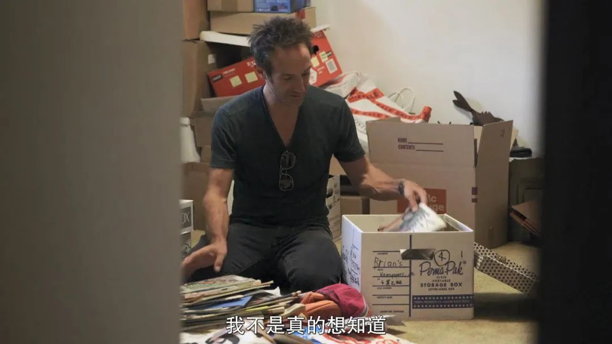
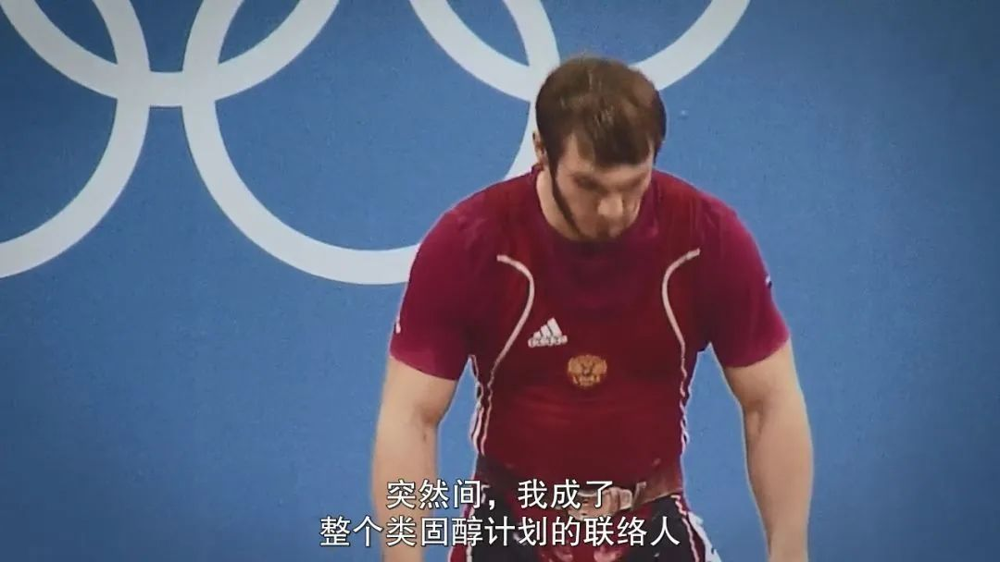
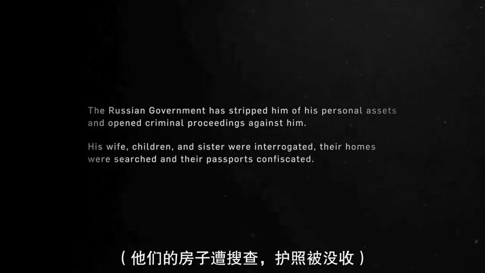

#  服用禁药，只是运动员的个人行为吗？《伊卡洛斯》

原创 有部电影 

前几天，孙杨“拒检案”结果已出，孙杨因为“妨碍阻拦兴奋剂检查”被禁赛8年。

这个结果迅速在网上引发了轩然大波，但随着听证会视频等更多资料的放出，网友们的舆论也几经反转。

一直以来，使用兴奋剂都是竞技体育中的重大问题，重视兴奋剂检查也无可厚非。

今天我想和大家聊的一部纪录片，讲的正是一桩关于“举国使用兴奋剂”的惊天丑闻——**《伊卡洛斯》。**

不同于此类纪录片一贯的局外人视角，本片以导演布莱恩·佛格尔的第一视角展开，通过他的故事，带领观众进入到事件之中。

这是因为，除了导演的身份之外，布莱恩还是一名业余的美国单车运动员。

他从小就热爱自行车比赛，把曾战胜癌症、连获7个环法自行车赛冠军的阿姆斯特朗视为自己的偶像。

实际上，他自身的成绩也不错，2014年第一次参加环法自行车赛，他就获得了第14名，战胜了400多人。

但他对此并不满意，进入前十、甚至成为冠军才是他的梦想。

可没想到，后来阿姆斯特朗服用禁药的丑闻被曝光，原来他一直都是通过技术手段，让药检结果显示为阴性。

这件事给了布莱恩很大的震撼。

他也受到偶像的“启发”，决定找人给自己制定个用药计划，进而骗过药检，在比赛中提高名次。

随后，经过旁人介绍，布莱恩找到了一个肯为他制定用药计划的人——**莫斯科反禁药实验室的主任，格里戈里。**

在格里戈里的帮助下，经过连续多月的注射、服药和训练，布莱恩的力量比之前增强了两成，尿液样本也达到了顺利通过检测的状态。

但悲剧的是，新一次的比赛结果并没有如他所愿。

他的自行车在中途电池没了电，变速器也坏了，在巨大的心理压力下，他的成绩只有27名，远不如第一次。

尽管比赛结果不尽人意，但布莱恩与格里戈里建立了深厚的友谊。

期间格里戈里还向他透露，自己正在接受世界反禁药组织调查的事。

原来，在2014年，德国电视台曝光了俄罗斯运动员使用禁药的丑闻，世界反禁药组织因此成立了独立调查委员会，格里戈里被列为重点调查对象。

到了2015年9月，世界反禁药组织宣布停止俄罗斯的反禁药实验室，格里戈里也因而引咎辞职，成为了整个事件的背锅侠。

从这里开始，整部影片的重点，从布莱恩转移到了格里戈里身上。

因为知道太多机密，格里戈里被俄罗斯政府和反禁药组织共同锁定，当局将他囚禁家中，稍有不慎，他就可能面临生命危险。

没过多久，他在一次视频聊天中，向布莱恩表达了自己想要逃离俄罗斯、奔赴美国的想法。

2015年11月，经由布莱恩的协助，格里戈里终于成功抵达美国，并向他讲述了自己这些年的经历和所知道的一切。

原来，在2008年，俄罗斯国家队没有了购买类固醇的渠道，而格里戈里刚好知道一个来源，于是便成为了整个类固醇计划的联络人。

这让俄罗斯国家队类固醇教练波杜加罗夫与他结下了梁子，找来缉毒警察要将他逮捕。

格里戈里精神沮丧，一度想要自杀，随后便被关进了精神病院。

然而2012年，格里戈里收到了奥委会的邀请，要他去参与奥运会的工作。

经过考虑，俄罗斯当局同意了这件事，普京还亲自撤销了格里戈里的案子。

为了“将功赎罪”，格里戈里只能继续为俄罗斯国家队服务。

他利用自己的职权，通过掉包运动员的尿检样本，成功使得俄罗斯在2014年的索契冬奥会上“大获全胜”。

简单来说，运动员的尿液在采集之后作为药检样本，会被分为A、B两份，分别装在贝林格瓶中，A瓶用于分析，B瓶会被冷冻保存。

而格里戈里则会利用监控盲点，配合相关人员，将预先准备好的干净尿液与服药尿液样本调换。

尽管整个操作听上去很难，但格里戈里他们配合得天衣无缝。

这起政府参与的禁药丑闻，最终为俄罗斯在冬奥会上赢下了33枚奖牌，13枚金牌，创造了一个历史性记录。

显然，事情发展到这地步，格里戈里也明白自己已经没有回头路了。

来到美国后，他就将相关资料交给了《纽约时报》，当新闻发布后，全世界都为之哗然。

尽管俄罗斯对此予以否认，但世界反禁药组织通过深入调查，拥有了百分之一百的证据，并对外宣布了俄罗斯的集体作弊行为。

因为这个丑闻的曝光，俄罗斯在国际体育赛事上被接连禁赛。

很多俄罗斯运动员的热情、期待和所有努力，就这样被付之一炬。

在影片的最后，经过一段时间，俄罗斯逐渐恢复了各种比赛参赛资格，而格里戈里则需要接受美国的保护性拘留以确保安全。

普京把格里戈里称之为“叛逃者”，当局没收了他的私人财产，他的妻子、儿女、妹妹被逐一审问，并收走了护照。从此，这一家人再也无法碰面。

**不可否认，影片对俄罗斯的批判是显而易见、毫不遮掩的。**

从格里戈里及家人的一系列遭遇，到令举国蒙羞的禁药丑闻，再到腐败官僚的行事作风，甚至就连俄罗斯与乌克兰开战的事，都被影片提及进来，不免显得有些刻意。

在将叙事重点转向格里戈里揭露禁药丑闻后，影片更是多次引用乔治·奥威尔的反乌托邦小说《一九八四》进行谋篇布局和归纳总结，其中的寓意不言自明。

不过平心而论，**整部电影令人感触最深的，并不是这些政治性的指涉，而是布莱恩与格里戈里身上的共同点，或者说是他们身上的矛盾性。**

就布莱恩而言，他是一个醉心于自行车运动的运动员，有着成为冠军的理想。

可是，当他意识到包括偶像在内的很多人都使用禁药时，自己便也想通过这种违背体育精神的方式来实现目的。

而对格里戈里来说，他的情况更为复杂。

他向往自由，最喜欢的书就是《一九八四》，在他看来，这本书就像人生地图一样，给了他意义和方向，指导了他的生活。

然而，回看他这些年的所作所为，却与《一九八四》所传递的警示背道而驰。

他对自己不认同的事，非但没有反抗，还成为了为之添砖加瓦的帮凶。

明明是反禁药实验室的主任，结果却助力运动员使用禁药、躲过药检。

这两人的选择，本质上来说，都像《一九八四》中所言，**对错误规则进行了学习、了解和接受，与他们原本的信念是一种矛盾的存在。**

不过有趣的是，这样的两个人遇上之后，竟然彻底改变了彼此的人生——

**一个拍出了一部非比寻常的纪录片，一个从禁药推手变成了“吹哨子的人”。**

仔细想来，片名中的“伊卡洛斯”，所指的正是人的某种矛盾性所在。

**“伊卡洛斯”是一个希腊神话中的人物，他用蜡和羽毛造了一双羽翼，飞得很高，但也正因为不断接近太阳而使蜡被融化，最终跌落丧生。**

回归现实来看，最令人痛心疾首的问题是，**不知道从什么时候开始，政治和体育总是被捆绑在了一起，甚至呈现出不可调和的矛盾。**

像片中一样，为了政治目的而牺牲体育精神的事情，我们已经看过太多。

但回想一下《奥林匹克宪章》中对“奥林匹克精神”的诠释——**体育竞技的初衷，是相互理解，是友谊长久，是团结一致和公平竞争。**

**违背了这些，也就远离了竞技的本意，这对于所有热爱体育的人来说，都是一场羞辱。**

