速读摘要

最近，有一部泰国出品的耽美剧，走的却是小清新的校园剧情。就像《爱在暹罗》之所以经典，靠的不仅是马里奥的干净帅气，这部《假偶天成》能斩获高分，靠的也不仅是Bright的混血美颜。虽然这个故事简单、直白、不深刻，但光论剧情的自然流畅，就足够吊打一众低龄幼齿的傻白甜校园剧了。值得一提的是，这部剧甩脱了很多泰剧制作粗糙的老毛病，不仅剪辑出色、节奏明快，还能从细节里找出不少信息含量。尽管LGBT的存在得到了越来越广泛的认可，但不可否认的是，在世界范围内，性少数群体的处境仍然很尴尬。

原文约 2104  字  | 图片 30 张 | 建议阅读 5 分钟 | [评价反馈](https://static.app.yinxiang.com/embedded-web/clipper/#/Evaluating?d=2020-03-25&nu=f43ab897-ee85-4df1-9aef-0c5d9838f08f&fr=myyxbj&ud=58b471&v=2&sig=021EB61EB1D012913BAFFB3C9026194E)

##  豆瓣9.2，耽美剧的颜值天花板又变高了？

原创 有部电影 [有部电影]()**
说起泰剧，大家的第一反应，都是会心一笑。

泰国人民的热情奔放，在影视剧中体现得淋漓尽致。

什么婆媳CP、变性撩拨姑父的剧情都能完美hold住，还看得人欲罢不能，堪称耽美与百合齐飞，狗血共尺度一色。

不过最近，有一部泰国出品的耽美剧，走的却是小清新的校园剧情。

这部剧播出不到1个月，不仅走红社交网络，还在豆瓣4万人的评分中，拿下9.2的高分——**《假偶天成》。**

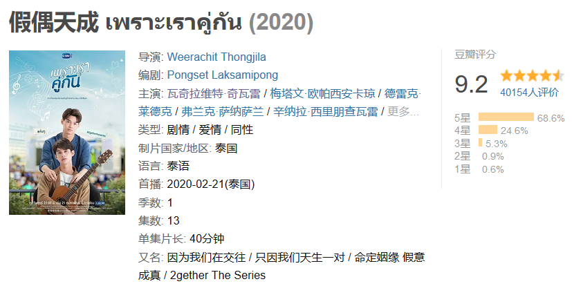

《假偶天成》刚开始为人所知，跟男主角之一的Bright有很大关系。

作为中美泰三国混血，Bright拥有183的身高和经得起镜头怼脸拍的长相。预告片出来时，他就凭颜值圈了一波粉。

网友们被撩得春心萌动，剧还没播就言之凿凿地表示：泰剧的颜值天花板，终于出现了。

开播后，不少原本不看耽美的人也被他拉下水，在评论区上演真香现场。网友们忽然发现“原来我不是不看耽美，是不看耽丑”。

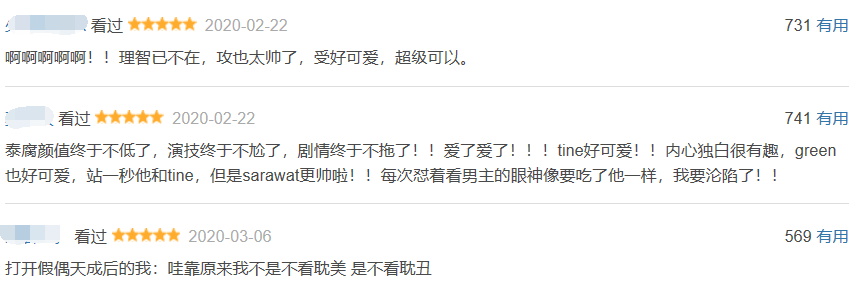

印象里，上一个靠颜值红出圈、直接带火一部作品的泰国男主，还要追溯到13年前，主演《爱在暹罗》的马里奥。

也是从那部电影开始，泰国的耽美事业开始轰轰烈烈，名扬海外。

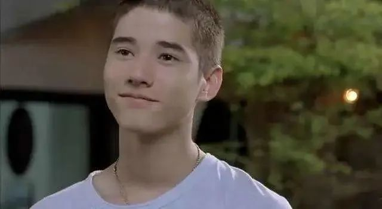

不过，就像《爱在暹罗》之所以经典，靠的不仅是马里奥的干净帅气，这部《假偶天成》能斩获高分，靠的也不仅是Bright的混血美颜。

作为一部校园爱情剧，它不仅不低幼、不俗套，不走傻白甜的路线，还把故事讲得搞笑里带着温情，沙雕里带着萌感。

剧中的男主Tine，是个乐观开朗的大学生，本来是个直男，有过不少感情经历，但每段都无疾而终。

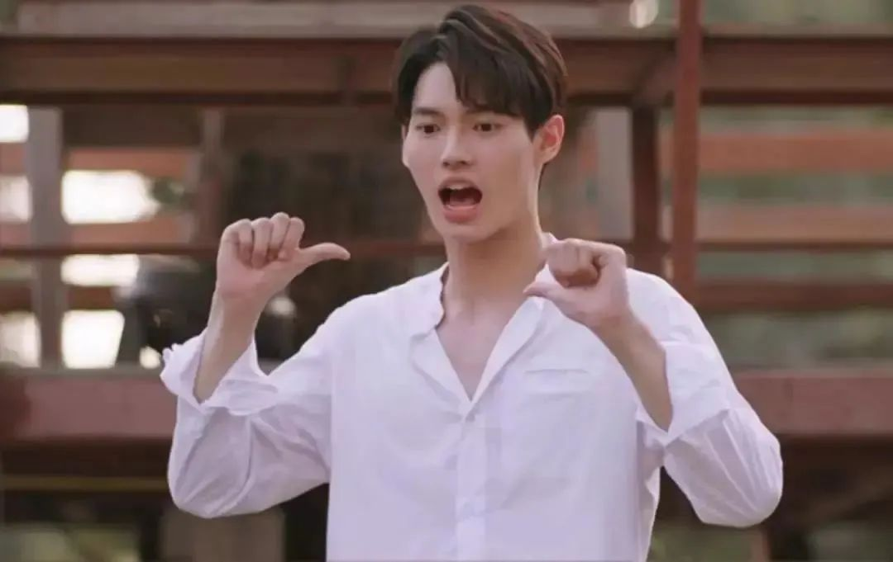

升入大学后，Tine摩拳擦掌，准备寻觅自己的天命之女，却没想道被男生小绿告白了：

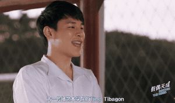

此时的Tine坚信自己只喜欢女孩子，便拒绝了小绿。

谁知小绿越挫越勇，对他展开了无孔不入的追求：上下课接送，饿了给做便当，渴了给买水，连Tine上个厕所都要在隔壁给他递纸……

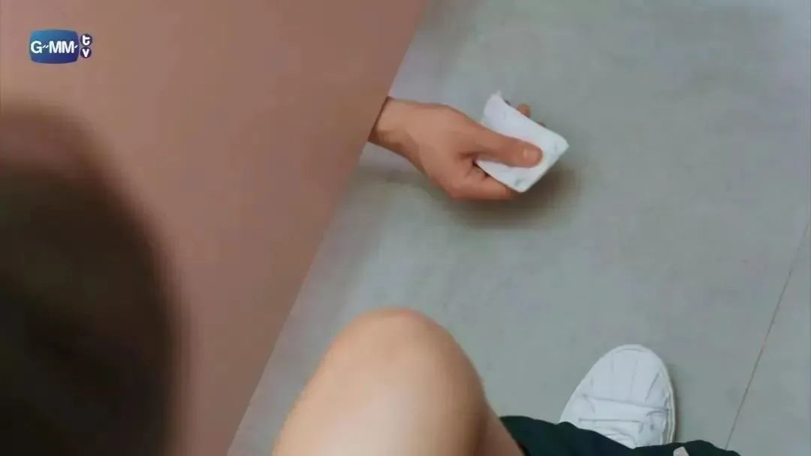

Tine想了各种方法拒绝，都没能摆脱对方24小时无缝衔接的攻势。

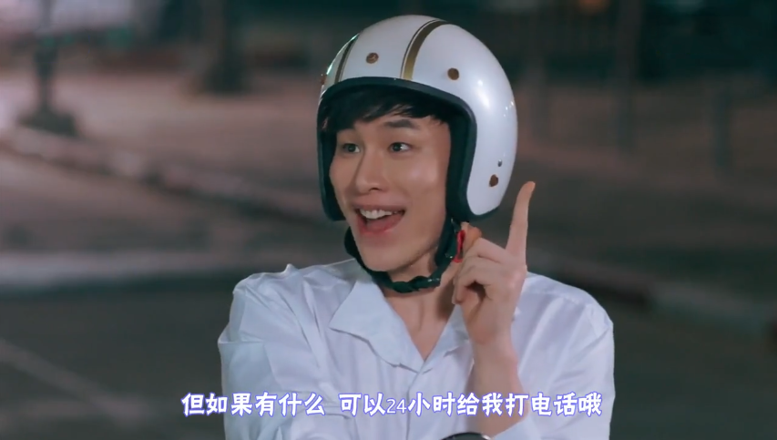

最后，在好友的建议下，他决定找一位男神级人物来帮忙，让他假装跟自己交往，以此让小绿知“男”而退。

看到这里我不得不感叹：为了拒绝一个男人的追求，男主的解决办法，居然是去找另一个男人交往，真不愧是他泰的脑回路。

而这个被Tine找上的人，就是Bright饰演的校草。

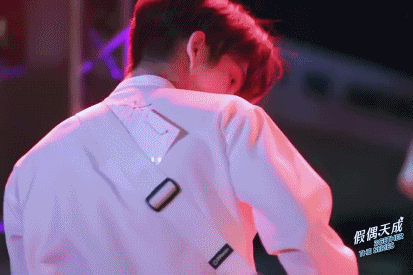

这两人之前并不认识，Tine多方了解才发现，Bright追求者众，但却仿佛对女生免疫，每天都顶着一张冰块脸，把向他示好的女生拒之于千里。

按理说，这么高冷的人，应该对Tine莫名其妙的请求不加理会才是。

可谁也没想到，Bright对他的态度还真的跟对别人不一样——

第一次被找上时，Tine这边还支支吾吾说不出话，他劈头就是一句：“再这样看我，信不信我把你亲晕？”

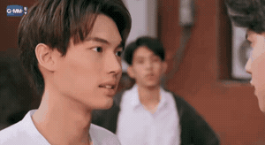

后来听Tine说了假装交往的要求，Bright既没有一走了之，也没有立刻接受，而是用他惯有的高冷态度，一边毒舌地嫌弃Tine，一边又各种调戏他。

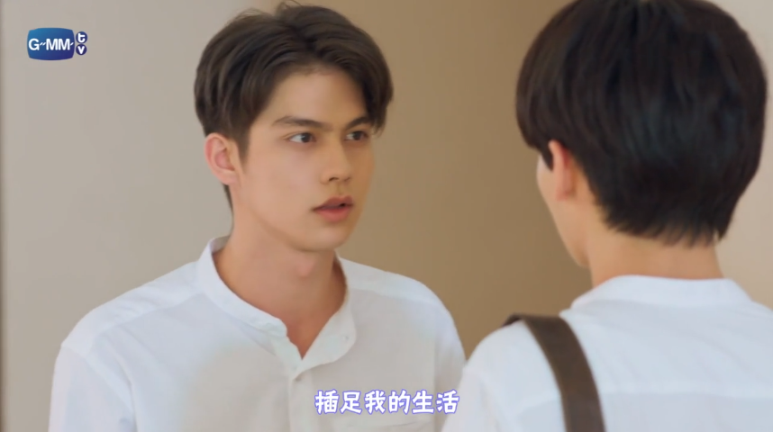

结果，Tine发现他这么难搞，反而来了斗志。

好友劝他换个人假扮情侣，他却强硬表示：不，本直男就是要搞定这个校草。

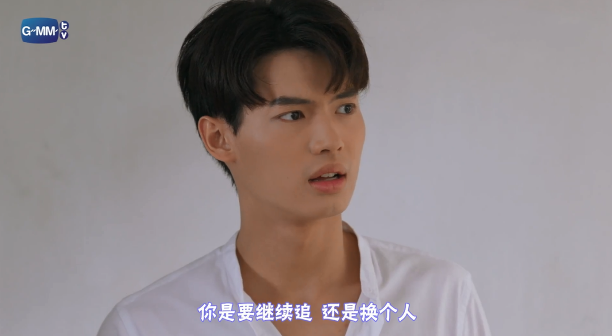

于是，这两人开始了你追我赶的游戏。

Tine千方百计地制造机会接近Bright，还跟他加入了同一个社团。

而Bright则是口嫌体正直，跟Tine做起暧昧游戏十分主动，撩得在场妹子们尖叫一片：

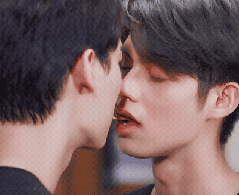

其实，从观众的角度可以明显看出来，两个男主之间的关系并不是Tine以为的那样，只是毫无交集的陌生人。

毕竟才打了没几个照面，Bright就对Tine关照有加，有意无意地对他做出各种亲昵举动：

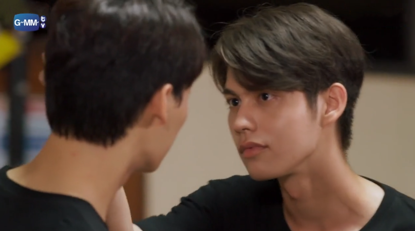

等社团其他人走了以后，他会主动教Tine弹吉他，留下来陪他练习：

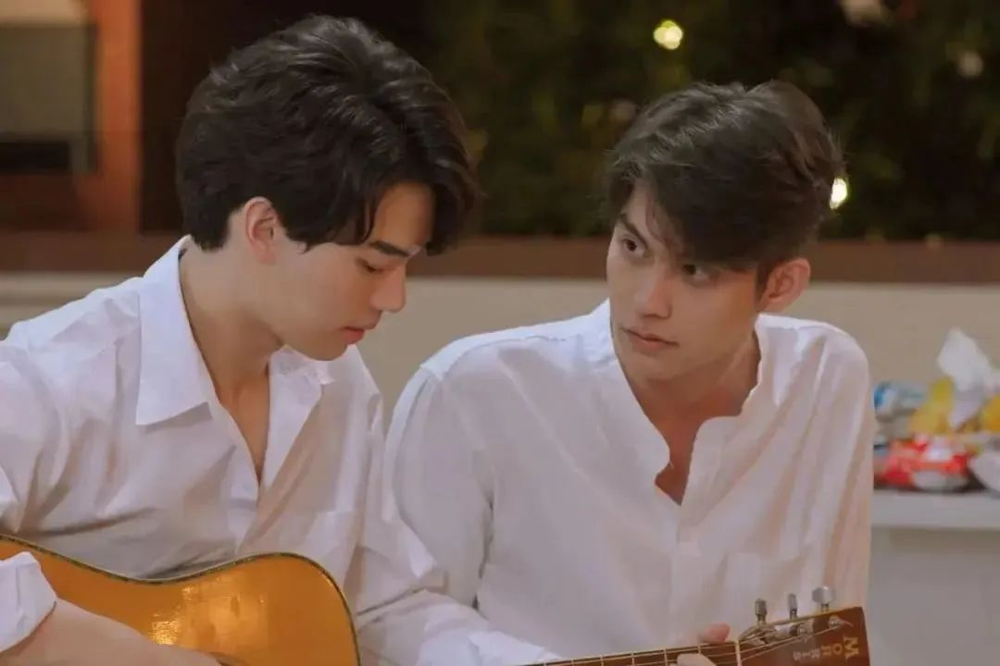

发现Tine不见了，Bright急切的心情也溢于言表：

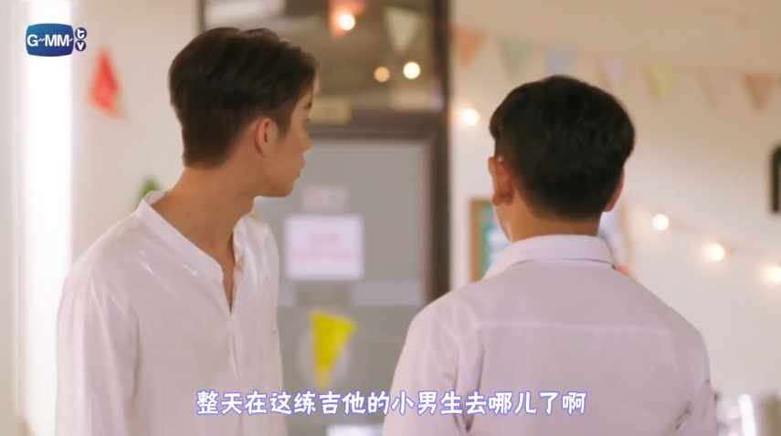

没错，实际上这是个“高冷校草暗恋二货直男多年，突然被心上人撞进生活、要求假扮情侣”的故事。

而追剧的过程，就是看这个甜蜜的谜题抽丝剥茧、两人慢慢假戏成真的过程。

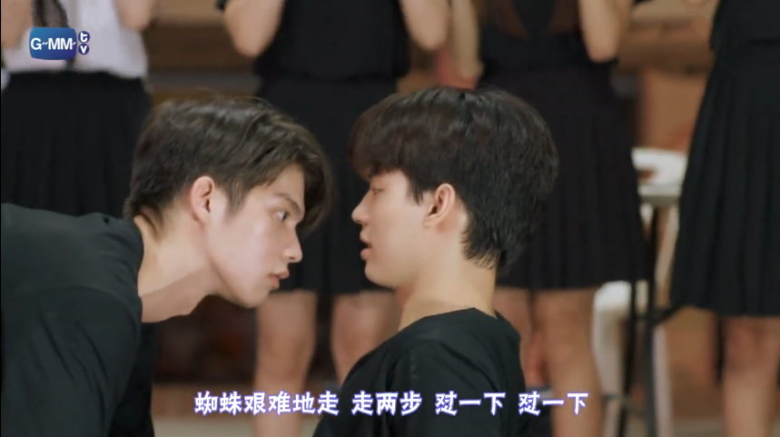

从剧情方面来说，这个经典暗恋梗诠释得很自然，剧情转折和伏笔都来得恰到好处，给剧的观感打下了良好基础。

Bright饰演的高冷校草，放在其中显得尤为出彩。

隐忍多年的暗恋居然发生在这样一个校园风云人物身上，碰上的还偏偏是Tine这么个不解风情的铁憨憨，一路碰撞下来，可谓处处是笑点。

虽然这个故事简单、直白、不深刻，但光论剧情的自然流畅，就足够吊打一众低龄幼齿的傻白甜校园剧了。

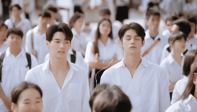

从演技方面来看，两位男主的表现也可圈可点。

无论是单纯可爱的Tine，还是傲娇毒舌的Bright，都完美贴合人设，细节处理得十分到位。

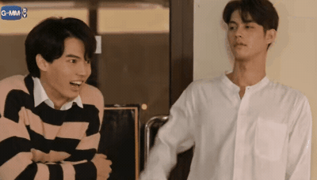

而最难表现的，是两人之间的暧昧情愫。

从开始的矛盾冲突，到后来的暗流涌动、火花四溅，一个眼神就是千言万语。

难怪很多人看完第一集就大呼上头：

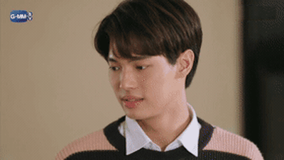

值得一提的是，这部剧甩脱了很多泰剧制作粗糙的老毛病，不仅剪辑出色、节奏明快，还能从细节里找出不少信息含量。

如果说它是一块小甜饼，那也是一块优秀耐嚼的小甜饼了。

说到这里，不难理解这个9.2分是怎么来的了。

不过在我看来，《假偶天成》至少还有另外一个值得高分的理由。那就是它把同性之间的恋情，表述得平静自然，既不反常也不费力。

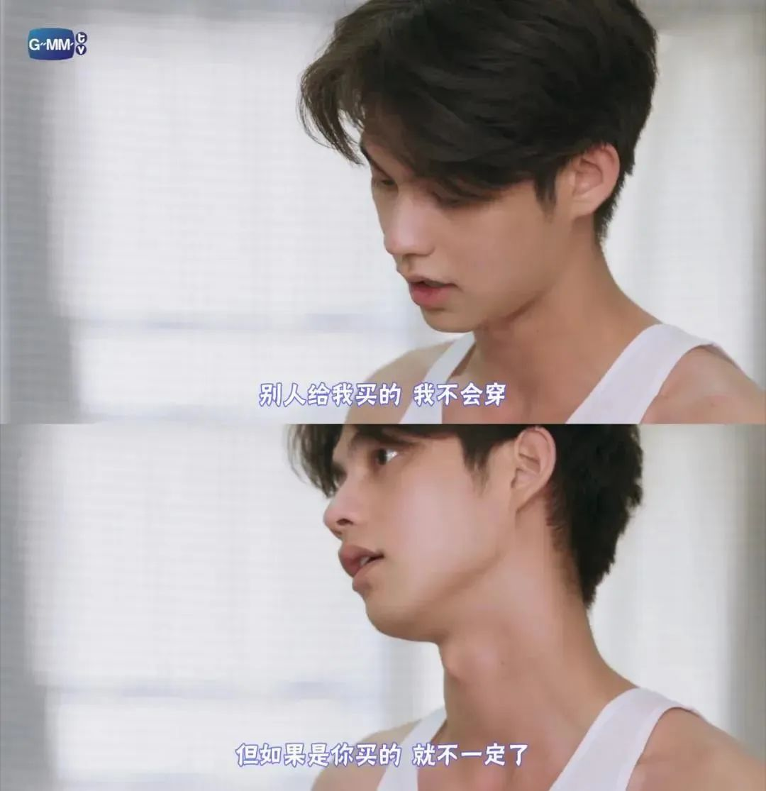

剧中的所有人，对“同性交往”这件事，既没有表现出歧视或反感，也没有丝毫惊讶。

这无形中，就给观众传递出一种态度：**爱情与性别无关。**

尽管LGBT的存在得到了越来越广泛的认可，但不可否认的是，在世界范围内，性少数群体的处境仍然很尴尬。

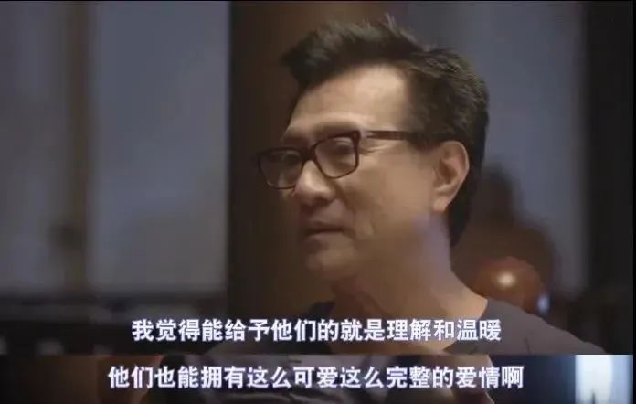

在去年的爆款台剧《想见你》里，关于王诠胜的番外就讲了这么一个故事：因为喜欢同性，他被视为怪兽，被身边的人唾弃、辱骂，最终不堪欺凌，跳海自杀。

后来，才有了李子维海中惊醒的那一幕。

这个番外在整部剧的跌宕起伏里，显得不那么起眼，像是一个被隐藏起来的影子，似乎也正暗喻了性少数群体的需求不被重视的现状。

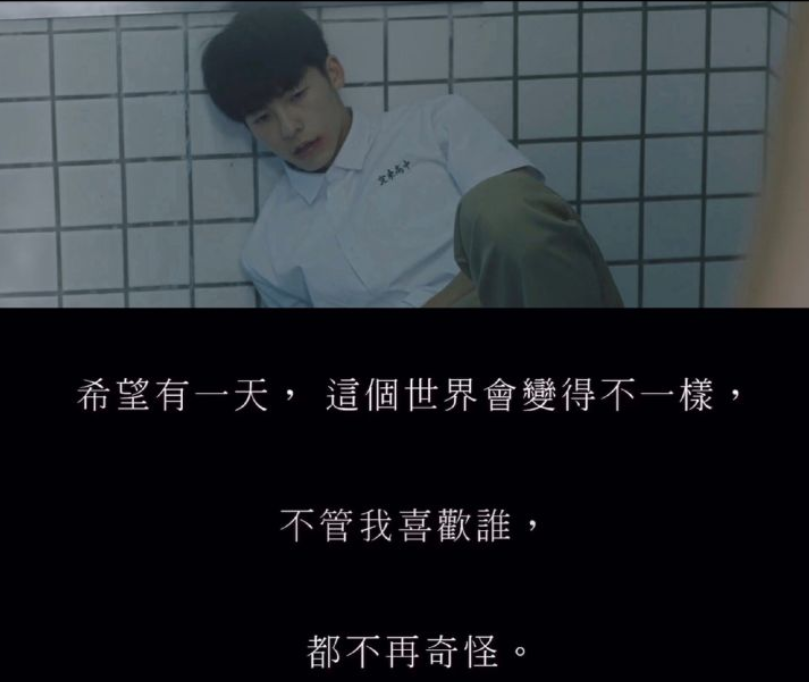

有关LGBT的平权运动之所以在不断进行，正是因为这样的残酷剧情，仍然在世界各地上演，有太多的性少数群体面临着被排挤、嫌恶的现实。

**其实真正的平等，不是大喊着“拒绝歧视”，而是从内心里认为，不管是同性还是异性间产生爱情，都没什么区别。**

也许，这样的社会认知离我们还很遥远，但至少我们能在泰剧里先看看这样的世界。

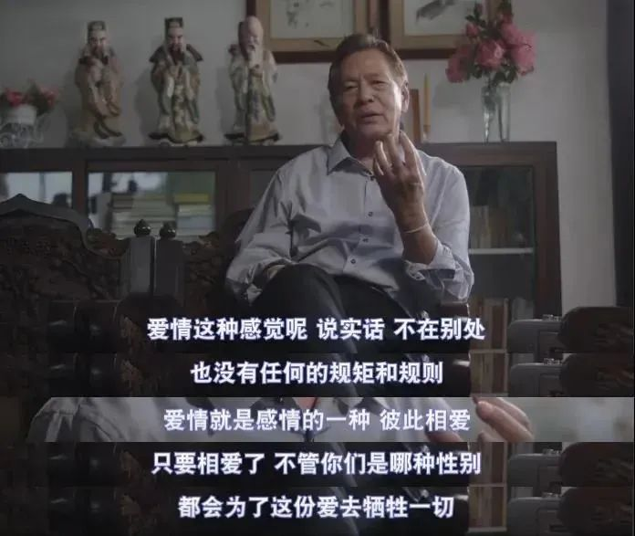

目前，《假偶天成》刚更新到第5集，Tine和Bright的故事也才讲了个开头。想知道他们后续会如何发展的，不如赶紧入坑追起来吧～

