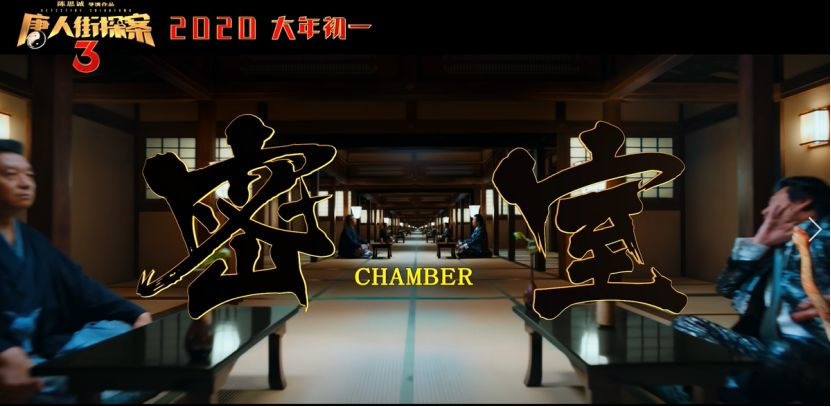
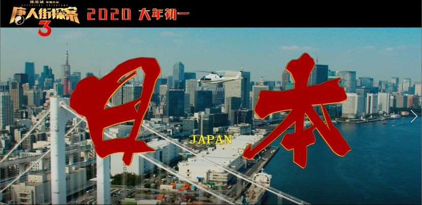

速读摘要

也可以判断目标的心理状态和行为模式，及时拍下犯罪证据。但奇怪的是，当天城里没有任何一架无人机上报犯罪行为。在故事开头，警方之所以不加调查就以"自杀"结案，不只是出于对全知系统的信赖，更是因为他们已经没有刑侦能力了，只会根据无人机的指示抓人。因为无人机报警从来都是拍下视频、人赃并获，主电脑根据法律条文来做出判断，所以人类的司法系统也变得形同虚设。这种对人性的不信赖，本身就具有一定的讽刺性。

原文约 2345  字  | 图片 36 张 | 建议阅读 5 分钟 | [评价反馈](https://static.app.yinxiang.com/embedded-web/clipper/#/Evaluating?d=2020-03-20&nu=57e172dd-0d35-4c75-abfc-31ea2358a5e2&fr=myyxbj&ud=58b471&v=2&sig=BE425A45D4814DFE507CC4CEB7CF05EC)

##  在未来，做羞羞的事情都会被监控？

原创 有部电影 [有部电影]()**
今天给大家聊一部来自巴西的冷门科幻剧。

这部剧短小精悍，只有6集，高能的情节让人一旦入坑就忍不住一口气刷完——**《全知》。**

故事发生在一个机器监控下的未来城市“全知城”。

在这里，每个人身后都会跟着一架微型无人机。它的形态像蜜蜂，长度不足2cm，头部装有精密的摄像头：

飞速扇动的翅膀，可以让它24小时不间断地跟拍自己的目标对象。

即便是人们生活中最隐秘的行为，也会被摄像头记录无遗。

不过，人类并没有权限获取视频录像，只有主电脑可以通过尖端技术分析所有视频信息，并以毫秒级的速度来处理和储存数据。

换言之，全知城是用“全机器管理”的方式保证人们的隐私安全。

此外，每架无人机都搭载了“全知系统”，相当于一个小型人工智能。

它可以实时监测人体的生理指标，在发生意外时及时拉响警报；

也可以判断目标的心理状态和行为模式，及时拍下犯罪证据。

正因为这种严密的监控措施，全知城里五年来只有4起凶杀案上报，全部都被抓到现行。

负责开发全知系统的科技公司，也因此成为了一家霸主式的企业。他们正想方设法地将业务扩展到其他地方，建立更多“全知城”。

剧中的女主角妮娜，就是全知公司的一名顶级程序员，目前和哥哥以及退休的父亲一起住在全知城里。

一天，妮娜下班回家，推开大门居然看见父亲躺在客厅的血泊里，已经死去多时。

尸体显示背部中枪，很明显是遭到了谋杀。但奇怪的是，当天城里没有任何一架无人机上报犯罪行为。

难道说系统出了故障？

女主寄希望于警方找到凶手，但没想到，前来调查的警探得知情况后，立马决定以“自杀”结案。

为了避免民众恐慌，警方还勒令女主兄妹，不许对外声张此事。

到了第二天，父亲的遗体也被警方扣留。兄妹俩只收到一张死亡证明，说好的“自杀”又变成了白纸黑字的“自然死亡”。

父亲并未与人结怨，如果只是意外被害，为什么无人机没有报警？如果这一切背后没有什么不可告人的秘密，警方又为什么要隐瞒死因？

想到这里，女主决定独自找出杀死父亲的凶手。而她唯一的机会，就是拿到父亲死前无人机拍到的监控视频。

作为一名顶级程序员，女主拥有开挂般的技术优势；作为全知公司的职工，她也有接近主电脑的机会。

除此以外，她还有一个天降的神队友——来自市政厅的女官员朱迪琪。

朱迪琪一直对“机器监管城市”的概念感到不安，希望能找出全知系统的bug，因此愿意暗中帮助女主调查。

但尽管有这么多外挂，女主想要拿到录像，仍非一件易事。

因为她并没有进入主机室的权限，而且还时刻处在无人机的监视下。

于是，这部剧的主线就围绕着女主调查杀父凶手的情节展开。

她与无所不在的摄像头斗智斗勇的过程，带有很强的谍战片即视感。

比如说，女主通过调查，发现无人机并非7x24小时在线，它会受到电磁信号的干扰。

一旦持续的干扰导致系统判断机器损坏，就会从“蜂巢”中派出新机进行替换。

在这个替换过程中，女主可以获得几分钟不受监视的自由。为此，她不得不每次都像个特工一样，争分夺秒地进行极限操作。

而至于杀死女主父亲的凶手是谁，我就不在这里给大家剧透谜底了。感兴趣的小伙伴可以去剧里寻找答案。

可以说的是，这部《全知》虽然是典型的人工智能题材，但结局却在套路之外——它并没有像很多同类作品那样，讲述一个“人机大战”的人工智能觉醒故事，反而从头到尾都将审视的目光放在人类自我身上，将科技作用下人性的异变展现得淋漓尽致。

片中，女官员朱迪琪在讲述自己为什么不信任“全知系统”时，说过这么一句台词：**观察者总是会改变被观察者的行为。**

虽然微型无人机并不会打扰人们的生活，但意识到自己每时每刻都活在镜头之下、一切行为都将受到评判并被储存记录下来，这本身就是一种难以承受的心理重负，会在不知不觉间让人的心灵产生病态的扭曲。

比如女主的一个同事，在滚床单时总是无法忽视摄像头的存在。久而久之，她养成了偷拍炮友为爱鼓掌的性癖。

比如女主的男上司，平时因为害怕触发警报，活得谨小慎微，不敢犯一点错。

但每过一段时间，他都要偷偷出城一趟，摆脱摄像头的跟踪，然后找个倒霉的流浪汉拽进巷子里暴打一顿。

通过暴力发泄，来疏散自己像“完人”一样活着的精神压力……

而除了心灵的异变之外，过度依赖科技也使得人类的行为能力逐渐退化，社会组成发生改变。

在故事开头，警方之所以不加调查就以“自杀”结案，不只是出于对全知系统的信赖，更是因为他们已经没有刑侦能力了，只会根据无人机的指示抓人。

同样，因为无人机报警从来都是拍下视频、人赃并获，主电脑根据法律条文来做出判断，所以人类的司法系统也变得形同虚设。

整个法院里就只有一个接待员，负责通知每个罪犯被判处的刑罚，工作流程仿如机器人一般：

**那么在这样的情境下，人与全知系统，究竟是谁成为了谁的工具呢？**

总之，剧中关于科技对人和社会文明的反噬进行了多方面的探讨。也正是因为这层主题，不少人看完后把它称为“巴西版《黑镜》”。

不过除此之外，本剧还有另外一大贯穿始终的母题，即大数据时代的隐私与安全问题。

剧中的人们想要利用高科技制造一种绝对安全的环境，当安全与隐私产生矛盾的时候，他们选择将掌控权交给机器。

这种对人性的不信赖，本身就具有一定的讽刺性。

但与此同时，机器也同样无法真正令所有人信赖。毕竟是机器就会出错，后台总还是需要人来掌控……**人类因此而陷入了无解的悖论。**

值得一提的是，正是对这一绝对掌控权的争夺，才导致了片中凶杀案的发生。

在这一季故事的最后，女主成功找到了杀父仇人，却发现自己落入了对方的圈套——对方和她的父亲根本无怨无仇，制造凶杀案，只不过是想借她之手入侵主电脑，成为“全知系统”的真正掌控者，监控全知城里每时每刻发生的一切。

而对女主来说，这也意味着只要活在无人机的镜头下，复仇就绝无可能。她只能带着哥哥逃离全知城。

走之前，她对着镜头竖起的中指，也为下一季埋好了坑，兄妹俩必将卷土重来。

**总的来说，这部剧虽然是人工智能设定，但讲述的却是人与人之间的斗争。****或者可以说，是人性在物欲与权欲下展现出的贪婪、狡诈与残忍。**

科技或许可以给我们带来一定的秩序与安全，但却无法根除人心中的阴暗。正如剧中的一名犯人对女主所言——**“这里的罪犯，我不是第一个，也不是最后一个。****这一点就连你的无人机也无法改变。****”**

**的确，因为人性的复杂，“绝对的安全”只是一种理想化的状态。****但通过对科技的使用，通过我们制造出的这些没有情感的工具，或许我们更容易从中窥见自我内心的症结，找到自己生而为人的意义所在。**

