##  邪教、同妻、中国式家长，这才是真正的华语限制级

原创 有部电影 [有部电影]()**
去年的柏林国际电影节，是华语片爆发的一届。

不仅有《地久天长》包揽帝后奖项，还有《风中有朵雨做的云》《少年的你》《一秒钟》《过春天》等高质量影片纷纷入围（前三部后因技术原因退出）。

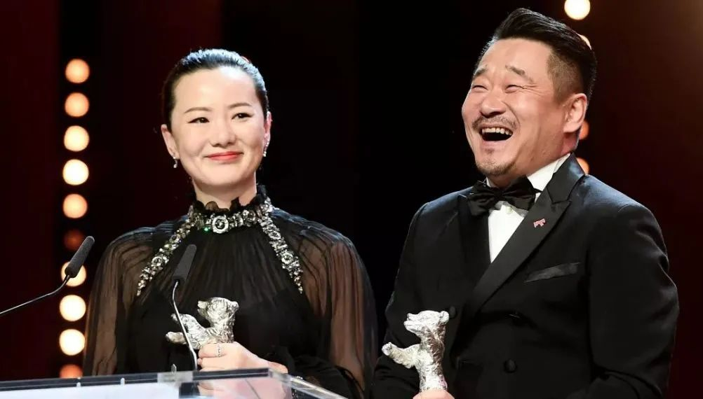

除此之外，还有一部来自新人导演的作品入围了全景单元，并摘得泰迪熊奖的评委会特别奖。

由于题材特殊，它并没有受到太多关注，但绝对值得一看——**《再见，南屏晚钟》。**

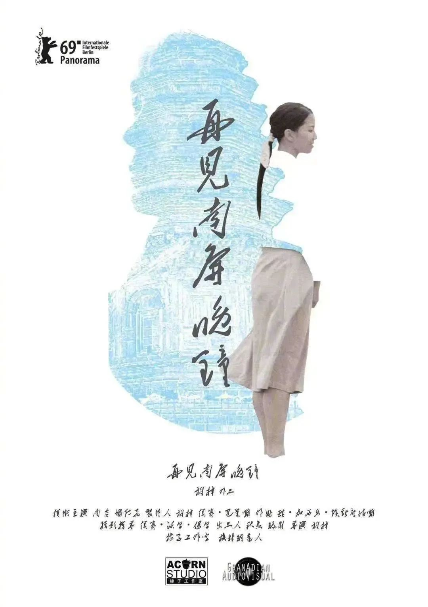

影片的故事，围绕一个看似体面的四口之家展开。

父亲黄涛是受人尊敬的大学老师，母亲李久梅在医院工作，女儿黄筱萸侨居美国、写作出书，最近刚和外籍女婿一起回国待产。

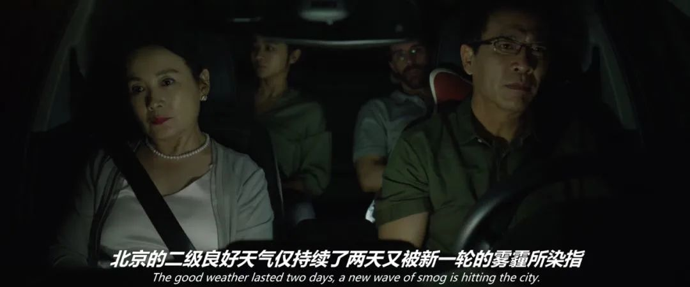

按说一家人难得团聚，本该亲密热络，但他们在经历短暂喜悦后，却陷入了尴尬和沉默。

从机场回到家里，父亲率先抱着狗躲进卧室休息，母亲将饭菜端上桌没聊几句，就触发了女儿的不悦……

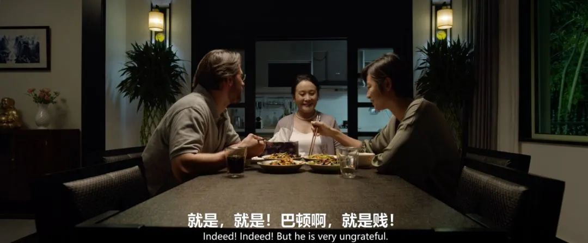

这一切看似不经意间发生，却暗示着家庭内部的暗流涌动。

直到母亲回房后与父亲发生争吵，才缓缓将影片的谜面揭开：女儿黄筱萸为何要远嫁他国？

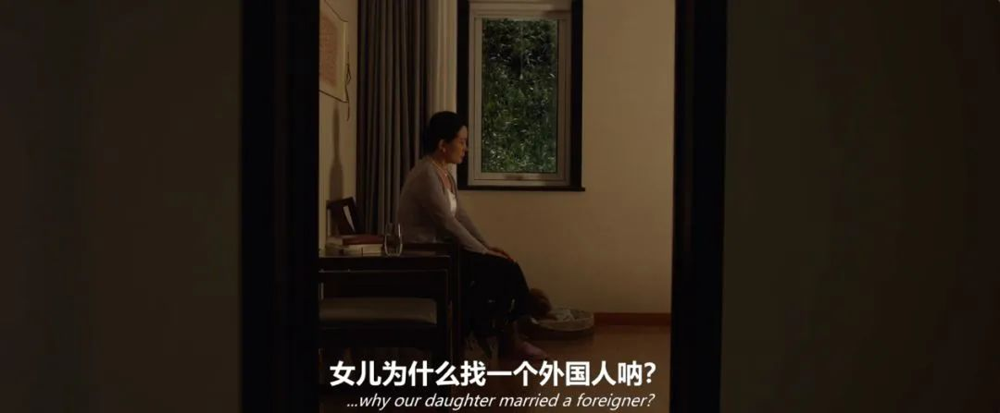

对于这个问题，他们显然心知肚明又讳莫如深，仿佛隐藏着什么家族秘密。

但影片没有故弄玄虚，而是即刻揭开了谜底——

原来早在上世纪九十年代，母亲就发现父亲是个深柜，还跟一个名叫马越的男人搞外遇，被她忍无可忍、捉奸在房。

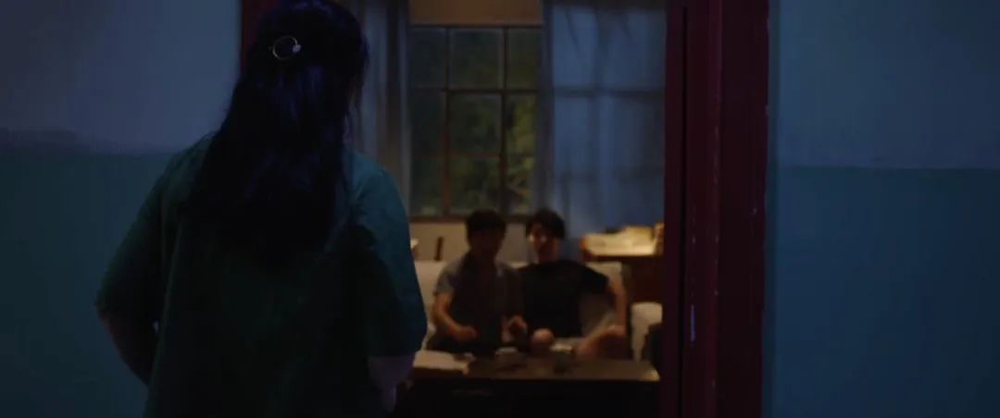

碍于世俗礼教和身边人的看法，母亲没有提出离婚或大闹一场。

为了捍卫婚姻和保住名声，她将马越及其妻儿叫来家里摊牌，可在孩子们面前，她又对真相羞于启齿，只能旁敲侧击地警告对方不要再犯。

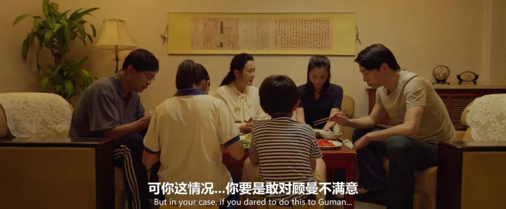

事实上，女儿黄筱萸那时虽然在读小学，但早熟的她已经对父母背后的秘密心照不宣。

父亲的软弱逃避、母亲的咄咄逼人，都让她在这场家庭变故中饱受伤害，迫不及待地想要摆脱这里。

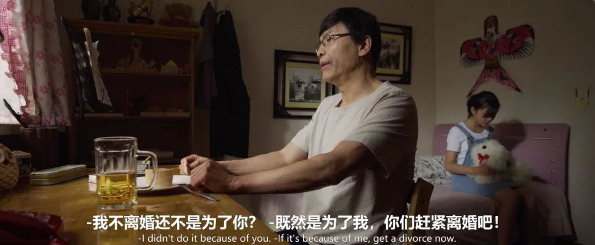

而这次回家之后，那些曾困扰她多年的阴影，又重新涌上心头。

原来，父亲跟马越斩断关系后，又跟一个名叫冯昔的学生混到了一起。

直到冯昔带着怀孕的未婚妻来家里做客，并当众宣布快要结婚的喜讯，才免除了一场家庭大战的危机。

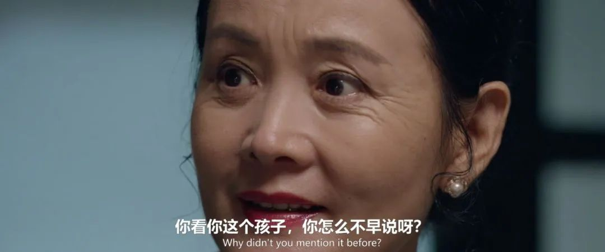

而母亲李久梅虽然明知丈夫不爱自己，但只要想到白白耗费的青春，就心里不平。

她宁愿对丈夫抱有幻想，坚持与他耗到油尽灯枯，也不肯放手有名无实的婚姻，让各自去追求各自的人生伴侣。

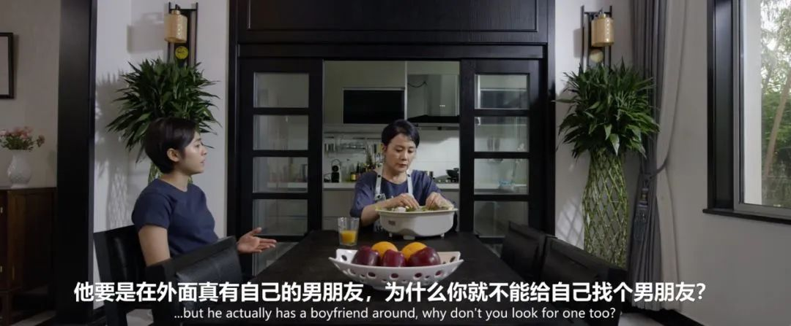

说到这里，你们肯定已经意识到，这又是一部同妻题材的华语电影。

它很容易让人想到2018年的金马提名影片《谁先爱上他的》，后者讲的是女主刘三莲在丈夫患病去世后，才得知他与一名男性有段婚外情。

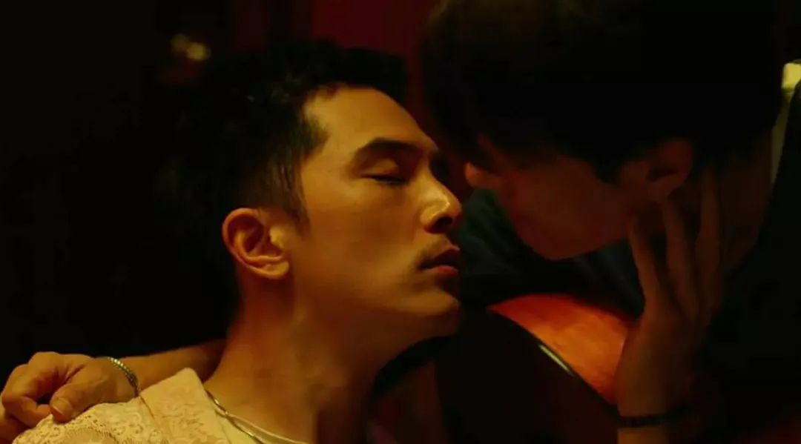

这两部影片确实拥有不少与生俱来的相似之处：比如对LGBT群体的生存现状、同妻群体的悲剧命运的关注，对中国社会的性压抑氛围的刻画等等。

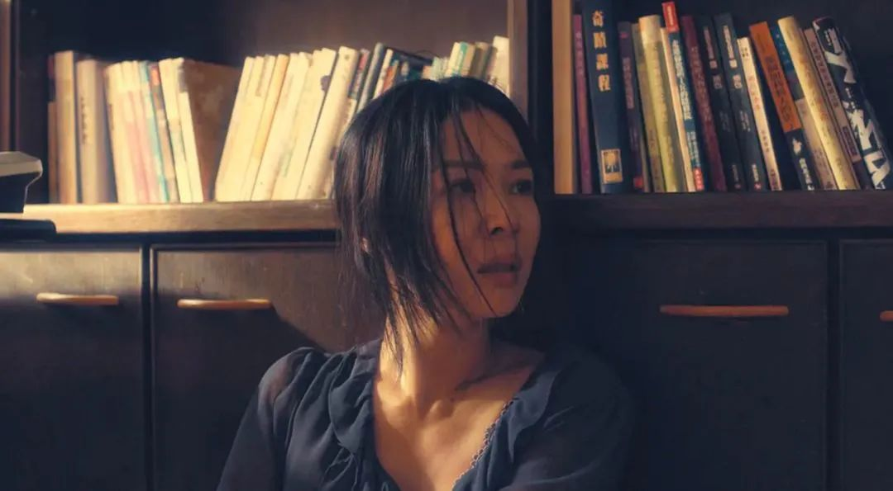

并且它们同样使用了戏谑的口吻来描绘故事，既消解了题材的苦大仇深，又为影片增添了一层喜剧色彩。

但与《谁先爱上他的》那种幽默感不同，《再见，南屏晚钟》之所以引人发笑，却是因为对禁忌话题一本正经的探讨，让观众感受到魔幻现实般的荒诞。

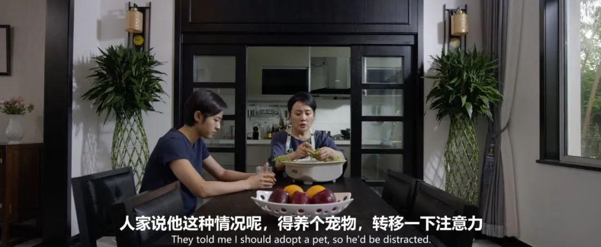

也正因如此，它无法像《谁先爱上他的》一样，用政治正确的“爱最大”来化解所有的仇恨戾气与委屈不甘。

影片中娜仁花饰演的母亲李久梅，作为崇尚科学精神的医疗工作者，却自欺欺人地认定同性恋是心理疾病。

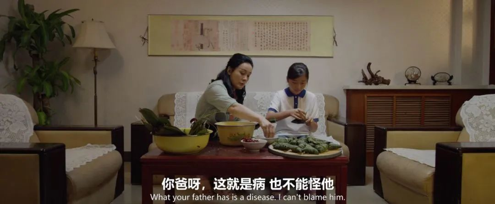

所以她不怪同性恋丈夫骗婚出轨，却将婚姻不幸的根源，归罪于其他无辜女性的身上。

她怪婆婆把丈夫生成“这样”；

怪自己头胎怀上儿子没保住，生完二胎又造成身材走样，让丈夫“情有可原”地朝三暮四；

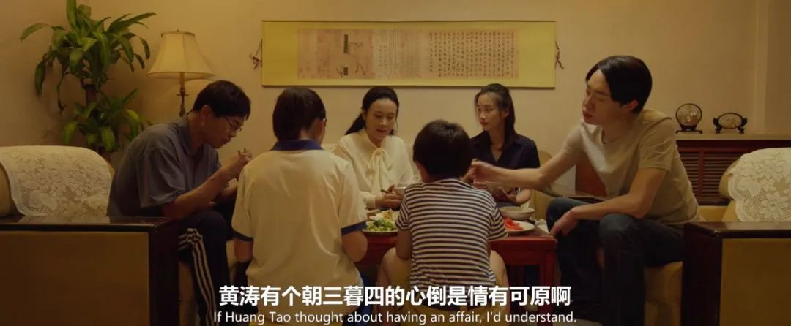

她怪女儿没有做好父母之间的粘合剂，还因为她总向着爸爸说话，要求父女俩保持距离。

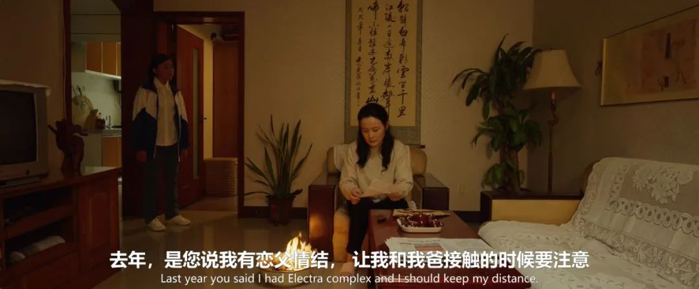

到了最后，她怪来怪去也不得解脱，又开始信上了邪教。

这个邪教歪曲佛教的“因果论”，认为今生不幸都源自前世作孽，还宣扬灵魂附体、生病不用问医吃药，找“赵老师”开示就管用。

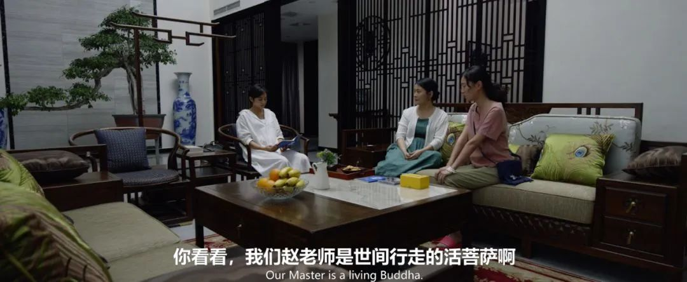

李久梅被这些歪门邪说打动，坚信只要信仰虔诚、做够金钱功德，就能让丈夫“改邪归正”。

于是，她又是宣称牲畜上辈子是家眷亲属，胁迫全家人吃素；又是要求女儿女婿一起信教修炼，用三个人的能量来感化丈夫。

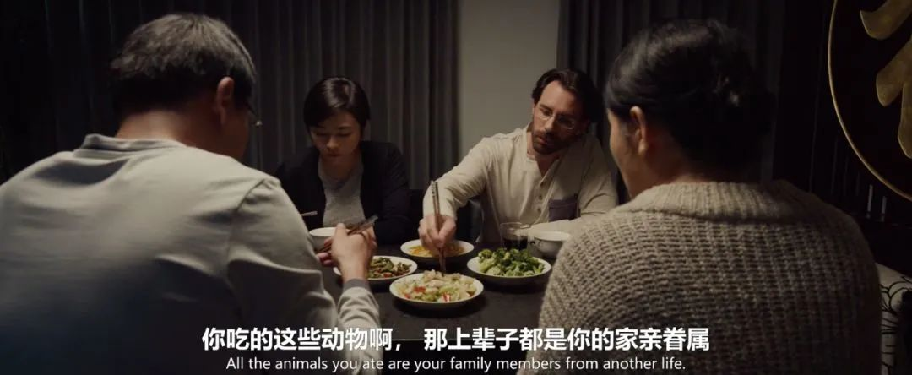

眼见母亲被洗脑成这样，黄筱萸向警方举报了这个邪教。

但没想到，在得知“治愈丈夫的最后希望”也将破灭后，李久梅陷入彻底崩溃，并选择了离家出走……

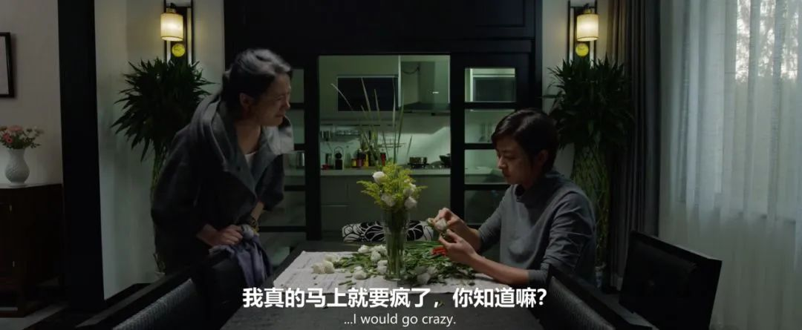

整体看下来，这部影片虽然只有107分钟时长，却囊括了邪教、同妻、中国式家长等多重话题，在情节安排上设计感略重。

再加上独立制片成本有限，一共仅拍摄了18天时间，美术布景和后期音效也比较粗糙。

但即便如此，它仍然瑕不掩瑜。

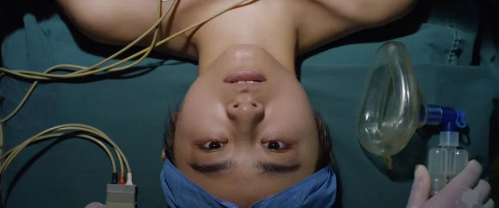

在剧情叙事上，影片利用交叉剪辑和非线性手法，将八十、九十、当下三个年代穿插在整个故事线中，既增加了影片的可看性，又让它们之间形成互文。

通过这三条故事线的交织，我们看到的不只是悲剧式的同妻命运，更是围绕中国传统家庭概念下的两代人，描绘出的一幅千疮百孔又真实复杂的家庭图景。

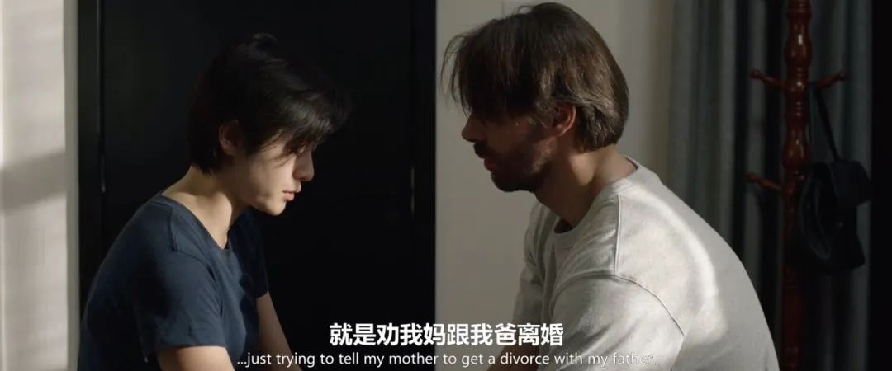

比如李久梅听到女儿暗恋老师的传言时，就有如看到洪水猛兽，不分青红皂白地对女儿进行荡妇羞辱，让其强行转班。

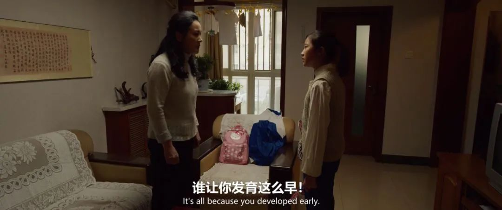

比如她无论说什么做什么，都不允许女儿提出任何反驳，否则就会以“你就是个白眼狼”、“我真是白养你了”、“当初就应该掐死你”等说辞来还击。

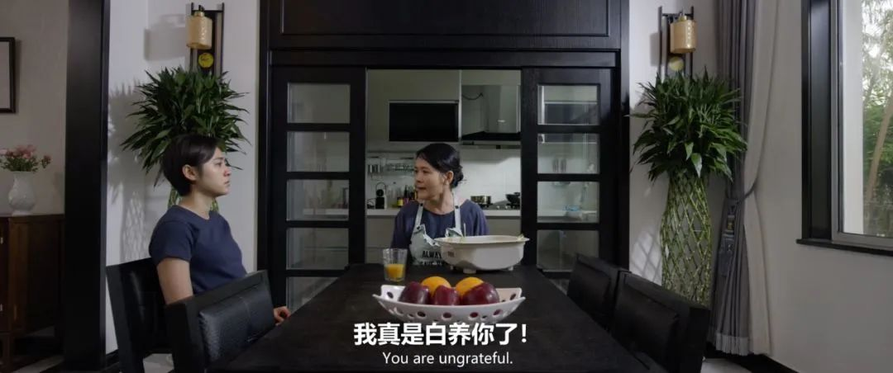

这样的专制家长并不罕见，她虽是以本片导演相梓的母亲为原型，却也让不少观众触发了成长回忆，发出“是我妈没错”的痛心感慨。

**但直到故事最后，影片藉由母亲出走时的故地重游，才揭开了这段家庭悲剧的真正起点**——

原来，正如片名及插曲《南屏晚钟》所暗示，母亲年轻时曾有过一位心仪对象，那人正是她的闺蜜刘媛。

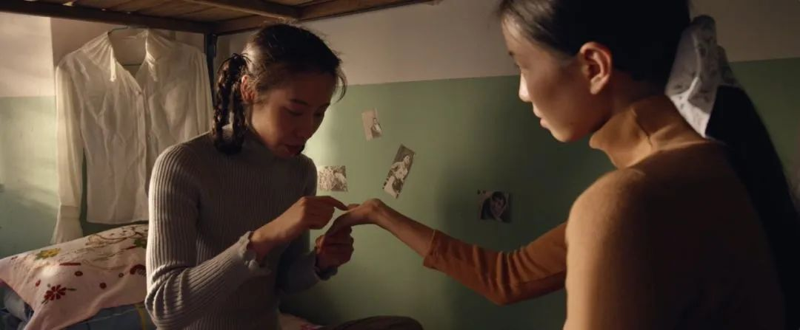

换句话说，在这个故事中，**母亲既是被骗婚的受害者，又是隐瞒性取向、造成家庭悲剧的加害者之一。**

正因为如此，她才将婚姻视为逃避世俗礼教的避难所，不惜以伤害身边人为代价坚守“正道”，在“治愈”丈夫的同时也“救赎”自己。

至此不难看出，导演的意图并非只是揭露同夫、同妻之痛，批判骗婚行为，而是引导观众去关注这类悲剧产生的根源。

**从个体角度来说，是LGBT群体的恐同内化；从社会角度来说，则是“不结婚有问题”背后的歧视性偏见。**

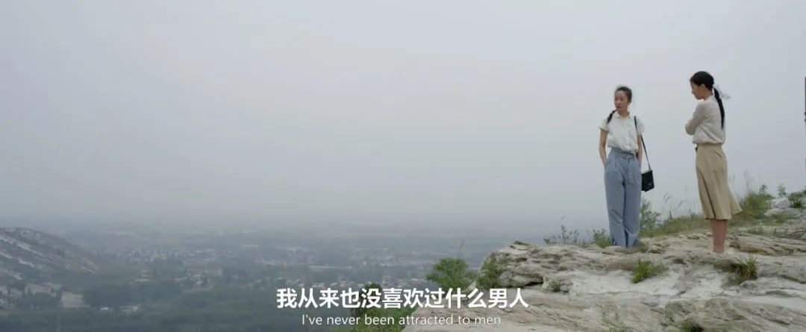

而在影像风格上，导演自幼受到中国古画的艺术熏陶，采用许多大景别、固定机位长镜头，使观众通过一种抽离的视角来看待剧中故事，也让影片看似耸动，却并不苦大仇深。

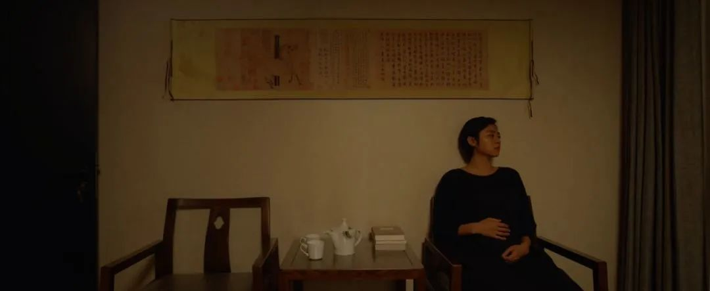

除此之外，《再见，南屏晚钟》虽然是现实主义题材，但却并没有局限于现实手法。

比如片中用舞台剧形式来呈现车祸等场景，既不失为节省成本的实验性创作，又能打破节奏制造“间离效果”，将观众从自我投射中释放。

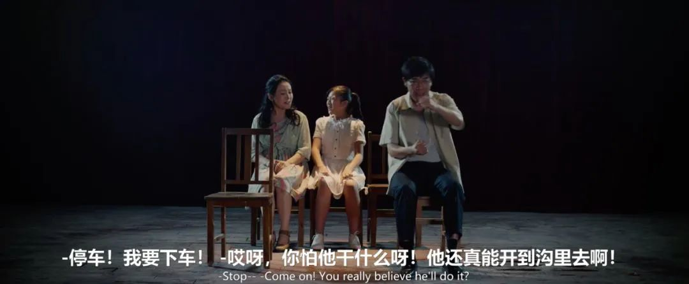

还比如片中多次出现的超现实桥段，让黄筱萸与幼年的自己对话，为剧情增添了不少解读空间。

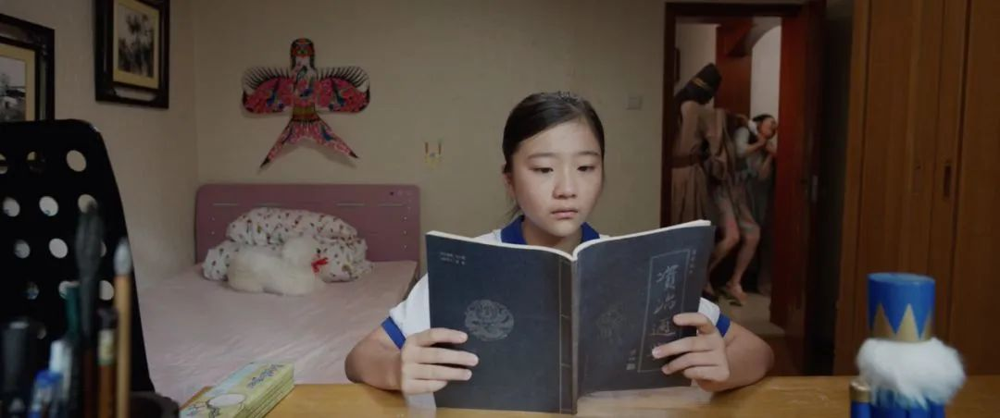

这些创作手法也让我们看到，尽管影片反映的问题十分现实，影视化呈现也受到审查桎梏，但仍有许多电影人在努力开拓尝试。

正如影片的英文片名A Dog Barking at the Moon的寓意：**“即使沟通无效，也要坚持下去。”**

**也正是因为有无数人从未放弃努力争取，才推动了这个社会不断向更多元的方向前进。最后，就像本片导演所说的：希望我们的社会有天可以明白，一个人是可以爱任何人的。**

