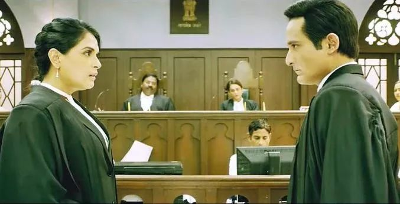

##  强奸大国印度的电影，居然开始为男性喊冤了？

原创 有部电影 [有部电影]()**
不久前，电影圈出了个新闻——有“法国奥斯卡”之称的第45届凯撒奖，将最佳导演奖颁给罗曼·波兰斯基，引发多名女演员愤然离场。

这是因为早在1970年代，波兰斯基曾因为性侵13岁女孩被定罪，却在此后逃离美国并遭到通缉。

这个获奖消息宣布后，不仅演艺界内部掀起轩然大波，还有大量巴黎民众在场外举行抗议活动。

原因正如女演员阿黛拉·哈内尔所说：“表彰波兰斯基，无异于向所有的受害女性吐口水，告诉人们侵犯妇女并没有错。”

这让我想到最近新出的一部印度犯罪片，故事同样是围绕一起“导演性侵案”展开——**《刑法典第375条》。**

影片中的受害者安贾丽，是一家影视公司的初级服装助理。

案发当天，她按照设计师的要求，将服装送到导演库拉纳家里，结果后者却见色起意、支开佣人，对她实施了殴打和性侵。

案发后，安贾丽带着满身伤痕回到家，并在父母兄长的陪同下去警局报案，接受法医鉴定。

结果显示，受害者的脸部、大腿内侧及身体存在多处挫伤；私处留有男性精液和毛发，与库拉纳的DNA完全吻合。

于是，库拉纳在当晚被立案逮捕，作为嫌疑人接受调查。

随后警方又在他家床单上发现了精液和毛发，分别属于他与受害者。

由于所有证据都与受害者陈述相符，一审法院认定库拉纳有罪，并根据印度刑法判处他10年监禁。

随后，这起“导演强奸案”立刻在舆论中引发了轩然大波。

这一来是因为库拉纳是宝莱坞大导演，他的行为让其他女性从业者感到心寒和后怕；

二来众所周知，印度本身就是“强奸大国”，近年来在MeToo运动的影响下，越来越多的女性关注到职场性骚扰问题，并把这次判决视为“历史性的胜利”。

所以无论从法律还是民意角度来说，库拉纳都很难再有翻身机会。

但他却一口咬定自己并没有碰过安贾丽，还告诉妻子有人篡改了DNA报告，才导致自己含冤入狱。

于是，为了帮丈夫脱罪，妻子砸下重金，聘请著名律师萨鲁加当二审辩护人。

而控方那边，则请出了充满正义感的检察官甘地，誓要让库拉纳受到惩治。

最后连最高法院都不敢轻视这桩案件，找来了两位风格迥异的法官坐镇，一位态度宽容，另一位保持着最高定罪率。

其实，说到性侵类犯罪的作品，咱们已经聊过很多。

它们中很大部分都将视角放在受害者身上，着重表现他们受到的身心摧残。

比如美剧《难以置信》，就让我们看到性侵受害者在报案后，不仅要承受伤情鉴定、复述案情带来的折磨，还会因为警方的冰冷质疑痛不欲生。

而这样的经历放在印度女性身上，更是难以想象的耻感压迫。

安贾丽先是被迫接受男法医的检查，接着把经历反复陈述给警察、医生、检察官、法官，每次说完都痛苦地大哭不止。

但这部影片的重点并不仅在性侵带来的伤害，而是围绕法庭上的唇枪舌战推动案情反转，引导观众对维护法律和捍卫正义做出辩证思考——

根据辩方律师萨鲁加所说，这起案件看似证据确凿，其实在证人盘问与证据监管上存在巨大漏洞。

他首先拿出库拉纳的通话记录和口供，指出调查官在实施抓捕前，曾利用职权向嫌疑人勒索钱财。

勒索未果后，又扣押床单证物和医检样本，延迟五天才发给法医实验室，导致关键证据很可能遭到篡改。

接下来，萨鲁加又将焦点放在受害者的证词上。

他一边通过大楼的监控记录，指出保姆离开时间约为22分钟；

一边拿出安贾丽当天穿的同款紧身裤进行演示，证明在发生激烈反抗的情况下，性侵过程无法在短时间内完成。

对于这个说法，检察官认为受害者很可能被压在身下，遭到殴打，无法做出有力反抗。

萨鲁加便直接拿出医检报告打脸——如果受害者是拼命推开库拉纳，为何反抗性抓痕都集中在他的后背呢？

随后，他又当庭盘问受害者的大哥，激怒对方，使其承认自己曾殴打安贾丽的事实——

原来，受害者脸上、身上的挫伤并非来自库拉纳，而是她大哥在得知事情后，将愤怒情绪发泄在了她身上。

结合这些证据，萨鲁加提出了一个颠覆性的推断——**安贾丽是库拉纳的婚外情对象，但事后她以强奸罪提出了报复性的虚假指控。**

为此，萨鲁加甚至以吊销执照六个月为代价，谎称掌握了两人亲密相处的视频，吓得安贾丽当场露怯。

当被告人库拉纳当庭进行自我陈述后，真相也来了个彻底反转——

原来，安贾丽作为服装助理，一直偷偷爱慕着导演库拉纳，并被后者以婚姻不幸为由、以事业上位作交换，成为他的婚外情妇。

但随着库拉纳的真面目暴露，两人很快在争吵中分手。

安贾丽不甘心事业尽毁，便主动上门献身并佯装向渣男认错，实施了这起报复性的虚假指控。

而库拉纳被捕后，一开始为了保护婚姻，死活不肯承认这段外遇，直到被判处10年监禁，他才向萨鲁加说出事实。

随后，在律师的努力下，终于将定罪证据逐一击破。

**但即便如此，法律就能公平公正地还被告人清白吗？**

关于这一点，影片开场就通过萨鲁加的高校演讲阐明了这样一个观点——**法律不等于正义，正义是抽象的理想，而法律是达到正义的工具。**

正因为法律规定被定罪的罪犯拥有辩护权利，萨鲁加才会顶着舆论压力，出任库拉纳的辩护律师。

但不可避免的是，法律有时也会让人失望。

比如在印度的刑法典中，绝大多数案件都是谁起诉谁举证，但性侵案件却违反这项原则，需要由被告方承担举证责任。

还比如片名中提到的“刑法典第375条”规定，如果被告男方利用职权凌驾于女方之上，两人又确实发生了性关系，那么当女方声称并非自愿时，法庭就会采信并予以定罪。

**所以，尽管萨鲁加举证反转了案情，但法官仍宣布维持一审法院的判决结果，判处被告人10年监禁。**

不难看出，影片藉由一起虚假指控的“导演强奸案”，给观众留下了一个值得反思的问题——**当某项法律偏向弱势群体却又遭到滥用时，它还一定能帮助人们捍卫公平正义吗？**

影片最终没有给出明确的答案，而萨鲁加决定用继续上诉的方式，寻求对法律权威与社会正义的维护。

在他看来，每一个虚假的强奸指控，都是钉在真正强奸受害者棺材里的另一枚钉子。

法律制度的确存在不够完善的情况，但更值得我们警惕的，是那些滥用法律、滥用社会同情心来满足一己私欲的行为。

正如罗曼·罗兰所说：**“怜悯是一笔借款，为小心起见，还是不要滥用的好。”**

如此滥用社会的同情心，不仅会导致真正值得同情、渴望正义的人们希望落空，那些造假者最终也会受到自身反噬的后果。

而除此之外，片中检察官最后的总结，也同样耐人寻味——

**当男人通过职权告诉女人，和他睡可以换取事业一飞冲天的时候，即使女人让步同意，那也是违背意愿的强奸行为。因为他是在间接告诉她，如果不顺从就可能有损她的职业。**

**当然，这里所说的两种人其实并不分男女。**

**任何人都不该利用权力地位上的优势去霸凌他人，用所谓“利益交换”的说辞来洗白性侵行为，就更为可耻。**

**面对性骚扰、性侵犯，只有在第一时间就选择抵制、勇敢发声，才能将可能受到的伤害降到最小。**
