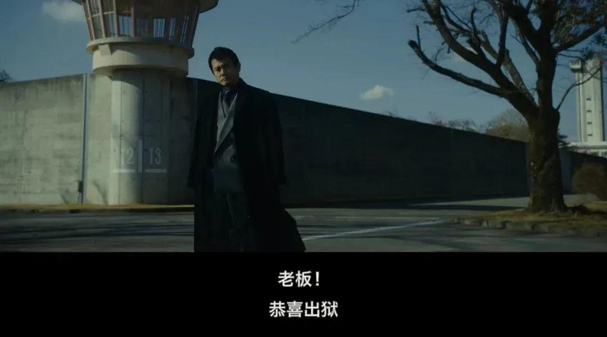
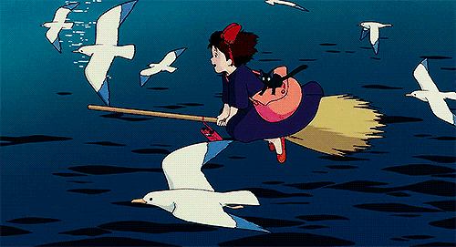
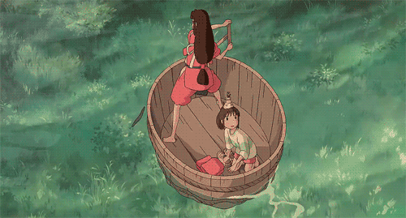

##  黄暴恶趣味的岛国神片，爽到飞起！

原创 有部电影 [有部电影]()**
今天，我给大家推荐一部新鲜出炉的日本黑帮片。

说是黑帮片，其实影片风格别致：

片名小清新，镜头很黄暴，看完让人开怀大笑——**《初恋》。**

从海报上就能看出这是一部群戏电影，主演有中国观众熟悉的染谷将太、帅气小生洼田正孝等。

不过最吸引我的，其实是本片的导演，这是一个如雷贯耳的名字——**三池崇史。**

他擅长拍黑帮犯罪电影，喜欢展现极致的暴力和罪恶。

其代表作品大家都不陌生，比如《切肤之爱》《杀手阿一》《恶之教典》《热血高校》等等。

在日本电影圈，三池有“罪恶教父”和“暴力美学的化身”之美誉。

今天这部《初恋》，就延续了他一贯的风格，砍头断手一个不少。

但与此同时，影片还出人意料地增添了几分温柔，纯爱与暴力相互交融，自有一份黑色幽默酝酿其中。

故事发生在夜晚的东京新宿。

这里是日本最繁华的商业区，也是黑道盛行、鱼龙混杂之地。

影片开始后不久，主角们轮番登场。

首先，是洼田正孝扮演的拳击手里奥：他是一颗冉冉升起的拳坛新星，平时独来独往，为人冷酷淡漠。

虽是孑然一身的穷小子，但他一心想成为一名伟大的拳击手。

最近几场连胜的比赛，让他崭露头角，东京最大的拳击杂志开始对他进行采访报道。

但没想到，报道后不久，里奥就被对手KO了。

百思不得其解的他，跑到医院一看，被医生告知自己得了脑肿瘤。

这不仅打碎了他的拳击梦，也让他失去了生存的希望。

与里奥有着类似困境的，还有一个名叫莫妮卡的应召女郎。

她身世凄惨，从小被生父虐待，后来又被父亲卖给人做妓女还债。

而债主，就是贩卖毒品的三合会小弟亚苏。

他和女友朱莉一起把莫妮卡囚禁在小黑屋里，通过约炮软件给她接活。

白天，他们逼莫妮卡接客赚钱，晚上，他们在房间里交易毒品。

就这样，莫妮卡被这对黑道小情侣折磨得生不如死，不仅染上毒瘾，还被无情毒打。

在身体摧残与毒瘾的作用下，莫妮卡时常产生噩梦般的幻觉，恍惚间看到父亲顶着白色床单朝自己走来。

而在里奥和莫妮卡各自为自己的命运痛苦挣扎时，东京的夜晚，也被蠢蠢欲动的罪恶所笼罩——

两股强大的黑道势力暗流汹涌，刚刚出狱的三合会大佬贡多，将成为大战的导火索。

原来，几年前三合会和华人黑帮在新宿进行过一场恶战。

交战中，贡多砍断了华人黑帮老大的一只手臂，而他自己则被对方送进监狱。

这次贡多出狱后，警察对他密切关注，华人黑帮也伺机报仇。

正巧这时，三合会新进了一批毒品交给亚苏，准备出手。

于是，黑白两道的多股势力都盯上了这批货，大战一触即发。

不过，这中间出现了一个小插曲——三合会的一个小弟，与亚苏关系不错的凯苏，产生了叛变之心。

凯苏和一个黑警素有来往，这场即将到来的大战让他恐惧不已，害怕自己会成为帮派火拼的牺牲品。

于是，凯苏瞄准了那批货，想出了一个金蝉脱壳的妙计：

他先让黑警扮成嫖客约莫妮卡出来，按照惯例，亚苏的女友朱莉会陪莫妮卡一起；

然后再雇个外援小混混，把朱莉劫走。

最后，凯苏扮成蒙面客去把亚苏打晕，偷走毒品。

二人卖掉一部分毒品分赃，另一部分留给黑警到警局邀功请赏。

然而理想很丰满，现实很骨感。

在执行途中，每个环节都惨不忍睹地掉了链子——

先是黑警接到莫妮卡，不料莫妮卡突然毒瘾发作，看到父亲的幻觉，吓得掉头就跑。

黑警死命追赶，却被当成流氓，直接被刚从医院出来的里奥，一拳撂翻在地……

就这样，里奥救了莫妮卡，两人开启了压马路的纯爱剧情。

同时，里奥捡走了黑警的警徽，意识到自己可能打错了人。

而另一边，凯苏也很不专业。

他在入室抢劫时被绊倒，暴露了身份，厮打之际，又一不小心开枪把亚苏打死。

同样地，雇来的小混混更是不靠谱。

他掳走亚苏的女友后，见色起意，却直接被身手了得的朱莉反杀。

这么接连几通令人窒息的操作后，凯苏背叛组织、杀人拿货的事很快败露了，遭到三合会的全面追杀。

同时，得到消息误以为毒品在莫妮卡手上的华人黑帮，开始四处寻找莫妮卡。

就这样，两大黑帮针锋相对的大战，被一个叛变小弟给搅乱；

运筹帷幄的凯苏和妄想通吃的黑警，合作告吹；

英雄末路的里奥与逃出生天的莫妮卡，虽然一见钟情，却又转瞬成为被人追杀的亡命鸳鸯……

**看起来，这个夜晚好像改变了所有人的命运，却又好像什么都没有改变。**

不难看出，这种多个角色因为各有所求，阴差阳错产生难分难解的恩怨故事，是黑色幽默的标准套路。

而与黑色幽默最搭的，无疑就是暴力美学。这一点，鬼才导演昆汀和盖·里奇都已玩得炉火纯青。

在这部《初恋》中，三池崇史又将其玩出了恶趣十足的新花样。

在影片的高潮段落，黑警找到莫妮卡和里奥，凯苏也与他们成功汇合，三合会跟华人黑帮也双双杀到，三方势力展开了精彩的追车枪战大逃杀。

这场混战持续了近40分钟，让影片的后半段嗨到飞起。

他们先斗黑帮，再战警察，杀到酣畅处时，直接全员暴走，刀枪并用，拳击擒拿十八般武艺轮番上阵，从公路战到仓库，又从仓库杀上公路。

整个过程，可以用天昏地暗与血色浪漫来形容！

而大战过后，众人的结局也颇具黑色意味。

凯苏被朱莉斩首，朱莉被华人黑帮错认成莫妮卡而一枪爆头；

至于丢失警徽的黑警，则因误伤警察而被打成了筛子……

其他人也都在混战中互相残杀致死，活下来的只有三合会大佬贡多以及里奥和莫妮卡这对莫名其妙卷入混战的绝命小情侣。

在故事的最后，贡多继续他的黑帮大佬生涯，而里奥和莫妮卡则互相成为了彼此的初恋。

这个充满罪恶与混乱的夜晚，改变了里奥和莫妮卡，命运安排他们相遇相爱，互相救赎。

里奥在混战途中接到了医生的电话，原来脑肿瘤是个误会，一切只是虚惊一场。

当他们从疯狂的夜晚冲出来后，天刚好亮了，迎接他们的这个早晨，正寓示着二人的重获新生。

**因此，本片在黑帮乱斗、警匪追逐的暴力美学与黑色幽默背后，还埋藏着这样一段美好的爱情奇遇。**

失意拳手与落魄少女的初恋，虽然看起来有些梦幻，但这却是导演难得一见的温柔表达，因而显得格外浪漫动人。

并且，里奥和莫妮卡的相爱并不只是烂俗的一见钟情，片中给他们安排了一个让人忍俊不禁的银幕倾心时刻——

在地铁上，当莫妮卡再次看到邪恶父亲的幻象时，正在听歌的里奥为莫妮卡戴上了耳机。

在音乐的包围下，莫妮卡眼中的邪恶父亲忽然跳起滑稽的舞蹈，她脸上的恐惧也因此转变为开心的笑容。

可以说，他们的相爱其实在冥冥之中早已注定。

**里奥找到了可以让自己放下冷酷面具、去关心呵护的女孩；****莫妮卡找到了不在意自己的过去、能够让她找回笑容的男孩。**

**从那一刻起，他的世界不再只有拳击，而她的幻觉也不再让她感到恐惧。**

**我想，如此美妙的初恋，虽不是奇遇，却胜似传奇。**

