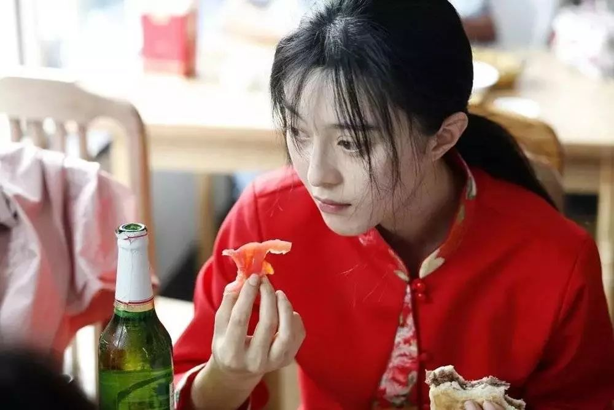
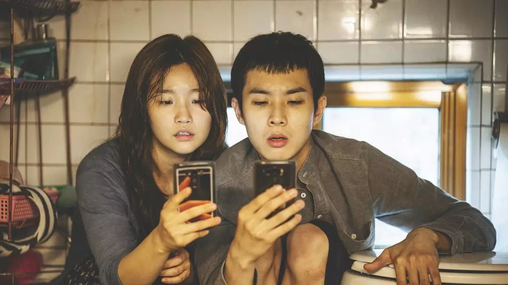
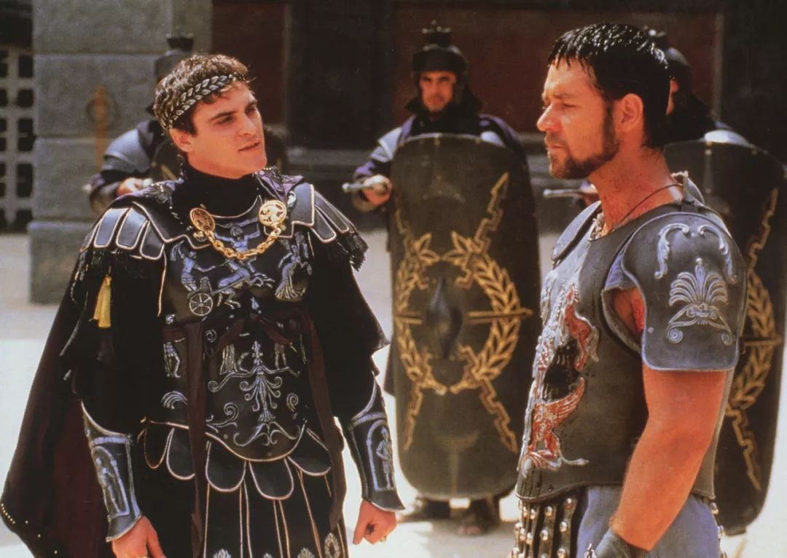
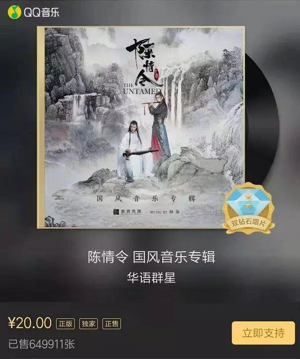
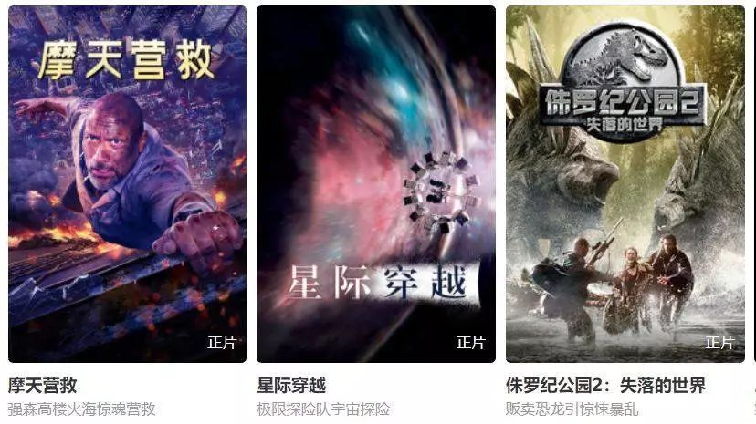
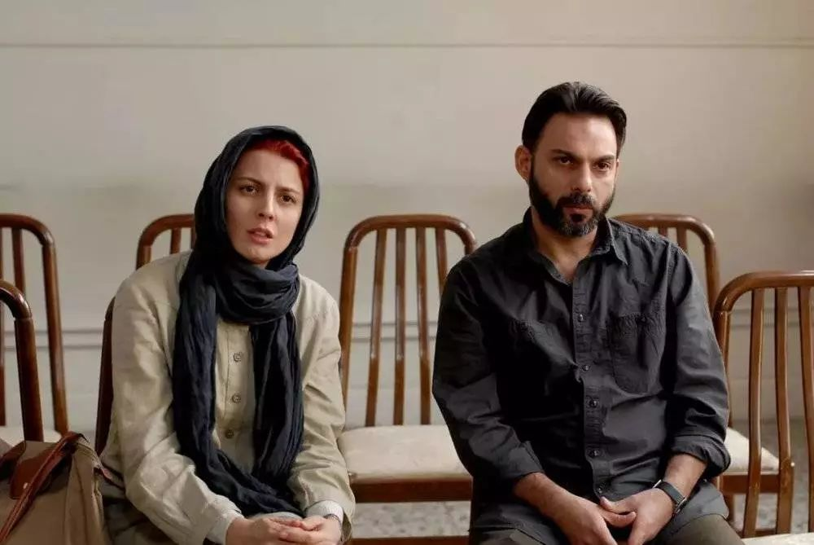
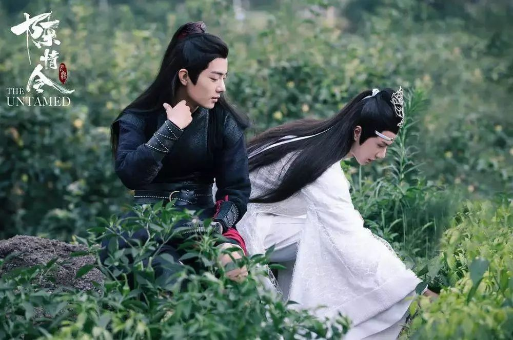
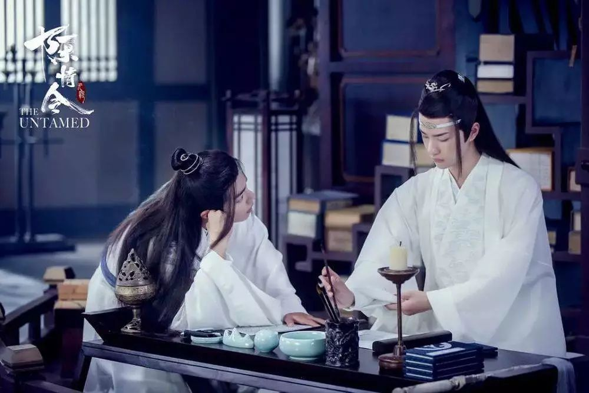

速读摘要

这部电影不仅剧情精彩，主演们的演技也个个炸裂，李秉宪已经被不少网友提前预定"明年的青龙影帝"，而饰演总统的李星民，也将这个人物心机深重、让人琢磨不透的特质诠释得入木三分。但在影片开场，男主却领到这样一项工作——为纪念中韩建交25周年，中国领导人将访问韩国，而特使会提前到达。而熊猫的基因不可能凭空出现，所以男主认为他必定和明明被劫走一事有关。值得一提的是，由于军犬阿里"第二男主"的地位，以及主角与动物之间发生的感人故事，说《动物园先生》是韩国版《一条狗的使命》也不为过，爱狗人士必看!

原文约 2104  字  | 图片 39 张 | 建议阅读 5 分钟 | [评价反馈](https://static.app.yinxiang.com/embedded-web/clipper/#/Evaluating?d=2020-03-20&nu=4ecd6b40-9115-4db3-aaad-bb789648f2b0&fr=myyxbj&ud=58b471&v=2&sig=6F51A660E495B6D6412F9F676FED36E1)

##  习惯了苦大仇深的韩国电影，看个喜剧片也不错

原创 有部电影 [有部电影]()**
不久前，我跟大家聊过最近的韩国爆款片《南山的部长们》。

这部电影不仅剧情精彩，主演们的演技也个个炸裂，李秉宪已经被不少网友提前预定“明年的青龙影帝”，而饰演总统的李星民，也将这个人物心机深重、让人琢磨不透的特质诠释得入木三分。

其实，李星民之前就凭借《特工》获得过大钟奖影帝。那部电影也同样是政治惊悚题材，他在片中扮演的是朝鲜对外经济委的审议处长李云明。

可能正是因为这些代表性角色的缘故，他一直给我留下深沉严肃的印象。

谁知道，最近看了他主演的一部喜剧后，我的印象全给颠覆了——**《动物园先生》。**

片中的男主叫周泰柱，在国家安全情报局工作。

因为有洁癖和强迫症，他非常讨厌动物，在电梯里碰见抱着狗狗的人，都恨不得马上缩进墙里。

但在影片开场，男主却领到这样一项工作——为纪念中韩建交25周年，中国领导人将访问韩国，而特使会提前到达。

不过这位“特使”并不是人类，而是一只可爱的大熊猫明明。

到时候，被指定的警卫将负责两国领导人见面的场合，并亲自保护特使。

男主即将迎来升迁，目前正需要积极表现。因此即便不喜欢动物，他还是抢着领到了这项任务。

但他万万没想到，初来韩国的大熊猫刚亮相动物园，就被一伙人劫走。

对方是有备而来，将国安局的人打了个措手不及。

而男主则在慌乱中被车撞倒，昏迷了过去。

等他醒来后，神奇的事情发生了——他发现自己竟然能听懂动物说话！

一开始，男主以为是自己大病初愈，身体太虚出现了幻觉。

后来却发现，他无论走到哪里都能听到动物说话，还能与之交流，不得不接受了这份“超能力”。

然而，同事们看到他的各种诡异行为，都觉得他是病糊涂了。

男主因此被强制要求“休息一阵”，交出了配枪和证件。

为了证明自己，也为了弥补过失，他决定靠自己的能力，找回大熊猫明明！

那么，怎么找呢？当然是利用他的能力，向动物们求助啦。

说起来，这种“主角能和动物对话”的设定并不新鲜。

1998年上映的美国电影《怪医杜立德》，讲的就是一名医生能听懂动物说话，生病的动物们都慕名而来找他治疗的故事。

今年初原打算上映的小罗伯特·唐尼新片《多力特的奇幻冒险》，也是这个故事的新版翻拍。

而从剧情走向看来，《动物园先生》又带有《博物馆奇妙夜》等奇幻片的影子，让本身不能说话的动物开口说话，帮助主角完成任务。

虽然从设定上来看，本片算不上新颖，但好在喜剧方面，《动物园先生》出色地完成了任务。

为了找寻明明，男主又一次来到动物园，试图从动物身上打听消息。

他意外地发现，原来动物们并不像人们想象的那样简单，它们的生活十分丰富，爱好也非常广泛——

比如有只老虎喜欢唱情歌；

有只雌猩猩对着杂志上雄猩猩的肌肉线条流口水；

甚至熊猫看到男主还会主动问好：

不过别误会，这只熊猫并不是明明，而是同事假扮的。

最终，还是雌猩猩告诉男主，有一只牧羊犬目睹了明明被劫走的全过程，找到它就能找到明明！

这只牧羊犬是一只军犬，代号1478。

自从明明被劫走后，它就趁乱偷偷留在了动物园里。

为了找到明明，男主不得不硬着头皮“讨好”1478，又是把它带回家，又是亲手给它洗澡，终于引得1478吐露了实情。

原来，1478原名阿里，从小在反恐训练基地长大。

当时，年幼的它十分胆小，本来不适合做一条军犬。但负责训练它的女兵素珍不愿放弃它，仍然每天耐心地训练阿里。

不幸的是，素珍在3年前死于一个恐怖分子引发的爆炸，阿里从此记住了这个恐怖分子身上的味道——而那天在动物园劫走明明的，就是此人。

根据阿里提供的线索，男主将嫌疑人锁定了在一家生物公司的首席研究员身上。

这个人准备通过克隆技术对熊猫进行改造，将它们培育成小狗的大小，再当成宠物卖给人们。

而熊猫的基因不可能凭空出现，所以男主认为他必定和明明被劫走一事有关。

但当男主费尽力气，终于将研究员抓获之后，却被同事告知，明明失踪的那天他根本就不在韩国……

这是怎么回事呢？难道说男主和阿里的判断都出了错？

接下来的故事我就不剧透更多了，感兴趣的小伙伴可以自己找来看看。

值得一提的是，由于军犬阿里“第二男主”的地位，以及主角与动物之间发生的感人故事，说《动物园先生》是韩国版《一条狗的使命》也不为过，爱狗人士必看！

总的来说，这是一部轻松治愈的喜剧，观感相当减压。

虽然它的故事并不复杂，内核也并不深刻，但看着那些萌萌的动物们，无论是谁心情都会变好吧？

除此之外，男主李星民的演技也是一大看点。

才看完他演整天阴沉着脸的总统，再看他演窘迫逗趣的特工，居然一点也不违和。

在片中，他饰演的男主经历了这样一个心理转变过程——

一开始，他极其讨厌动物。不仅因为洁癖，更因为他的妻子正是因为不分日夜地照顾动物，连自己受的伤也顾不上照看，才最终罹患败血症去世。

而后来，在与阿里的相处过程中，他渐渐习惯了有狗狗的陪伴，也渐渐开始离不开它。

直到最后，为了救阿里的性命，男主甘愿为它挡子弹……

**这种转变，也意味着男主对待动物的态度从一开始的傲慢自大，逐渐变成了理解与敬畏。**

从前的他认为，人类最重要，动物低人一等；等到能听懂动物们的语言时，他才发现每个生命其实都平等地生活在这个世界上，没有谁比谁更高贵。

同样的，这种转变也体现在他对女儿的态度上。

一开始，女儿总抱怨他没时间陪伴自己，男主却觉得，自己是为国家做事的人，女儿应该理解，常常扔给她一把零花钱就了事。

但当他看到初次见到女儿的阿里，居然很快就和她混熟后，心里有点嫉妒了——

可以说，阿里的到来让男主忽然发现了自己作为一个父亲的失败。

也正是在阿里的“提点”下，他才明白，对女儿来说比零花钱更重要的，是他的陪伴。

在故事的结尾，蜕变后的男主因为肯花时间陪伴女儿，又变得爱护动物，成功获得了女儿的拥抱与阿里的友谊。

**你看，不论是对人还是对动物，只要能放下居高临下的姿态，设身处地地去理解对方，隔阂也没有那么难以打破。**

也许是国内最认真的电影自媒体
长按扫描二维码关注

在看