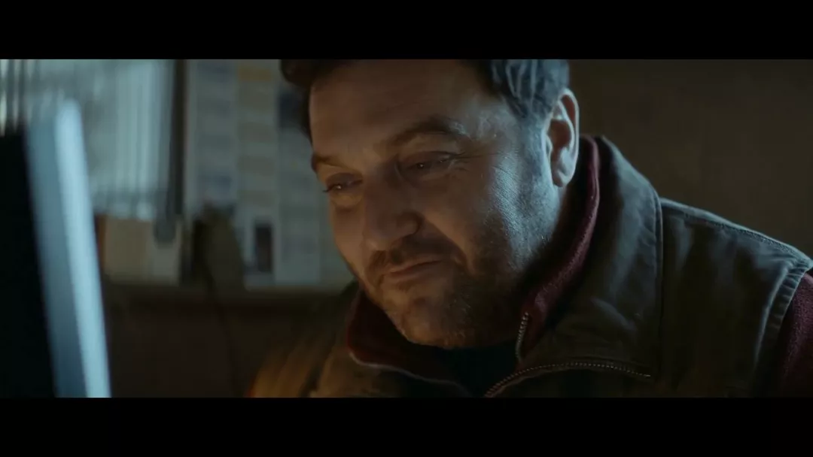

## 出轨杀人，恋母抛尸，这部大尺度悬疑片够深刻

原创 有部电影 有部电影 *今天*

很长时间没讲悬疑犯罪片了，今天就来聊一部奇情又狗血的法国电影。

  

这部影片的叙事手法非常特别，它用一个环环相扣的故事，揭露出了人性中荒蛮而悲凉的一面——**《只有野兽》。**

  

  

故事发生在法国的一个偏远小镇。

  

影片开场，当地警察发现一个名叫伊芙琳的女人的车停在路边，但她本人却失踪了。

  

  

按照一般套路，接下来警察会找到她的尸体、查出背后的真相。

  

但本片却没有这样展开，而是将随后的故事分成了四个章节，每个章节以一个角色命名。

  

其中，第一部分名为“艾莉丝”。

  

她是一名保险业务员，也是小镇农场主米歇尔的妻子。

  

  

在一次谈业务的过程中，艾莉丝爱上了不善言辞的客户乔瑟夫，并与之做了爱做的事。

  

  

这两人虽然谈不上有多深的感情，但艾莉丝也算打开了乔瑟夫的心扉，使他不再完全沉浸在母亲去世的痛苦中。

  

  

可就在这两天，乔瑟夫出现了一连串反常行为——

  

有一次两人为爱鼓掌时，他忽然表示自己想独处一下；

  

  

还有次艾莉丝来看他，却发现他身上沾满碎草，养的狗被人枪杀，惊慌之中还冷酷无情地叫她滚蛋。

  

  

等艾莉丝回家之后，发现丈夫米歇尔也不大对劲。

  

他骂骂咧咧地出门了，回来之后便满脸是血。

  

  

联想到两人的反应，艾莉丝猜想这是因为丈夫知道了自己出轨的事，所以去找乔瑟夫报复，并觉得狗也是他杀的，心里百感交集。

  

  

不过事情并没有这么简单。

  

在影片的第二部分，主视角从艾莉丝转移到了乔瑟夫身上，乔瑟夫此前态度大变的原因，也由此浮出水面。

  

  

原来，乔瑟夫有着强烈的恋母情结，去年母亲去世之后，他变得无法面对任何人，甚至一直守在母亲的尸体旁边，直到尸体腐烂。

  

  

最近的某天早上，他突然在家附近发现了失踪女人伊芙琳的尸体。

  

扭曲的恋母情结再次爆发，他把这具女尸当成像母亲尸体那样的依赖对象，藏在草堆里，没事就和她待在一起。

  

  

正是这个秘密，让他在为爱鼓掌时心猿意马，接着见狗子把尸体拖拽出来便枪杀了狗子，后来又把撞到他诡异状态的艾莉丝赶走。

  

  

应该说，故事发展到这，伊芙琳失踪的事算是解决了，剩下的问题就是到底谁杀了她，原因又是什么？

  

  

而想要解开这个谜题，首先要知道伊芙琳经历了什么。

  

所以，影片的第三部分，将视角转移到了一个与伊芙琳有直接联系的人物——玛莉咏身上。

  

  

玛莉咏是一个年轻貌美的服务生，在餐厅邂逅了成熟迷人的伊芙琳后，立刻陷入到深深的迷恋当中。

  

  

然而，伊芙琳只把她当炮友，事后就一声不响地离开了。

  

玛莉咏只能根据伊芙琳说过的只言片语寻找她，最终找到了她的家中。

  

  

见了面后，虽然两人又再续前缘了几次，但伊芙琳始终拒绝和玛莉咏在一起，还以担心丈夫出差回来为由，不让她在家里过夜。

  

  

没过多久，伊芙琳正式向她提出分手。

  

两人为此大吵了一番，伊芙琳的死亡便是从那里离开之后。

  

  

但凶手并不是求爱失败的玛莉咏。

  

几天之后，小镇农场主米歇尔突然找到了她，还莫名其妙地说要和她私奔。

  

一脸懵逼的玛莉咏朝他脸上踢了一脚——这就是第一部分里，米歇尔回家后满脸是血的原因。

  

  

那么，这两人又是什么关系？杀死伊芙琳的凶手到底是谁？

  

当影片来到最后一部分，所有的疑团也在引入了黑人角色安曼蒂之后，逐一解开。

  

  

安曼蒂是一名网络诈骗犯，他和朋友们会利用网上弄来的美女照片和视频，伪装成女孩，然后与男人网恋来骗钱。

  

  

结果，就在他以玛莉咏的形象物色猎物时，米歇尔不幸中了他的圈套，一次又一次地给他汇了不少钱。

  

  

时间久了，米歇尔想要面基的心开始蠢蠢欲动。

  

好巧不巧的是，有一天他在路上看见了玛莉咏。

  

  

因为当时妻子在身边，所以他没有上前相认，但在那之后，他偷偷跟踪了玛莉咏，还在网上发出了正式见面的邀请。

  

  

安曼蒂眼看事情要败露，于是谎称自己被收债人威胁，暂时不能见面，想着最后再捞一笔。

  

  

哪知道，米歇尔一听心爱的“玛莉咏”身处险境，一下子热血上头，决定去帮她摆平麻烦。

  

  

而当他来到玛莉咏的住处时，恰好听到了玛莉咏与伊芙琳的争吵，因此把伊芙琳当成了迫害玛莉咏的人。

  

  

于是，当伊芙琳离开后，他直接跟了过去将她掐死，还把尸体扔在了老婆的情人乔瑟夫的家门口。

  

这也是为什么在第二部分里，乔瑟夫会突然捡到一具女尸。

  

  

**没错，整件事情的真相就是如此的荒谬。**

  

总的来说，这是一部蝴蝶效应式的电影，完成度很高，具有很强的可看性。

  

通过拼图式的叙事，影片以每一个角色的经历和视角，呈现出整个事件的不同切面，进而层层剥开，形成了一个完整的闭环。

  

影片又名《谜夜拼图》

  

在前三部分中，影片的摄影和剪辑凌厉逼人，始终维持着让人欲罢不能的悬念，在冰天雪地的自然景观下，用冰冷的镜头语言刻画出人性的幽暗。

  

  

而作为核心要素的第四部分，影片则在节奏和氛围上打破了之前的沉稳，不仅使用了占全片二分之一的时长，而且安曼蒂的戏码也比其他角色要躁动不少。

  

  

这种处理或许是导演有意为之，或许是使故事能够自圆其说的必要，但在观感上的确让影片变得有些失衡和泄气，不少人对影片的槽点就在于此。

  

  

所以，平心而论，尽管本片也动用了非常规的叙事技巧，但它的确无法像《撞车》《通天塔》《低俗小说》那种以结构见长的经典影片一样让人惊叹。

  

《撞车》

  

相比于结构，本片所深入探讨的主题，反而是更吸引人的地方。

  

就像片名《只有野兽》所暗示的一样，影片重点刻画的是人类在性与爱这种动物性本能面前的复杂面孔，有欺骗、矛盾以及妥协，也有偏执、疯狂甚至病态。

  

  

出轨的艾莉丝，与丈夫各怀鬼胎。

  

但值得玩味的是，两人仍能相安无事地生活在一起，见到丈夫受伤，她也会去照顾和安慰。

  

  

从恋母到恋尸的乔瑟夫，他的恋母并非仅仅是依赖，为爱鼓掌时因为女尸而走神的戏码，也暗示了他在性投射对象方面的偏离轨道。

  

  

在赶走艾莉丝后，他知道尸体恐怕藏不住，于是跑到了一个山洞边抛尸，结果抛完之后，自己也跟着跳了下去。

  

  

而性观念不同的伊芙琳和玛莉咏，前者将性作为美好的游戏，后者却衍生出爱欲里狂热的占有欲，进而陷入到迷失自我的痴迷境地。

  

  

最让人无语的是米歇尔，他因为垂涎于女孩靓丽的外表，失去了基本的判断力，甚至还在阴差阳错下，做出了杀人抛尸的举动。

  

  

在影片最后，米歇尔找到了安曼蒂，也发现了自己被骗的事实。

  

但当安曼蒂继续用之前的假账号给他发信息时，他依然不由自主地发出了“亲爱的”，脸上还流露出发自内心的喜悦。

  

  

这种沉迷于虚幻情感中的“真挚”，看起来可笑，实际上却很可悲。

  

回过头来看，隐藏在婚外情、恋母恋尸、网恋杀人这些的背后，说到底，是人类拗不过的人性弱点以及深不见底的孤独。

  

  

正是它们，造成了人们在爱欲面前的执迷不语与歇斯底里；

  

也是它们，让人们哪怕知道自己所追求的并不可能，甚至充满扭曲，却仍然像抓住了救命稻草一样不肯放手。

  

  

**时常有人感叹，所谓爱情，不过是镜中之花，水中之月。**

  

**可实际上，爱情自有其无可替代的价值与意义，绝非虚幻。面对情感问题，需要的并不是看破红尘式的消极和懒惰，而是舍弃病态的贪嗔痴，保持基本的理性和清醒。因为真正可怕的，并非爱欲本身，而是人们对其破坏性的茫然不知。**

