速读摘要

女主怀孕后，丈夫很高兴，但依旧没有表现出多一点的关心。女主自己也没太在意，但没想到，她从此便一发不可收拾地爱上了吞咽各种小东西。因为自卑，女主养成了取悦型人格，缺少丈夫的关注便觉得一无所有。因为没有爱，丈夫容不下女主的一点错误，连领带被熨皱了也要把她叫到跟前大发牢骚。同样是设定猎奇、情节重口，《生吃》表现的是兽欲与人性，野蛮与文明，本能与自我约束之间的对抗，通过一个校园霸凌引发的吃人故事，讲述女性从适应罪恶的外部环境，到步入成人社会所要经历的痛苦与蜕变。

原文约 2414  字  | 图片 41 张 | 建议阅读 5 分钟 | [评价反馈](https://static.app.yinxiang.com/embedded-web/clipper/#/Evaluating?d=2020-03-20&nu=ec169b6e-c50c-4a01-b2af-5cf20aba04da&fr=myyxbj&ud=58b471&v=2&sig=92AB5606F0FBAF01CFC0AA29FBE79D83)

##  迷恋上吞咽的少妇，什么东西都敢吞下去

原创 有部电影 [有部电影]()**
开门见山，今天给大家推荐一部女性题材的励志惊悚片——**《吞咽》。**

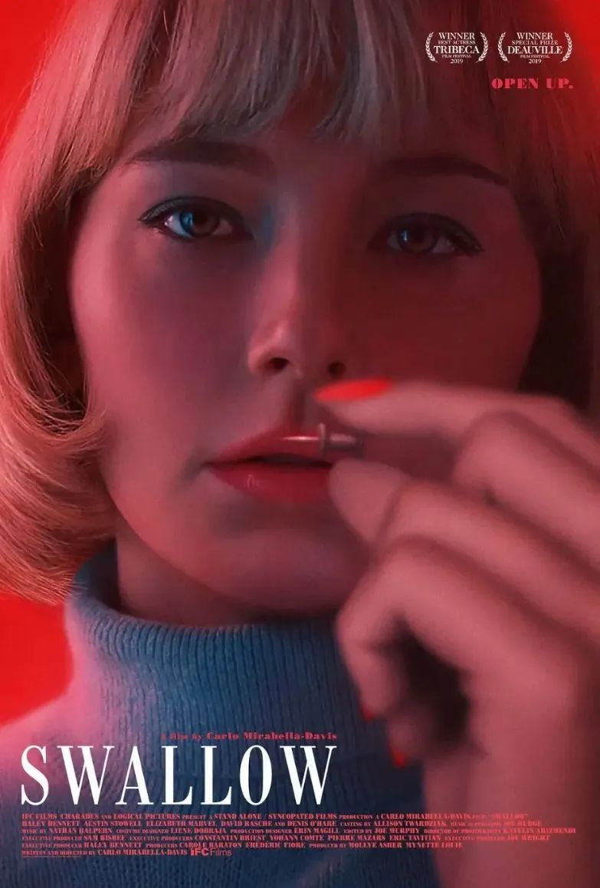

女主角亨特出身普通，但很“幸运”地嫁给富豪，成为了一个家庭主妇。

她年轻貌美，温柔大方，受到丈夫的赞赏和周围朋友的羡慕。

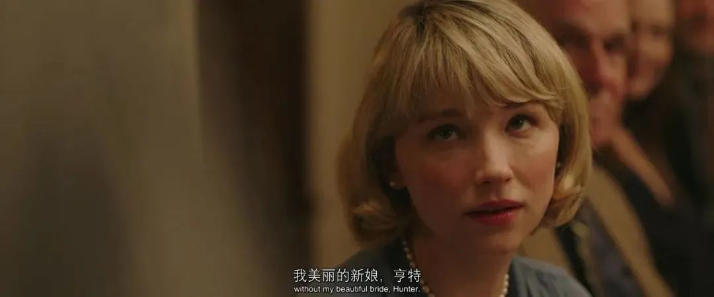

她的丈夫是家族企业的继承人，刚晋升为公司里最年轻的常务董事。

最近，两人搬进了一栋山庄豪宅，女主每天的任务就是准备早餐，打扫房间，清理泳池，到了晚上就打扮得漂漂亮亮地迎接丈夫回家。

闲的时候，女主就刷刷手机、看看肥皂剧，或者画画简笔画，培养一下艺术情趣。

看起来，女主过得轻松闲适，但也非常单调乏味。

她和丈夫的交流很少，连吃晚饭时都相敬如宾地坐的很远。

常常女主一句话还没说完，丈夫就开始接电话，等他抬起头来已经不记得女主在说什么，只好微微一笑，夸一句饭很好吃……

可想而知，在这种冷漠尴尬的婚姻关系中，女主过得并不快乐。

精神上的压抑与不满，在她怀孕之后也变得越来越严重。

女主怀孕后，丈夫很高兴，但依旧没有表现出多一点的关心。

在和父母一块吃饭时，他还不顾女主的感受，一个劲儿地鼓动她讲一个疯子骚扰她的故事。

那是一段不愉快的童年经历，让女主感到很难为情。

可即便如此，还没等她讲完，丈夫和公公就又开始聊起生意，把她晾在一边。

就在这时，女主看着杯子里的冰块，突然有了某种冲动，旁若无人地嚼起冰块来。

起初，女主自己也没太在意，但没想到，她从此便一发不可收拾地爱上了吞咽各种小东西。

每当丈夫不在家，她就会情不自禁吞下玻璃球、钥匙、别针、石子或是其他小金属物件。

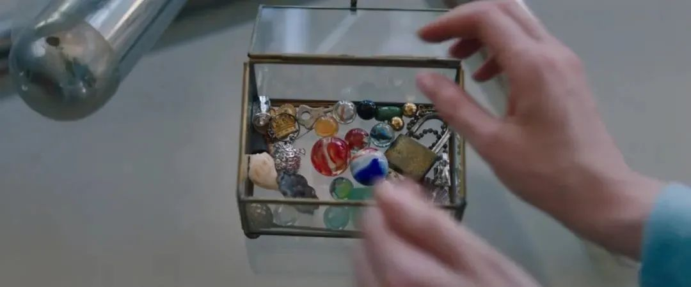

每当吞下这些异物后，女主都倍感轻松，心情也变得愉悦起来。

仿佛这种自虐似的吞咽，能够治愈心里的不快一样。

就这样，女主渐渐吞掉自己的口红、废弃的电池，几乎身边能碰到的所有小东西，她都像上瘾一般地吞下去。

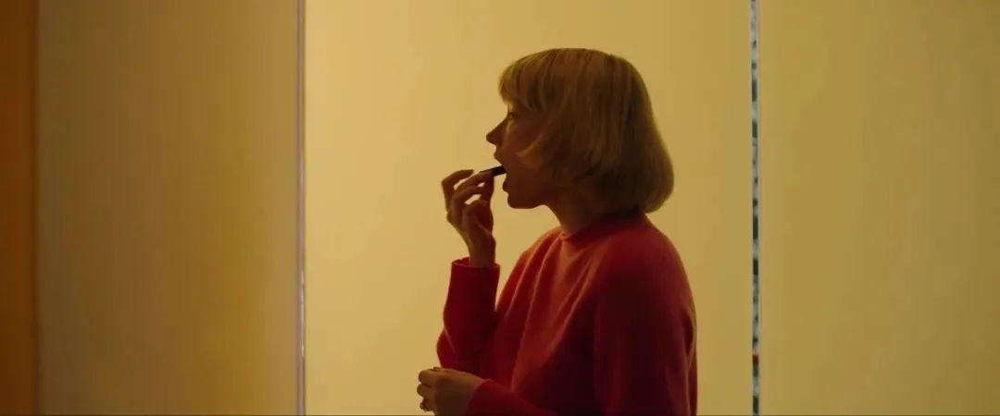

有天扫地时，她发现一枚尖锐的图钉，同样忍不住吞了下去。

而这好像并没有想象中的痛苦，于是她把吞咽的食物链又扩大了一圈。

即便身体出现不良反应，也不能阻止她的吞咽冲动。

但没过多久，做产检时，这个“癖好”还是暴露了。

医生从她嘴里取出来的各种东西，让人触目惊心。

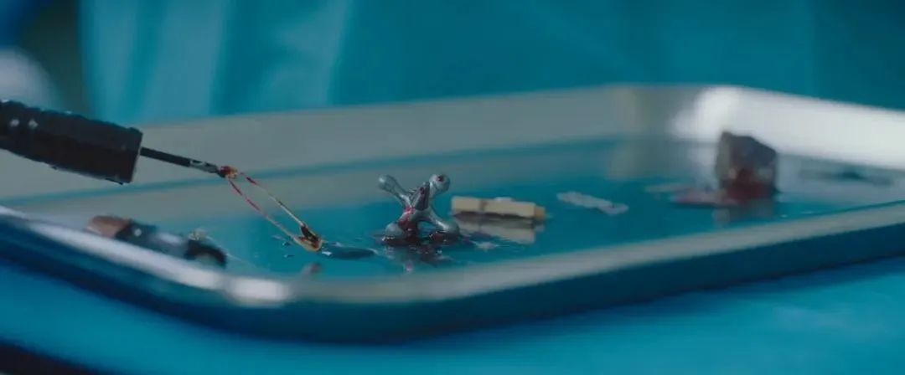

她被医生告知，患有异食癖和强迫症。

不过，丈夫无法理解世上竟然有这种怪病，回到家后暴跳如雷地把她大骂一顿，责怪女主没有在婚前就告诉他自己有病。

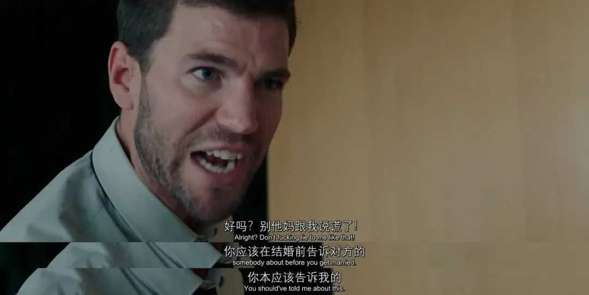

随后，丈夫想出了各种办法给她治病。

先是请了位心理医生，治疗方法就是万能的吃药、聊天、谈父母；

接着，婆婆也亲自上阵，教女主做孕期营养餐，还大扯一通缺乏营养——脑子秀逗——吃错东西的歪理；

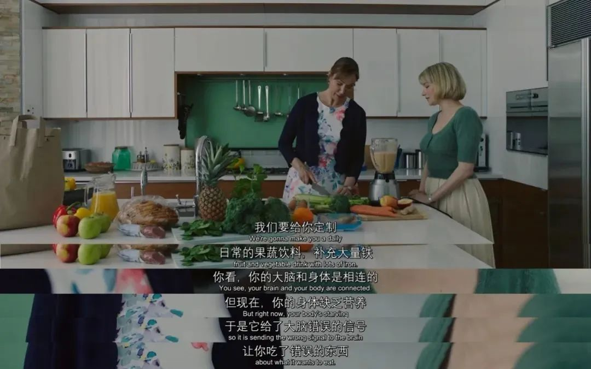

他们还请了一个凶神恶煞的男护工，说是来帮女主做家务，其实是来监视她。

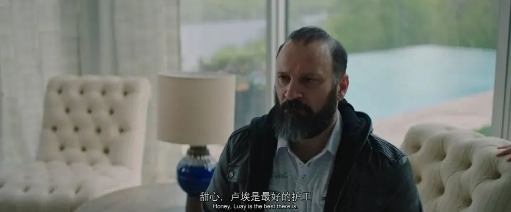

但想也知道，这些举措并没有什么用。

越是被禁止，女主就越是千方百计地想吞些奇奇怪怪的东西。

比如，她在卫生间里藏了一袋金属物件，趁上厕所时吞食；在修剪花园时，甚至会偷偷吞下种花的泥土。

她也曾有意识地阻止自己吞食异物，但这就像是戒断毒瘾一样难受。

等到复发之时，情况还变本加厉，她在抓狂状态下吞掉了一根十几公分长的螺丝刀。

当她因为疼痛难忍被送进医院后，医生做了开喉手术，才把螺丝刀取出来。

这次事件让丈夫一家忍无可忍，逼女主住进疗养院，把孩子生下来才能获得自由，否则就要离婚。

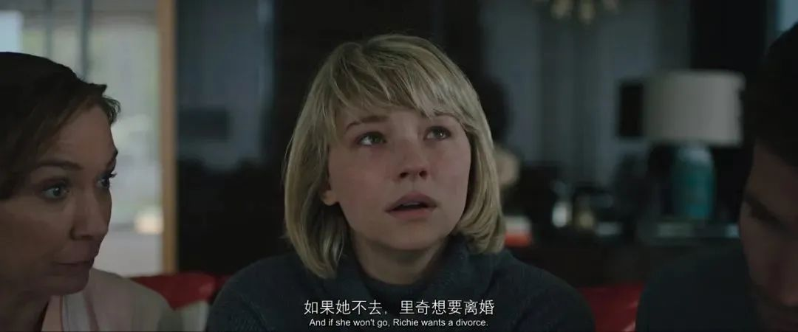

而这一次，女主也爆发了，她翻窗逃走，决定再也不回去。

给丈夫打完“告辞”电话后，失去一切的她在宾馆房间里再次吃起泥土来。

看到这里，可能有人会既心疼女主，又感到不解，甚至觉得她有点自作自受。

事实上，女主把自己逼到这么惨的境地，确实跟她不堪回首的家庭和童年有关。

原来，她的母亲曾被人强奸怀孕，因为是极端天主教徒，不能堕胎，才不得不生下了她。

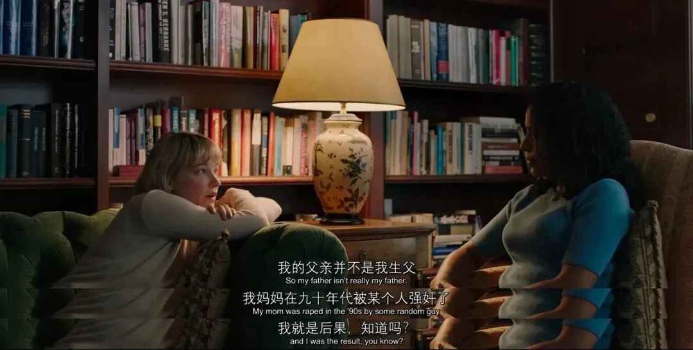

母亲视她为耻辱，父亲更不待见她，这样带有“原罪”的身世，成为了女主痛苦的根源。

在逃离丈夫后，女主曾给母亲打电话，想回家住一段时间，但被母亲拒绝了——从小到大，她一直没被家人接受。

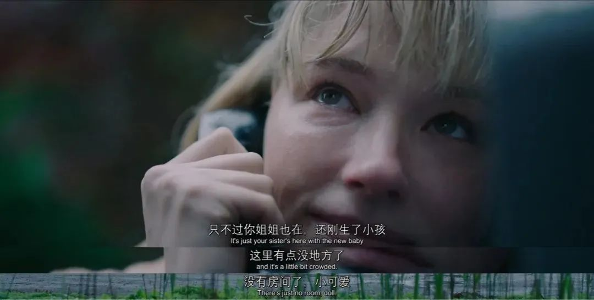

在这种被厌弃的缺爱环境中长大，女主形成了自卑性格和负罪心理。

她觉得自己不配被爱，不配得到美好的事物，包括后来吞食异物，也像是在以自虐的痛苦来惩罚自己，达到某种心理上的解脱。

如果说，不幸的出身埋下了女主走向悲剧的根源，那么丈夫一家的冷漠无情，则是把她逼上绝境的直接原因。

嫁给丈夫，女主所求并非荣华富贵，而是关心、呵护与爱，但这只是一厢情愿的想法。

虽然丈夫对女主相敬如宾，没有出轨背叛，但他与女主没有共同语言，也没有沟通交流的意愿——低头看手机，抬头微笑化解尴尬，就是他面对女主的常态。

他并不爱女主，娶她无非就是事业型男人想要个漂亮贤惠的妻子，在家能做饭洗衣，出门作为宴会伴侣，让他觉得脸上有面子。

简单来说，丈夫想要的，只是一个不给他添麻烦，能为他生儿育女的保（工）姆（具）罢了。

因此，他们的结合从一开始就是无法挽回的错误。

因为自卑，女主养成了取悦型人格，缺少丈夫的关注便觉得一无所有。

因为没有爱，丈夫容不下女主的一点错误，连领带被熨皱了也要把她叫到跟前大发牢骚。

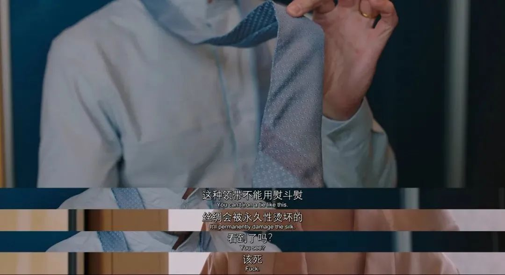

同样地，公公婆婆对女主也没有一点家庭亲情可言。

婆婆一味地想要改造女主，要他一切为丈夫服务；

公公完全不管女主死活，只关心她肚子里的孩子，因为那是家族企业的下一代继承人。

因此，女主对吞食异物的成瘾，既是为了在孤寂中引起丈夫的注意，也是一种表达不满与反抗的方式。

人格的独立，往往从掌控自己的身体开始，尽管她知道这种方式会伤害自己。但也恰恰是这种自我掌控的伤害与自虐，让女主觉得痛并自由着……

总体来看，本片虽然设定上有猎奇成分，但表达的主题很简单，就是女性自我意识的觉醒与独立人格的养成。

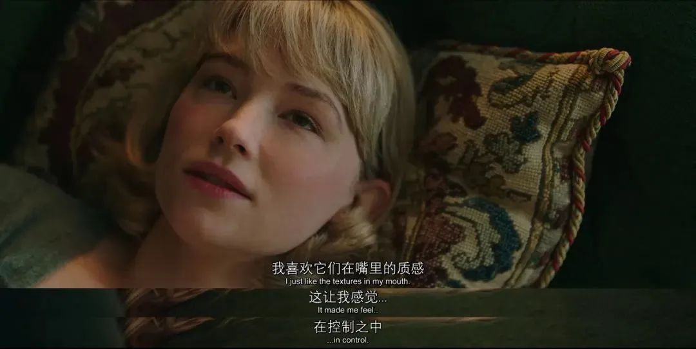

这种以极端方式来表达女性主义的故事，让我想起了2016年的一部法国电影——《生吃》。

甚至也有观众把这部《吞咽》，当作《生吃》的姊妹篇。

在那部影片中，女主一开始是个对肉食过敏的极端素食主义者，后来在学校里遭受霸凌，被强迫吃生肉。

没想到这一下激发了女主体内的嗜血食肉本能，让她走上了吃人的道路……

同样是设定猎奇、情节重口，《生吃》表现的是兽欲与人性，野蛮与文明，本能与自我约束之间的对抗，通过一个校园霸凌引发的吃人故事，讲述女性从适应罪恶的外部环境，到步入成人社会所要经历的痛苦与蜕变。

而与《生吃》的暴戾、生猛相比，《吞咽》表面上显得更加平静含蓄，但内里的爆发力同样震撼。

在最后那通电话中，当丈夫气急败坏地辱骂女主，嘲讽她离开自己什么也不是的时候，女主挂断了电话。

她决绝离开的举动，既是对丈夫最好的回应，也标志着重新做回自己的决心。

因此，影片算是给出了一个大快人心的结局。

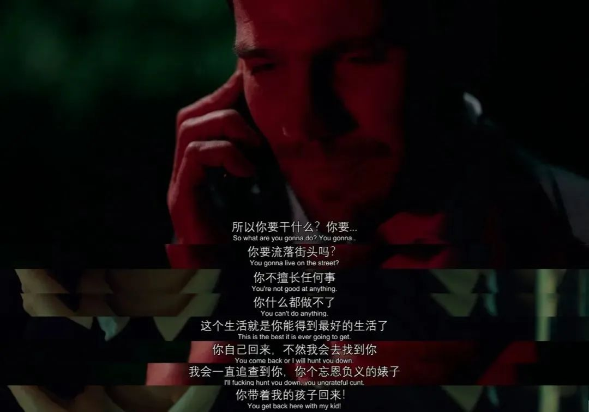

**确实，即便是今天这个时代，女性在很多方面也会比男性更辛苦一些。但这并不意味着，男女之间在人格尊严和能力素养上有强弱之分、高下之别。所有人，不论男女，都应该被世界温柔以待，都应该自由、勇敢、独立地活出真实的自我！**

