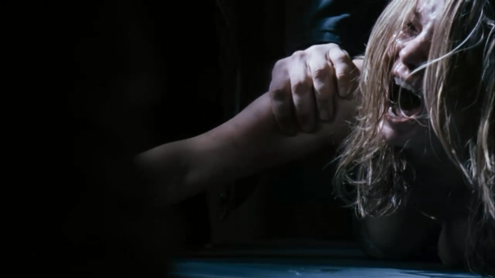
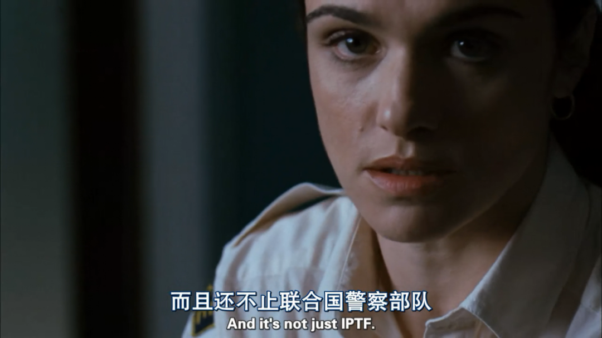
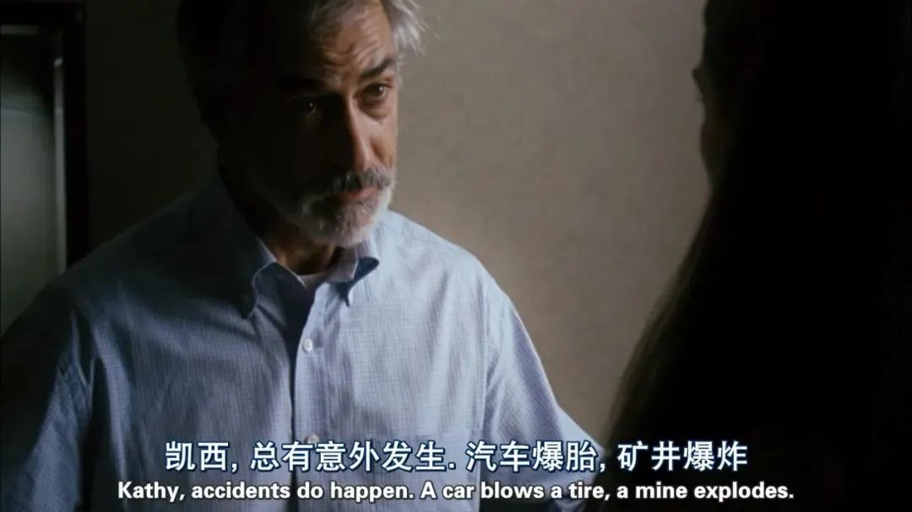

#  道貌岸然的联合国，居然参与拐卖妇女卖淫性虐《The Whistleblower》

原创 有部电影 

自从韩国N号房事件曝光之后，其后续调查始终备受关注。

昨天，据韩媒报道，N号房另10名运营者被捕，其中年龄最小者仅12岁。N号房的运营者里80%都是“10代”（10-19岁）。

这则新闻一出，又瞬间引爆了舆论。很多人都说这背后体现的不仅是韩国性别歧视、物化女性的社会风气，更是一整代人性教育的失败。

但正如我之前在一篇文章中和大家说的，其实“N号房”并不仅仅发生在韩国。

今天要讲的这部根据真实事件改编的电影，就扒开了联合国一段骇人听闻的黑历史——**《告密者》。**

片名The Whistleblower，直译就是“吹哨人”。

片中的女主凯茜是一名警察，因为工作狂的属性，老公和她离婚，女儿也被判给了老公。

为了能搬到离孩子近的住处，她需要一大笔资金，于是接受了前往波斯尼亚担任联合国维和人员的工作，半年可获得10万美金。

虽然是为了赚钱才去的，但凯茜依然保留着工作狂精神和维护正义的人生理念。

刚到波斯尼亚不久，她就为一名遭受家暴的妇女打赢了诉讼，这在男尊女卑的当地是史无前例的。

这起诉讼使凯西在维和部队中脱颖而出，很快她就得到提拔，成为当地性别事务办公室的主管。

升职后的一天，凯茜接到了外国少女莱娅的报案，得知很多女孩在一间酒吧遭受性侵和虐待，随即前往调查。

她惊讶地发现，这些女孩被囚禁在酒吧后面的囚室里，用铁链、牢笼所控制，并长期受到酒吧老板和客人的变态折磨。

而这些客人里包括很多联合国的维和人员，他们的照片贴满了墙。

更诡异的是，她前脚刚到酒吧，当地警察后脚就赶来救人了，说是要把女孩们送到一个妇女避难所，完全不让她插手。

可等她来到避难所后才知道，这些女孩都是被拐卖来满足维和部队男人性欲的。

这个避难所根本就是病残被拐女的收留站，里面全是出于各种原因需要调养的被拐女，莱娅就因遭受非人虐待、严重感染而高烧昏迷。

回去之后，凯西在联合国国际警察部队信息系统上查询，却没有发现任何关于酒吧突击检查的记录。

至此她明白了，这些女孩被人拐来当做性奴的背后，是当地警察与人贩子沆瀣一气，而维和部队的人则在其中收取保护费，并参与玩弄被拐女孩。

痛心疾首的凯茜决定为这些女孩讨回公道。但不用想也知道，她面前有着巨大的阻力。

一开始，她想起诉酒吧照片上的那些维和人员，结果却被告知他们都享有“豁免权”，是不可能被起诉的。

但凯茜不听，坚决要起诉。结果就在立案当天，又出现了新的状况。

凯茜本想让从避难所带回来的莱娅和伊尔卡在法庭上作证，谁料伊尔卡被人以没有护照为由交给了警方，随后被警方丢在了随时可能因地雷丧命的塞尔维亚边境；

而莱娅也因为警方内鬼的通风报信，在去法庭的路上被人贩子劫走，继而遭到了残酷虐待。

这样一来，好不容易找回的伊尔卡也不敢出庭作证了，事情又陷入了停滞。

好在，凯西的上级里斯小姐得知后，给她安排了一个靠谱的搭档皮特，对方的建议给了她一个启示，那就是必须先保护好受害的人。

于是凯西调整策略，只从避难所的女孩那里搜集资料，不要求她们出庭作证。

就这样，凯西通过在酒吧和避难所的搜证，发现了更加触目惊心的真相——

原来，联合国国际警察部队才是贩卖女孩的幕后黑手，美国军方和外交部也牵扯其中。

这绝对是联合国和美国的惊天丑闻，一旦曝光后果将不堪设想。

而凯西坚持不懈地挖掘真相，也在不知不觉中使自己陷入了危险的境地。

起初只是有人想让她闭嘴，高层领导答应给她带薪年假，劝她回家去陪陪女儿。

接着，凯西的电话遭到监听，调查被关停，材料也被有关机构强行抽走。

这个时候，搭档皮特提醒凯西，再不收手就会有“意外发生”。如果她执意要将真相公布于天下，就必须立刻带上证据离开波斯尼亚。

然而，凯西刚要离开时，忽然收到了莱娅的消息。

她无法放下莱娅不管，决定先从人贩子手里救出莱娅再说。

到了现场之后，一切再次让凯西感到绝望——

事情的走向就和上次一模一样，她前脚刚到，当地警察后脚就跟了来。

于是，凯西带不走莱娅。而莱娅转眼就被人杀死抛尸于树林。

这让凯西彻底崩溃了。她等不到离开波斯尼亚，而是立刻采取行动，向联合国参谋长、波斯尼亚高级专员等人发送了一封邮件，揭露当地警察和维和部队参与贩卖人口、逼迫卖淫的罪行。

但不幸的是，她刚发完邮件，高层领导就将她开除，还没收了她收集到的所有证据。

这样一来，即便凯西离开了波斯尼亚也没用，因为空口无凭，案件终究会被掩盖过去。

然而凯西仍然没有认输，而是和搭档皮特上演了一出双簧——

首先，她在皮特的掩护下进入办公大楼，偷偷拿回证据；

接着，她让皮特假装反水，使她当场被抓包，从而偷偷录下高层领导的嚣张言论；

最后，等高层领导以为高枕无忧时，皮特再把所有证据和录音交还给她，使她顺利带出波斯尼亚。

在影片的最后，离开波斯尼亚的凯西接受了BBC的专访，终于将一切罪恶公之于众。

但可惜的是，正义并没有因此到来。

贩卖人口这件事涉及到了利益方太多，包括美国民主党、州政府、军方等等，他们都不允许自己的利益受损。

所以，在影片结尾的字幕里，我们看到了一个“杀人放火金腰带，修桥补路无尸骸”般的残酷结局——

**“尽管涉案人员被遣送回国，但他们都没有受到指控；那些相关利益方继续做着生意；而凯西则被拉进了黑名单，从此没有了到国际组织工作的资格。”**

这部影片取材于联合国维和人员凯瑟琳·波克瓦克的真实经历，呈现出了少有的客观与真诚。

**不同于“能力与大、责任越大”的正面论述，影片为观众展示的是“权力越大、越易腐化”的顽疾。**

比如片中的高层领导，在面向凯西等新来的维和人员时，他会道貌岸然地说要为当地重建秩序、维护法治和平，甚至不惜牺牲生命。

可实际上，他却与多方势力勾结谋私。

当凯西发现问题后，他并不帮忙解决问题，反而千方百计地解决提出问题的人，甚至把被拐卖的女孩称为“慰安妇”，美其名曰“维护联合国的脸面”。

但真正让联合国蒙羞的，正是他们这样的衣冠禽兽！

再比如说，片中的基层维和人员，虽然并不是这条人口贩卖产业链的始作俑者，可他们同样对被拐女孩的悲惨遭遇视若无睹，为了享受自己的“特权”，劝凯西少管闲事。

正是因为以上种种，才使得凯西想要揭发罪恶都备感举步维艰。

她在发给联合国参谋长的邮件中有一句质问，也说出了所有观众共同的困惑——

在接受BBC的采访时，主持人问凯西：如果再来一遍，你是否还会这样做？

她的回答是：yes，不带有丝毫迟疑。

**我想，这就是一个真正忠于自己、忠于理想的人的纯粹。导演借助这个个人对抗腐朽权力的真实故事，想要激励的正是每一个追求正义、锲而不舍的无名英雄。**

**尽管坚守底线可能带来巨大的压力，与强权斗争可能要付出惨痛的代价，但是，人总要坚持些什么，也正是有了这些人的坚持，我们的社会才不会缺乏希望。**

