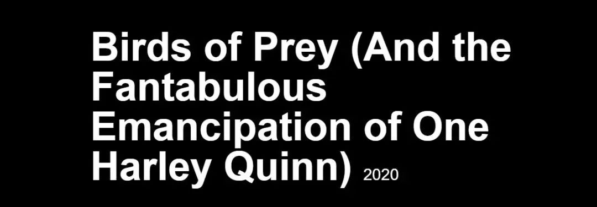
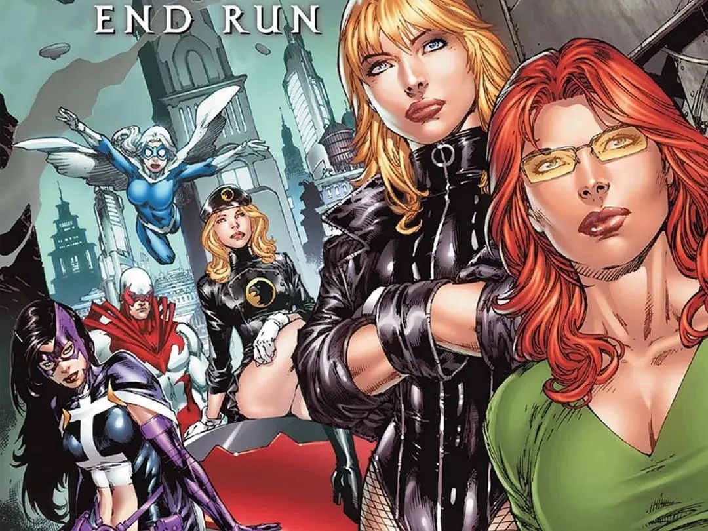
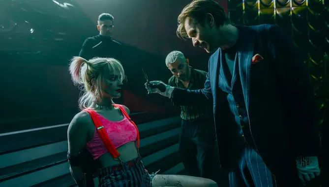

##  苦等4年的R级爽片，坏女孩联盟来了！

原创 有部电影 [有部电影]()**
2016年DC的《自杀小队》，口碑一败涂地，却成了票房爆款。

最大的功劳，则是让首次触电大银幕的小丑女，火得一塌糊涂。

随着角色的人气加成，饰演小丑女的90后女星玛格特·罗比，近几年也是大红大紫。

年纪轻轻就合作了昆汀、小李、皮特，先后拿到奥斯卡最佳女主和女配的提名，从好莱坞新生代小花中脱颖而出。

很多观众都非常期待小丑女的单体电影，现在我们终于等到了《哈莉.奎茵:禽小队》。

本片已于2月7日在北美和海外陆续上映。

专业影评网站MTC给出5.7的低分，IMDb上拿到6.6，一向宽松的豆瓣上也只有6.9分，且还在不断下滑。

本片也没能复制《自杀小队》叫座不叫好的奇观，上映近一个月来仅取得1.7亿全球票房，最终将会在回本线附近挣扎。

而且，因为票房失利，出品方华纳还搞了一个骚操作，在公映四天后紧急召回院线拷贝，决定更改片名。

更骚的是，本片的英文原名特别长，叫做Birds of Prey (And the Fantabulous Emancipation of One Harley Quinn)，翻译过来就是《猛禽小队与哈利·奎恩的奇妙解放》。

MTC网站现在也没改过来

之所以要大费周章改名字，是因为华纳觉得猛禽小队的知名度，不如小丑女。

这倒是说对了，可能国内观众对这个漫画IP也不太熟悉。

猛禽小队是DC旗下一个全部由女性组成的（反）超级英雄团队，不同时期成员不同。

但实际上，漫画中的猛禽小队基本和小丑女哈莉·奎恩没什么交集，因此不了解漫画，观看本片也没什么影响。

这部电影，事实上还是以小丑女为绝对主角的个人成长秀。

故事起源于小丑女和小丑分手之后，她想独自在罪恶之都哥谭市闯出一片天。

但不管她走到哪里，都被人指指点点，说她能在哥谭混，靠的都是小丑女友的身份，这次分手估计也是作秀，离了小丑她啥都不是……

为了证明自己，她决定向世人宣告和小丑已经彻底决裂，于是，她开车炸毁了哥谭市化工厂。

酷女孩从不回头看爆炸

那里既是哈莉·奎恩成为小丑女的地方，也是她和小丑定情的地方。

为了证明自己对小丑的爱，她曾经奋不顾身地跳进化学池，成为癫狂邪魅的小丑同类。

没想到，炸毁化学池后，分手的信号是传出去了，但也招来了不少仇敌。

原来，小丑女和小丑在一起时作威作福、树敌无数，没了小丑的庇护，仇敌们一哄而上对她下达追杀令。

其中，最想杀死她的，是号称“黑面具”的罗曼·辛尼斯。

他是哥谭市让人闻风丧胆的黑帮老大，也是蝙蝠侠的宿敌之一。标志性的作案手法，就是活活剥下敌人的脸皮。

最近，黑面具正在寻找一颗刻价值连城的钻石。

15年前，哥谭市最富有的黑手党家族惨遭灭门，相传他们把巨额财富的银行密码，用镭射激光编码刻在了一颗钻石内，但至今下落不明。

为了找到钻石，哥谭市的地下帮派和各路人马，都使出浑身解数，甚至犯下多起命案。

其中，一个新崛起的人物，是代号“女猎手”的十字弓杀手，不少黑帮大佬都死在她的箭下。

同时，这场由钻石引发的风波，也吸引了女警察芮妮·蒙托亚的注意。

这位女警作风豪放，破案手法不循规蹈矩，因此被上司开除，只能暗中调查。

其实，那颗钻石一度落到了黑面具的手中。

他的女保镖“黑金丝雀”得到了钻石，却不料转瞬就被一个名叫卡珊德拉的小偷偷走。

卡珊德拉偷到钻石后没多久，就被警察抓进监狱，无奈之下，她将钻石吞了下去……

就这样，黑面具派出的手下，怎么也找不到钻石。

而就在他暴跳如雷的时候，手下给他抓到了小丑女。为了保命，小丑女急中生智，答应帮他寻找卡珊德拉和钻石。

于是，后面的剧情就很明了了——

小丑女在监狱营救卡珊德拉后，碰到追踪到此的女警察和女猎手以及黑面具派来“收货”的下属和黑金丝雀。

一番混战之后，女孩们纷纷觉醒，决定同仇敌忾，组团对付黑面具。

这是因为，她们落得如此窘境，或多或少都跟黑面具有关——

女警察之所以被上司撤职，是因为黑面具贿赂了警察和政府官员；

黑金丝雀虽然为黑面具做事，却也是迫不得已，随时都有性命之忧；

而女猎手的真实身份，是当年惨遭灭门的富豪家族唯一幸存下来的黑手党公主。她用十几年时间刻苦训练成顶级杀手，却发现当年的仇人都在为黑面具做事。

至于小丑女和卡珊德拉就更明显了，就算她们交出钻石，黑面具也不会放过她们。

就这样，落魄女孩们组成的“猛禽小队”终于成军。

可以看到，《猛禽小队》的剧情简单而直接，故事通畅但也平淡。

而作为一部万众期待的R级漫改爽片，《猛禽小队》也有一些鲜明的特色。

比如，影片用一分半钟的开场动画作为前情提要，就表明这是一部具有浓烈漫画质感的真人电影。

这种混搭风格如果玩得出彩，可以大大增加电影的趣味性，就像《死侍》那样。

但可惜的是，影片随后的“漫画质感”仅仅停留在演员的夸张表演，和陌生角色出场时，画面跳出的卡通形象和字幕提示：

此外，影片的另一大噱头，是由《疾速追杀》武指团队打造出来的“酷炫”动作戏。

其中，着重描绘的有三场：一是小丑女独闯警局、二是女英雄混战，三是结局的反派大乱斗。

单独看个别动作设计的花哨程度，确实有《疾速》那种硬核的感觉：

但连在一起看，就没内味了——因为片中的反派角色就像纸片人，个个面目狰狞，看起来凶狠异常，其实一碰就碎。

小丑女只需一个“帅气”十足的侧身翻，就能轻松解决战斗。

这么一对比，让人不得不纳闷，同样的动作指导，在《疾速》里搞出了拳拳到肉、枪枪爆头的杀手宇宙，但在这部《猛禽》里咋就整成了一枝独秀、花式空翻的体操表演呢？

最后的大战，更是混乱不堪，犹如马戏团里的动物暴走。

女英雄们打出了隔空拳、无影脚，吓得反派异常配合，还没接触就飞的飞、倒的倒。

看到这里，我想大家不难理解这部以小丑女为卖点、主打DC女英雄集结的《猛禽小队》，票房口碑双扑的原因了。

影片的剧情套路平庸，角色转变全靠顺拐，任务难度有如过家家，主角光环全靠开挂，对男性角色的脸谱化表现也到了弱智和令人厌恶的程度。

难怪网友纷纷表示，这种粗暴低级地表现女性力量的方式，很不OK！

可以说，**《猛禽小队》烂就烂在了形式与内容的极度不匹配上。**

虽然画面出类拔萃，配乐节奏踩点、情绪饱满，但由于故事短板过于突出，让观众很难与角色产生共振，一起真正地嗨起来。

看完后我最大的感受就是，本片非常努力地想用形式上的“装酷”来掩盖内容的空洞，最终只能是装逼失败，成为 “漫画式电影”的反面教材。

尤其是看过DC的上一部作品《小丑》之后，更加不可避免地会让人对本片的印象大打折扣。

这是一部看点、缺点都非常明显的粉丝向作品，有着坚定的受众群体，也会让一些好奇围观的人大失所望。

但话说回来，如果你是DC拥趸或是哈莉·奎恩的粉丝，那片中小丑女癫狂俏皮的个人秀，也足以让你津津乐道，收获不少惊喜吧！

