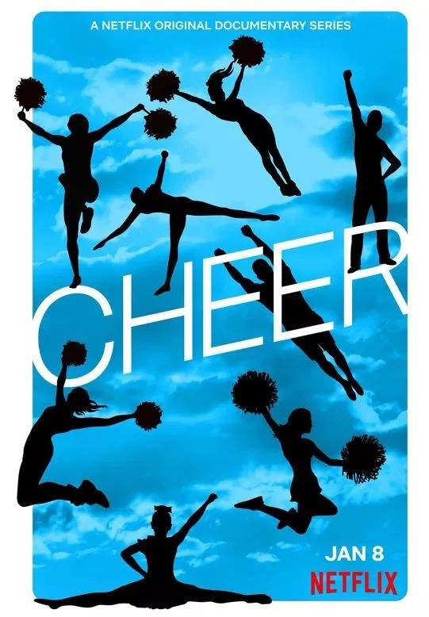
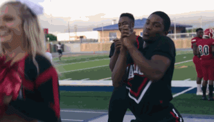
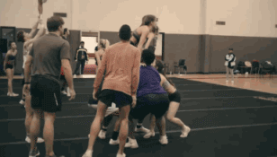
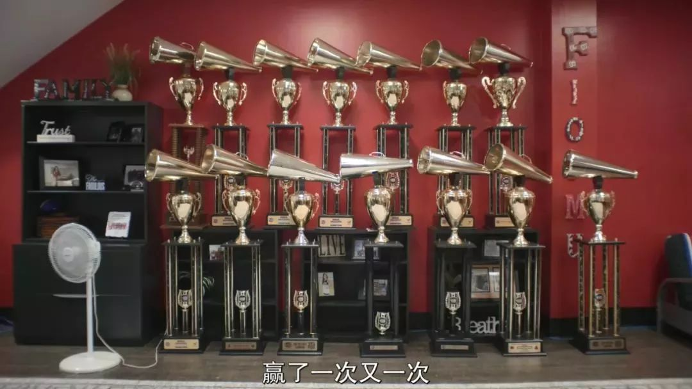
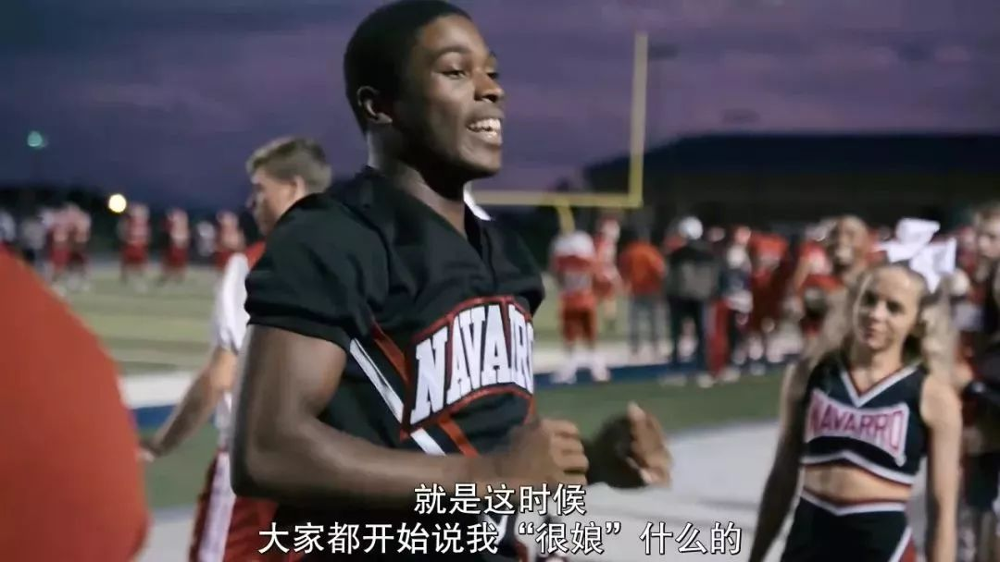
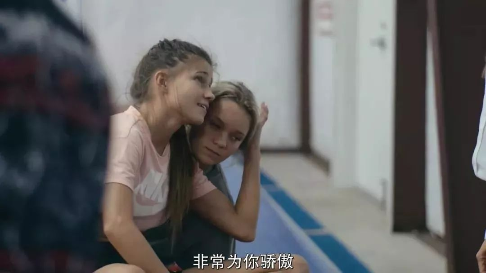
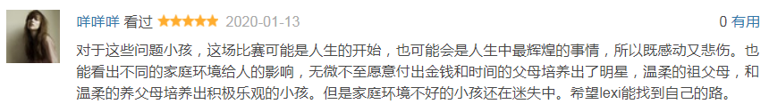
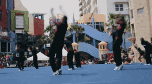

速读摘要

从2000年至今，纳瓦罗学院啦啦队曾14次拿下全国大学啦啦操冠军，是这个领域的绝对王者。在纳瓦罗学院，每个队员首先面临的是激烈的内部竞争。对于莱克茜的情绪波动，莫妮卡也敏锐觉察到了。而对于有些自卑的摩根，莫妮卡则适时给她更多表现机会，在一次动作调整时，她让摩根站上金字塔最高处的关键位置。即便这项运动在外行人眼里，依旧存在着刻板印象，甚至连纳瓦罗学院所在的小镇居民都对其一无所知，但每个成员也会不遗余力地用自己的行动，让更多人去了解它。

原文约 2546  字  | 图片 37 张 | 建议阅读 6 分钟 | [评价反馈](https://static.app.yinxiang.com/embedded-web/clipper/#/Evaluating?d=2020-03-20&nu=6a829f5f-c251-4168-bcae-19c21bb512f4&fr=myyxbj&ud=58b471&v=2&sig=E6640554D6F7E9F32DADE55040AF12F1)

##  这可能是荷尔蒙最爆棚的网飞纪录片

原创 有部电影 [有部电影]()**
开门见山，今天给大家聊一部小众的运动题材纪录片。

这项运动其实说起来大家都不陌生，但看完这部影片，我们才会发现自己此前对它的误解有多深——**《啦啦队女王》。**

提到啦啦队，估计大家印象中，都是美国电影里常出现的那种劲歌热舞的短裙美女方阵：

.jpg)

但经常刷微博的小伙伴，可能还记得这么一条新闻——

美国得州一场橄榄球比赛期间，一名黑人啦啦队小哥，凭借魔鬼般的动作实力抢镜，风头甚至盖过了面前的小姐姐。

他的劲舞视频一度引起轰动，浏览量超过1200万。

实际上，这位小哥在网络爆红，不光是因为他的舞蹈，更因为他所在的纳瓦罗学院啦啦队，是多次获得全国冠军的“神之队”。

.jpg)

从2000年至今，纳瓦罗学院啦啦队曾14次拿下全国大学啦啦操冠军，是这个领域的绝对王者。

而今天聊的《啦啦队女王》，讲的就是这个王牌啦啦队的日常。

.jpg)

事实上，竞技拉拉操发展至今，已经是一项专业的竞技运动。

它不仅成员有男有女，动作编排还加入了高难度的体操技巧，有大量的翻筋斗、托举和抛接动作，以及开挂般的人肉金字塔，这对于队员的默契配合和身体素质都有极高的要求。

所以本质上，每个竞技啦啦队员，体能都不输一名专业运动员。

.jpg)

而对于爱好啦啦操的少男少女来说，纳瓦罗学院，就是他们梦寐以求的顶级学府。

只不过，通往冠军的道路一点也不好走。

在纳瓦罗学院，每个队员首先面临的是激烈的内部竞争。

由于每年只有20人有资格代表学校参赛，所以即便考进了学校，也还是要跟自己的队友先进行一轮选角PK。

.jpg)

其次，由于啦啦队毕业后没有对口工作，所以整个职业生涯的高光时刻，就是在校的这短短两年。这段时间如果不使出浑身解数拼一把，两年后就将永远告别这项运动。

.jpg)

此外，全国比赛只有2分15秒的表演时间，这意味着想要拿冠军，就必须顶着巨大的精神压力，让表演动作完美无瑕。

而这背后的风险，就是各种摔伤淤青、肌腱撕裂，甚至脑震荡……

.jpg)

说到这里不难看出，这部《啦啦队女王》的特点之一，就是从卫冕冠军的视角，为我们揭秘了啦啦队的日常。

它是一项课外活动，也是一项高难度、高风险的竞技运动，并非只有短裙和彩球，还需要付出常人难以想象的汗水和艰辛。

.jpg)

而纳瓦罗学院之所以能成为这个领域的王者，很大程度上是教练莫妮卡的功劳，她被学生们称为“女王”。

.jpg)

莫妮卡大学时就是一名啦啦队员，同时也是具有MBA学位的学霸。

她年轻时的理想，是去纽约当叱咤商圈的女强人。但机缘巧合下，她最终选择留在了家乡。

.jpg)

身为教练，莫妮卡对学生们的要求极为严格，每次训练她都会在场边指导，给学生纠正动作，鼓舞士气。

.jpg)

因为这项运动对成员间的信任度要求极高，莫妮卡的团队有一套特别的“惩罚措施”——一旦训练中有人受伤，不管是谁的责任，全体队员都要同时被罚做50个俯卧撑。

惩罚的目的就是让每个人记住，大家是一个同甘共苦的整体，只有记住每次失误和受伤，最终才能在比赛中表现得完美无瑕。

.jpg)

训练之外，莫妮卡对于学生们的学业和个人品行，也有极高的要求。

她聘请了高材生做助教，帮助大家跟上日常的学业进度；也时刻关注学生们的社交网络，因为每个人的言行都代表了纳瓦罗学院。

.jpg)

除此之外，莫妮卡还要时刻关注学生们的心理健康，因为她手底下的学生，有相当一部分是遭遇过家庭变故的“怪孩子”。

比如开头提到的黑人小哥拉达瑞斯，曾是一名出色的橄榄球队员，但自从接触并爱上竞技拉拉操之后，他开始被朋友和兄弟喊“娘”，不仅遭受霸凌，甚至还被性骚扰。

这样的成长环境让拉达瑞斯变得极为暴躁，平时遇事爱动手，遇到困难又习惯性撒手不干。

这样的怪脾气，导致他训练时一旦消极情绪上来，就会直接影响队友的安全。

.jpg)

还有队里的全能选手莱克茜，高中曾辍学两年，学业一度荒废，家长也管不了她。

后来出于对啦啦操的热爱，她临时发狠补课，才考入了纳瓦罗学院。

.jpg)

然而入学后，莱克茜因为性格孤僻，一开始与其他队员相处得并不好。

在训练时，她因为被网友挖出了过去的裸照，一度产生不安情绪，影响了训练效果。

.jpg)

再比如队里另一个女孩摩根，也是一个破碎家庭的小孩。

因为从小被亲生父母遗弃，她带有讨好型人格倾向，特别希望得到教练的关注，但偏偏她越是用力尝试，就越容易出错，一度被莫妮卡列为待定人选。

.jpg)

可以说，莫妮卡每天的任务除了指导训练，还要想尽办法让学生们战胜性格缺陷，将内心争强好胜、自信爆棚的一面展现出来。

面对训练中出现的各种意外插曲，她有着不同的应对方法。

对于经常闹脾气的拉达瑞斯，莫妮卡选择“冷宫伺候”，让替补队员代替他的位置。被晾了几天后，再让助教安排一次谈心，才他回到队伍中。

从那之后，拉达瑞斯意识到自信和自负有一条微妙的界限，再也没有因为自己的情绪问题而给大家拖后腿。

.jpg)

对于莱克茜的情绪波动，莫妮卡也敏锐觉察到了。

了解情况后，她亲自带着莱克茜去报案，并告诉她自己才是裸照事件的受害者，教她把局面的掌控权夺回来。

这不仅让一直担心会给学校抹黑的莱克茜松了口气，也让她深刻感受到莫妮卡的关心。

从那以后，莱克茜似乎变了一个人，与队友的关系也变得更加亲密。

.jpg)

而对于有些自卑的摩根，莫妮卡则适时给她更多表现机会，在一次动作调整时，她让摩根站上金字塔最高处的关键位置。

.jpg)

这个重任在摩根看来，代表着教练对自己的极大信任，也激发出她内心无所畏惧的一面。

经过短暂适应，摩根凭借实力留在了最终的20人之列。

从这里就能看出，《啦啦队女王》不光把镜头对准了一个团体，还专注刻画个体故事，通过对日常生活的真实捕捉，去诠释这些性格张扬的年轻人，对于这项运动的热爱。

这部纪录片虽然冷门，但看过的网友无一不被剧情感动。

其实根本原因在于，竞技拉拉操跟其他运动一样，具有极大的包容性。

不管你的性别、取向、出身如何，每个全身心投入的人，都能在挥洒汗水的过程中，找到生活的动力，挖掘出自己的潜力，形成影响人生的积极价值观，甚至彻底脱胎换骨。

即便这项运动在外行人眼里，依旧存在着刻板印象，甚至连纳瓦罗学院所在的小镇居民都对其一无所知，但每个成员也会不遗余力地用自己的行动，让更多人去了解它。

在训练紧张的阶段，莫妮卡也会接受当地政府的邀请，让学生们切换到“普通啦啦队模式”，为慈善活动贡献自己的力量。

.jpg)

因为纳瓦罗学院的每次公开表演，都会让人们感受到这项运动不光只有靓丽的外表，还有百分百的健康和自信。

他们每一次的完美表现，都会激励更多的孩子们，去认识、了解并加入其中。

.jpg)

《啦啦队女王》的最后一集，全程记录了纳瓦罗学院参加2019年全国比赛的过程。

理论上来说，他们夺冠几乎毫无悬念，然而这次比赛却并没有大家预想中的那般顺利。

在表演过程中，一名男队员在翻筋斗时出现失误，导致表演被叫停……

按照比赛规定，因伤中断比赛的队伍，还有一次表演机会。

此时的好消息是，他们在中断前的完美表演计分有效；坏消息是，大家只有半小时的调整时间去完成后半程的动作，而这其中包括了决定胜败的三层金字塔。

那么纳瓦罗学院到底能不能再次称王呢？想欣赏一次完美啦啦体操的小伙伴们，就自己去纪录片中寻找吧~

也许是国内最认真的电影自媒体
长按扫描二维码关注

在看