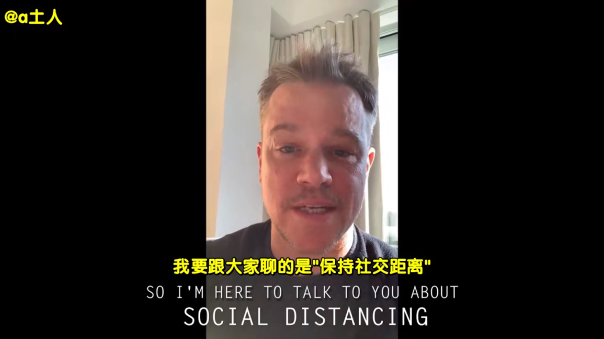
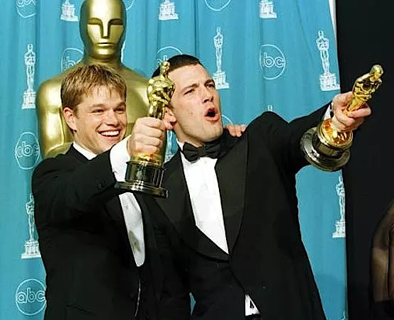
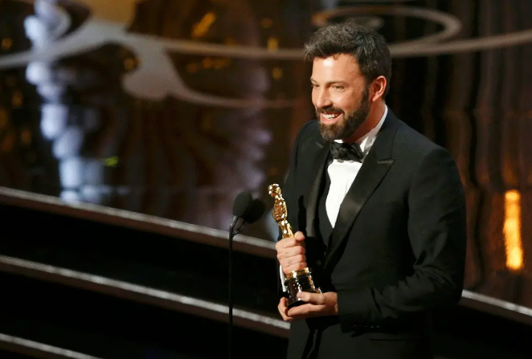
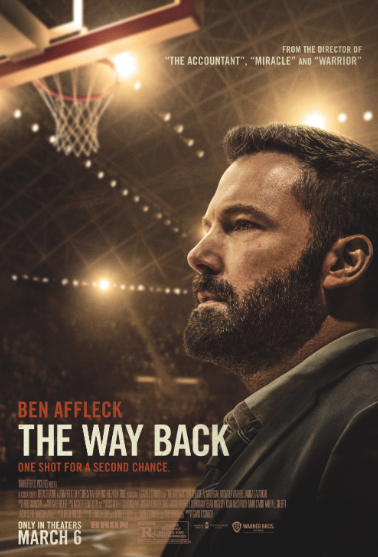
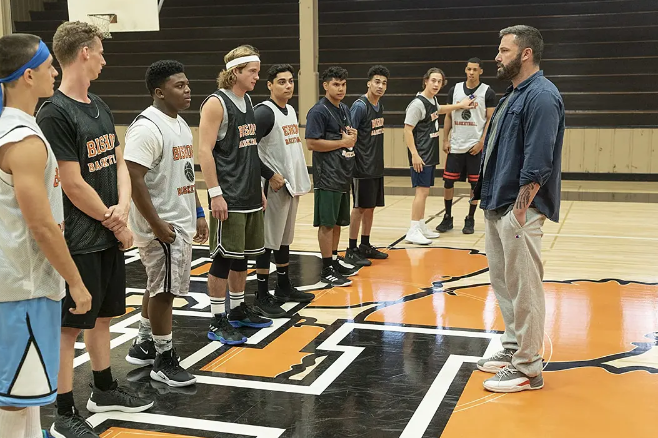
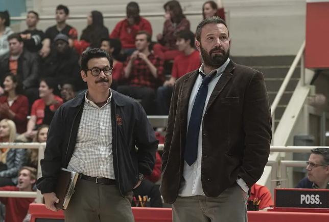
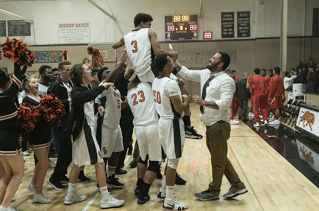
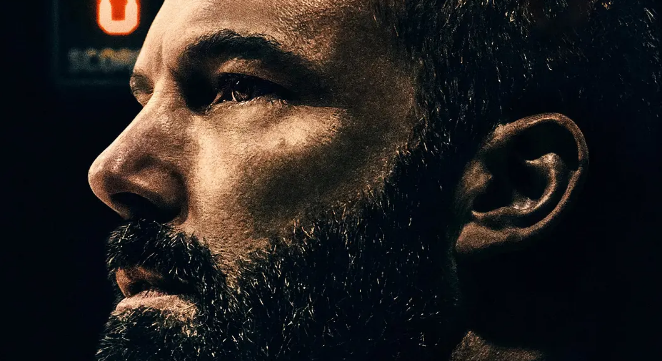

速读摘要

本·阿弗莱克称得上是集编剧、导演、制片技能于一身的全能电影人。一直到去年，戒酒成功的大本才一口气接下不少电影项目，其中一部便是咱们今天要聊的《回归之路》。杰克的儿子不幸因病去世，他沉浸在丧子之痛中无法自拔，才开始用酒精麻痹自己。杰克得知儿子生前的一个小病友病情突然恶化，于是和前妻一块去医院看望，看到对方父母绝望哭诉的神情，杰克顿时想起自己当年的心碎时刻，当场情绪失控，又一次投靠了酒精。

原文约 2344  字  | 图片 33 张 | 建议阅读 5 分钟 | [评价反馈](https://static.app.yinxiang.com/embedded-web/clipper/#/Evaluating?d=2020-04-02&nu=45e64d2a-6673-4d5d-b829-0a738322b78d&fr=myyxbj&ud=58b471&v=2&sig=962459097F9E32703995A30A468D1C0F)

##  “蝙蝠侠”把自己的黑历史拍成了电影

原创 有部电影 [有部电影]()**
最近，疫情肆虐之下，好莱坞变了一番模样。

很多欧美明星都开始宅家自闭，线上营业。比如马特·达蒙，就联合其他几名《传染病》主演，给粉丝录制了个防疫知识小视频：

但也有人分外头铁，比如他的好基友本·阿弗莱克，三天两头被狗仔拍到不戴口罩出门遛狗。

很多粉丝看了，都忍不住在网上对大本隔空喊话。

说起来，本·阿弗莱克称得上是集编剧、导演、制片技能于一身的全能电影人。

他和马特·达蒙一块拿奥斯卡最佳原创剧本奖的时候，两人都还是20多岁的小鲜肉。

从他参与编剧并执导的《失踪宝贝》和《城中大盗》两部电影就能看出，大本对于叙事节奏的掌控能力十分突出。

之后，这种导演潜力在《逃离德黑兰》里得到全面释放，他也凭借此片一举包揽奥斯卡和金球奖的最佳导演。

然而近几年，大本的口碑慢慢跌入了谷底，先是被网友吐槽表演“面瘫”，好不容易演了回蝙蝠侠，结果票房和口碑双失利。

在辞演蝙蝠侠之后，我们很少再见到他主演的电影了。当年的小鲜肉，也开始往油腻大叔的方向肆意生长……

.jpg)

实际上，在《逃离德黑兰》之后，大本逐渐染上了酒瘾，之后又传出出轨绯闻。经过几次不成功的戒酒治疗，他与妻子选择了离婚。

这场婚变使他的情绪日渐消沉，又重新陷入了酗酒的死循环。

一直到去年，戒酒成功的大本才一口气接下不少电影项目，其中一部便是咱们今天要聊的**《回归之路》。**

在这部电影里，大本“本色出演”了一个酗酒成性、婚姻破裂的男主角杰克。

影片开场就用几个镜头，诠释了杰克的酗酒日常——上班喝、下班喝、开车喝，就连洗澡时啤酒也放在触手可及的地方……

.jpg)

他平常打工的收入，基本都贡献给了酒馆和便利店，每隔一段时间就要补充储备：一冰箱的啤酒，他一个晚上就能解决掉。

.jpg)

感恩节这天，杰克接到了高中母校的电话，想请他出任篮球队教练——在20多年前，杰克是个出色的篮球运动员，曾带领校队拿下过州冠军。

几番犹豫之后，杰克接下了这个活。

表面上看，这是杰克的一次人生转机，但真正做起来并不容易。

由于学校里严禁饮酒，杰克在比赛前为了缓解紧张情绪，只能狂吃薄荷糖强打精神，短暂的戒断反而让他的酒瘾迅速反弹，晚上去酒馆喝得更多。

.jpg)

另一方面，他带的球队早就没了当年校队的斗志，队员们懒散懈怠，个个都是问题人物。

个子最高的马克尔斯，不会利用身高优势防守，只会跟队友互怼；

.jpg)

擅长三分的肯尼，虽然能力不错，但他的心思在泡妞上，每打一场比赛都要换个女票；

.jpg)

控球后卫布兰登的综合能力最强，但他总是惜字如金，比赛时无法把自己的战术传达给队友……

不用想也知道，杰克带队后的几场比赛，每次都被对手虐得体无完肤。他对此并不在意，继续在完成训练后，去酒馆喝得酩酊大醉。

直到有一次跟排名第一的球队比赛时，他的斗志才被激发出来。

赛前，主场球队教练前来打招呼，认出了曾为年度球员的杰克，简单几句寒暄就透出对杰克和球队的鄙视。

.jpg)

杰克本打算忽略这些挑衅，但没想到自己的队员比赛时又频频失误，让对方更加洋洋自得，急得他在暂停时朝队员们飙了一连串脏话。

.jpg)

虽然这场比赛最终还是毫无悬念地惨败了，但却激起了杰克对于篮球的热情，喧闹的赛场、凶狠的对抗，都是他年轻时的美好记忆。

这天晚上，他没再去酒馆喝酒，而是彻夜想出了一系列训练计划。

为了让队员们打起精神，杰克采取了不同的教育方式——

对于经常迟到、满口脏话的马尔克斯，杰克选择直接换人，好让他学会尊重；

.jpg)

对于只顾泡妞无心比赛的肯尼，杰克直接叫来了他的三个女票，让女孩们决定用何种训练方式来惩罚肯尼的花心；

.jpg)

对于能力出众却惜字如金的布兰登，杰克让他担任队长，逼着他必须在赛场上大声指导队友、组织进攻。

.jpg)

慢慢的，球队在杰克的带领下取得了一些小成绩，从原来的惨败变成了险胜，再发展成遥遥领先，赛绩越来越好。

杰克自己也在这个过程中，找回了篮球带给自己的满足感，不知不觉离开了对酒精的依赖，他不再抱着啤酒罐，而是时刻把球队挂在心上。

.jpg)

没过多久，杰克他们在球场上再次遇到了排名第一的球队，之前的训练成果全都显露出来，拿下了这场期待已久的胜利。

故事讲到这里，其实都还在运动题材的套路里，用一场关键比赛的胜利，来完成人物的转变。

但在这部《回归之路》中，运动只是故事的一部分。在球场之外，影片揭晓了杰克染上酗酒的原因。

几年前，杰克的儿子不幸因病去世，他沉浸在丧子之痛中无法自拔，才开始用酒精麻痹自己。

.jpg)

在旁人眼中，杰克的生活彻底陷入停摆，他变得不再关心家人和妻子，也不愿提起去世的儿子。每当被人戳到内心痛处，他就任由酒精控制自己。

.jpg)

表面上看，教练的工作让他重新回到了人生正轨，但实际上，杰克酗酒的根源并没有解决，它依旧像一个定时炸弹，威胁着他的生活。

有天，杰克得知儿子生前的一个小病友病情突然恶化，于是和前妻一块去医院看望，看到对方父母绝望哭诉的神情，杰克顿时想起自己当年的心碎时刻，当场情绪失控，又一次投靠了酒精。

.jpg)

这次喝醉，也引发了一系列的麻烦。

杰克第二天带着宿醉去球场，被助教和队员发现一身酒气，直接丢了教练的工作；

晚上他又继续喝得酩酊大醉，结果摇摇晃晃地误闯民宅，被房主打昏在地……

.jpg)

直到在医院醒来，杰克才意识到自己的堕落和麻痹，不仅搞得自己满身伤痕，也伤害了身边的所有人。

.jpg)

之后在心理医生的指导下，杰克主动找到妻子，为自己这几年的所作所为表示歉意——“我辜负了我们的儿子，因为我没照顾好他的妈妈。希望有天你能看到，我变成了你曾经所期望的样子……”

.jpg)

据导演加文·欧康诺说，这场戏拍摄时，本·阿弗莱克在现场情绪崩溃，搞得整个剧组当场呆住，大家也不好意思打断他，只能眼睁睁看着镜头记录下他崩溃的瞬间。

**由于这些片段的情绪太过私人化，导演最终没有把它剪进正片。**

虽然大家都不知道当时大本崩溃的真正原因，但从这场戏就能看出，他在这部电影里确实融入了自己的经历。片中那个对着前妻道歉的杰克，仿佛也说出了大本心中的忏悔与告白。

.jpg)

影片结尾，杰克没有再回到球队执教，但他已经给队员们留下了一笔宝贵的财富，原先那个懒散的球队没了踪影，只剩下一群享受篮球、斗志昂扬的少年。

.jpg)

通常来说，这样开放式的结尾放在运动题材的电影里，会显得不够“刺激”，但换个角度看，这样的结尾也是演员本·阿弗莱克借助电影的一次自我表达。

**每个人的一生，都会经历属于自己的辉煌，也可能会遭遇失败，甚至被负面情绪拉扯着跌入谷底。**

**但无论跌倒多少次，犯了多少错，最重要的是如何重新爬起来，直面自己的过错，重新步入正轨。回归之路很难，重要的是勇敢找回属于自己的方向。**

