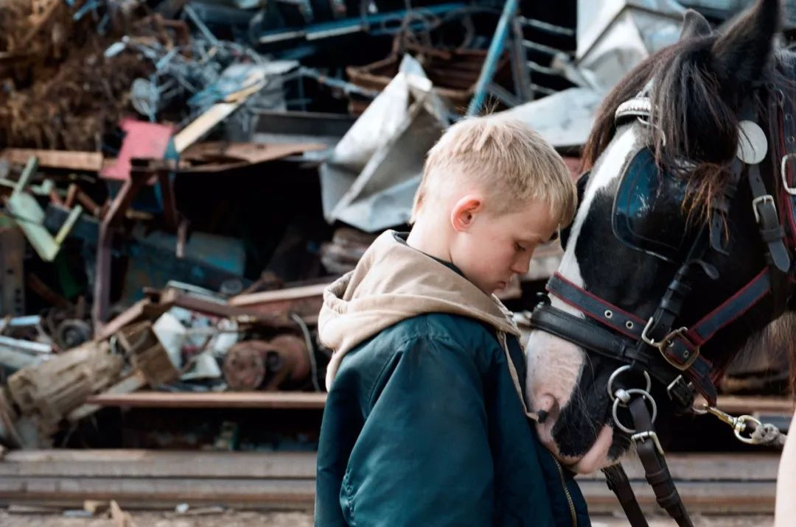
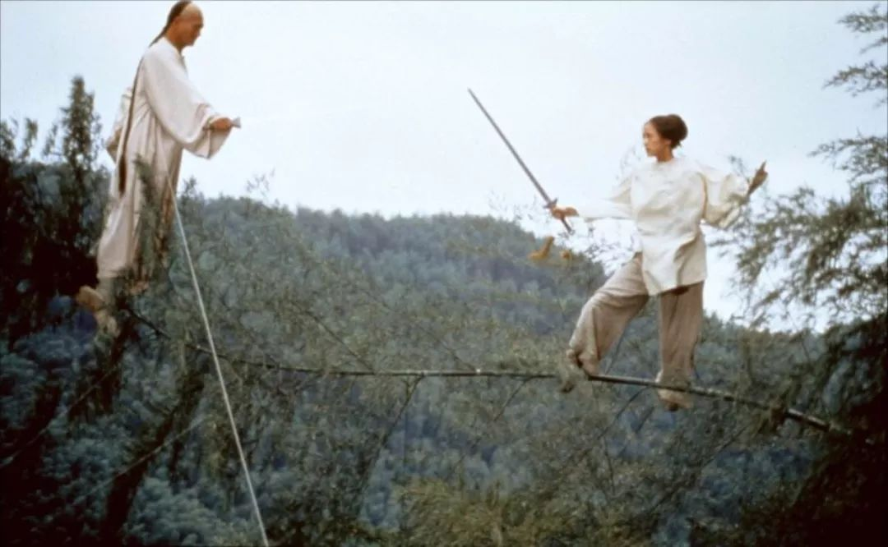
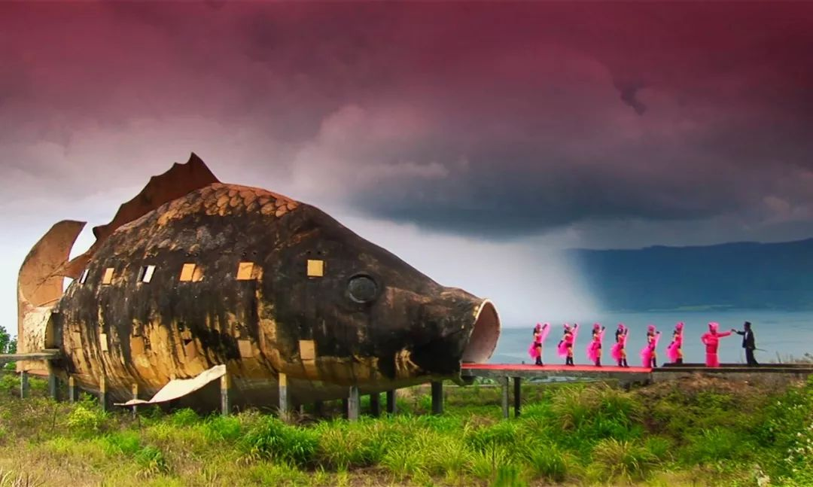
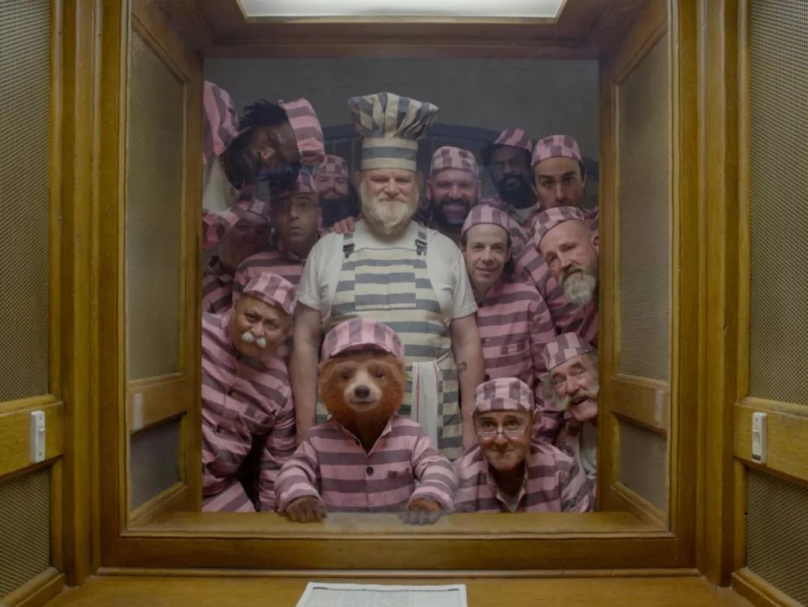
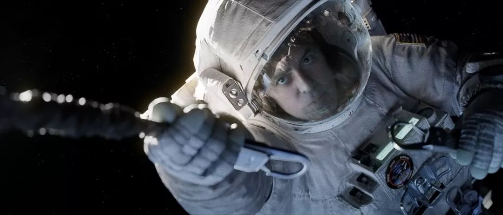
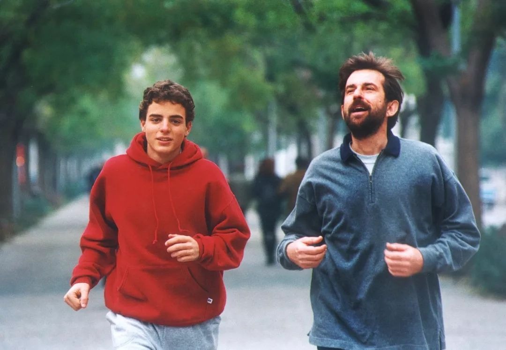

速读摘要

多亏了那个监控摄像头，网友们才get到这个意外的快乐源泉，也更直观地感受到了人类与动物间的密切联系。这是一部关于野生动物的纪录片，它最突出的特点，就是利用热成像摄影机、微光摄影机等新技术，深入黑暗的夜晚，一探动物们的夜间生活。而和熊妈同样心力交瘁的，还有一只生活在城市的仓鼠妈妈，几个小时前，她刚刚生下6个宝宝。那些动物为了生存，衍生出的全新生活方式，给地球带来不一样的景观。对于这种变化，《地球的夜晚》并没有一味去批判人类的侵占，而是从另一种动物的夜生活入手，去探讨人类与动物和谐共存的可能——新加坡的水獭。

原文约 2430  字  | 图片 38 张 | 建议阅读 5 分钟 | [评价反馈](https://static.app.yinxiang.com/embedded-web/clipper/#/Evaluating?d=2020-03-20&nu=fa5b496c-bdb1-437e-955e-c41f6c902e53&fr=myyxbj&ud=58b471&v=2&sig=B25E786EC673AE87B8424206AE46C904)

##  他们晚上偷偷干的坏事，都被曝光了

原创 有部电影 [有部电影]()**
前段时间，网上出现了一段有趣的视频：

一只地鼠潜入居民的菜园偷菜，并在主人布下的监控摄像头前，大肆搞起了“吃播”，它吃完萝卜吃西红柿，昨天走了今天还来，俨然把菜园当成了自家的粮库。

对于这只“莫得感情的偷菜机器”，菜园主人起初是哭笑不得。

但后来被偷得次数多了，他开始期待每天能在监控里看到这只地鼠的身影，甚至开了个账号来更新它的吃播视频，意外收获不少粉丝关注。

地鼠的频繁光顾，让菜园主人意识到，人类和动物其实一直在共享着大自然，与其强行划界隔离，不如寻找一种共生的模式。

到后来，他直接开辟了一个菜园，任由地鼠和其他野生动物随意进来“偷吃”……

可以说，多亏了那个监控摄像头，网友们才get到这个意外的快乐源泉，也更直观地感受到了人类与动物间的密切联系。

最近，网飞也推出了一部拍摄方式十分独特的自然纪录片，借助高科技手段，呈现了动物们不为人知的一面——**《地球的夜晚》。**

这是一部关于野生动物的纪录片，它最突出的特点，就是利用热成像摄影机、微光摄影机等新技术，深入黑暗的夜晚，一探动物们的夜间生活。

所以比起那些赫赫有名的BBC野生动物纪录片，《地球的夜晚》可以说是剑走偏锋，画面也因为技术而变得与众不同，有种诡异而瑰丽的美感。

在微光摄影机的镜头下，略微有光的满月之夜如同白昼一般，可以完整捕捉到夜行动物的日常；

而通过热成像摄影机，则可以深入更加黑暗的夜晚，记录草原上的一切风吹草动。

这些先进的拍摄手段不仅让人耳目一新，也改变了我们对地球上一些最具标志性的生物的认知。

比如大家熟悉的猎豹。这种大型猫科动物以速度见长，由于它们的夜视能力不算强，也没有狮子和鬣狗那么能打，所以人们通常认为，猎豹只在白天狩猎。

但是在微光摄影机的捕捉下，我们却最终发现——其实猎豹有三分之一的捕杀活动，都是在夜间完成的。

微微有光的满月之夜，会给它们的团队作战带来更多优势。

再比如海洋里的虎鲸，我们通常以为，它们依靠回声定位能力捕食。

但实际上，在有捕鱼船出没的海域，这种聪明的海洋动物形成了一套全新的捕食方式。

每当发现有“漏网之鱼”时，打头的虎鲸会吹出一股泡泡，如同在海洋中亮起灯塔，吸引伙伴们前来大快朵颐。

这个吹泡泡的行为，让人们相信，虎鲸随着环境变化，已经进化出了全新的交流方式。

有意思的是，在摄影机捕捉到的夜间故事里，雌性动物们的夜生活，似乎过得更加心力交瘁。

比如第二集中，微光摄影机跟踪拍了一个北极熊三口之家，熊妈带着两个熊孩子，在极夜中奔波觅食。

通常情况下，北极熊为了搜寻食物，可以在24小时内雪地前进80公里，速度十分惊人。

但由于带着两个贪玩的熊孩子，这个熊妈的觅食进度被严重拖后。

不仅如此，前行路上，熊妈还得给到处惹事的熊孩子们“擦屁股”。

有次，饥饿的熊儿子发现不远处有一头北极熊正在吃饭，于是自不量力地上前抢食，结果被对方痛扁一顿，最后还是熊妈匆匆出战，熊孩子才幸免于难，顺带抢来了对方的食物。

就这样走走停停，战斗力爆表的熊妈总算撑到了开春太阳升起。即便此时它已经饥肠辘辘，也依旧要用尽浑身解数，为全家人捕食。

只有在捕猎成功后，熊妈才能迎来难得的休息时间，幸福地原地滑倒躺平。

而和熊妈同样心力交瘁的，还有一只生活在城市的仓鼠妈妈，几个小时前，她刚刚生下6个宝宝。

但为了养活全家，仓鼠妈妈趁着夜色匆匆外出觅食。

由于夏天的黑夜很短，它必须抓紧时间猛吃东西，吃完一波便立刻回家卸货，然后继续外出进食，如此往返多次。

但偏偏在这个忙到底朝天的晚上，它碰上了一只精虫上脑的雄性仓鼠，仓鼠妈妈不得不一边觅食，一边与突如其来的性骚扰周旋……

值得一提的是，《地球的夜晚》不仅讲述了野生动物们不为人知的夜生活，也通过技术手段，为我们提供了一个全新的视角。

其中的第五集，就将镜头对准了生活在城市周边的动物们。

由于城市的不断扩张，野生动物的生存环境被严重挤压，甚至被大肆改造，它们的生活习惯也因为城市发生了诸多改变。

比如南非的某个小镇，主干道将大象的觅食路线切断，白天它们根本无法穿过车水马龙的街道。

为了吃到公路对面的牧草，象群不得不在路边等到天黑，只有那时，街道上才变得安静和安全。

而到了深夜时分，小镇街道上会出现这种带有魔幻色彩的画面：象群或如行人一般在街道上悄悄行走，或绕到居民的后院里默默觅食。

而在大快朵颐之后，它们还得掐准时间，赶在城市早高峰前原路返回……

实际上，因为人类侵占领地而被迫改变生存方式的，不只有南非的大象。那些动物为了生存，衍生出的全新生活方式，给地球带来不一样的景观。

比如在美国波特兰，雨燕每年都会把一处废弃的烟囱，当作迁徙途中的休息站。1.3万只雨燕瞬间飞进烟囱消失不见，形成城市中罕见的魔幻时刻：

比如在人口密集的印度孟买，花豹会趁着夜色悄悄进城，物色居民的家养动物，在后街上演血腥的猫鼠游戏。

再比如科罗拉多州的某个市中心，即将进入冬眠期的黑熊为了贴膘，不得不昼夜颠倒，天天摸黑深入城市，偷偷带走超过2万卡路里的食物……

看到这里，你就会发现，这些动物和开头提到的地鼠一样，生存方式正在被人类所深深影响，甚至发生改变。

不过，对于这种变化，《地球的夜晚》并没有一味去批判人类的侵占，而是从另一种动物的夜生活入手，去探讨人类与动物和谐共存的可能——新加坡的水獭。

在半个世纪以前，新加坡的城市环境并不适合野生动物生存，但经过数百万美元的环境改造，这里已经成为全球对野生动物最友好的地方。

片中的夜视摄影机对准了当地一个三代同堂的水獭家族，这种规模的群体在野外几乎看不到，因为水獭通常会在母亲再次生产时离家出走，独立生活。

而优质的水域环境，让这些水獭在此定居下来，并逐渐改变了早出晚归的习性，变得昼伏夜出。

夜晚，它们深入河道捕捉丰厚的食物，填饱肚子后，还会成f群前往沙地梳洗一番，随后走上街道，开始巡视领地，留下气味标记。

在它们的活动范围内，路边都会有醒目的“水獭出没”标识，以提醒往来的路人。

这样的环境，让水獭与人类之间形成了和谐共存的模式，即便天色渐亮，水獭遇到了晨练的人群，它们也依旧享有“过路权”，既不会遭受人类的驱赶，也不会惧怕往来的人类。

新加坡的水獭日常，实际上给我们提供了一个新思路。

我们的城市，其实可以为一部分野生动物提供家园，这种和平相处、互不侵扰的相处模式，或许才是未来城市的景象。

说到这里，再回想开头那个偷菜的地鼠，就会发现，网友们之所以愿意看它的“吃播”，甚至要给菜园主人打钱，或许正是因为——**每个人的内心深处，都愿意看到我们与动物共享地球资源的那个和谐未来，也只有对每个生命都怀有尊重和敬畏之情，人类社会才能够生生不息地繁衍下去。**

