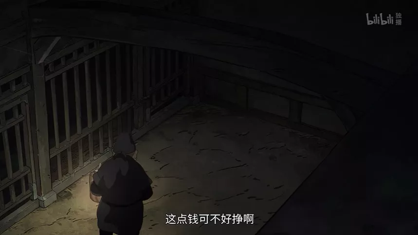
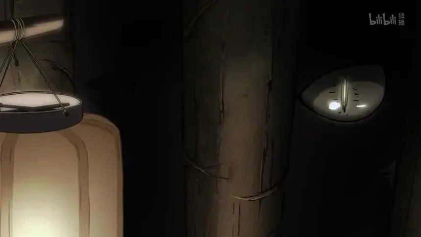
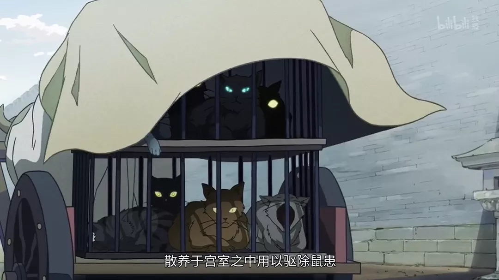
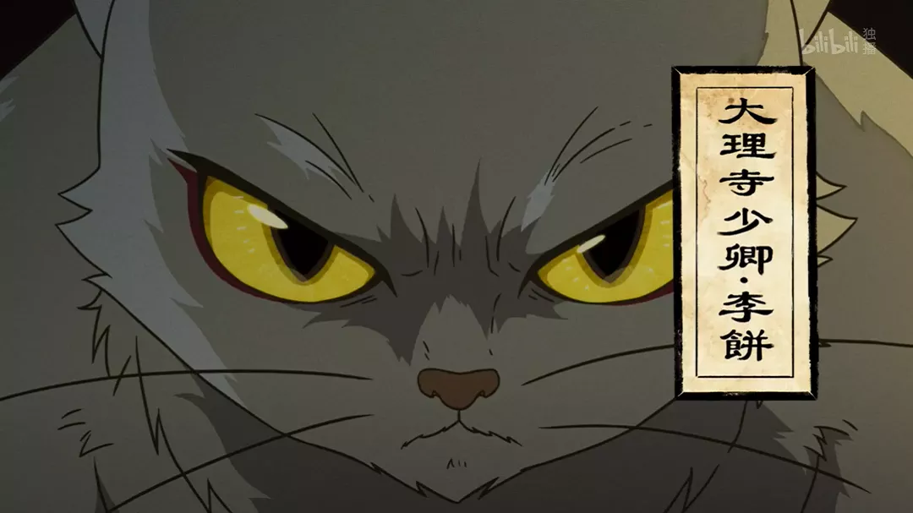
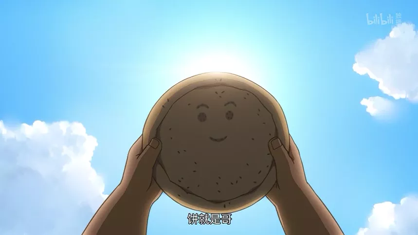

# 豆瓣9.2，年度最佳国漫预定？《大理寺日志》

原创 有部电影 有部电影 *今天*

前段时间给大家聊《异度侵入》的时候，就有不少小伙伴求推荐精品国漫。  

  

刚好，最近有一部国产番剧悄悄在B站上线，才更新两集就拿到了豆瓣9.2的高分。

  

  

不少看过的观众激动表示，今年的最佳国漫非它莫属。

  

所以今天，咱们就一块来看看这部——**《大理寺日志》。**

  

  

大理寺是什么地方？经常看古装剧的小伙伴一定不陌生。

  

在唐代，它相当于“最高法庭”，掌刑狱案件审理。

  

咱们熟悉的神探狄仁杰，就曾担任大理寺丞，破获多起案件。

  

  

所以不难想象，这部《大理寺日志》也是一部悬疑推理番，故事背景是武则天上位初期。

  

故事改编自国内漫画家R·C的同名彩色条格漫画，由制作《大护法》的原班人马好传动画打造。

  

  

《大护法》作为良心国漫的代表之一，以独树一帜的画风和黑暗复杂的主题，在当年惊艳了不少观众。

  

而《大理寺日志》的原著漫画，本身也人气极高，悬疑混搭搞笑的风格获得了不少读者的喜爱，豆瓣评分一直在9分以上，质量过硬。

  

  

这次漫画改动画，R·C本人也是编剧之一，所以原著粉们大可放心，保证是原汁原味。

  

故事开头就悬念十足——

  

一名狱卒提着灯笼，来到幽暗阴森的牢狱中，一边走，一边叹气：“这活不好干呐……”

  

  

因为紧张，他全身抖得像筛糠一般，冷汗也流了不少，但还是走到最靠里的那间牢房，将手中的食盒递给里头的囚犯。

  

  

在战战兢兢地说出“吃饭了”三个字后，狱卒的勇气似乎用尽了，干脆把食盒放在牢房门口，打算立即开溜。

  

究竟牢房里关着什么，让狱卒如此恐惧？

  

灯笼一抬，一只明显不似人类所有的眼睛露了出来，直接把狱卒吓得跌倒在地——

  

  

难道说，这里关押了一只怪物？

  

这个疑问并没有立刻得到解答，镜头一转，圆脸的主角陈拾操着一口河南话上场了。

  

  

他从老家来到洛阳寻兄，身上的钱却早已花光，只好用仅剩的钱买了一张胡饼，打算随便填饱肚子。

  

  

谁曾想，饼还没吃到肚里，就被一个流浪汉抢了去。

  

  

陈拾急得要哭了出来，好在流浪汉告诉他，大理寺正在招聘杂役，他若是应聘上了，饭钱不就有着落了吗？

  

陈拾喜出望外，赶忙问明了大理寺所在，之后也顺利地被征用了。

  

  

大理寺司直阿里巴巴告诉他，他的工作就是负责打扫牢房的卫生。

  

但陈拾怎么也想不到，牢房里竟然关了一只会说话的白猫。

  

  

难道说，这是一只猫妖？

  

当时的市井刚好流传着一个猫妖的传说，据说皇宫中一直散养着几只狸猫，用以驱除鼠患。

  

  

但寻常人家却不能养狸猫，会镇不住狸猫的妖气。

  

这是因为，狸猫每活过九年，就会多长出一条尾巴，等它长到九九八十一岁的时候就会成精。

  

  

在这之后，成了精的猫妖会在晚上潜伏在偏僻之处，专等落单的行人经过，伺机下手。

  

  

它们吃人不吐骨头，而后还能幻化成所吃之人的样子，就连言行举止都一模一样。

  

  

如果猫妖吃的人多了，还可以随意变化成任何样子，为祸人间。

  

而被它们吃掉的人，则毫发皆无，从此不见踪影。

  

  

虽然故事被传得神乎其神，但陈拾经过一天天的相处，发现这猫虽然有点挑食，但也不吃人，应该不是妖怪。

  

于是他也就不再惧怕，悉心照料了起来。

  

  

其实，白猫名叫李饼，原本是人，还是天水郡王，因为父兄谋逆被牵连入狱。

  

变成猫爷之后，因为奇特的外表和古怪的脾气，大理寺所有官员都很怕他，所以没有背景又不识几个字的陈拾，才能这么顺利地被征用为杂役。

  

  

不久之后，武则天（剧中叫做武明空）登基大赦天下，李饼也随即被委任为大理寺少卿。

  

而陈拾则因为淳朴耿直的性子被它看中，做了它的随身书吏，将要和它联手探案。

  

  

虽然目前只更新了两集，但不得不说信息量巨大，还留下了不少悬念——

  

陈拾本是奉母亲的遗命来洛阳寻找哥哥的，但他并不知道哥哥的姓名和样貌。

  

在捧着胡饼时，他曾说“饼就是哥，哥就是饼”。

  

  

而他在梦中见到母亲、询问哥哥的长相时，镜头也无缝衔接到了李饼身上。

  

  

难道说，陈拾与李饼有着血缘关系？

  

李饼又为何会变成白猫的形态？他与传说中的猫妖有无关联？

  

这些疑问，都只能等待后续剧情揭晓了。

  

  

说起来，猫咪拟人化的设定，在动漫中早已屡见不鲜。

  

比如《罗小黑战记》里的罗小黑，就时而是一只萌到吐血的猫，时而是一个萌到吐血的“人”。

  

  

但猫少卿李饼的独特之处在于，他必须要定时服用药物，不然就会进入暴走状态，连心智都完全变成猫。

  

这无疑给这部悬疑向动画，增添了一丝中二搞笑的气息。

  

  

而且仔细想想，不给吃的或是一言不合就闹腾，这不就是卑微铲屎官和傲娇猫主子的日常吗？

  

其实《大理寺日志》就是部云吸云撸的猫片啊……

  

  

不过真要说起来，这部动画的灵感其实来源于徐克的电影《狄仁杰之通天帝国》。

  

它的前身漫画《大理寺外传》，正是《狄仁杰之通天帝国》的同人漫，那部漫画的主角还是邓超饰演的大理寺少卿裴东来。

  

  

不过，《大理寺外传》的内容本身和电影关系不大，到了《大理寺日志》，白发少卿又变成了白猫少卿，已经几乎看不出电影的痕迹了。

  

  

目前来说，看完前两集，我觉得《大理寺日志》只有一个缺点——短。

  

动画每集时长17分钟左右，掐头去尾之后几乎只有10分钟的剧情，非常不过瘾。

  

  

但这也保证了每集节奏紧凑，丝毫不讲废话，让人恨不得一口气看个100集。

  

另外值得一提的是，《大理寺日志》虽为动漫，但主创人员在制作上仍然非常用心，简直就是一部动漫版的“《洛阳十二时辰》”。

  

  

据说，主创人员为了能逼真还原唐朝风貌，不仅多次实地采风，学习了解盛唐历史、风俗、建筑等等，还请来资深历史博主森林鹿（《唐朝穿越指南》作者）作为番剧的唐史顾问、天津大学建筑历史与理论研究所为其提供学术支持，保证最大程度贴合史实。

  

出来的效果也显而易见，即便不是专业人士，我们也能从这细致的场景、精美的画工中，看到神都洛阳穿越古今的气韵。

  

  

所以，它能拿下豆瓣9.2的评分一点也不难理解——

  

精良的制作、利落的节奏、精细的画风、舒服的色调、恰到好处的配乐，辅以时不时冒出来的搞笑段子，再加上一只可萌可酷的大白喵……很多人都是抱着试试看的心态点开，结果分分钟上头，回到豆瓣就是四星起步、五星预定的节奏。

  

  

虽然客观地说，对于一部悬疑向的动漫，我们其实没法仅凭开头一两集，就定义整部作品质量的好坏。但起码我们能看到创作者一丝不苟、尊重观众更尊重作品的态度。

  

仅这一点，就值得我们对国漫保持期待，为精品用力打call！

  

