#  十余名年轻女性连续被害，这片堪称“美国版杀人回忆”《失踪女孩》

原创 **有部电影**

2010年12月，美国长岛警方在当地海洋公园大道，发现了4具女性尸体，皆为被勒颈至死，尸体被分别放入麻袋，抛尸在灌木丛中。但由于小女儿患有精神疾病，需要定期服药，玛丽的操劳也只能勉强维持生计，有时不得不向从事性工作的大女儿夏南借钱。但玛丽却在后来发现，那晚有当地居民也报了警，并指出了夏南离开的方向，警方却莫名地没有采纳这条线索。10具骸骨被发现后，警方也没有更加关注失踪的夏南，反而显露出满不在乎的态度——谁会花这么多时间去找一个失踪的妓女?

今天给大家聊的这部电影，跟美国的一起连环杀人案有关。

2010年12月，美国长岛警方在当地海洋公园大道，发现了4具女性尸体，皆为被勒颈至死，尸体被分别放入麻袋，抛尸在灌木丛中。

经过确认，这4名死者都是20多岁、身材娇小的年轻女孩，生前都是性工作者，通过一个广告网站招揽生意，其中最早的在2007年就已经失踪。

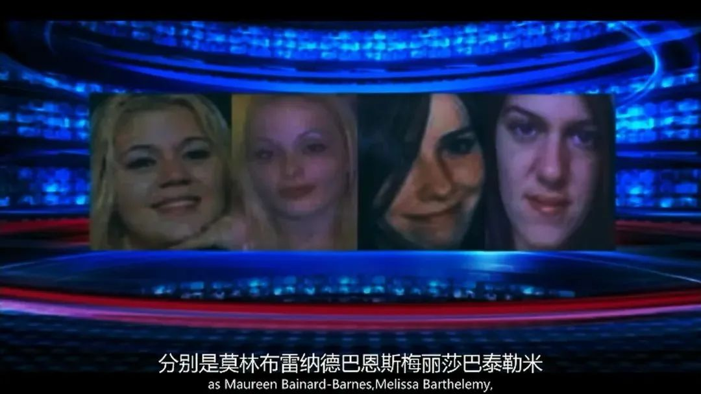

根据这些信息，当地警方认为四起命案是同一凶手所为。

到了2011年4月，警方又陆续发现了6具尸体，这次有的还遭到了肢解。其中一名死者的DNA，与1996年发现的不明身份的断肢吻合。

也就是说，在过去15年里，长岛发生了杀人抛尸的连环案件。凶手手法极其老练，故意将尸体抛弃在鲜有人踏足的灌木丛中，拖延尸体被发现的时间。

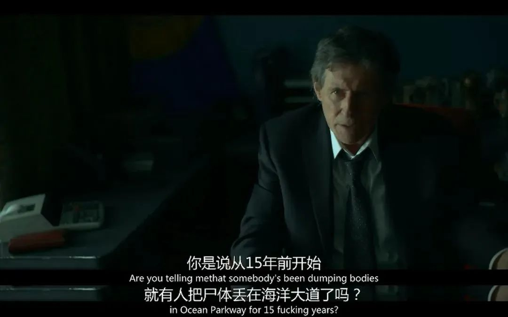

而这一连环杀人案之所以能被警方发现，还要从2010年的一起失踪案说起，这便是今天聊的电影——**《失踪女孩》。**

影片的女主玛丽是个单亲妈妈，为了养活两个年幼的女儿，她一人打两份工。

但由于小女儿患有精神疾病，需要定期服药，玛丽的操劳也只能勉强维持生计，有时不得不向从事性工作的大女儿夏南借钱。

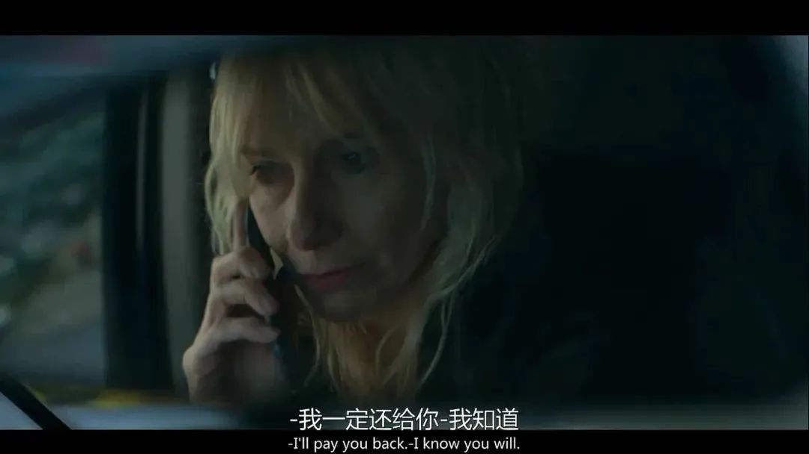

这天，夏南原本说好回家吃饭，可全家人等了一晚上，她都没现身，手机也直接转到了语音信箱。

两天后，玛丽觉得情况不对劲，果断报了警。但警方只登记了信息，并没有出动找人的打算，玛丽便只好亲自去寻找女儿。

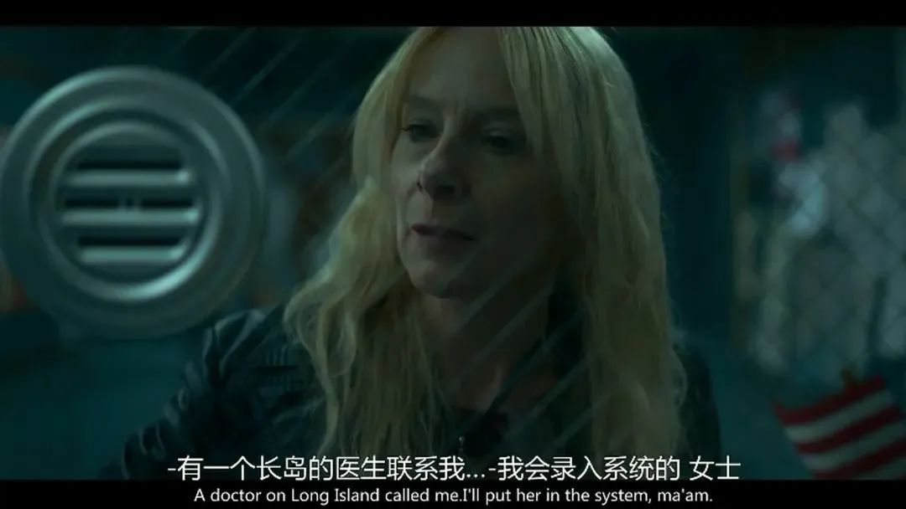

她很快就发现，一切线索都与长岛有关——

在她刚报案时，就有一个自称住在长岛的医生给她打过电话，说失踪当晚看见过夏南；

而夏南的司机也证实，那晚她去了长岛接客，可不知怎的，从客人家出来就情绪失常，到处敲别人的门，也不肯上司机的车。

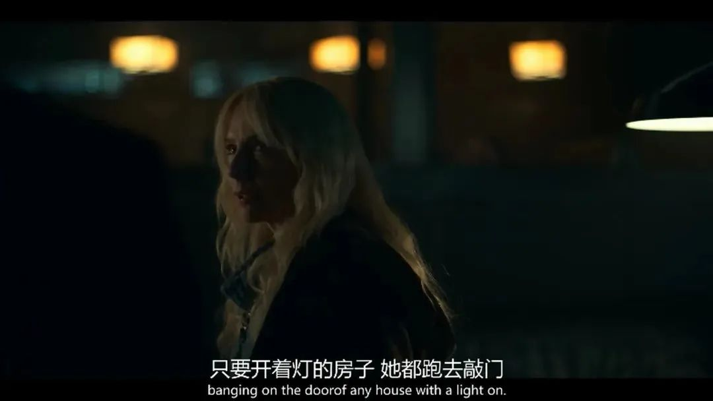

此外，夏南手机的通话记录显示，那晚她曾经打了一个长达23分钟的报警电话。

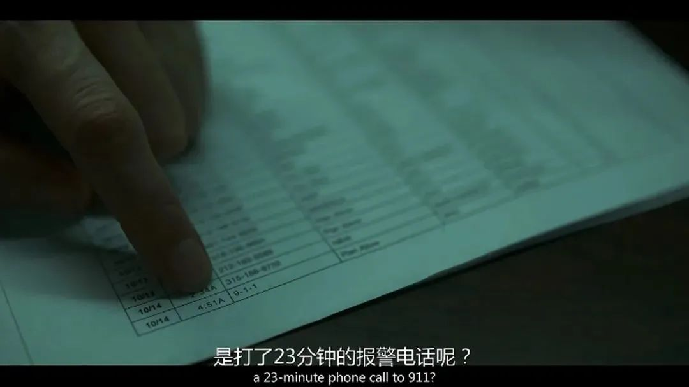

随后，一家人赶到长岛的警局报案。

警方调出通话录音，发现夏南正如司机所说的那样，情绪特别不稳定，多次大声呼救。

然而这通报警电话拨出后过了一小时，警方才赶到现场，称并没有发现可疑现象。

心急如焚的玛丽见此状况，要求警方立刻去寻人，没想到却被警方怼了回来——“那晚有居民报警说你女儿嗑药了。你和你女儿的关系怎么样？她大晚上去一个封闭社区里做什么？”

言下之意，警方认为夏南是嗑药后发疯，过几天说不定她就会自己现身……

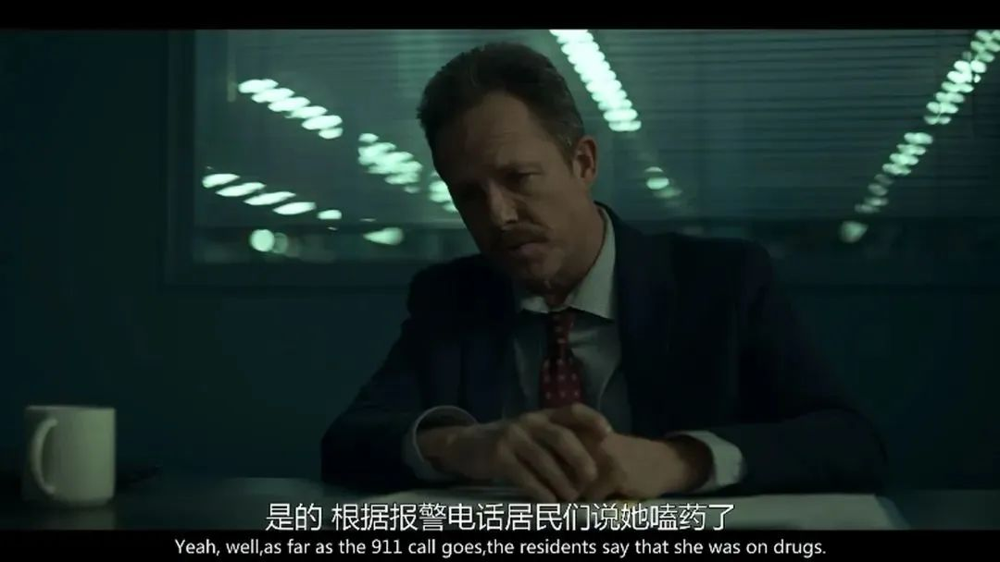

直到后来，一只警犬在巡逻时发现海洋公园大道附近有异常气味，警方随后封锁区域进行搜寻，一下子找到了四具骸骨。

这也就是文章开头提到的那4名死者。这时距离夏南失踪，已经过去了好几个月。

在确定4人生前都是性工作者后，警方瞬间意识到这可能是连环杀人案，于是对夏南的失踪展开调查。

他们锁定的第一人，便是在失踪当晚把夏南叫到长岛的嫖客。

玛丽本以为，从他那里，警方会找到重要线索。但没想到没多久嫖客就被释放，理由是他通过了测谎，证实与夏南失踪无关。

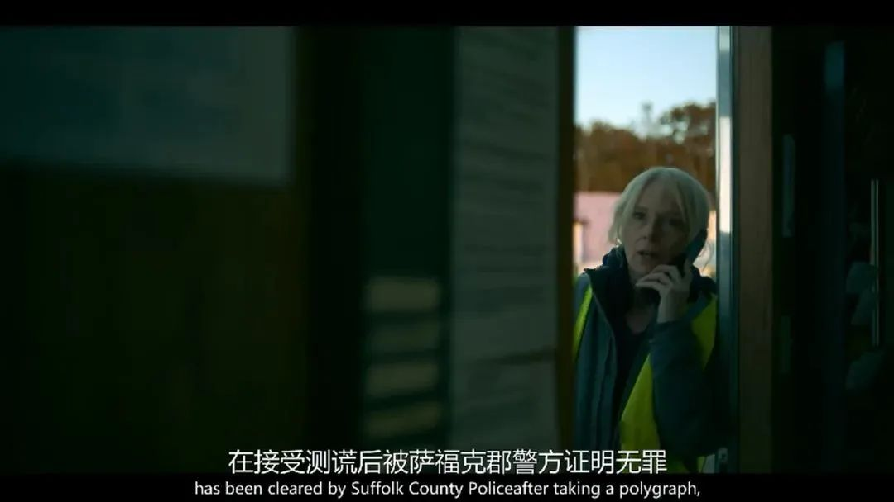

随后，玛丽又向警方提出另一个可疑之人——曾给她打电话、声称见过夏南的哈克特医生。

这人不仅家里屯着成卷的麻布袋，这种东西在当地并不常见；而且当警方上门询问时，他直接否认了自己给玛丽打过电话。

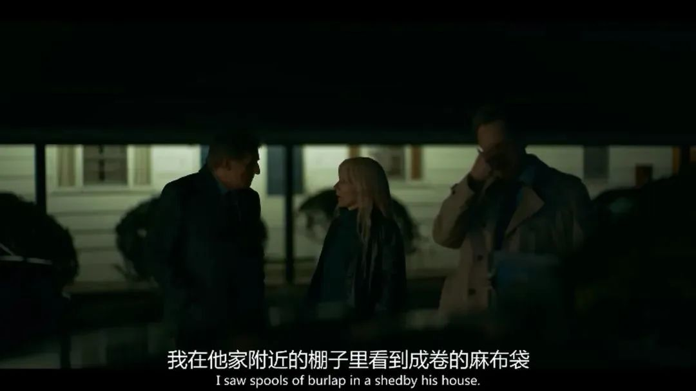
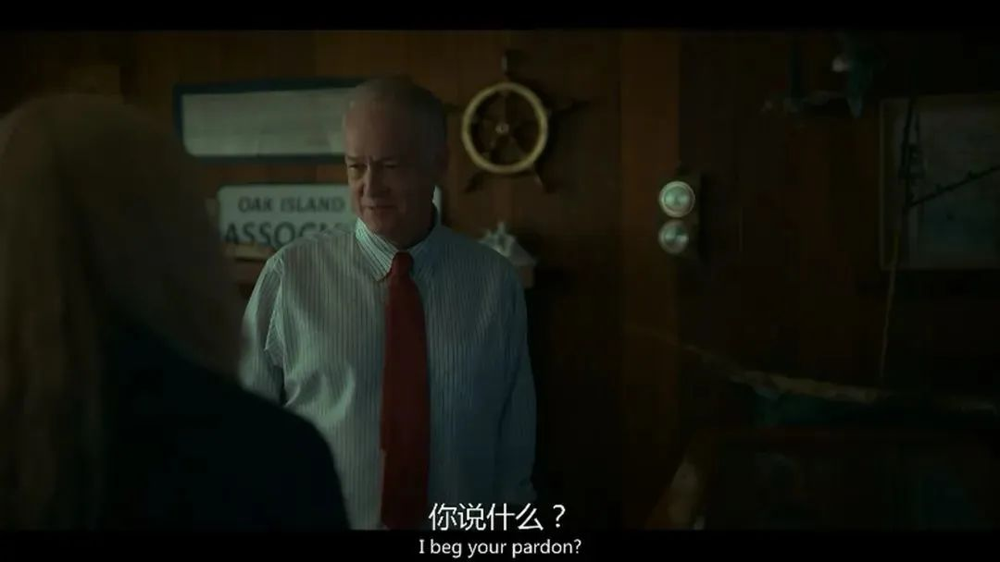

更可疑的是，哈克特在当地主管一个海滩协会，办公地点装有摄像头，对准的恰好是那晚夏南经过的地方，但他并没有主动给警方提供监控视频，而是任由视频在一周后自动删除。

对于这个行为，他给出的解释是：警方又没要，我干嘛给，我又不是负责查案的……

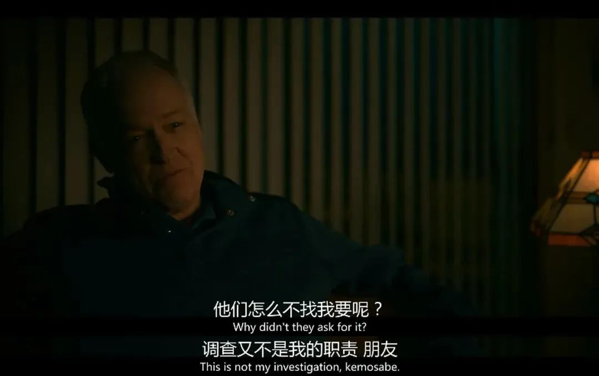

就在这些线索走入死胡同时，警方又先后发现了6具骸骨，鉴定后发现没有一个是夏南。

随后警方发布公告，认为夏南的失踪案是偶发案件，与发现的那10个死者并无关联。

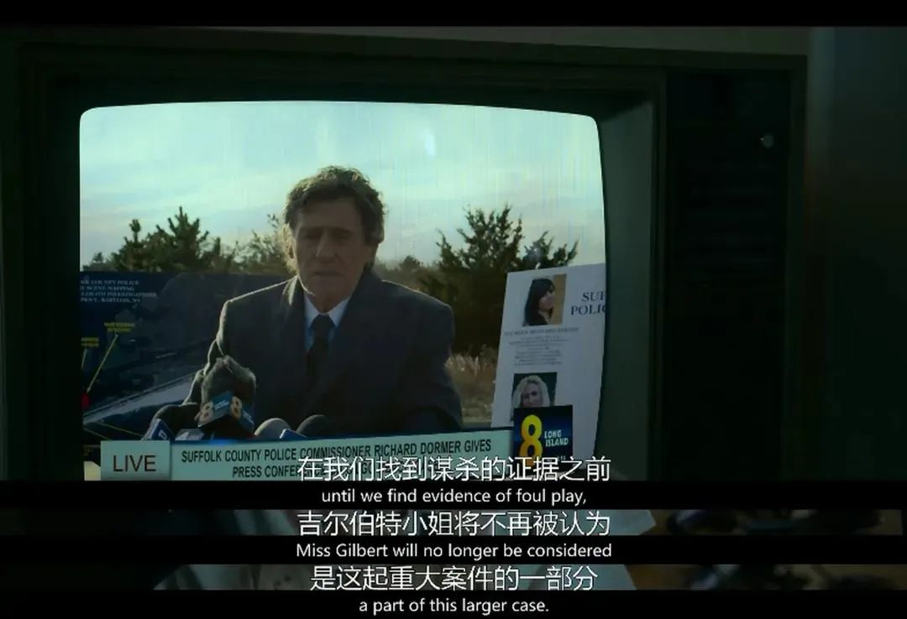

这个结果让玛丽无法接受，因为在她看来，女儿和那些受害人有太多相似之处了，很可能就是连环杀手的目标之一，要不是夏南失踪，其他女孩的尸体还被抛在荒郊野外。

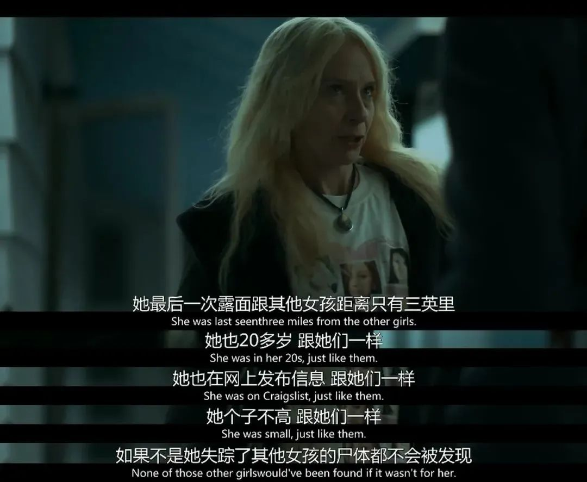

虽然警方的这个决定不代表就此放弃寻找，但玛丽认为调查越拖延，夏南生还的机会就越渺茫。

而在夏南失踪的几个月里，这件事已经给全家人带来了巨大的精神冲击，原本就患有精神疾病的小女儿，因为各种新闻越发显得焦躁不安；

二女儿虽然一直强撑着，但内心也慢慢因为玛丽隐瞒姐姐是性工作者这件事，对妈妈产生埋怨的情绪。

玛丽则开始因为女儿的失踪，而产生深深的自责感。

此外在她看来，警方在整个调查过程中的表现，也令人失望至极。

夏南出事那晚，警方接到报警求助一个小时后才赶到现场。他们声称向当地的众多社区居民进行了询问，没有发现异样。

但玛丽却在后来发现，那晚有当地居民也报了警，并指出了夏南离开的方向，警方却莫名地没有采纳这条线索。

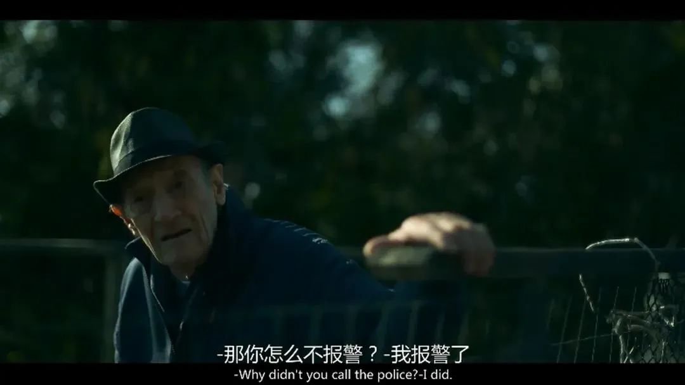

10具骸骨被发现后，警方也没有更加关注失踪的夏南，反而显露出满不在乎的态度——谁会花这么多时间去找一个失踪的妓女？

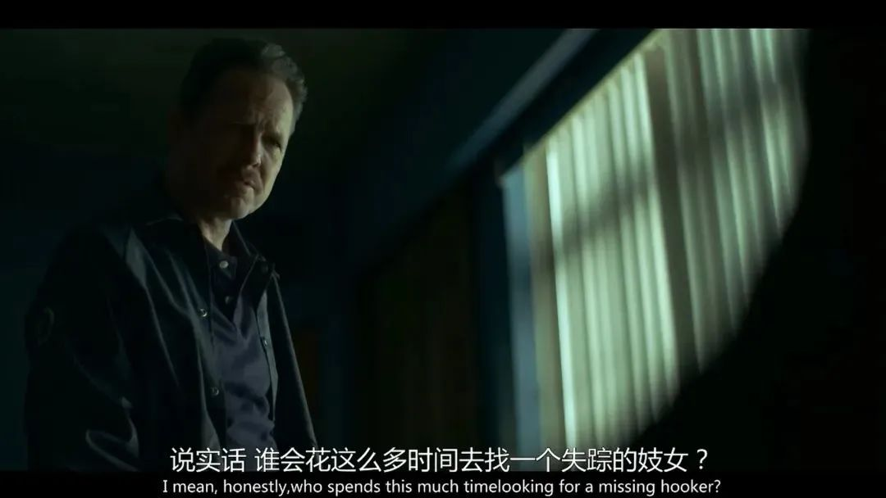

在玛丽看来，警察的推理能力和办事效率，还不如她这个单亲妈妈。

最后，在她的一再坚持下，警方才对仅剩的沼泽地进行了彻底搜查，终于在那里发现了夏南的骸骨。

此时距离她失踪，已经过去了一年。

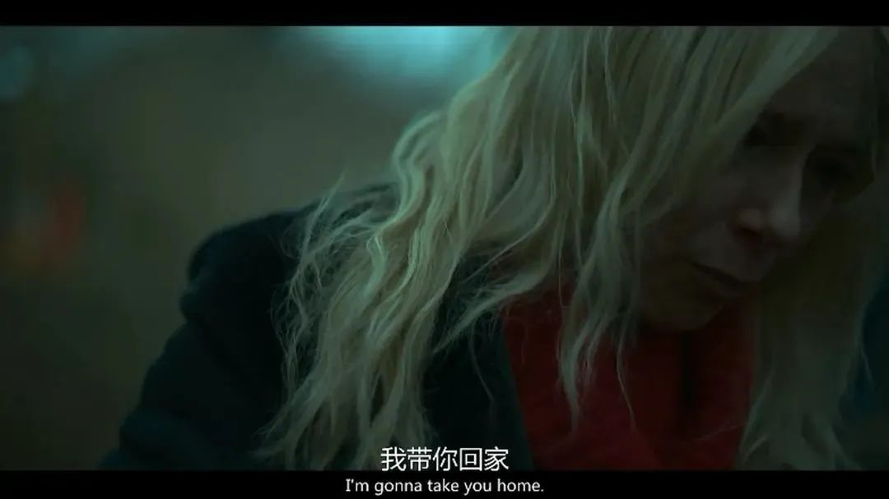

直到现在，长岛连环杀人案的凶手都没有落网，成为一桩跨度几十年的悬案。

有犯罪专家曾对这个凶手做过侧写，认为此人应该是长岛本地居民，白人男性，受过良好教育，熟知本地地理环境。鉴于他没有留下任何有价值的犯罪证据，不排除他有出色的反侦查能力。

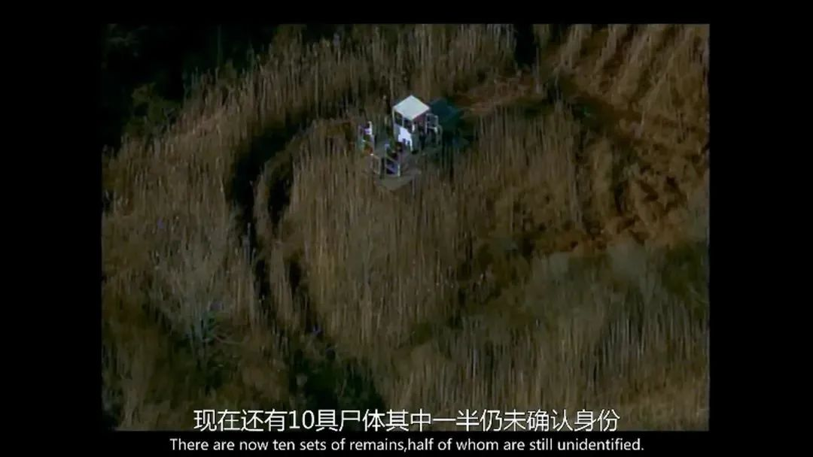

还有人猜测，这个案件如同华城连环杀人案一样，凶手早就身陷囹圄。

因为2017年警方曾抓住一个叫约翰·彼特罗夫的杀人犯，在上世纪90年代他曾将两名性工作者殴打致死。巧的是，这个约翰就是长岛常住居民。

甚至还有一部分人推测，警方与此案也有着不可告人的联系。2016年12月，夏南的家人就对前萨福克县警察局长提出了指控……

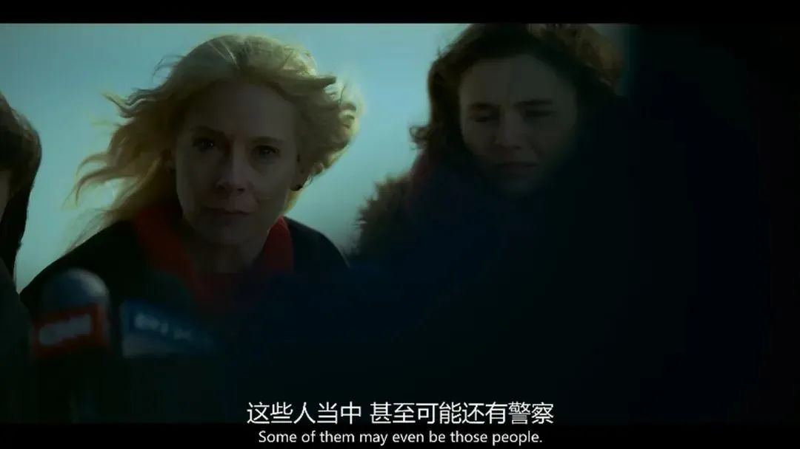

虽然影片如同这个案件一样，无法给观众一个最终真相，但导演也透过镜头给出了原著作者、调查记者罗伯特·考尔克的观点——若那些受害的女性从事着不同的职业，也许警察就会对这个案件予以更多的关注和尊重。

这个案件中除了凶手的冷酷和凶残，我们还应该注意到，在一部分新闻报道中，媒体总是针对受害者大做文章，导致报道带有“受害者有罪论”的倾向，

在案发地的居民眼中，他们对于那些失踪、死亡的底层女性，也表现出漠视的态度。

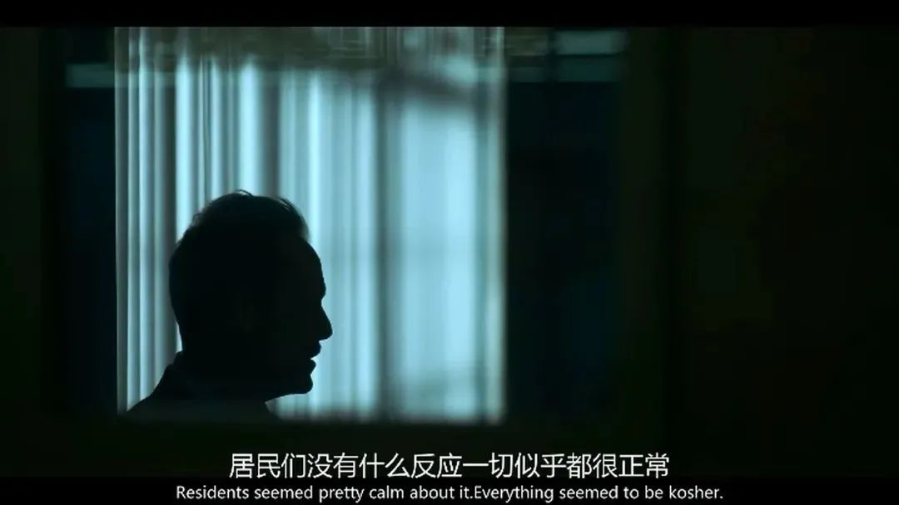

但正是这样的偏见与漠视，把那些受害者推向了深渊，让凶手更加肆无忌惮。

也许，把这个案件形容成“妓女连环杀人案”会更有噱头，但我们必须意识到——**每个受害者都不是符号，而是一条曾经鲜活的生命；在她们无声逝去的背后，是一个个正在经受苦难的家庭。**

