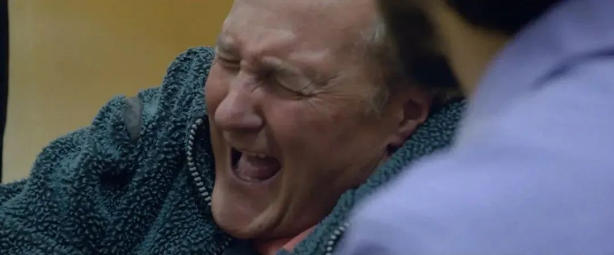

#  直面人性与欲望，这部硬核科幻片有尺度也有深度《安尼亚拉号》

原创 有部电影 

那是一部走内心戏的软科幻，通过男主的星际之旅，深入探索孤独无际的人类内心。安尼亚拉号从外部看，是一个矩形方舟，但内部则像一个超大型的商场，可容纳十几万人。等到两年过后，女主出狱，她发现飞船上的人们已经活得像行尸走肉，人人自危。而飞船上的人大多也像她一样，已经完全失去希望，在宗教狂热之后就变得精神麻木，只能慢慢走向灭亡。本片就是以一艘飞船的生命历程，预演了人类星际旅途的一种可能。

很长时间没写科幻片了，上一次正经八百地跟大家聊科幻片，还是去年皮特主演的《星际探索》。

那是一部走内心戏的软科幻，通过男主的星际之旅，深入探索孤独无际的人类内心。

最近偶然的机会，我看到一部产自瑞典和丹麦的小成本科幻片。

其探讨的内容与《星际探索》有异曲同工之妙，但是在主题深度和思想广度上都更加令人震撼，说是人类未来的史诗预言都不为过——**《安尼亚拉号》。**

海报有种《2001太空漫游》的即视感，而片中呈现的压抑和孤独，也确实让人想起了那部科幻巨制。

《安尼亚拉号》虽是来自北欧的冷门科幻，但它的来头一点也不小。

影片根据诺贝尔文学奖得主、瑞典诗人小说家哈里·马丁逊获奖的同名小说改编。

**原著小说用诗歌写成，也是迄今唯一一部获得诺奖的诗性科幻小说，被誉为“太空版的《浮士德》”。**

哈里·马丁逊

光是这部传奇的原作，就让人忍不住一探究竟。

而这部电影也拍得非常诗意，片中不仅有科幻、邪教、心理、惊悚等多种元素，还有一场大尺度戏码。

故事开场，人们搭载太空电梯来到安尼亚拉号飞船上，准备启程来一场火星之旅。

太空电梯

安尼亚拉号从外部看，是一个矩形方舟，但内部则像一个超大型的商场，可容纳十几万人。

里面有纯天然的空气、食物、饮用水等一整套自给自足的生态循环系统，每一层楼也有不同的职能，超市、泳池、客房等等。

一切都说明，这已经是一个对太空旅行习以为常的时代。

女主Mima，是这艘飞船上的一名心理治疗师。

在长时间的太空旅行中，人们容易产生一些不良情绪和心理疾病，如孤独抑郁、幽闭恐惧、深空恐惧等等。

女主的工作，就是利用一个与她同名的脑电波影像系统MIMA，来缓解人们的情绪、治疗心理疾病。

MIMA可以与人的记忆相连，让人进入催眠状态，梦到令自己舒适的场景。

比如女主喜欢大自然，所以她也常常用MIMA让自己去到青山绿水的河边漫步，放松心情。

不过来女主这里疗愈的人并不多，所以她成了飞船上最孤独的人。

而善解人意的MIMA，成为了她唯一的伙伴。

没过多久，意外出现了，飞船遭遇太空碎片的撞击，失去了燃料和动力。

这意味着，不仅火星之旅泡汤，而且也无法返回地球，人们将不得不随飞船一起在太空里流浪。

可想而知，这个噩耗引起了所有人的恐慌。

但船长又带来一个好消息，他说只要飞船经过一个天体附近，就能利用引力让飞船返回地球航道……理想估计，需要等待两年时间。

注意船长的及时改口

船长的话并没有多大安慰效果，但仍给了许多人回到地球的希望。

在接受事实后，人们能做的只有等待。

就这样，来找女主治疗的人渐渐变多了，女主也变得忙碌起来。

在飞船开始流浪的第一年里，人们还是像往常一样生活，偶尔到MIMA厅做做心理治疗。

随着接触的人越来越多，女主也渐渐开朗起来。

一天，她高高兴兴地回到房间，却从室友那儿得知，他们永远也回不去了。

室友是一位严谨的天文学家，女主知道她说这句话的分量，这才明白，原来船长欺骗了所有人。

突如其来的打击，把女主吓到快要窒息，她抱起酒瓶喝得烂醉如泥，跑到MIMA厅去“做梦”呼吸“新鲜空气”。

一转眼，到了飞船流浪的第三年。

女主发现，有些人还在跳舞狂欢，仿佛醉生梦死、浑然不觉。

而有些人则出现了反常情况，他们在被MIMA治疗的过程中抽搐不止。

女主用仪器提取他们的梦境，发现他们梦到的全是战火、死亡等恐怖景象，许多人因此精神崩溃。

女主本想暂停MIMA系统，进行修复调整。

可没想到，人们长期积压的负面情绪，已经让MIMA系统不堪重负，崩溃自爆了。

在此之后，人们的心理疾病更加一发不可收拾。为了推脱责任，船长又给女主冠上毁坏MIMA的罪名，把她关进监狱。

等到两年过后，女主出狱，她发现飞船上的人们已经活得像行尸走肉，人人自危。

唯独有一个名叫伊莎盖尔的女船员，对女主抱以善意。

她们很快就走到一起成为恋人，度过了一段属于两个人的美好时光。

但是大环境的崩坏，最终摧毁了一切。

此时，以船长为代表的统治者，实行高压统治；下面的乘客又组成各式各样的邪教小团体。

他们有的不吃不喝，禁食祷告；

有的跪地爬行，认罪忏悔；

还有的直接代行上帝职权，给人定罪，开始谋害他人。

而没有加入这些邪教的人，就会被当作异教徒。

无奈之下，女主和伊莎盖尔被迫参加到邪教仪式中，和所有人一起，脸上涂抹上油彩，跳舞狂欢，进行不可描述的大型群交……

在这之后，伊莎盖尔生下了一名男婴，但等待这位新生儿的却是末日——伊莎盖尔最终因精神崩溃杀死了孩子，并随后自杀。

而飞船上的人大多也像她一样，已经完全失去希望，在宗教狂热之后就变得精神麻木，只能慢慢走向灭亡。

随后，时间跨度慢慢拉长，在第24年，飞船上能源枯竭，食物稀缺，已经只剩下十几个人。

在失去人造光源后，他们的眼睛已经退化，变成了盲人。

再之后，时间直接跳过了500万年。

毫无生机的安尼亚拉号，此时仍孤零零地飘荡在距离地球587光年的天琴座。

画面中的飞船已经很难看清，在巨大恒星照耀下，犹如沧海一粟。

整部影片所呈现的质感，正是这种孤独、渺小、深邃和无助。

这是创作者对人类宿命的一种悲观预言。

当地球资源枯竭后，坐以待毙和飞向宇宙，是留给人类的唯二选择，前者生存机会渺茫，后者则将面临浩瀚宇宙的未知风险。

本片就是以一艘飞船的生命历程，预演了人类星际旅途的一种可能。

其实，刘慈欣在《三体》和《流浪地球》里，也都描绘过像安尼亚拉号这样的星舰文明。

在脱离地球母星、进入茫茫太空后，人类在身体、心理、精神、情绪、认知等各方面经历的剧变，都极易导致人的崩溃。

在《流浪地球》中，刘慈欣曾这样写道，**“希望，是这个年代像钻石一样珍贵的东西”，本片可以说是对这句话的完美写照。**

**在极端环境中，人的精神会迸发出强大的能量，一旦失去这种精神支撑，没有了生存的希望和求生意志，人的身体机能和精神状态都会慢慢退化，文明也很快便会随之倒退。**

**因此在某种程度上，本片也可以说是一曲人类文明演进的末世悲歌。**

压抑与绝望贯穿始终，巨大的飞船既是人类征服自然的象征，也是宇宙蔑视人类的明证——

在宇宙维度的无垠深空里，飞船就像一具滑向黑暗的棺材，渺小、孤寂、冰冷……

空间的广度与时间的长度，是人类永远无法征服的存在。它们既能孕育生命，滋养文明，也能扼杀生命，抛弃文明。

影片的最后，飞船从天琴座的“超级地球”开普勒-62e旁边幽幽略过，一个死寂的人造飞船，与一个不知是否有生命存在的类地行星擦肩而过。

这样的情景，不得不说令人无比震撼。

**但回过头来，也让人再次感到警醒——**

**人类赖以生存的唯一家园，就是我们居住的地球。但愿我们还能亡羊补牢，保护好它，不用走到被这位滋养了万物的母亲所抛弃的那天。**

