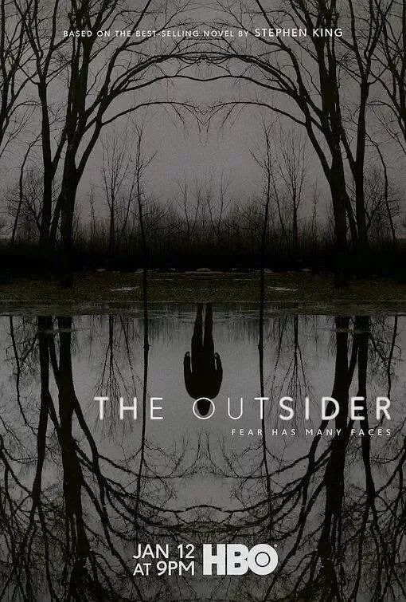
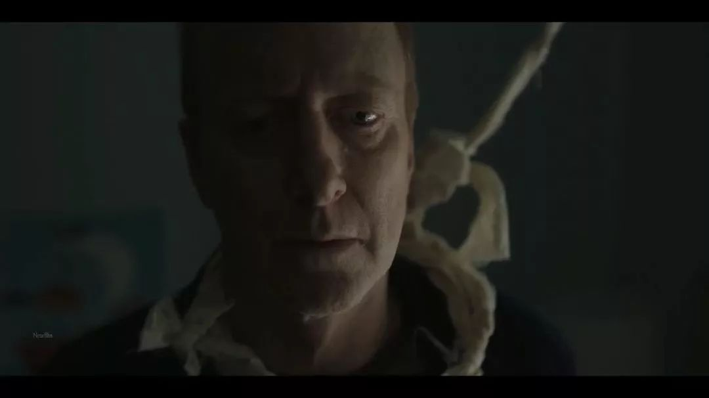

速读摘要

它改编自斯蒂芬·金2018年出版的同名小说，并且是惊悚剧《梅赛德斯先生》的衍生篇。在很多人看来，斯蒂芬·金的作品，就没有故事不好看的。不过通过小说剧情，我们可以稍稍开个"上帝视角"——案件中之所以会出现一些看似"无解"的疑团，是因为这个故事其实涉及到了超自然元素。虽然目前《局外人》只出了两集，但超自然的力量，已经多次出现在了镜头中。这个阴影始终折磨着他，让他无法不将情绪代入到工作中，影响着他的判断和决定。

原文约 2317  字  | 图片 38 张 | 建议阅读 5 分钟 | [评价反馈](https://static.app.yinxiang.com/embedded-web/clipper/#/Evaluating?d=2020-03-20&nu=4d15b99f-2bc9-4fc2-a346-0f95ab688e72&fr=myyxbj&ud=58b471&v=2&sig=E4462B2836DD2B2793D4D5774B43CEA7)

##  豆瓣8.8，11岁男童被强暴、分尸，背后的邪恶触目惊心

原创 局外人 
现在提到HBO，黄暴污几乎成了它的专属标签。

由它出品的大尺度剧集，咱们聊过不少。

不过，今天要分享的这部HBO新剧，走的却完全不是这个路子。它集惊悚悬疑于一身，气质就如同海报一样冷峻锋利——**《局外人》。**

单看片名，很容易让人误以为这是部乏善可陈的大路货。

毕竟与之同名的影视作品，实在太多了……

不过，这部《局外人》其实大有来头——

它改编自斯蒂芬·金2018年出版的同名小说，并且是惊悚剧《梅赛德斯先生》的衍生篇。

《梅赛德斯先生》同样改编自斯蒂芬·金小说

说到斯蒂芬·金小说改编的影视作品，那简直不要太多。

其中，既有像《肖申克的救赎》《绿里奇迹》《闪灵》那样难以超越的影史经典，也有《迷雾》《小丑回魂》《幻影凶间》等爆款恐怖片。

总之，很多都是脍炙人口的大作。

在很多人看来，斯蒂芬·金的作品，就没有故事不好看的。即便改编的电影扑街了，也大概率是拍摄执行中的问题。

所以，这部《局外人》一开播就吸引了不少关注。而从目前豆瓣8.8、IMDb9.1的评分来看，剧集没有辜负观众的期望。

故事发生在一个虚构的小镇，开场情节就十分高能——

身为警探的男主安德森，忽然接到报案，一个11岁的小男孩在树林里被强暴、分尸。

他遂即展开调查，派人去调阅附近商店、人家和街道上的监视器，并逐户寻找可能的目击证人。

根据周围人的证词，男主很快把嫌疑人锁定在了男孩的棒球教练泰瑞身上。

而无论是证人的描述、调出来的监控录像，还是现场指纹的鉴定结果，都有力地证明了泰瑞就是凶手。

所以，男主二话不说，直接在众目睽睽之下逮捕了泰瑞。

然而被捕之后，泰瑞拒不承认自己杀害了小男孩，声称他当天在七十里以外的凯普市，参加一个教师会议。

随后，男主顺着泰瑞的口供一一核实，发现教师会议的视频、当地的监控录像，以及证人的口供等各种证据，都证明了泰瑞所言不假。

但这么一来，两边的证据就产生了矛盾。

看到这儿，估计很多人会想到印度电影《误杀瞒天记》中的桥段。

在那部影片里，男主为了伪造不在场证明，利用人脑记忆的模糊性和重构性，制造出了案发时自己和家人在外地的假象，并诱导他人成为人证。

但相比之下，本剧中的泰瑞想做出充足的伪证，显然更加困难。而且关键是，案发现场和几十里外的凯普市，都有他在场的铁证。

可一个人怎么可能同时出现在两个地方呢？这让男主百思不得其解。

不仅如此，男主这边能证明泰瑞是凶手的证据，虽然不可辩驳，但却十分诡异。

比如，监控录像中的泰瑞，并没有表现出杀了人后的害怕，反而好像非常渴望被发现，还匪夷所思地对着镜头竖起了中指。

这让男主想到，或许是有人伪装泰德犯下凶杀，并将罪名嫁祸给他。

但悲剧的是，还没等案件有什么进展，受害人的哥哥就突然出现，一枪杀死了泰瑞，他自己也被男主在情急之下击毙；

受害人的妈妈，早前就因为悲伤病发而亡，而他的爸爸也在哥哥死后，选择了上吊自杀……

也就是说，案件还一筹莫展，忽然之间又死了4个相关人。这让男主陷入了巨大的痛苦中，但同时也使他坚定了要找出真相的决心。

为此，他只能不厌其烦地去找泰瑞的妻子，希望从她口中得知更多的信息。

目前，这部剧刚播完两集，男主还处于一脸懵逼的状态。

不过通过小说剧情，我们可以稍稍开个“上帝视角”——案件中之所以会出现一些看似“无解”的疑团，是因为这个故事其实涉及到了超自然元素。

在后续剧情中，《梅赛德斯先生》中的角色霍利，将前来协助男主调查，而剧集也将呈现出更多阴森恐怖的情节。

所有的线索都指向一个墨西哥传说，告诉我们真正的凶手并不是人，而是某种超自然的远古生物，所谓的“局外人”，指的就是ta。

平心而论，如果换做别人，把一个推理探案的题材写成“神棍片”，很容易给人一泻千里的感觉，但斯蒂芬·金却不会如此。

因为一直以来，神秘主义都是斯蒂芬·金最为擅长和热衷的题材。而借助这些看似神棍的奇幻、恐怖元素，他所聚焦的，始终都是心灵的创伤与幽暗的人性。

比如在《迷雾》中，小镇被突如其来的浓雾淹没，人们为了躲避未知的怪物聚在超市里。

怪物全程都没怎么出现，但人与人之间的猜忌、分裂、争斗、厮杀，却在镜头下展露无遗。

比如《小丑回魂》，片中看似狰狞恐怖的小丑，实际上是孩子们童年阴影的化身，代表他们难以弥合的创痛记忆。

只要人无法从自己内心深处的恐惧中走出来，噩梦就始终都会存在。

其他很多斯蒂芬·金的作品，包括《闪灵》《死光》《穹顶之下》《必需品专卖店》《末日逼近》等等，也都是如此。

虽然目前《局外人》只出了两集，但超自然的力量，已经多次出现在了镜头中。

比如，有一个幽灵一般的人，经常带着面具出现。当警方搜查泰瑞家、男孩哥哥枪杀泰瑞，以及男孩爸爸自杀时，他都远远地站在旁边注视。

比如泰瑞的小女儿，在案发后变得十分诡异。她表示有个神秘人在对自己说可怕的事，但大人们以为她是做了噩梦，并没有在意……

这些情节，不仅加持了惊悚效果，也为后续剧情埋下了伏笔，形成谜团重重的悬念氛围，使人对故事的展开充满期待。

除此之外，与斯蒂芬·金的其他作品一脉相承，在这部剧中，沉重的阴影和对人性的反思也已经得到了充分呈现。

首先，在男主执着查案的背后，实际上有一个隐藏的心结——他的小儿子也曾不幸遇害。

这个阴影始终折磨着他，让他无法不将情绪代入到工作中，影响着他的判断和决定。

同样，泰瑞的妻子因为相信丈夫无罪，对男主不解且怨恨，整个人痛不欲生，一度不愿配合调查。

而剧集里那些真正的局外人，所展露出的人性嬗变，也同样令人反思。

比如，因为男主当众逮捕了泰瑞，“丑事”变得人尽皆知，街坊邻里明明不知真相，却一夜之间就成为了泰瑞一家的敌人，不由分说地对他们进行攻击和骚扰。

比如，想要连任的政客，得知这事有利可图时，言之凿凿地向媒体表示，一定要伸张正义；但当他意识到事情远比想象中严重，却立马决定不再参与其中。

可见，离奇恐怖的事件也好，惨绝人寰的凶案也好，它们不仅仅是当事人和家属所面临的苦难，同时也是指涉所有人的一面镜子，能够照出每个人无法自知的狰狞与丑陋。

就像在无数的热搜事件中，明明是悲剧，却总有人歪曲事实、煽动情绪，只为了谋求私利；明明已经十分凄惨，却有人抱着看热闹的心态，往伤口上继续撒盐。

悲剧本身就像一颗石子，掷入人群中后，会溅起人们的关注与反思，也会照见那些人性深处、不为人知的恶。

相比神秘恐怖的“超自然”力量，这些才更值得人警觉。

正如苏格拉底说过，**未经自省的人生没有意义。**
**
**
**在人的一生中，所要面临的考验并非只有命运的风雨波折，更大的困境，往往都来自于自身。**
