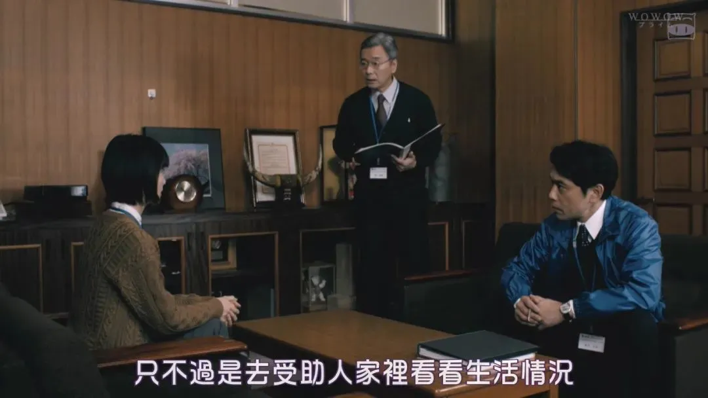
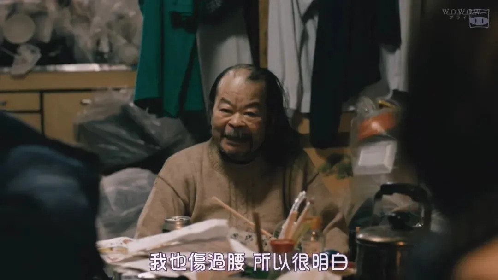
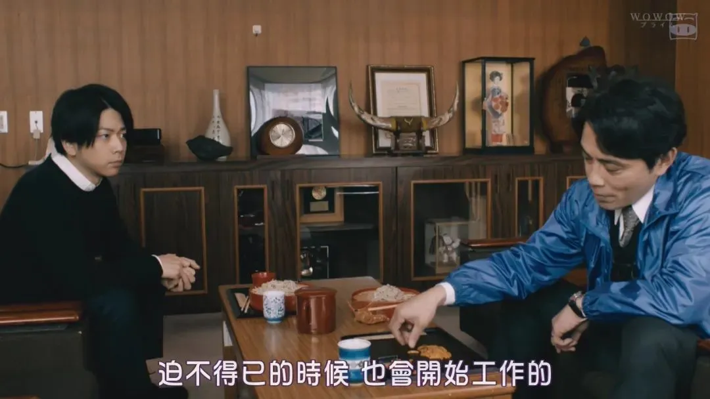
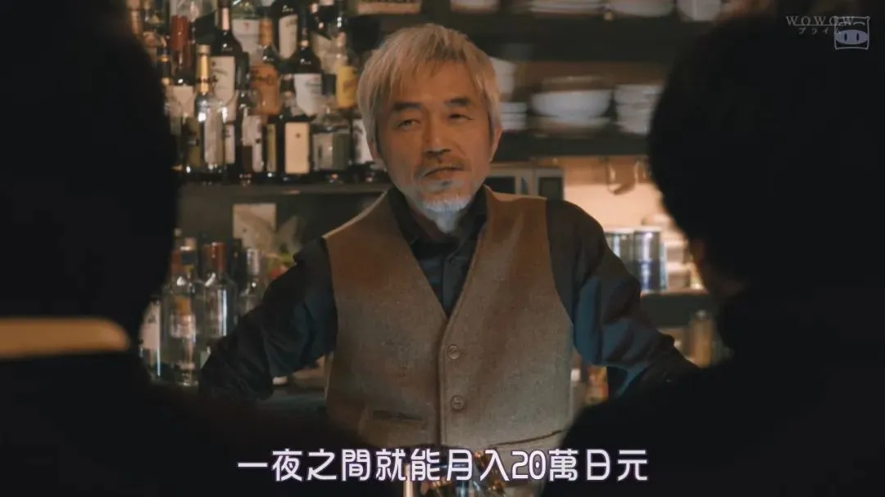

## 5集凶杀案，拍出了岛国社会的水深火热

原创 有部电影 有部电影 *昨天*

开门见山，今天给大家聊一部岛国“窝窝台”（wowow）的新剧——**《帕累托的误算》。**  

  

  

桥本爱饰演的女主角牧野聪美，是津川市社会福利科的一名职员。

  

这个部门的主要职责，就是按照政府规定，审核、发放福利金。

  

  

虽然看上去是公务员，但牧野只是个没有编制的临时工，每个月的工资寥寥无几，平时连个零食都舍不得买。

  

但为了尽快转正，争取调到心仪的城市建设科工作，她还是硬着头皮接受了工作。

  

  

福利科的工作深入基层，经常与社会底层居民打交道，所以难免会遇到难缠之人，尤其是发放福利金当天，很容易成为无辜的出气筒。

  

有的人像大爷一样来领钱，对工作人员态度恶劣；还有的人耍小聪明，想要骗取更多的福利金。

  

  

这些场面对于刚开始工作的牧野来说，简直让她无力招架，每天上班如同上坟。

  

科长则抓住了她迫切想转正的心理，把最累工作推给她这个新人。

  

  

就在这个时候，科室里的前辈山川察觉到了她的情绪，于是带着她去受助人的家里探访。

  

  

两人刚进门时，就有一股刺鼻的气味扑面而来，牧野在门口做了好一番心理建设，才敢走入房间。

  

这家的房主是个失业大爷，因为腰伤无法工作，已经领了几年的救助金。

  

  

对于这样的沟通对象，山川没有任何轻视、嫌弃态度，而是按照工作流程，仔细了解大爷的身体状况，还亲自喂大爷吃药。

  

  

之后他们又见了几个受助人，不论对方当下是否有工作，山川都表现出一以贯之的关心和热情，每个见到山川的受助人，也都发自肺腑地感谢他。

  

  

这次旁观的体验，不仅让牧野对山川敬佩不已，也让她意识到，这项工作并不是给人发钱那么简单。

  

每张申请表格的背后，都是一段复杂的人生经历，作为福利科的公务员，是万万不能戴有色眼镜的。

  

  

从那以后，牧野调整了工作态度，加班加点翻遍了所有的受助人资料。

  

在山川的帮助下，她慢慢地跟受助人建立起信任关系，工作中遇到的笑脸和感谢也越来越多。

  

  

然而就在这时，山川却忽然在去中村公寓探访的过程中，遭遇火灾身亡。

  

  

根据现场勘查和验尸报告，警方推断有人故意纵火，在第一时间展开了调查。

  

想到山川生前对自己的照顾，牧野无法袖手旁观，于是跟负责此案的警官提出合作建议，双方共享发现的线索。

  

  

牧野发现，发生火灾的中村公寓，其中8户都是山川负责的受助人。但这些人对于山川死亡当天发生的事却三缄其口，有人避而不见，还有人直接玩起了失踪。

  

她认为，这里肯定有人知道山川死亡的内幕。

  

  

看到这里不难发现，这部剧其实是不折不扣的悬疑犯罪套路，而女主角正是引导观众深入案件的关键人物。

  

  

不过比起重在逻辑的本格推理，本剧是典型的社会派推理，专注于社会批判和人性刻画。

  

剧名里的“帕累托”指的就是“帕累托法则”，也叫二八定律，即社会上20%的人占有80%的社会财富。

  

  

这个结论后来作为分析方法，被应用到了各个领域，剧中福利科的职员仓田，就把帕累托法则应用到了自己的工作中。

  

  

他认为，假设在一个100只蚂蚁组成的蚁群中，20只工蚁创造了80%的食物，那么这20只工蚁停止工作的话，剩下80只饥肠辘辘的偷懒蚂蚁中，肯定会有20%自发投入到寻找食物的工作中。

  

  

同理，把蚂蚁换成人的话，如果收紧福利金的发放标准，不给受助人提供“偷懒环境”，那么必定会有人迫不得已，主动去工作。

  

  

所以在仓田看来，**与其让政府把大笔资金花在那些不工作的受助人身上，不如提高审查标准，把钱用在最需要的人身上。**

  

在接待受助人的过程中，仓田也是按照自己的这套思路办事。他觉得牧野太单纯，总是无条件批准申请，于是中途拦截接待了一个无固定住所的受助人，拒绝了他的申请。

  

  

乍看之下，仓田心怀责任感，希望纳税人的每一分钱都用在刀刃上，但他却犯了纸上谈兵的错误——**人毕竟不是蚂蚁，一口气切断80只蚂蚁的食物来源，结果就会直接引爆潜在的不安定因素。**

  

没过多久，那个被驳回申请的受助人迁怒于福利科，直接拿着刀冲进办公室，打算跟仓田同归于尽。

  

  

这场风波的结果是两败俱伤，持刀的受助人进了监狱，福利科也在媒体面前变得两头不是人，一边被指责“放弃低收入者”，一边被诟病乱花纳税人的钱。

  

  

剧中关于这条支线故事的刻画，说的正是日本社会水深火热的当下。

  

严重的老龄化和低迷的经济，本就让政府的财政负担持续加重，再加上屡禁不止的福利诈骗行为，政府的公信力逐渐下降。

  

可以说，这部剧最出彩的地方，就是用一场虚构的纵火案，刻画出了真实的日本社会。

  

  

剧中的津川市，原本凭借港口快速发展，但随着造船业的落寞，这座城市也失去了往昔的生机，工人纷纷下岗，很多人因为工伤无法顺利再就业，政府福利金成了他们唯一的收入。

  

其中有的人开始对政府心生怨念，每天混吃等死，有的人想要争取从头再来，但重新融入社会并非易事。

  

  

津川市的副市长表面上把“复兴城市”挂在嘴边，但政治对他来说不过是谋取私利的工具。

  

他的女儿也是福利科公务员，但每天就凭借官二代的身份混日子。

  

  

对比之下，女主这样无权无势的“临时工”，不仅承担着巨大的工作量，还因为“转正”这个把柄，总被人按在地上摩擦。

  

剧中呈现的日本社会，一边是占有绝大多数社会资源的人，继续利用制度漏洞敛财；另一边则是身处底层之人，为了仅剩的少部分资源，忍气吞声维持着最后的尊严。

  

不过女主并没有因为自己的遭遇气馁，反而凭借良知和责任感，逐渐发现了这起案件背后的内幕。

  

  

持刀伤人发生后，女主对入狱的受助人心怀愧疚。

  

她觉得如果当时自己再强硬一些，不让仓田强行拦截接待，事情也不至于发展到这个地步。

  

  

受助人被她的诚意打动，于是向她透露了一个“内部消息”——福利科内部有人跟黑社会勾结，帮人骗领金钱。

  

  

一开始，牧野对此半信半疑，但没想到这已经成了当地秘而不宣的潜规则，连餐馆的老板都知道：

  

有黑帮到处拉拢流浪汉，给他们提供固定住所，帮他们申请政府福利金，如果愿意，还会人为制造残疾，提高补贴金额。

  

  

也就是说，黑帮一直在利用政府，从穷人身上榨取仅有的利益。

  

与此同时，为了尽快查明山川的死因，牧野好不容易联系到了一直避而不见的受助人安西。

  

结果发现，失火的中村公寓住户果然与黑帮有联系，他们还都曾被安排去离家10公里外的一家医院就诊。

  

  

牧野随后赶到那里，真的发现了不少没病装病的老人。

  

但就在她要通知办案的警官时，自己却被黑帮给绑架了……

  

  

而至于这起牵扯黑帮、政府和底层民众的纵火案，幕后黑手到底是谁，我在这里就不给大家剧透了。

  

目前剧集已经更新完毕，想知道谜底的小伙伴们可以赶紧看起来了！

  

也许是国内最认真的电影自媒体

长按扫描二维码关注 

微信扫一扫  
关注该公众号