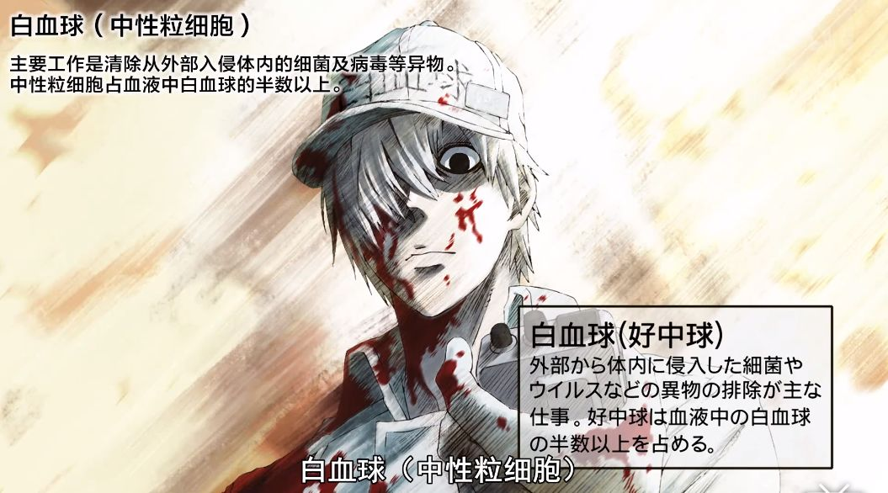
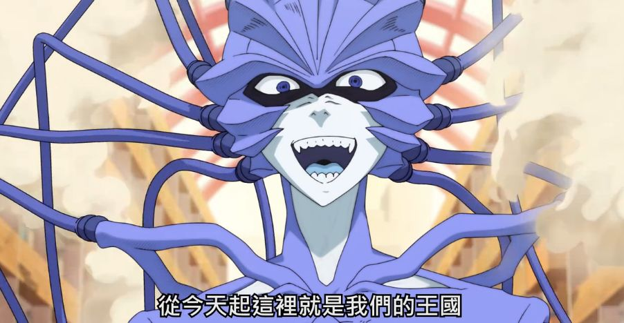
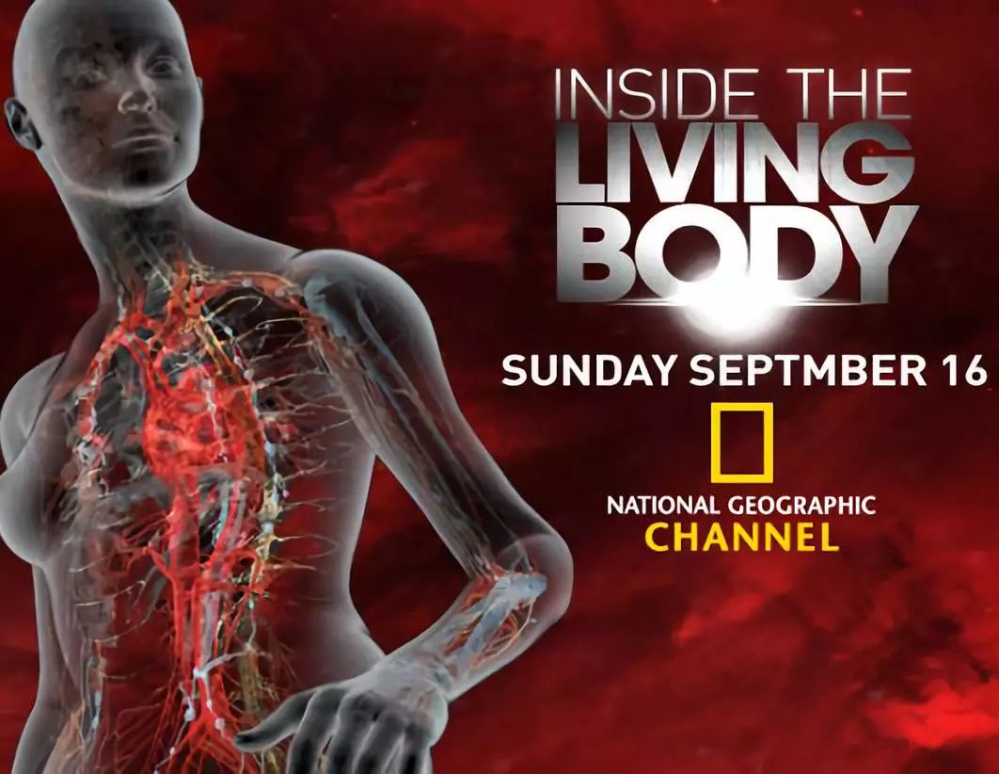
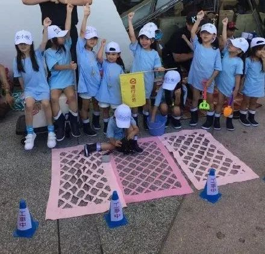
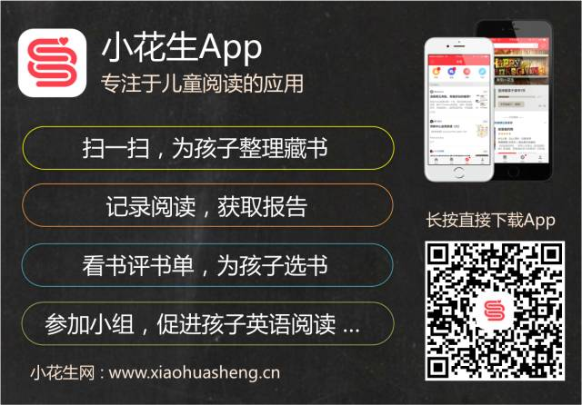
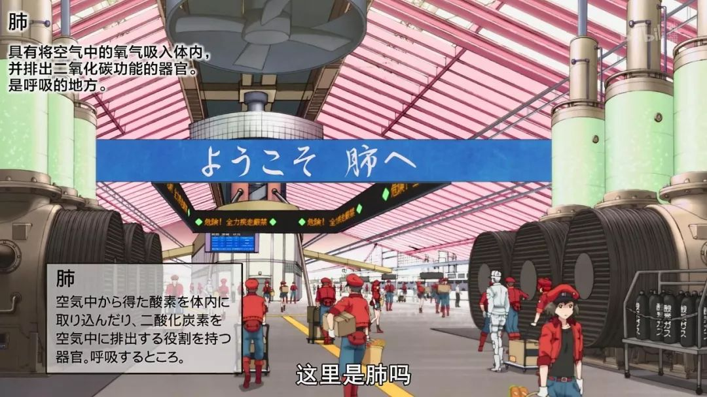

速读摘要

这部剧主角是一对双胞胎女孩，分别叫Oei和Ma，从小由单亲妈妈Lin和光棍舅舅抚养。为了不让渣男的计划得逞，Lin在设法逃出来后，便决定把儿子Oei当成女孩养，并对外宣称生的是一对双胞胎女儿。富家兄弟中的大哥早早地就被指腹为婚，将来要迎娶白富美、诞下子嗣，留给渣男家做继承人。尤其得知自己被母亲当做报复渣男的工具时，更是出离愤怒，当场割发明志，决定随父亲一走了之。总的来说，这部《心之影》虽然狗血，但在天雷滚滚的剧情背后，也不难看出对社会中诸如男尊女卑、父权家长制、LGBT群体的自我认同、性别刻板印象等议题的反思。

原文约 2307  字  | 图片 42 张 | 建议阅读 5 分钟 | [评价反馈](https://static.app.yinxiang.com/embedded-web/clipper/#/Evaluating?d=2020-03-20&nu=d9a3245b-3856-4291-a934-8e268b62afe7&fr=myyxbj&ud=58b471&v=2&sig=968E0F41788CD56E7176CBE2116362D2)

##  圈养囚禁、强制变性，五雷轰顶泰国大戏又来了

原创 有部电影 [有部电影]()**
之前给大家分享日剧《下辈子我再好好过》的时候，就有不少小伙伴表示“一女五男”的车速太猛，车轱辘都快碾到观众脸上了。
a
无独有偶，刚聊完岛国女司机的故事，又来了一部无敌高能的泰国开年剧——**《心之影》。**

这部剧主角是一对双胞胎女孩，分别叫Oei和Ma，从小由单亲妈妈Lin和光棍舅舅抚养。

有天妈妈外出，双胞胎溜到河边玩耍，失足落水，幸好舅舅及时相救，才有惊无险。

但万万没想到，就在Oei换衣服的瞬间，Ma突然吓得大叫起来——本以为是好姐妹的Oei，竟然长着男性器官？！

一脸懵逼的舅舅这才想起来，Lin曾经三令五申，不让自己接近Oei，就是怕暴露两个孩子的龙凤胎身份。

原来，两个孩子的生父是个十恶不赦的渣男。

他仗着家里有钱有势，不仅强占良家妇女，还威逼利诱让Lin帮他生儿子，甚至为此害死了她的母亲。

为了不让渣男的计划得逞，Lin在设法逃出来后，便决定把儿子Oei当成女孩养，并对外宣称生的是一对双胞胎女儿。

可这事做起来并没那么容易。

一开始，通过女装和洗脑，Lin还勉强能让Oei相信自己是个女孩；

但随着年龄增长，性成熟来临，不仅Oei发现了自己和妹妹的不同，外人也可能分分钟看出破绽。

为了确保万无一失，Lin直接将儿子圈养起来。

她不仅剥夺Oei上学的权利，给他买来教材在家自学；还禁止儿子每天往公园里跑，抹杀他对足球的爱好。

但问题是，光是外表打扮得像女孩也没用，Oei好几次在外边差点说漏嘴，Lin只能痛下决心做个狠人。

她先是要求儿子服用避孕药，增加雌激素，强化女性特征。

然后又使出一招情感绑架的骚操作，只要Oei不服从管教，她就会家暴Ma，一直打到儿子心疼服软为止。

结果可想而知，Oei一边在药物的刺激下，变得愈发凹凸有致；一边在亲妈的变态管控下，每天饱受精神摧残，过着水深火热的生活。

值得庆幸的是，每当Oei想要喘口气做回自己，身边总有妹妹和舅舅的支持。

他们一个给予他父爱，给他出谋划策，还陪他踢球解闷；一个是异体同心的“世另我”，经常神出鬼没地为他当替身、打掩护。

但随着龙凤胎逐渐长大成年，又引发了一段无敌狗血的“兄妹骨科五角恋”。

这事要从妹妹在大学校园里，认识了一对富家兄弟说起。

这对兄弟中的大哥Neur，是个温柔的霸道总裁。

由于父亲在多年前去世，他继承了家族企业，对弟弟的学业和生活也十分上心。

在机缘巧合下，兄弟俩都对Ma产生了好感。

尤其是大哥，在一见钟情后便施展各种撩妹手段，撩得Ma整天小鹿乱撞，芳心暗许。

但事实上，这是因为他在10前就在公园里偶遇过Oei，并为“她”卓越的球技心动不已。

在被Oei一脚球踢晕后，大哥一发不可收拾地坠入爱河。碰到Ma之后，他以为自己是盼来了与初恋的“重逢”。

更鬼畜的是，大哥还多次把女装出门的Oei错认成Ma，对其疯狂发射总裁魅力。

这一下，连Oei也被扫射得内心凌乱起来。

他一会儿怀疑自己吃药太多，已经由内而外变成真·妹子；一会儿又担心自己取向有变，甚至跑去找男路人做实验。

为了确保自己还是纯爷们，Oei偷偷戴假发、穿男装，跑去健身房里练肌肉。

结果歪打正着，又跟一位白富美妹子擦出火花，还差点被强行扑倒。

更狗血的是，这位白富美妹纸并非别人，而是他同父异母的妹妹……

看到这里，你们是不是已经要被编剧的脑洞震碎了？**很多网友表示，一时间甚至分不清这剧到底是耽美剧、百合剧，还是骨科剧……**

**不过这种放飞自我、五雷轰顶式的狗血情节，正是泰剧最让人上头的原因之一。**

更何况咱们在过往泰剧里，就已经聊过女婿劈腿丈母娘、婆婆勾搭儿媳、儿子变装勾引报复老爸、侄子暗恋姑父……还有啥奇葩桥段没见识过？

《吹落的树叶》，姑父爱上变性侄子

而除了“霸道总裁爱上龙凤胎兄妹”、“同父异母差点骨科飙车”等抓马设定之外，这部《心之影》最让观众打call的，还有花式上演的大型修罗场。

比如，当白富美根据定位找上门时，差点撞见女装扮相的Oei；

比如男装Oei跟白富美开房时，又差点被富家兄弟捉奸。

原来，富家兄弟的父亲，在生前跟Oei的渣男父亲是世交好友。渣男是在生完女儿后，为了救这位好友，才遭遇车祸丧失了生育能力。

所以，富家兄弟中的大哥早早地就被指腹为婚，将来要迎娶白富美、诞下子嗣，留给渣男家做继承人。谁料白富美奋起反抗包办婚姻，还整出了开房出轨这种大动静……

而渣男这些年也没有消停，他查到了Lin的住址，还知道了她当年生下了龙凤胎的消息。

于是便找上门，想要见母子俩一面。

可此时饱受母亲折磨的Oei，早就想要逃离这个家庭。

尤其得知自己被母亲当做报复渣男的工具时，更是出离愤怒，当场割发明志，决定随父亲一走了之。

结果，当他以男儿身份出现在家族聚会上时，不仅见到了一脸懵逼的富家兄弟俩，还见到了恍闻男票变亲哥的白富美……

说到底，局面之所以变成现在这么个大型修罗场，都是因为“渣爸狠妈”害人不浅。

虽然这部剧目前只播了五集，但像Oei这样被爹妈坑惨的孩子，已经到处都是——

比如和Oei同父异母的白富美妹妹，因为爷爷重男轻女，从小受尽歧视，哪怕学业有成，也同样要沦为家族的繁衍工具。

比如富家兄弟中的大哥，看似过着霸道总裁的光鲜生活，却连婚姻大事都不能自己做主，还要为了替父亲报恩，迎娶不爱的女孩。

比如龙凤胎妹妹Ma，不仅经常因为哥哥挨打，连初恋对象也一度被撬走……

更不用说全剧最倒霉的孩子Oei，生下来就被剥夺了各种做人权利，好不容易对男性性别建立认同，又要开始质疑起自己的性取向来。

总的来说，这部《心之影》虽然狗血，但在天雷滚滚的剧情背后，也不难看出对社会中诸如男尊女卑、父权家长制、LGBT群体的自我认同、性别刻板印象等议题的反思。

这些问题虽不算罕见，但《心之影》却做出了有价值的反向思考，它让观众看到许多家庭悲剧的根源，是以爱之名的情感绑架，也是专权父母对子女的蛮横物化。

比如Lin强行把儿子当女儿养，违背Oei的意愿，却每次都拿出“为你好”的挡箭牌，既不让舅舅插手自己的“家务事”，也不允许Oei做出反抗。

而Oei的爷爷，更是典型的父权制家长，一言不合就要剥夺儿子的继承权，或是将不听话嫁人的孙女，赶到乡下农庄干苦力。

**无论是打着关心你的名义，还是居高临下的安排，本质都是对个体缺乏尊重。**

这也是本剧带给观众的一点思考——**它提醒我们每个人都是独立的个体，即便是为人父母、家族长辈，也不能无视儿女的意愿，甚至剥夺他们的基本权利。**

在接下来的剧情中，由于父母插手儿女婚事，还将上演一波替妹出嫁、男男大婚的狗血大戏……高能指数不断升级。

想知道这个震碎三观的故事最后究竟要如何收场，不妨趁着假期赶紧入坑吧！
