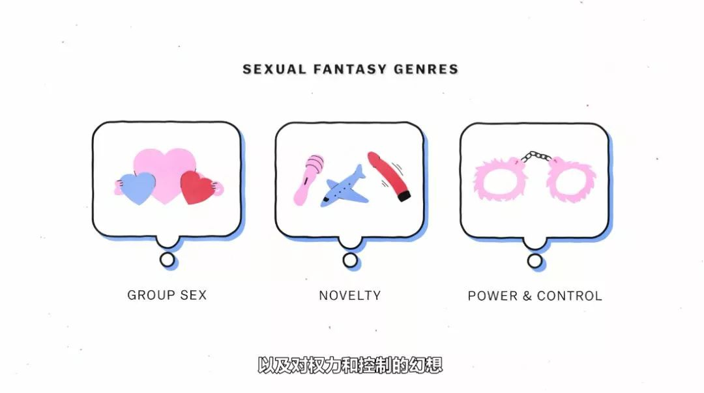

##  这部满屏大尺度的纪录片，我可不好意思独享

原创 有部电影 [有部电影]()**
前两天，网飞的爆款英美剧《性教育》回归。

剧集讲的是两个高中生联手创办“课外班”，给同学们解答性困惑的故事，设定看似黄暴，其实三观超正。很多看完的观众都表示，我们的校园里也需要这样的“性教育”。

不过，很多人没注意到的是，网飞同时还推出了一部正儿八经的纪录片，来科普那些成年人也未必知晓的性知识——**《性解密》。**

这部纪录片一共五集，每集一个主题，时长20分钟左右。

别看它篇幅短小，但内容生猛、信息量爆表，涵盖了性幻想、性吸引、避孕、受精、生育等方面的科普，分分钟颠覆你对“性”的认知。

就拿讲“性幻想”的第一集来说，影片上来就纠正了很多人对它的认知误区。

根据全球最大环（色）保（情）网站P站的数据，在用户热搜排行榜的前六位中，有三组关键词都与“妈妈”有关：

这难道说明，大家都对妈妈有啥邪恶想法吗？？？

别担心，事实并非如此。

影片接下来就讲明了，所谓“性幻想”，指的是通过想象而达到性兴奋的一种自我刺激的性活动方式，它跟每个人的“看片喜好”未必相同。

为此，美国社会心理学家、性学研究员贾斯汀·莱梅勒，特地找来近4200名18岁到87岁的民众进行问卷调查，调查对象囊括了各种性别认同和取向、族群及政治背景。

结果发现，几乎每个美国成年人都有过性幻想，87%的人每周至少有一次，52%的人每天至少一次。

而每个人的性幻想内容，又大致分为三种类型：群P、打破常规的性，以及BDSM模式。

其中最受欢迎的幻想类型要属群P，尤其是“三人行”，几乎得到所有美国成年人的青睐。

这类“多男一女”、派对式性行为之所以引人遐想，一方面是因为每个人都渴望得到关注和认可，并且很容易将这种情感需求投射到性幻想中。

另一方面，则是因为一夫一妻制的模式是现实，而人们需要通过幻象来获取某种新鲜感。

而第二大受欢迎的幻想类型，是打破常规的性体验。

比如带有猎奇意味的性玩具，眼罩、手铐等等；

还比如越是容易被发现的场所，越能带来刺激与性奋感，公园、私家车、公共更衣室、电梯皆是如此。

第三类性幻想BDSM，指的是伴侣在约定规则内，通过给予或忍受痛苦，享受支配或臣服带来的性快感。

说到关于BDSM的性幻想，早在18世纪的欧洲历史上，就有大佬级人物可以追溯。

一位是法国贵族萨德侯爵，以各种性虐待犯罪闻名于世，电影《鹅毛笔》里讲的就是他的事迹。

另一位是奥地利贵族利奥波德冯萨克·马苏德，他在半自传体小说中，讲述了一个男人说服一个女人把他当奴隶的故事。

这些在当时看起来精神反常的行为，随着社会发展与性观念解放，已演变成不算罕见的性癖好。在莱梅勒的问卷调查中，就有超半数受访者幻想过自己被强奸的场景。

从某种程度上说，正是因为这类性幻想的普遍存在，它们才渐渐成为一种备受欢迎的故事素材，出现在各种文学或影视作品中。

但值得注意的是，正如片中的心理学家所言，人们之所以会在性幻想中感到性奋，是因为这些幻想大多涉及禁忌，抑或是现实中无法体验的事情。即使有过强奸或被强奸的性幻想，也不代表人们在现实中渴望同样的遭遇。

在很多情况下，我们的性幻想恰好是社会文化的一种反向延伸。

比如在种族歧视盛行的时期，美国社会就先后出现过针对各种有色人种的性幻想风潮；而随着21世纪反恐战争爆发，各种有关基地组织的种族主义性幻想，也在美国女性群体中流行开来。

另外，很多人都知道，BDSM文化通常与皮革制品密不可分。事实上，这也是性幻想常常与社会禁忌密不可分的一个案例佐证。

这种联系，最早可追溯到20世纪40年代的美国。

当时二战宣告结束，许多同性恋大兵选择留在西海岸，加入充满男性荷尔蒙的摩托车手阵营，并随之将“同志皮革文化”传播到欧美其他城市。

后来到了八九十年代，艾滋病泛滥起来，民众对男同群体充满恐惧和愤怒。警察和殡葬业者，更是会戴上面具和口罩来隔离他们。

正是因此，皮革、乳胶、捆绑等象征禁忌的符号，才逐渐进入BDSM文化，在产生刺激的同时抚平人们对于性的焦虑。

这些幻想看似匪夷所思，但大多数都反映了人类的某种需求，它或许是渴望关注、打破常规、应对焦虑，也可能是多种情感需求的混合投射。

但无论你拥有怎样独特的性幻想，都不必为此感到困扰或者惊吓，只要明白幻想与现实的区别。

**别看第一集的内容就如此吸睛，实际上这部纪录片并非借题开车，而是围绕性的方方面面，都进行了一本正经的科普讲解。**

比如第三集，就以人类节育措施的发展为主题，列举了历史上各种不靠谱的避孕偏方，更借此揭示了女性为承担避孕责任所遭受的磨难。

众所周知，早期避孕套由动物肠制成，可以通过清洗反复使用。

但大家或许不知道的是，在这之前，人们为了节育，会使用一种避孕膜，就是往女性体内塞入各种物品，例如羊毛、丝绸、碾碎的植物或动物粪便等。

直到20世纪50年代，科学家才研制出口服避孕药，终于帮女性减轻了节育压力，也让数百万家庭顺利脱贫。

但与此同时，这些口服避孕药带来明显的副作用，诸如头痛恶心、毛发体重的增长、性欲降低、情绪抑郁等等，甚至还会造成一定的死亡几率。

后来有位美国记者撰写了一篇调查报告，揭露女性服药后出现心脏病、中风、血液凝结、癌症等患病风险，这才迫使美国国会举行听证会、制药公司降低激素剂量。

但截至2015年，仍有拜耳公司这样的跨国制药企业，因为避孕药造成血栓等问题被告上法庭。

除此之外，还有一种将节育器植入子宫内、一劳永逸达到长期避孕的做法。

但这种方法很容易造成子宫发炎病变。美国曾有上万妇女发起集体诉讼，控告“达康盾”节育器存在感染隐患，导致有人为此丧命或失去生育能力。

事实上，由于各种节育措施都有一定的副作用，许多女性不是要承担健康风险和医疗费，就是为避孕而战战兢兢、担心不已。

但与此同时，针对男性的节育措施，却始终未得到推广。

这是因为男性一来不必面对分娩带来的风险，二来对于节育药物及结扎带来的副作用，也表现得格外难以接受。

但更重要的是，正如性作为人类最原始的驱动力却长期被污名化一样，我们对于它的许多方面也仍然缺乏统一的认知。

比如在“解密性吸引力来源”的第二集中，男女之间就存在着明显的认知差异；

在第五集说到分娩话题时，人们又在医疗干预与自然分娩之间产生了争议看法；还有时下大热的LGBT群体试管受精现象，也仍然保持着纷争不断……

而对于这些不同的观点与争议，本片也并未进行说教，而是通过科普的方式对“性”这一主题本身进行揭秘，呈现数据与理论，剩下的留与观众自己思考。

**正因如此，我才认为它非常值得一看。****不仅饱含干货，还用一种直截了当的态度告诉人们谈论性、了解性不是件尴尬羞耻的事，反而能帮助我们了解自身，避免不必要的奉献，与世界、与他人更好地建立共情和联结。**

