速读摘要

这部剧从开播时的豆瓣8.6飙升到如今的9.2，不仅稳坐"2020开年第一神剧"的交椅，还给广大少女贡献出了"新任老公"许光汉。男主看见的"女鬼"，就是本剧的女主程家乐。另一方面，女主作为新闻记者，在工作中认识了四个月前的男主。通过调查一个接一个的案件，剧集呈现出了类似单元剧的节奏，这些案件看似独立，其实背后也与主线有着或多或少的关联。在认清现实不尽人意后，她仍然努力给自己创造机会，对新闻充满热忱。

原文约 2396  字  | 图片 38 张 | 建议阅读 5 分钟 | [评价反馈](https://static.app.yinxiang.com/embedded-web/clipper/#/Evaluating?d=2020-03-20&nu=1f628b4c-a84c-4655-879d-a488e14871f3&fr=myyxbj&ud=58b471&v=2&sig=D8767BD3ED6FA11096E8E92BD9F30969)

##  每晚与陌生人同居1小时，这部台剧和《想见你》一样高能

[有部电影]()**
前几天，爆款台剧《想见你》完结了。

这部剧从开播时的豆瓣8.6飙升到如今的9.2，不仅稳坐“2020开年第一神剧”的交椅，还给广大少女贡献出了“新任老公”许光汉。

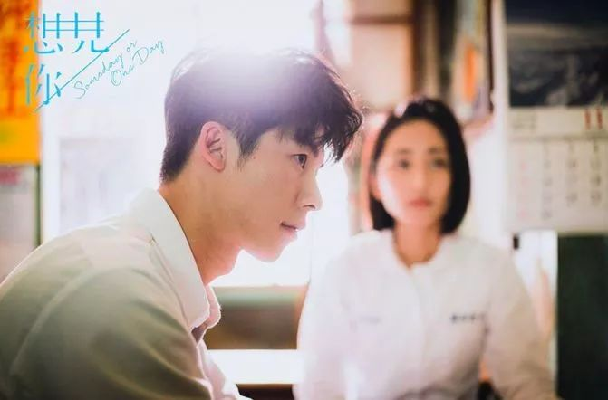

据说，因为许光汉，金马奖最佳影片《阳光普照》突然受到了大波关注，网飞那部一炮没红的《罪梦者》点击率暴涨，就连周杰伦早年作品《三年二班》的MV，也没有逃过“考古学家”的魔掌：

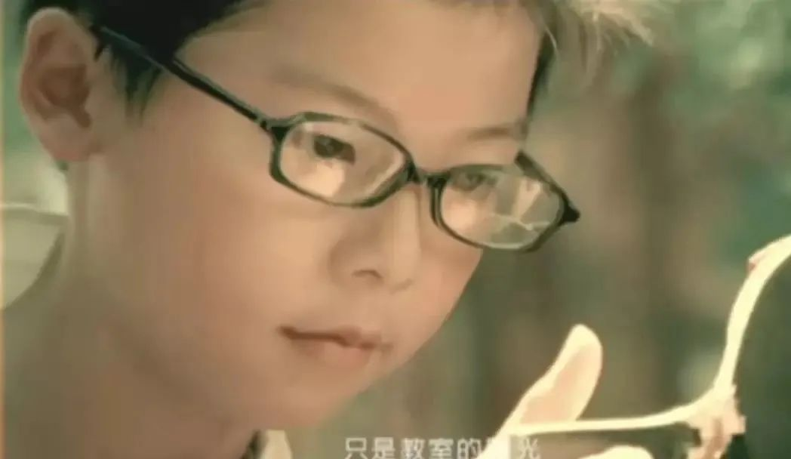

其实，许光汉此前还演过另一部时空交错的奇幻悬疑爱情剧，豆瓣上标记看过的人不多。

但我点开看了几集才发现，这也是部宝藏——**《1006的房客》。**

比起《想见你》里多重时空嵌套的设定，这部剧乍看之下，并没有那么烧脑。但它的剧情同样悬念丛生，高能反转不断，一旦入坑就让人欲罢不能。

剧中的男主柯震宇，是个年轻有为的金牌律师。

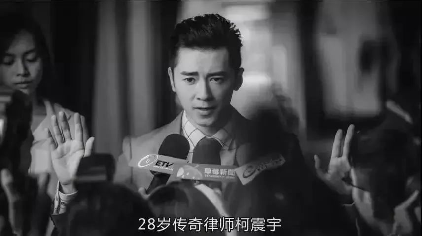

剧集开场，他接手了一个柔道教练被杀案，嫌疑人被告是死者的新婚妻子吴继柔，也是男主青梅竹马的发小。

由于吴继柔坚称自己无罪，男主便尽全力帮发小辩护。但没想到，官司还没打赢，他自己就因为“伪造证据”被起诉，一时之间身败名裂。

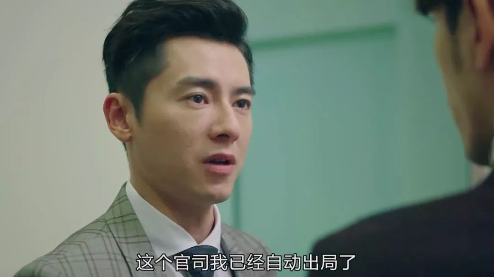

失业后，男主卖掉豪宅，搬进了一栋老公寓，结果第一天晚上就过得不太平——他隐约感觉这屋子里闹鬼。

注意镜子

其实呢，男主看见的“女鬼”，就是本剧的女主程家乐。

她原本是一名柔道运动员，因为心怀新闻梦想，半途转行去做了记者。

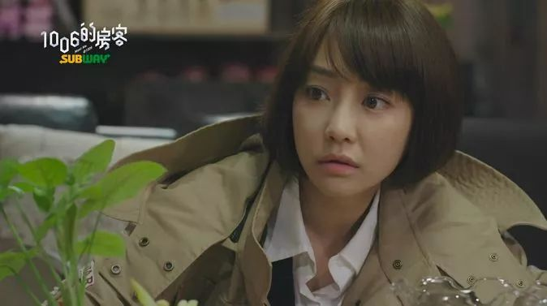

那女主为什么会突然出现在男主家中呢？

因为女主在四个月前，也是这里的租客。而这间公寓每天晚上10:06到10:52之间，时空会发生融合。

也就是说，活在2017年10月的女主角，和活在2018年2月的男主角，每天有46分钟时间会“共处一室”。

一开始，两个人都不知道会出这种状况，闹出不少囧事。

比如女主优哉游哉泡着澡，时间一到，浴缸里突然多出一男的：

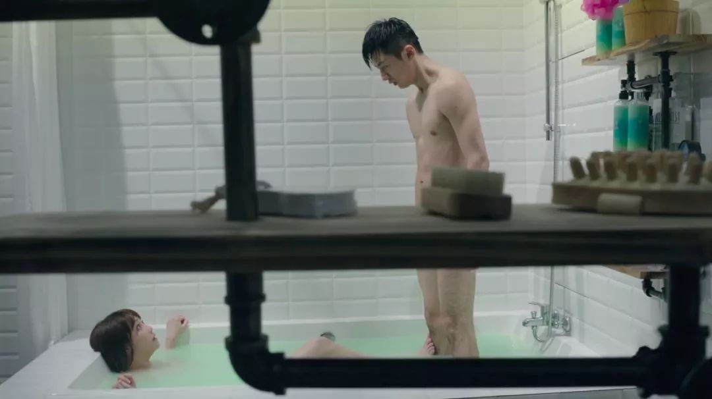

比如男主刚躺床上想睡觉，身边凭空出现一女的：

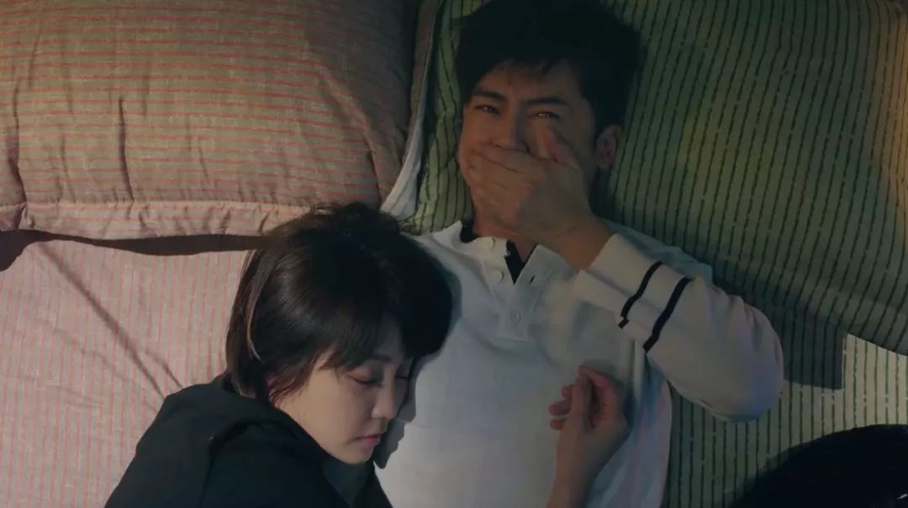

总之，两人经历了互相把对方当女鬼和变态的阶段，直到拿出租约和日历对着一看，才不得不接受真相。

而且当时空融合时，屋子外面的世界是2018年，这意味着是女主穿越到了未来。

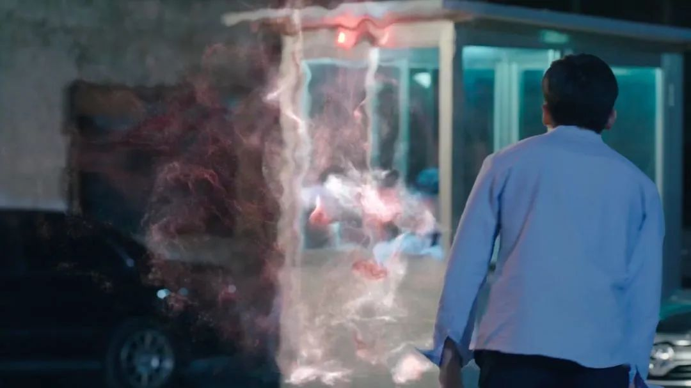
10:52分一到，女主凭空消失

乍一看，这种“超时空同居”的设定并不算新奇。

比如《超时空同居》中，佟丽娅扮演的女主生活在2018年，雷佳音扮演的男主生活在1999年。

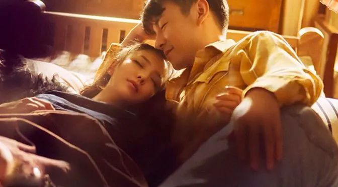

但反观本剧，男女主角只相隔4个月，彼此身处的世界并没有什么大的不同。命运的巧合让他们撞在一起，究竟有什么目的呢？

答案就是：**破案。**

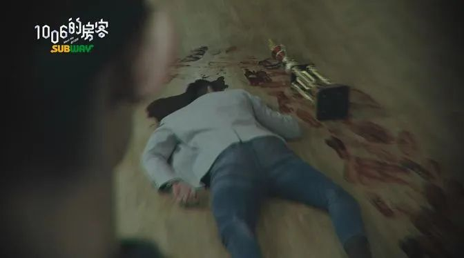

最开始，是男主意识到了这一点。因为他发现女主恰好是那位被谋杀的柔道教练江承浩的师妹。

于是决定，不如利用女主开穿越的外挂，改变自己的命运。

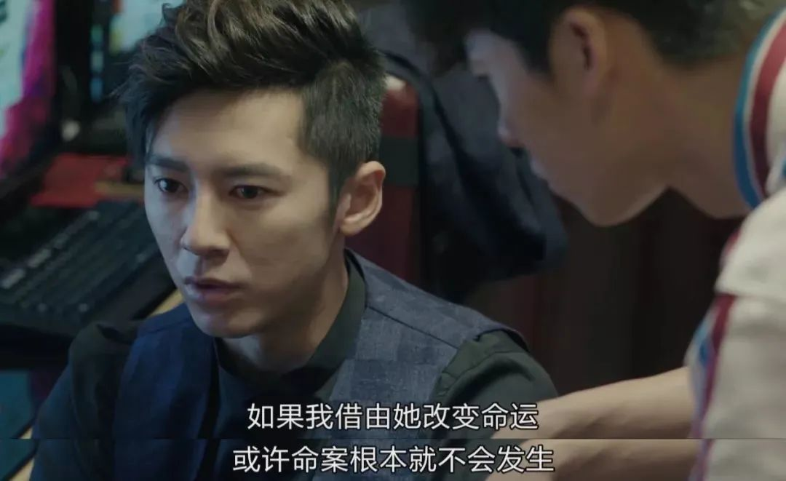

女主在得知未来的现实后，也想救自己师兄一命，于是两人就这么组队成功了。

而在这种特殊的“同居式合作”过程中，他们对彼此的认识逐渐加深，也最终爱上了对方。

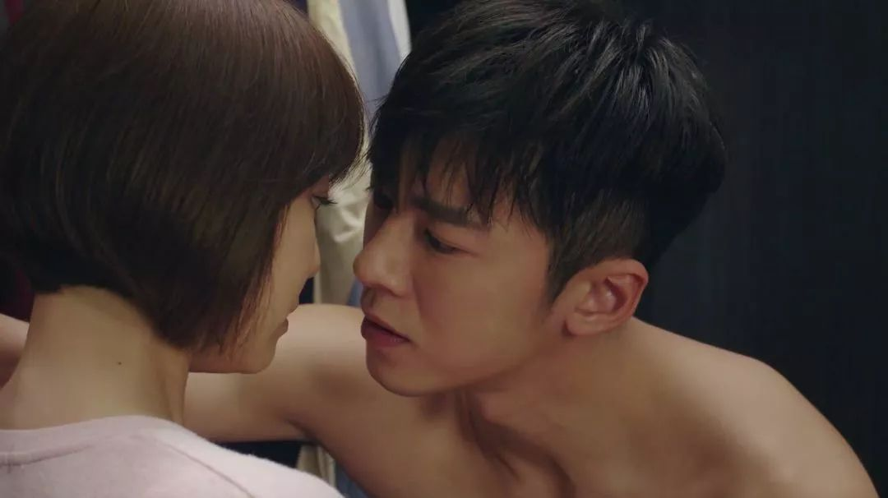

但就在一切都眼看要往好的方向发展时，一个巨大的打击突然降临到男主面前——一天，女主的闺蜜敲开了他的家门，说来拿走女主的“遗物”。

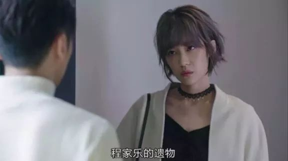

男主这时候才知道，自己之所以能租到这个公寓，是因为上一个租客，也就是女主，在不久前因为心脏病去世了。

不仅如此，女主死亡的时间，刚好是江承浩案件一审当天。

这让男主觉得有点蹊跷，仔细一查果然发现——所谓的心脏病，其实是被人注射了过多胰岛素造成的。

正是因为女主试图阻止这次案件，了解了越来越多的内幕，才导致她最终被人杀害。

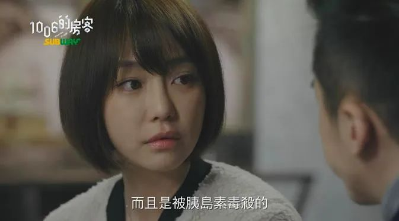

得知这个真相后，男主陷入了极大的矛盾和痛苦中，但同时他也明白了，江承浩被杀案件确实另有凶手。就连自己当时拿到了假的证据，继而被起诉，可能也是凶手的圈套。

这跨越时空相遇的两人，必须尽快查清案件背后的隐情，扭转彼此的命运……

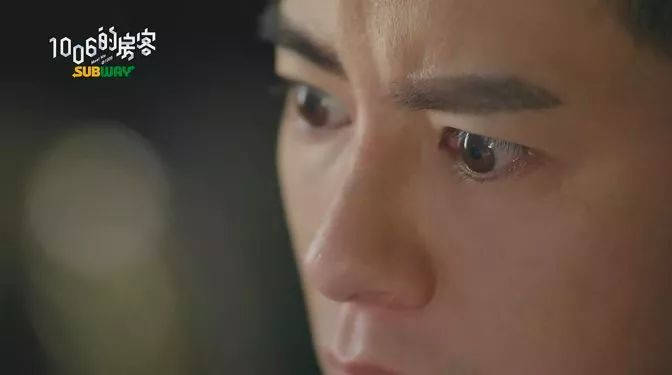

总的来说，虽然这部剧有着浪漫的奇幻爱情设定，但以一个迷雾重重的凶杀案贯穿始终，非常引人入胜。

剧情虽然算不上烧脑，但也复杂高能，多重反转让人不看到最后猜不到真相。

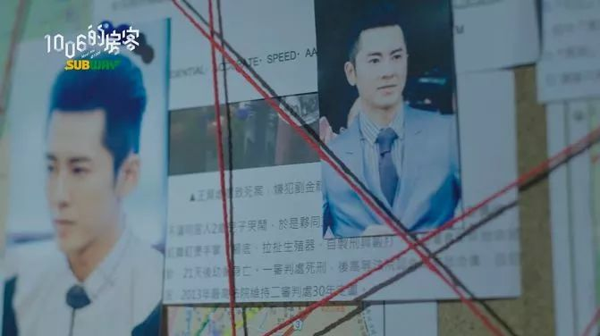

一方面，女主在过去的行为，会引发各种意想不到的蝴蝶效应。每次她改变一件事实，男主脑中对于过去的记忆，也会跟着改变。

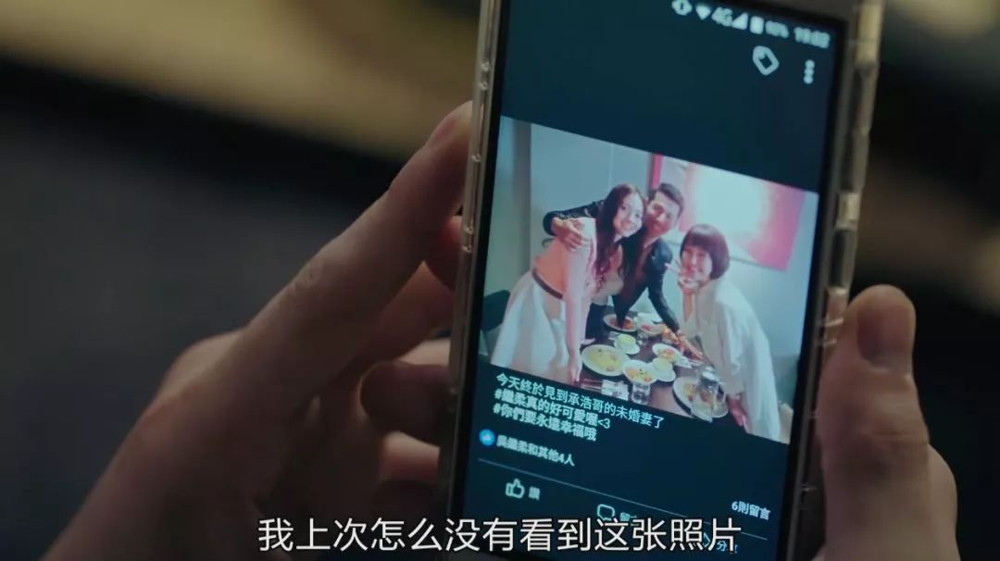

另一方面，女主作为新闻记者，在工作中认识了四个月前的男主。那时的他还是春风得意的大律师，对即将到来的悲剧毫不知情。

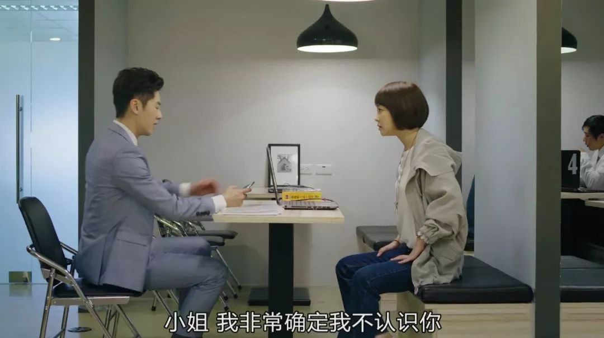

此后，女主过上了白天夜晚分别应付两个男主的生活。

而与律师男主的交集，也使她接触到了许多其他案件，比如女大学生裸尸案、出轨医生受贿案等等。

通过调查一个接一个的案件，剧集呈现出了类似单元剧的节奏，这些案件看似独立，其实背后也与主线有着或多或少的关联。

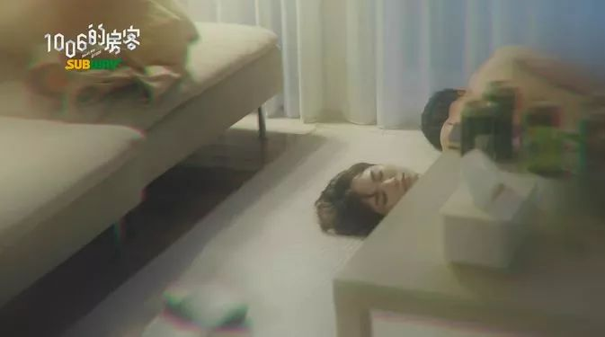

值得一提的是，除了男女主角外，剧中的配角也非常抢戏，每个人背后仿佛都隐藏了一些秘密。

比如男主的发小吴继柔，她在婚前就已经知道了江承浩劈腿，却还是坚持嫁给他；凶案发生后，她坚称自己不是凶手，却又在受审时刻意对警方说谎。

比如继柔的哥哥吴瀚文，他对妹妹似乎有种超出伦理的感情，千方百计想阻止她结婚。江承浩劈腿的证据，一开始也是他雇人偷拍的。

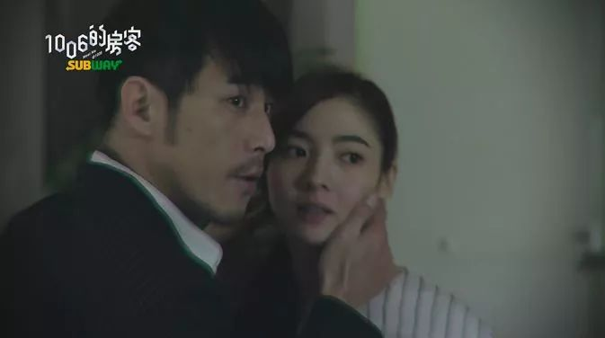

还比如男主的好基友，也就是许光汉饰演的周大军。

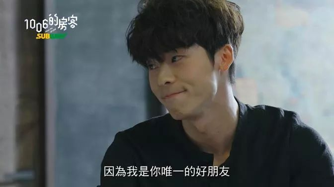

他看起来是个人畜无害的暖男，但却总是在最关键的时刻出现，促成一些扭转局势的“意外”。

这些意外越到后来，越让人感觉细思极恐，毛骨悚然……

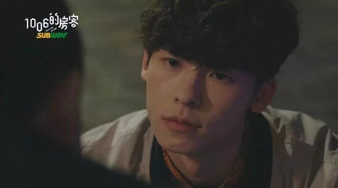

总而言之，剧中这个主线案件的真相，不仅仅是单纯的情杀或误杀，终极的幕后大boss令人大跌眼镜，好奇的小伙伴们可以赶紧入坑追起来。

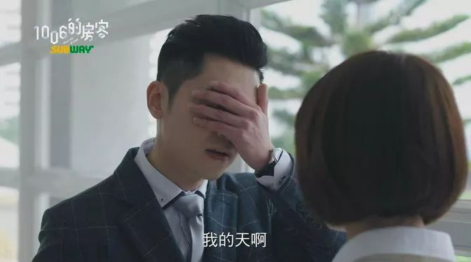

而在我看来，这部剧的亮点除了浪漫奇幻的设定和环环相扣的悬疑剧情外，还在于它通过主角的人物塑造，呈现出了对社会问题的关注。

剧集花了不少篇幅去刻画两名主角在职场中遇到的困境，和他们对此做出的思考和选择。

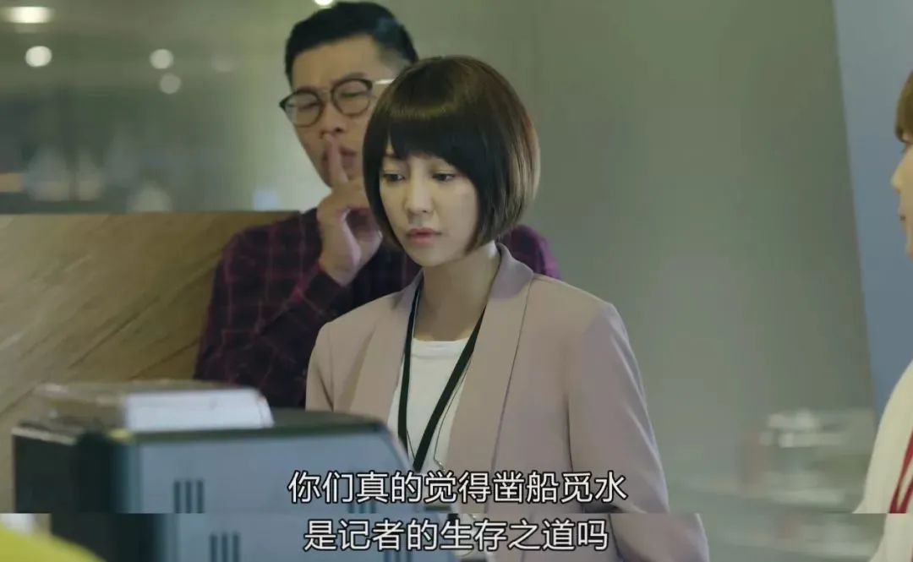

比如女主，作为一名记者，她怀有一腔热血和纯粹的新闻梦想。

在初入职场时，她的正义感和道德感不是被同事们嘲笑，就是被前辈所规训和教育。

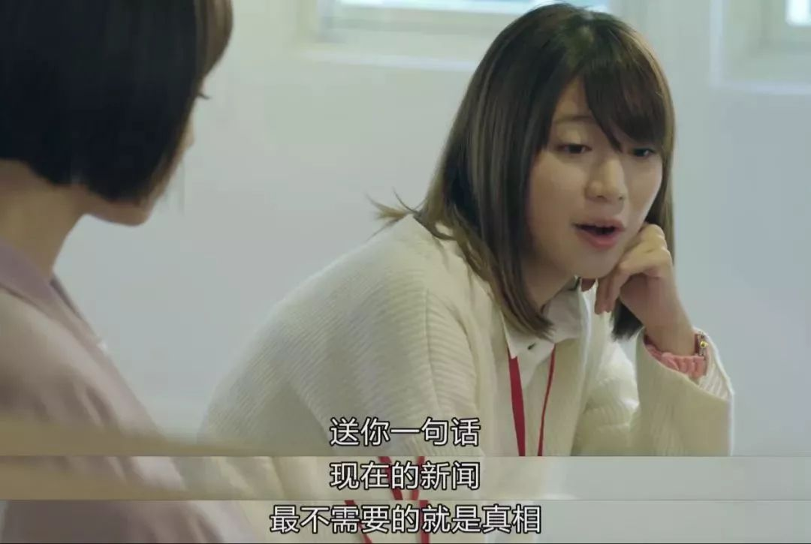

但即便如此，女主也从未摒弃过初心。在认清现实不尽人意后，她仍然努力给自己创造机会，对新闻充满热忱。

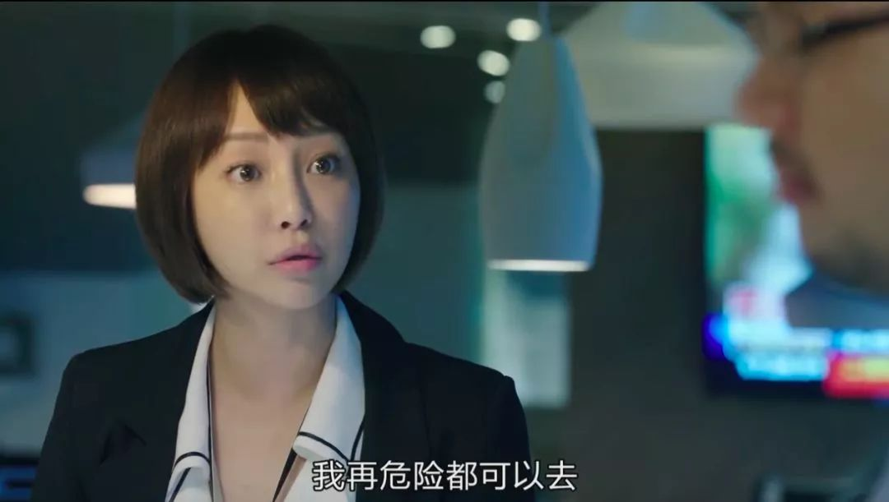

而男主，则常常因为对真相的执着追求，而显得不近人情。

他从不会去考虑哪种结果“更符合多数人的期待”。对他而言，是真相就必须被揭开，尽管很多人不愿或不忍心去看，这才是律师存在的价值。

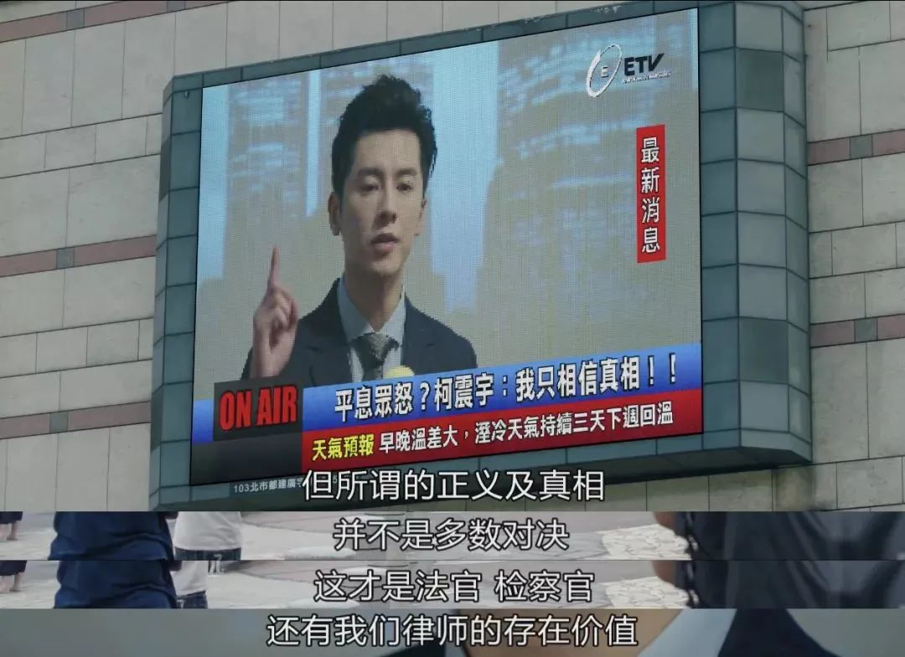

这些情节，不仅深入浅出地讨论了现实社会的症结，也将剧中的人物塑造得更加丰满。让人看到，男女主角之所以会渐渐走到一起，靠的并不是什么一见钟情或时空魔法，而是他们在本质上就是同一类人。

这样的惺惺相惜的爱情，才更加令人信服，让人越嗑越上瘾。

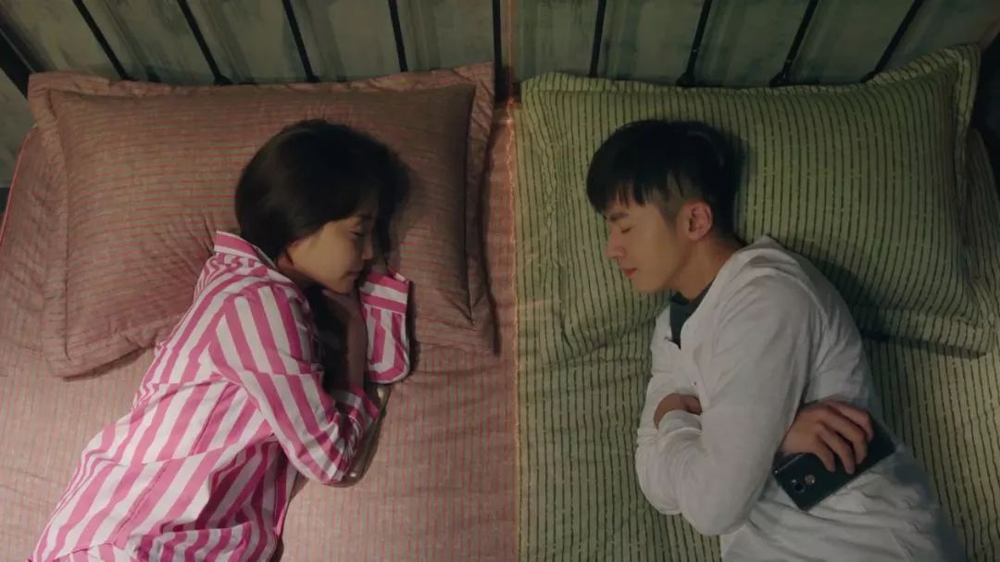

说到这儿，让我想起近些年一直有人感叹台剧的没落，现实题材的剧集还偶有佳作，但爱情偶像剧似乎也和曾经辉煌的港剧一样，变成了80、90后们追不回的童年记忆。

然而，不论是火爆全网的《想见你》，还是这部冷门的《1006的房客》，都让我看到，台剧并没有止步不前，而是在剧情、人物和对爱情本质的探讨上，不断挖掘精进，变得更高级，也更走心。

也许是国内最认真的电影自媒体
长按扫描二维码关注

在看