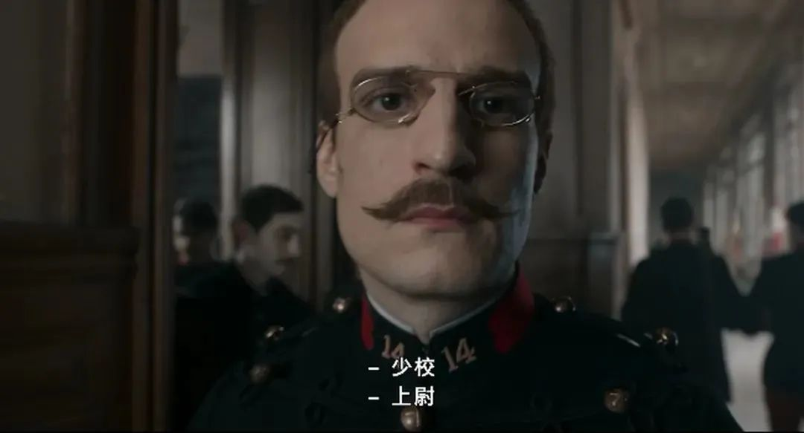
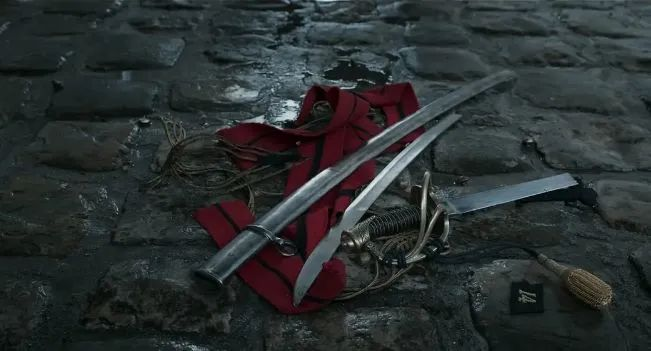

速读摘要

《我控诉》讲述的是19世纪末法国家喻户晓的一起冤案——"德雷福斯事件"。专家称德雷福斯的笔迹与那张便笺高度相似，认定他是出卖情报的间谍。他们用靴子践踏国家，以国家利益为借口，将国家要求真理及正义的呼声塞入它的喉咙。一直到1906年，被冤枉了12年的德雷福斯才被宣判无罪，重新回到军队任职。片中试图隐瞒真相的军方和公开发出控诉的左拉，都被导演一笔带过，所有的重点都集中在男主皮卡尔的身上。

原文约 2696  字  | 图片 34 张 | 建议阅读 6 分钟 | [评价反馈](https://static.app.yinxiang.com/embedded-web/clipper/#/Evaluating?d=2020-03-20&nu=a8b30834-3aac-42f3-82d1-883ec17147b6&fr=myyxbj&ud=58b471&v=2&sig=3D46F0FA5DDB04605333176CA0A35AEE)

##  他们给他颁奖，他们骂他“人渣”

原创 有部电影 [有部电影]()**
今天给大家聊聊这段时间最有争议的一部电影——**《我控诉》。**

这部电影拿下了威尼斯电影节费比西奖，凯撒奖最佳导演、最佳改编剧本，在法国上映后立刻成为首周末票房冠军，可以说是叫好又叫座。

但另一方面，影片也因为导演波兰斯基的丑闻而遭到各方抵制，尤其是在凯撒奖颁奖当天，这种抵触情绪达到最高点，部分电影人愤然离席，场外大批民众集会抗议。

如此抵触的原因，在于这部电影被理解为“波兰斯基想借用电影为自己辩解、洗白自己性侵的黑历史”。

从目前的豆瓣评分分布也能看出，有相当一部分的一星差评，都加上了对导演本人的批判，波兰斯基的性侵丑闻也逐渐取代影片内容，成为了大众关注的焦点。

《我控诉》讲述的是19世纪末法国家喻户晓的一起冤案——**“德雷福斯事件”。**

1894年，法国情报部门截获了一张没有署名的便笺，怀疑军队内部有间谍，此人企图向德国驻法武官泄露重要的军事情报。

根据便笺上的信息，军方推断这名间谍是个炮兵军官，在总参谋部的四个部门都工作过。

按照这个条件筛查，陆军参谋部犹太军官德雷福斯，成为最大的嫌疑人。

尽管德雷福斯的笔迹与那张便笺并不完全吻合，但是对于军方来说，他是**“最符合逻辑”**的嫌疑犯。

这就要说到当时的历史背景。

普法战争后，针对德国的反间谍工作持续展开，由于阿萨尔斯、洛林地区被割让给了德国，导致来自这一地区的军人的忠诚度开始饱受质疑；与此同时，法国社会的反犹主义也日渐盛行起来。

在这种背景下，生于阿萨尔斯、总参谋部唯一的犹太军官德雷福斯，几乎完美符合了间谍的所有“特征”。

随后，仅仅凭借有些相似的笔迹，德雷福斯就被推上了军事法庭，审理过程更是堪称典型的“欲加之罪何患无辞”。

法庭上，专家称德雷福斯的笔迹与那张便笺高度相似，认定他是出卖情报的间谍。尽管律师提出两份笔迹也存在几处不同，专家仍一口咬定“不同也是德雷福斯为了摆脱嫌疑，故意伪造的”。

也就是说，不管德雷福斯的笔迹与便笺相似与否，他都会被认定是间谍。

在这种草率的指控下，德雷福斯百口莫辩，叛国罪名成立，他被流放到了法属圭亚那的恶魔岛，受尽各种非人待遇。

他被禁止与士兵交流，每天晚上还要以“预防”的名义被拷在床上……

在被流放之前，军方兴师动众地举办了一个剥夺军衔的仪式，《我控诉》的开场所呈现的，就是这个带有羞辱意味的仪式——

在众目睽睽之下，德雷福斯的兵团编号、帽徽被撕扯下来，佩剑被斩断。

这场戏里，大远景的构图方式，阴沉的环境，直接诠释出德雷福斯当时的无助与无力感。

他在空旷的广场上大声宣称自己被冤枉，但换来的却是围观群众的辱骂。

虽然德雷福斯这个“间谍”被捕入狱了，但在那之后，法国的间谍活动依旧存在。

1896年，法国情报部门又截获了一封信件，引起了当时负责反间谍工作的主管——本片的男主角皮卡尔的注意。

这封信件显示，收信人是一个叫埃斯特哈齐的少校，男主随后对他展开了暗中调查，没想到一查就有惊人发现——

埃斯特哈齐的军籍显示他隶属于步兵团，但他本人却不在兵团驻扎的区域，反而经常与炮兵混在一起。

之后男主拿到一份埃斯特哈齐手写的调职申请，发现字迹与那份用来指控德雷福斯的便笺，几乎相差无几。

这个发现随后在笔迹鉴定专家那里得到了证实——埃斯特哈齐才是出卖情报的罪魁祸首。

男主无法忽视这个真相，于是立刻向上级申请，重审德雷福斯的案件。

但他没想到，自己却因为此事开始遭受排挤，同事告诫他“军人只负责执行命令”，让他不要滋生事端。

军方为了维护声誉，没收了男主收集的全部证据，并把他调至突尼斯，要求他永久隐瞒这个真相。

至于那个真正卖国的埃斯特哈齐，则在秘密审判中被判无罪。

但即便如此，男主依旧不愿放弃。从突尼斯调回巴黎后，他仍在积极寻求重审的机会。可没想到迎来更激烈的压制，平日里他被军方派人跟踪，也无法通过书信与朋友往来，家里更是被翻了个底朝天。

对于军方来说，这个事情的重点并不是德雷福斯是否叛国，而是即便他是无辜的，让他这个犹太人在恶魔岛继续饱受折磨，也总好过让法国军队因为这个丑闻，受到人民的非议和质疑。

因为他们深信不疑，在国家的荣誉和威信面前，个人的生命和名誉不值一提。

这个事件直到1898年才出现转机，作家左拉在《震旦报》发表文章，揭露了军方诬陷德雷福斯的阴谋。

文章里洋洋洒洒地阐述了对于真理和正义的强烈呼声，并在结尾多次用“我控诉”做开头，点名了事件中全部该被追责的人。

报纸原文

这篇文章到现在看来，依旧是句句振聋发聩，发人深省——

*“他们用靴子践踏国家，以国家利益为借口，将国家要求真理及正义的呼声塞入它的喉咙。”*
*
*
*“我深信真理正在向前迈进，没有什么事物能阻挡它。”*
*
*
*“真理若被埋藏在地下，将会发芽生长，一旦有一天爆发，一切都会被炸开。”*

终于，在1899年，军事法庭重审德雷福斯案。

但中间依旧经历了各种波折——

男主被民众指责为“犹太人的走狗”；左拉因为“发表损害军队荣誉和名声的谎言”，被判刑一年；德雷福斯的辩护律师，直接遭人枪杀……

而这场重审，也无视之前各种站不住脚的伪证，依旧判德雷福斯有罪，还堂而皇之地给他“适度减刑”为十年。

一直到1906年，被冤枉了12年的德雷福斯才被宣判无罪，重新回到军队任职。

整体看来，《我控诉》是一部还原历史事件的电影，影片在威尼斯电影节拿下场刊最高分，是因为其整体质量过硬，摄影、服化道、演员演技方面，都给人留下了深刻的印象，是一部货真价实的**“电影节级别的电影”。**

但值得注意的是，反映历史事件的《我控诉》，不能算是一部优秀的历史片。

历史上的“德雷福斯事件”之所以在法国家喻户晓，是因为它当年像一个导火索一般，让法国社会迅速分裂成两派。

一边是右翼分子、反犹人士、天主教人士，他们坚称德雷福斯有罪，理应接受严厉的惩罚。

而另一边则是资产阶级共和派、新教徒，以及支持左拉的学者、教师、学生等等，他们呼吁法庭进行公正判决，维护真理和正义。

**“知识分子”（intellectual）这个词，正是由此而来。**

为了充分表达自己这方的立场和诉求，两派经常通过文章进行笔头战争，可以说是法国内部一次思想层面的对抗。

但这些在《我控诉》里，并不是刻画的重点。

片中试图隐瞒真相的军方和公开发出控诉的左拉，都被导演一笔带过，所有的重点都集中在男主皮卡尔的身上。

在这场风波中，皮卡尔是立场最复杂的一方。

因为他本人是个反犹人士，也从来不避讳自己的观念，对于军队有着深厚的感情；

但在维护军队荣誉这个问题上，皮卡尔的立场与手段，又显然与上级军官不同。

可以说这个角色身上所体现的，主要是个体与公权力的对抗。

从这里就能看出，导演波兰斯基对于“德雷福斯事件”的切入角度其实是十分有限的，片中对于法国社会的展现，也多集中在反犹主义这一点上。

民众焚烧刊登左拉文章的报纸

也正因如此，《我控诉》才会被一部分人认为是波兰斯基的“洗白片”，它只注重个人化的表达，缺乏宏观的历史角度，导演似乎在极尽全力将自己与片中的德雷福斯做类比。

但实际上，波兰斯基与片中的德雷福斯唯一的相似之处，只有他们的犹太身份，除此之外两者再无可比性。

**与其陷入“波兰斯基是否在为自己洗白”这个问题中，不如重新审视影片展现的“德雷福斯事件”本身。**

**因为尽管它已经过去百余年，看上去也似乎与我们无关，但像当年法国军方那样，煽动普通人的仇恨情绪，拿爱国主义当挡箭牌的行为，依旧层出不穷，遍布每个国家，每个民族。**

**如何避免类似的历史错误再次上演、避免真理与正义在盲目的仇恨中被埋没，才是最值得每个人反思的问题。**

