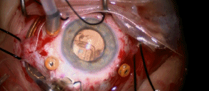
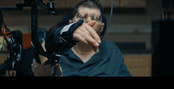

速读摘要

正常说话，但比尔丧失了行动和生活自理能力。但与比尔和史蒂芬不同的是，她仍对生活充满信心，想通过积极治疗重拾画笔。而对于身患帕金森症的安妮，由于还伴有全身肌肉萎缩，所以在大脑植入探测芯片后，还在她的胸腔植入了辅助芯片。史蒂芬在治疗半年后，恢复了部分视力，在一次测试中他看到了姐姐的身影，激动得当场落泪。这样的疗效对于比尔个人来说意义甚微，但从科研的角度来看，仍是意义深远的一次突破。

原文约 2352  字  | 图片 35 张 | 建议阅读 5 分钟 | [评价反馈](https://static.app.yinxiang.com/embedded-web/clipper/#/Evaluating?d=2020-03-22&nu=3c6e49b4-5e5b-4450-867e-590f7cc4cc00&fr=myyxbj&ud=58b471&v=2&sig=4D43BFD321E6AA429C0B50FA314AA70E)

##  看完我惊呆了，《黑客帝国》里的脑机接口已经实现！

原创 有部电影 [有部电影]()**
不知不觉地，这段时间聊了蛮多科幻，有北欧小成本佳作《安尼亚拉号》，有美剧《开发者》和《西部世界》。

今天，再给大家推荐一部硬核科普纪录片——**《我是人类》。**

.jpg)

也许我们还没有意识到，科幻片里半人半机械的生命体，正悄然出现在现实生活当中。

尽管远没有电影里那么多酷炫惊悚的功能，但新兴的人工智能医疗技术，已经开始改善一些残障病患的生活质量。

今天这部纪录片，就聚焦于近几年科技界非常热门的脑机接口技术。

.jpg)

把人的大脑直接跟机器相连接，光是想想就觉得简直是《黑客帝国》剧情……但令人意外的是，现实中已经有人这么做了。

本片就记录了三位残障病患，接受脑机治疗的真实案例——

第一位是美国人比尔，因车祸致脑部受损，成为高位截瘫患者，胸部以下完全不能动弹，只有脖子和脑袋还有知觉。

虽然可以正常说话，但比尔丧失了行动和生活自理能力。

.jpg)

在出车祸前，他是一位蓝领工人，有一个恩爱的妻子和一个聪明可爱的儿子。

一家三口过着不算富裕却幸福无忧的生活。

然而车祸摧毁了这个家庭，用比尔自己的话来说，“一切都变了”，他对生活已经不抱任何希望。

.jpg)
.jpg)

第二位是加拿大人史蒂芬，他在人到中年时才发现自己的身体有某种不同寻常的先天缺陷，患上了反常失明。

.jpg)

他眼睛感知的不是黑色，而是纯白，他形容自己不管看什么，都像是看着空白的书页一样。

.jpg)

失明后，史蒂芬搬到姐姐家居住，一开始因为烦躁，经常跟姐姐吵架，直到几年后才慢慢适应。

但他也因此变得自闭，不愿与外人交流。

姐姐想带他出去散步、跟亲戚朋友聊聊天，都会被他毫不犹豫地拒绝，在他内心，根本不对复明抱有期望。

.jpg)

第三位患者，是同样来自加拿大的安妮。

她原本是一名绘画艺术家，也经常到医院做义工，但步入老年后渐渐显露出帕金森的症状。

.jpg)

患病后，安妮的行动变得迟缓，反应大不如前，走路需要扶手，面部表情变得僵硬，很难与人谈话交流。

随着病情加重，她不得不停止了艺术创作和慈善工作。

.jpg)

因为病症，安妮倍感焦虑，担心成为家人的负担。

但与比尔和史蒂芬不同的是，她仍对生活充满信心，想通过积极治疗重拾画笔。

.jpg)

这三位情况各不相同的患者，都是病在控制着我们身体各项机能的大脑上。

大脑里一个小小的神经版块出现“故障”，就有可能导致一个人失明、聋哑或不能动弹。

好比片中的比尔，他胸部以下的身体四肢，其实在生理上是完全健康的。史蒂芬和安妮也都是大脑病变“连累”了全身。

.jpg)

然而大脑在生物结构上的复杂程度和运行机制的强大功能，完全超乎我们的想象。

对于人类大脑的研究与探索，也一直都是科学界的一大难题。

正如片中的生理科学家说的那样，大脑就是“我们自己的整个宇宙”。

.jpg)

事实上，大脑也确实可以与宏大神秘的宇宙相提并论。

我们的大脑有1000多亿个神经元，这与科学家保守估计的宇宙星系的数量相一致。

.jpg)

而神经元相互之间交流的方式，又特别像计算机运算的零一代码，只是还要更复杂得多。

正因为人脑和电脑的底层逻辑相类似，所以科学家们认为将人脑和电脑相连接，成为一种可能。

近几年，脑机接口作为科技领域的一个热门概念，被越来越多地提及，并迅速走向实际应用。

美国科技狂人、有“现实版钢铁侠”之称的埃隆·马斯克在2016年创立了名为Neuralink的脑机接口公司。

2017年，脸书创始人扎克伯格也提出了研究脑机接口的“脸书脑计划”。

.jpg)
.jpg)

这些公司在研究初期，无一例外都选择以计算机治疗残疾病人的医疗领域，作为突破口。

以马斯克的Neuralink公司为例，他们一直在跟一些生物计算机实验室，和医疗科学研究院进行合作。

其中最著名的一个项目，就是“大脑之门”——本片提到的比尔、史蒂芬和安妮，都是这个项目的治疗对象。

.jpg)

针对他们的不同情况，脑机接口的治疗方案也不尽相同。

对于高位截瘫的比尔，治疗方案最为激进，真的就是像《黑客帝国》里那样在头顶钻孔，再用高精密和灵敏度的电子探针连接到电脑上。

通过电脑调整探测区域和电流大小，来测试比尔在脑部电流的刺激下掌控四肢运动的反应。

.jpg)
.jpg)

对于因先天缺陷导致失明的史蒂芬，则是直接在眼球内植入可以传输信号的电子芯片。

再用可视化的电脑系统，把各种颜色的图片通过光信号，传入史蒂芬的大脑。

.jpg)

而对于身患帕金森症的安妮，由于还伴有全身肌肉萎缩，所以在大脑植入探测芯片后，还在她的胸腔植入了辅助芯片。

再通过电流刺激，来增强大脑和全身的肌肉活力。

.jpg)

光是这些精细繁复的植入手术，就看得人心惊肉跳，也让我们对脑机治疗的实际效果充满期待。

不过，三人的第一次试验测试，都以失败告终。

.jpg)

此后又经过了大量的调整和系统改进，才终于收到了一些可喜的效果。

史蒂芬在治疗半年后，恢复了部分视力，在一次测试中他看到了姐姐的身影，激动得当场落泪。

.jpg)

如今，他戴着特制的眼镜已经能够看到物体的大致模样。

他也因此变得开朗起来，经常陪姐姐一起逛街散步，对于未来有一天完全复明，他充满了信心。

.jpg)

而效果最好、生活质量改善最大的是安妮。

之前走路都要摔倒的她，在植入芯片后不仅逐渐恢复了行动能力，还获得了自如的表情控制机能和语言交流能力。

这让她重新拿起了画笔，也再次享受到了天伦之乐。

.jpg)

相对来说，同样的治疗思路在比尔身上的效果并不明显。

通过不断的测试训练，他最终还是只能进行轻微的手指活动。

这样的疗效对于比尔个人来说意义甚微，但从科研的角度来看，仍是意义深远的一次突破。

当然，这个小小的进步也在极大程度上激励了比尔，他一度把能够自己拿勺吃饭而不用他人喂食当做人生目标。

只可惜这个目标还未实现，比尔就因为脑部病变而去世了。

.jpg)

总体而言，这部纪录片本质上是一个纪实性的科普。

但片中展现的那些脑机治疗场景，还是给人带来了相当具有颠覆性的认知，震撼程度不亚于科幻惊悚片。

虽然影片里讲的是偏向概念性的初步研究方向，但通过三个切实的案例，让我们看到了脑机接口技术在未来的广阔前景。

.jpg)

无论我们承认或接受与否，当今世界的主流科研领域，都在不可阻挡地朝着脑机接口、人工智能的大思潮迈进。

像《西部世界》里那样半人半机器、人与机器人共存的未来世界，也在一步步走向现实。

**这种划时代的科技变革，在不断更新我们世界观的同时，也引领我们更加深入地探索人类自身的意义和未来的命运。**

.jpg)

正如我们每个人所知，科技进步是一把双刃剑，充满了令人期待的无限可能，也有让人忧心的很多不确定性。

但我们至少应该抱以开放包容的积极心态，去憧憬科技发展带来的美好一面。

就像比尔在生前所说，**必须有人去做研究，才能有所突破，而最终总有人会因为这些科技成果而受益。**

.jpg)

