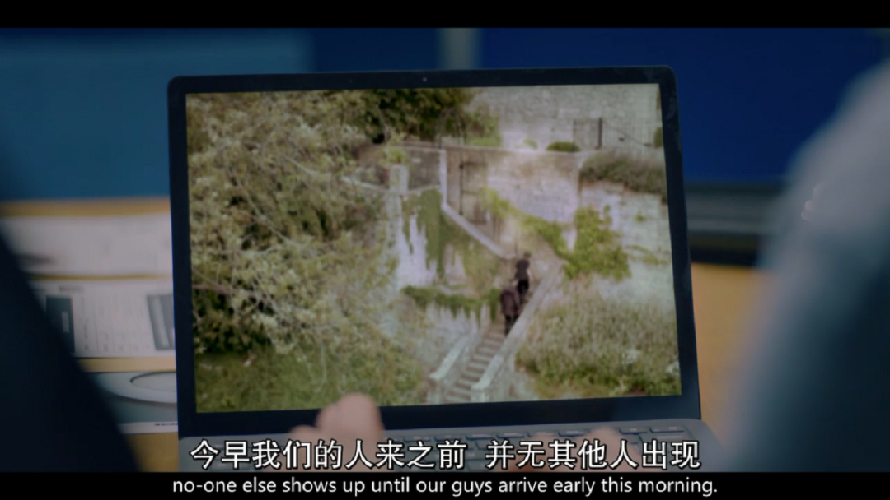

速读摘要

这起案件被交到了两位主角——麦克唐纳德和多德的手里，也就是海报上的俩人。会不会是塞斯伙同他人一起来克洛科特家盗窃，后来因为什么事情发生了矛盾，同伙枪杀他后带着雕像逃走了?但她私底下也是个吐槽役，会跟多德吐槽男友智商太低，找不到破案线索时也会不顾形象地大喊大叫。但正是这样两位毫不起眼的侦探，最终在细心的调查中找到了破案线索。卡莎打算杀掉克洛科特，但因为家中的主灯是坏的，她便在黑暗中误杀了塞斯。

原文约 2149  字  | 图片 32 张 | 建议阅读 5 分钟 | [评价反馈](https://static.app.yinxiang.com/embedded-web/clipper/#/Evaluating?d=2020-04-13&nu=50da5141-27dd-40f2-b691-9ed86ca0343c&fr=myyxbj&ud=58b471&v=2&sig=8F27B84B002A9FA97463CAABAAFFE7D9)

##  为争遗产，全家变态，这部冷门探案剧请收下！

原创 有部电影 [有部电影]()**
开门见山，今天跟大家介绍一部冷门的英国探案剧——**《探案拍档》。**

.jpg)

故事发生在英国小城巴斯。

这里拥有英国最优美绮丽的田园风光，是一座古典雅致的古城。

但在剧集开场，这里却发生了恐怖的凶杀案——

一名青年男子腹部中枪，死在当地名人克洛科特的房子里，身份证件、钱包、手机等一切能证明他身份的物件通通没有。

经初步检验，死者死于前一天晚上，身上的子弹是从一把军队常用的老式手枪射出的。

房子主人克洛科特当晚和妻子逗留伦敦，早上回家发现尸体后立刻报了警。

他还表示，家中丢失了一件价值不菲的古罗马雕像，是女儿们送他的礼物，十分珍贵。

这起案件被交到了两位主角——麦克唐纳德和多德的手里，也就是海报上的俩人。

别看他们貌不惊人，但各自都有过人之处——

麦克唐纳德是精明干练的高级督察，做事雷厉风行，看问题一针见血；

多德看起来呆头呆脑，但他心思沉稳，知识非常渊博。

这对看似平常的搭配，总能在各种离奇案件中直击重点，勘破迷雾。

比如，麦克唐纳德一眼就通过死者手指上的纹身样式，判断出他曾坐过牢，大大缩小了死者的身份范围。

而多德也凭借脑中的冷知识，成功找到了命案现场附近唯一的监控。

经过调查，两人很快得知死者名叫塞斯，是一个犯过抢劫罪和盗窃罪的流浪汉，还有吸毒史。

那么，会不会是塞斯伙同他人一起来克洛科特家盗窃，后来因为什么事情发生了矛盾，同伙枪杀他后带着雕像逃走了？

这个推测虽然符合情理，但可惜现场附近的监控显示，当时仅有塞斯一人从警报系统损坏的后门进入，而前门的警报系统完好。

这证明了当晚没人和塞斯一同潜入克洛科特家中。

此外，多德还发现了一个疑点——

**城里前一天晚上才下过雨，后门门口的石阶上还是湿漉漉的，但后门大敞了一夜，里面的地板却根本没有水迹，这是怎么回事呢？**

对此，克洛科特表示，这是因为自己之前离开家时忘记关地暖了。

眼见命案现场再找不出什么破案头绪，主角两人只能寄希望于死者的人际关系。

可经过调查，他们发现塞斯既无父母也无朋友，简直就是完美的谋杀案受害者。

唯一的线索是邻居昨天曾听到他打电话，说是要去高档餐厅吃饭。

一个流浪汉为什么会去高档餐厅吃饭？

麦克唐纳德想起，塞斯的尸体被发现时，穿着的衬衫也非常昂贵，这确实有些反常。

多德立刻想到，塞斯的身形与克洛科特十分相似，克洛科特家的主灯又刚好坏了，一到晚上房子里肯定很黑。

那么会不会是有人想杀克洛科特，却误杀了塞斯呢？

顺着这个思路想下去，如果想进入克洛科特家，又不走后门，还不会引发警报的，那就只有他的三个女儿和两个女婿了。

他的大女儿是一名政客；二女儿醉心于艺术；只有小女儿看起来落魄一点，和妻子经营着一家蛋糕店，但也过着自给自足的生活。

克洛科特是员佐勋章受勋者，也是一家创新公司的老板，有企业家、设计师、工程师、慈善家等多重身份，身家三千万英镑。

他曾公开表示，在他死后，遗产只会留给其中一个女儿，因为他希望女儿们能够自食其力，靠自己的努力获得成功。

这样看来，女儿们其实是有杀人动机的。因为如果他突然去世，没来得及挑选继承人，那么财产就会平分给三个人，总比一分钱也得不到好。

但遗憾的是，案发当晚，所有人都有不在场证明。

克洛科特自己也认为女儿们不会做出这种事，与其怀疑她们，还不如去找找那些和他有私怨的人。

但在警探眼里，如果凶手不是克洛科特家族的人，眼下的情况是解释不过去的。

正如那句名言所说，如果你排除了所有不可能的选项，剩下的那一个不论看起来多不可思议，它都是真相。

而这一集的名字《克洛科特府的倒塌》，其实也早就剧透了这个谜底……

看到这里，不知小伙伴们发现没有，这剧情走向似乎有点像去年的爆款悬疑片《利刃出鞘》，都是讲述各怀鬼胎的一家人争夺遗产的故事。

.jpg)

但相比《利刃出鞘》里花哨华丽的多重反转，《探案拍档》走的则是沉稳朴实的路线，专注于从警方角度展开案件的侦查推理过程。

这种风格虽然不算新鲜，但观众看着会很有代入感，仿佛在和主角一起破案。

而且光看主角的颜值与个性，会以为本剧的基调是严肃古板的，但实际上本剧却很有喜剧的潜质，两位侦探性格都十分真实可爱，有一种特别的反差萌。

麦克唐纳德做事雷厉风行，看起来不近人情，嘴上总说着“反正我在巴斯也不会待很久，不用跟我搞好关系”。

但她私底下也是个吐槽役，会跟多德吐槽男友智商太低，找不到破案线索时也会不顾形象地大喊大叫。

而怪老头多德就更可爱了，明明学识过人却看着迷迷糊糊的，眼镜戴在头上却死活找不到，有时候一不留神还会将调查进展透露给嫌疑人……

但正是这样两位毫不起眼的侦探，最终在细心的调查中找到了破案线索。

原来，克洛科特在大学时期曾有一个未婚妻，她为克洛科特生了个儿子，就是塞斯。

但因为克洛科特在未婚妻生产前就抛弃了她，未婚妻因病亡故后，塞斯只能在福利院长大。

自私又爱面子的克洛科特不能允许自己有这么个私生子存在，于是他表面上答应带塞斯去高档餐厅吃饭，实际上却在计划怎么杀掉他。

他知道塞斯没有像样的衣服，便把自家后门的钥匙给他，让他自己来取衣服。

这样，塞斯看起来就很像克洛科特本人了。

与此同时，克洛科特也在不停地激怒凶手——小女儿的妻子卡莎，他以鄙视的态度表示卡莎配不上这个家族，想方设法逼她动杀心。

最终，中计的两人在同一天晚上来到了克洛科特家中。

卡莎打算杀掉克洛科特，但因为家中的主灯是坏的，她便在黑暗中误杀了塞斯。

而翌日一早，克洛科特一回到家中，便趁着妻子不注意，破坏了案发现场——一脚踹开了后门，拿走了雕像，并打开了地暖，使整个案件看起来扑朔迷离……

就这样，一桩看起来迷雾重重的借刀杀人案就此告破。

作为一部探案剧，《探案拍档》的案件虽不算复杂但胜在严谨可信，故事性强，观众跟随两位侦探抽丝剥茧般寻找真相的过程，也十分过瘾。

目前，这部剧集已经更新完毕，总共只有两集，每集讲述一个案件。喜欢英式推理的小伙伴们，可以一口气看个爽了！

也许是国内最认真的电影自媒体
长按扫描二维码关注

在看