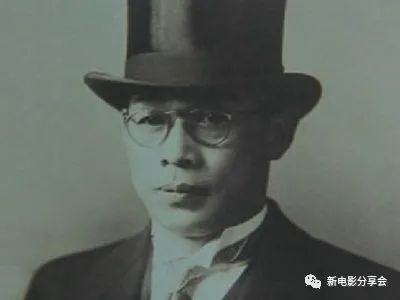
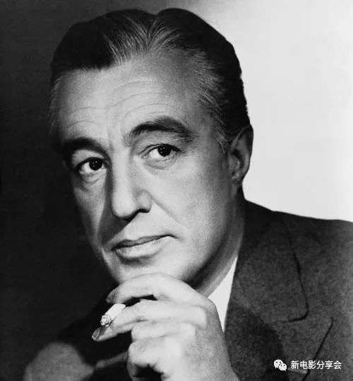
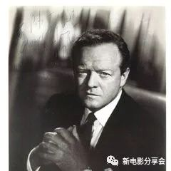
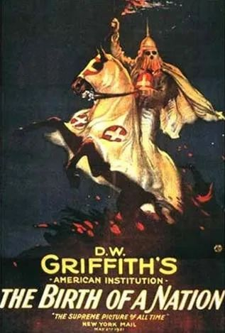
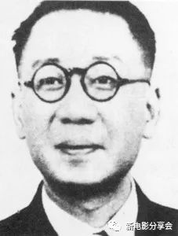
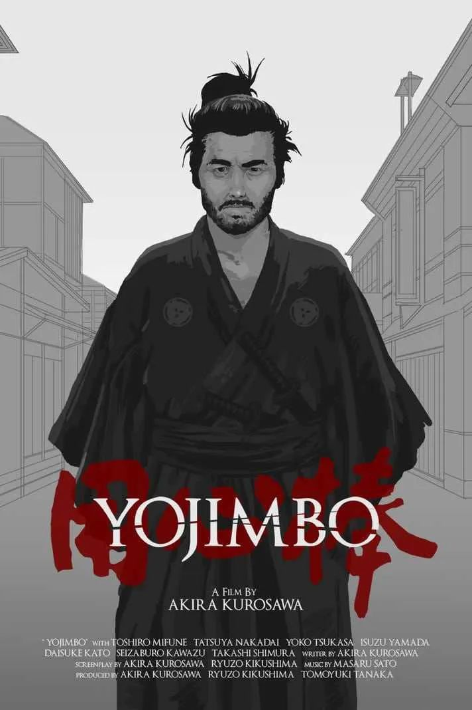
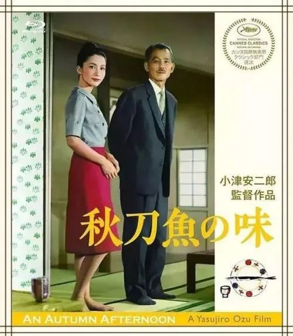
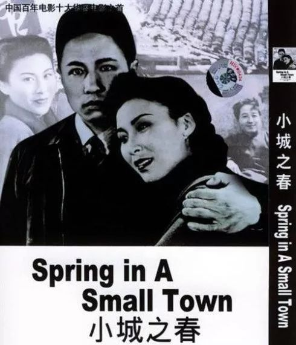
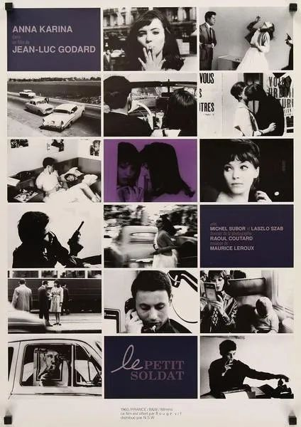
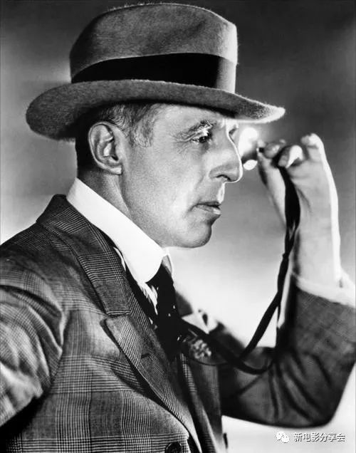

速读摘要

其中最著名的，莫过于《星期五俱乐部》系列，比如追完女儿追老妈的《缥缈的爱》，媳妇婆婆看对眼的《过界的爱》等等。回来之后，基友也开始各种挑衅女主，仿佛他才是男主的恋人。一方面又与基友难舍难分，没有妥善处理好这段情感关系。若不是被基友捅破、被女主捉奸，他或许还会继续这种"脚踏两只船"的渣男生活。同闺蜜搬回家后，如何折磨男主和基友，就成为了她的行为初衷。

原文约 2238  字  | 图片 51 张 | 建议阅读 5 分钟 | [评价反馈](https://static.app.yinxiang.com/embedded-web/clipper/#/Evaluating?d=2020-03-20&nu=96075943-4532-4af4-ba0c-c4a963f42a4f&fr=myyxbj&ud=58b471&v=2&sig=A494B2F2C40962B6748011EB52F6719E)

##  丈夫劈腿基友，妻子出柜闺蜜，居然改编自真人真事

原创 有部电影 
关于高能的泰剧，咱们已经聊过不少。

其中最著名的，莫过于《星期五俱乐部》系列，比如追完女儿追老妈的《缥缈的爱》，媳妇婆婆看对眼的《过界的爱》等等。

这个系列最绝的是，不仅剧情部部五雷轰顶，而且还都是根据真实事件改编。

最近，《星期五俱乐部》第12季的第一个故事已经更新完毕，一共4集，咱们今天就一块来感受一下——**《无人知晓的爱》。**

这个故事的男女主是对恋人，最近共同贷款买了新房，计划几个月后结婚，开启幸福的二人生活。

但让女主意想不到的是，男主的一个基友，意外成为了两人爱情路上的绊脚石。

在搬入新家后没多久，男主就把基友带到了家里，并介绍给女主认识。

直觉告诉女主，这个基友来者不善。

男主和他的关系亲密无间，看上去完全不是朋友那么简单。

很快，更多可疑的事情接连发生，进一步证实了女主的猜测。

先是男主瞒着她请了一周的假，和基友一起出国玩：

回来之后，基友也开始各种挑衅女主，仿佛他才是男主的恋人。

后来，女主从同事的口中得知，这个基友是一个到处约炮的男人。

她本想拿这点来攻击对方，但没想到基友完全不当回事，还干脆摊牌，表示要和她抢夺男主。

更可怕的是，没过几天，男主真的和基友混到了一起。基友还趁男主睡着，拍了张两人的果照发给女主。

这样一来，女主算是得到了男主“出轨+出柜”的实锤。但因为她还爱着男主，所以在闺蜜的陪伴下哭了一整晚。

在闺蜜的安慰下，女主决定和基友斗智斗勇，不仅不推迟婚礼，还要把男主给掰回来。

但她万没想到，基友一顿操作猛如虎，直接在婚礼上偷偷进入操作室，用大屏幕播放了他和男主为爱鼓掌的小电影……

当场窒息的女主

但即便事情闹到了这个地步，女主还是强行和男主完了婚。

婚后的生活可想而知，他们陷入了无尽的争吵之中，没有半点幸福可言。

看到这里，估计不少人会有疑问：**男主到底是什么奇葩，怎么一边和基友纠缠不清，一边又找女主相爱结婚？**

实际上，打从上学时，男主和基友就已经走在了一起。

在男主追女主的时候，两人都还没有分手，此后也一直没有断绝亲密关系。

不过，男主的确是喜欢女主的，他与女主相爱并不是为了骗婚，而是他的内心也渴望像其他人一样，有一个妻子，有共同的孩子。

在基友和女友两个人之间，他一直犹豫不定，谁也不想放弃，就这么一拖再拖……直到最终被女主发现，才第一次向基友提出了分手。

然而这时的女主已经被这段感情搞得心力交瘁，不知道如何面对以后的生活。

她选择离家出走，暂时住到了闺蜜家。

男主本来渐渐想通，开始接受与女主分开的事实，但偏偏这时候，女主被查出怀有身孕，使得男主渴望拥有常规家庭的心再次被点燃。

在删除了基友的联系方式后，他终于再次得到了女主的信任。

两人重归于好，度过了一段快乐的时光。

但故事到这里，还远没结束。

因为基友并没有善罢甘休，他直接跑到公司去找女主的麻烦——

这让男主怒不可遏，带着球棒就要亲自出门去教训基友，结果万没想到，两个人见面之后直接来了场旧情复燃式的分手炮，还被女主当场捉奸。

事已至此，女主对男主彻底死了心，她怀疑自己是否能独自抚养孩子，想到了堕胎。

而看着女主如此难过的样子，闺蜜终于忍不住向女主表达了深藏在心底的爱意，还表示愿意和女主一起抚养孩子。

按理说，如果故事沿着这样的脉络发展下去，男主继续和基友鬼混，女主同闺蜜组建家庭，结局也算是某种程度的大团圆了。

但人算不如天算，偏偏在这个时候，女主的妈妈出现了。

妈妈强势告诫女主：**人可以不要，但输绝对不能认。**她还提醒女主，别忘了自己也参与了还房贷，同样是业主。

就这样，女主最终带着闺蜜也住进了新房里。

整个房子由此成为了女主、男主、闺蜜、基友四人的大型修罗场，彼此之间每天充斥着抓马的报复与较量，最终导致女主意外流产。

虽然这部剧只有四集，但剧情信息量极大，每隔几分钟就会出现一次高能的戏剧冲突，给人以跌宕起伏的情绪冲击。

而且，尽管剧情非常狗血，但却也从不同侧面反映出了人们在处理情感问题中，酿成悲剧性后果的根源所在。

从男主来看，他的同性恋身份整体来说并没有受到社会环境的歧视和压迫，他本可以不招惹女主，专心和基友幸福下去。

但是偏偏，他一方面有着世俗化的执念，想和女主在一起；一方面又与基友难舍难分，没有妥善处理好这段情感关系。

可以说，对两个人而言，他都没有做到认真负责，也没有基本的原则和底线。

若不是被基友捅破、被女主捉奸，他或许还会继续这种“脚踏两只船”的渣男生活。

在女主和闺蜜搬回家后，他甚至一度借着醉意，企图以强暴夺回女主，实现他那已成泡影的“家庭梦”。

而从基友来看，虽然离开一个相爱多年的人是件痛苦的事，但当对方决定迈入新生活时，即便做不到祝福，也至少应该学会尊重别人的选择。

然而，他却苦苦纠缠不休，又是百般向女主“宣誓主权”，又是以爱的名义来扰乱男主的心智，让男主犯下一次又一次的错误。

最后女主的不幸流产，原因也是他看到男女主的关系有所缓和，担心自己没有了机会，于是自导自演了一出戏，导致女主在情急之下摔下楼梯。

不过，关于这个恶果的到来，女主自身也并非全然无辜。

她原本大可从此不再理会男主，和闺蜜过上幸福快乐的日子，但可惜她渐渐由爱生恨，对男主产生了强烈的报复心理。

同闺蜜搬回家后，如何折磨男主和基友，就成为了她的行为初衷。即便差点被男主强暴，她也不肯听闺蜜的劝告离开这里，因为她内心已经被恨所填满。

而在整部剧中，只有闺蜜对待感情保持了理智、原则，以及真心实意为爱人着想的温柔。

在起初，她全心全意地安慰女主，鼓励她为了自己心中所想而努力。

面对基友多次“统一战线、各取所需”的拉拢，她不屑一顾，没有为了得到女主而不择手段，放弃底线。

即便到了最后，她也没有过对女主一丝一毫的埋怨，始终尊重她的选择。

诚然，从人物塑造的方面来看，闺蜜的人设有些过于完美。但在四人之中，她不失为一个正面榜样，让我们得以对照出他人在爱情中如何走向了迷失。

**不可否认，爱情总是让人魂牵梦萦，有着令人陶醉的美好。****但与此同时，爱情也往往是对人性的一场终极考验。**

**人的占有欲、征服欲、嫉妒心、报复心，都有可能在情感的漩涡里释放出摧毁性的力量，让人变得疯狂扭曲而迷失心智，最终伤害了自己，也伤害到所爱的人。**

