速读摘要

则是因为本片堪称尼古拉斯·凯奇的翻身之作!妻子特蕾莎是一名股票交易员，作为家庭经济支柱的她不幸患上了癌症，精力不足导致流失了一大批客户，让她感到心力交瘁。《湮灭》也是一道太空光芒把外星生物带到地球，并通过"闪光"的形式对地球生物产生偶发性的基因融合与突变，让人类产生困惑、恐慌，与之对抗。拉温妮亚面带笑容地迎接"星之彩"的吞噬，这恰恰是对人类自我毁灭本能的完美诠释。正是这些抽离于剧情之外的细节隐喻，拔高了整部影片的主题表达，让我们能够在猎奇、恐惧与震撼的观影体验中，产生一些对家庭社会和自然生态的思考。

原文约 2442  字  | 图片 45 张 | 建议阅读 5 分钟 | [评价反馈](https://static.app.yinxiang.com/embedded-web/clipper/#/Evaluating?d=2020-03-20&nu=aff48c5e-f645-4479-949a-fd8b05138b69&fr=myyxbj&ud=58b471&v=2&sig=B6DDA2DDC3CAB3992B1338FD92FF53DE)

##  年度最邪门的电影，却成“烂片之王”翻身之作？

原创 有部电影 [有部电影]()**
开门见山，今天给大家推荐一部别具一格的科幻恐怖片。

说它别具一格，一来是因为它把克苏鲁神话和神秘外星生物融合在一起，创造出骇人听闻的恐怖怪物；

二来，则是因为本片堪称尼古拉斯·凯奇的翻身之作！

众所周知，因为各种原因，凯奇大叔成了好莱坞的“烂片之王”。

对于这位昔日的奥斯卡影帝而言，这是他个人的事业低谷，也是所有影迷朋友的遗憾。因而如今这部“翻身之作”，更加让人期待与好奇——**《星之彩》。**

本片改编自克苏鲁神话鼻祖H·P·洛夫拉克夫特创作于1927年的同名短篇小说。

故事发生在新英格兰小镇的一处农场庄园，主角是凯奇饰演的男主内森和他的妻子儿女。

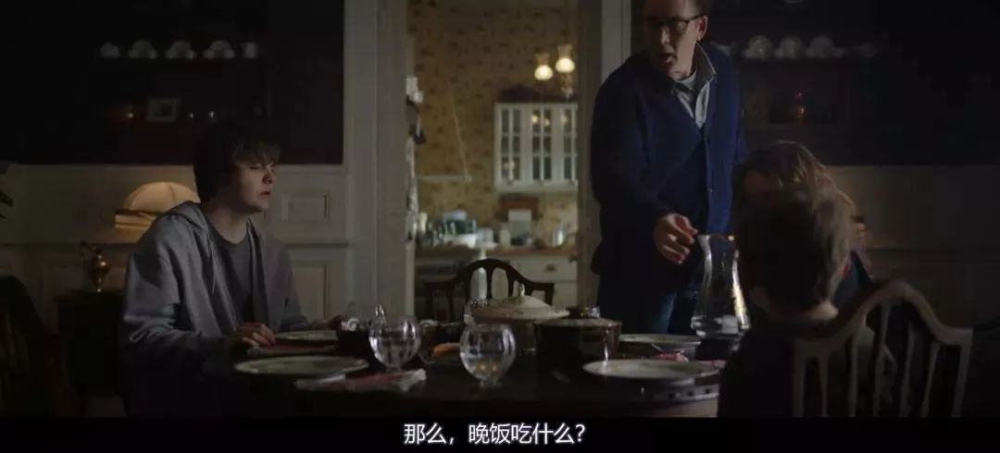

影片开始，内森一家正处于某种不易察觉的家庭危机之中。

妻子特蕾莎是一名股票交易员，作为家庭经济支柱的她不幸患上了癌症，精力不足导致流失了一大批客户，让她感到心力交瘁。

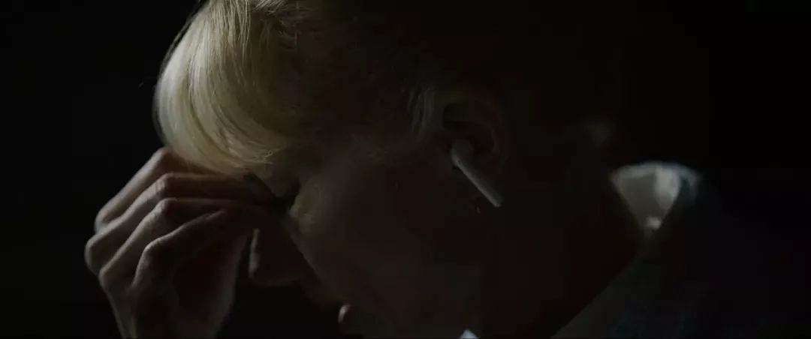

内森则是一名毫无建树的画家，妻子生病后，原本就没啥地位的他花大价钱买了几只羊驼，试图为家人以后的生计做点贡献。

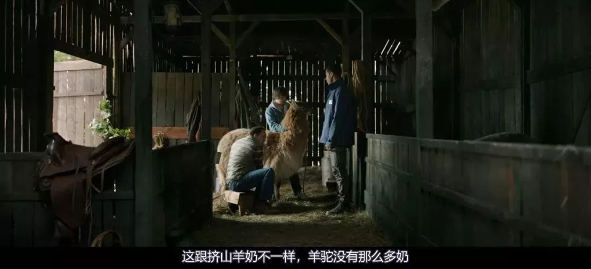

他甚至一改往日的懒散形象，开始下厨做饭。

然而，这些殷勤改变，还是招来了孩子们的厌恶。

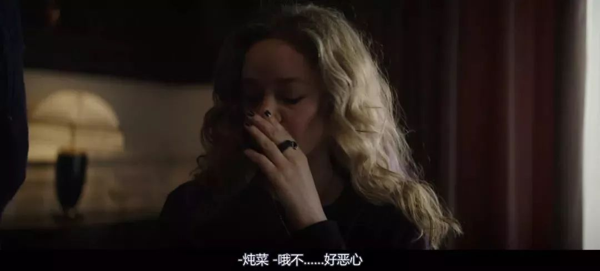

在家中，叛逆的女儿拉温妮亚是最不尊重内森这个父亲的。

她不仅经常当面顶嘴，还在暗地里研习巫术，试图用古老的仪式为母亲祈福，治愈她的癌症。

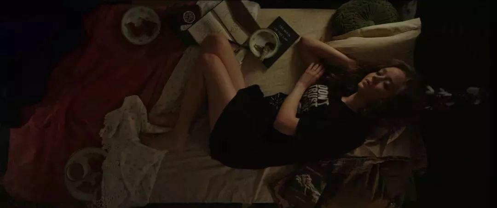

与女儿相比，大儿子班尼则是内森的翻版，整日无所事事，躲在马厩里飞叶子，是个不折不扣的小毒虫。

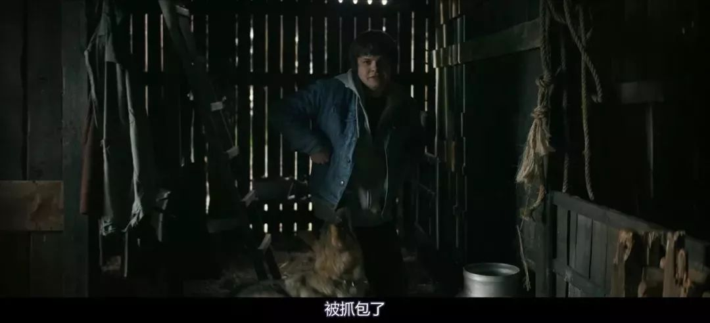

而小儿子杰克，则是一家人的快乐源泉，也是最让内森宠爱和省心的孩子。

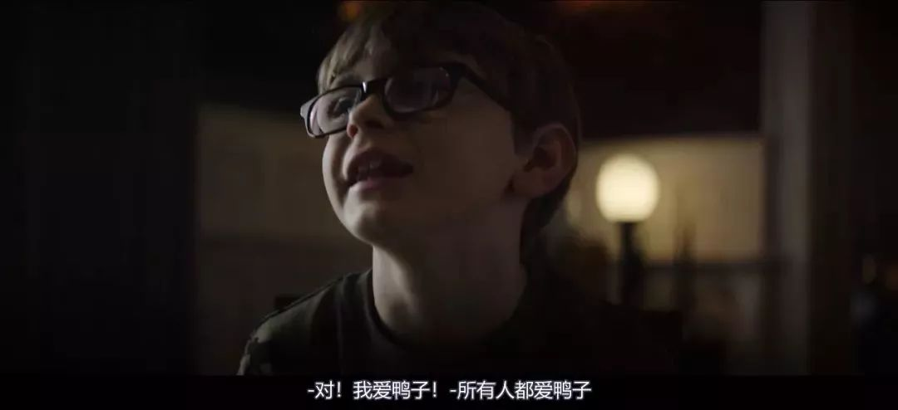

一天夜里，内森一家正准备熟睡之际，突然被一道伴随着巨响的眩光惊醒。

原来，是一颗色彩艳丽的陨石降落在院子里。

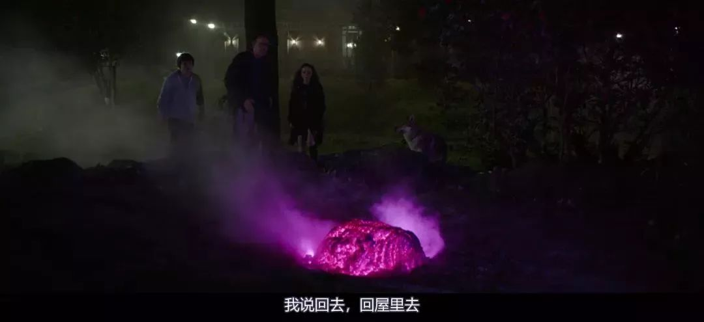

第二天一早，市长就带队前来围观，同行的一位地质与水文专家在勘测之后，觉得没啥大碍。

于是，市长便引来大批媒体报道陨石降临的“祥瑞之兆”，为兴建水坝的项目造势。

但随后不久，内森家里却出现了一连串难以解释的怪事。

先是五彩陨石吸引雷电，召唤出狂风暴雨；

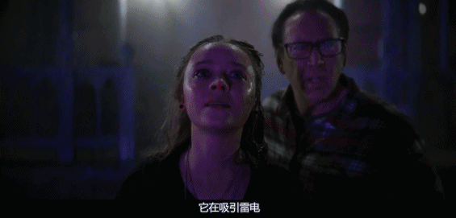

紧接着，祸事也接连降临到内森一家人身上。

比如妻子特蕾莎在切菜时，像中邪一般，切断了自己的手指；

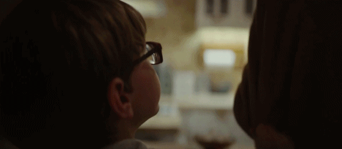

比如小儿子像精神失常一样对着井口发呆，与看不见的“朋友”对话；

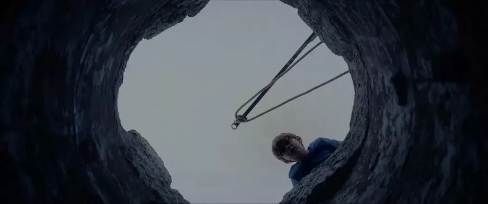

女儿也像受到某种诅咒，出现各种幻觉，身体日渐衰弱。

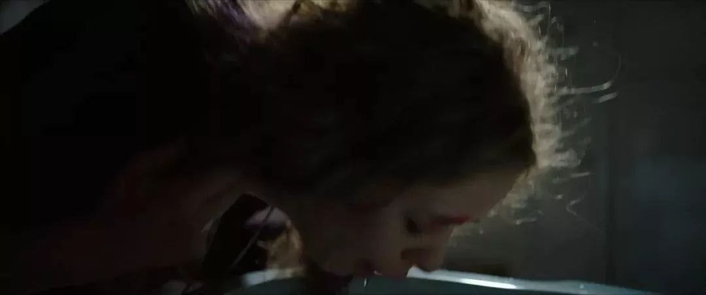

与此同时，内森在一次洗澡时还被不明生物攻击，手臂上开始起可怕的红疹。

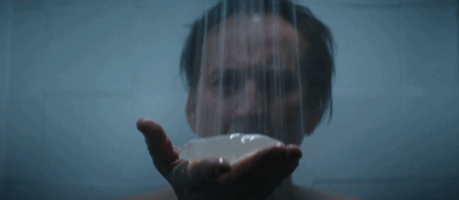

他因此变得日益暴躁，渐渐失去理智，经常把毫无缘由的怒气撒在别人身上，对妻子和孩子大吼大叫。

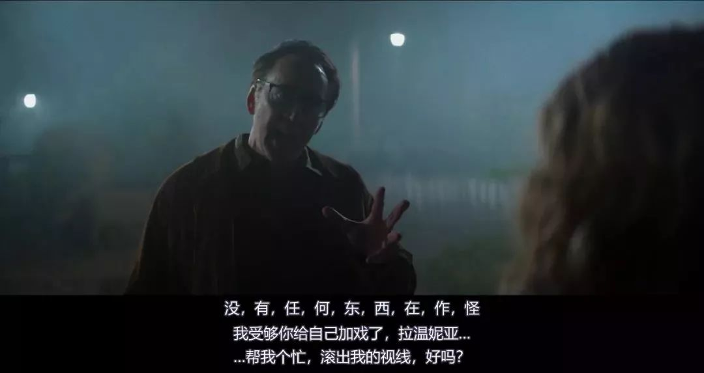

对于这一切显而易见的变化，没有人能说清缘由，一家人就这样谨小慎微地保持着默契，继续生活在恐惧与不安之中。

一天早上，之前那位地质专家跑来警告拉温妮亚，说陨石污染了水源，让她不要喝水。

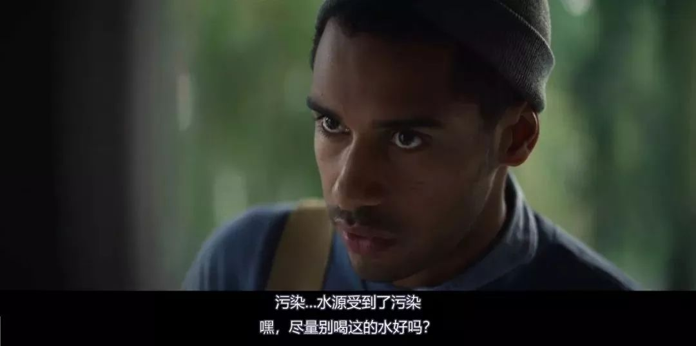

然而，真实的情况比这还严重和诡异得多。

没多久，拉温妮亚就变得疯狂失控，她大摆邪教仪式，试图用自残的方式献祭；

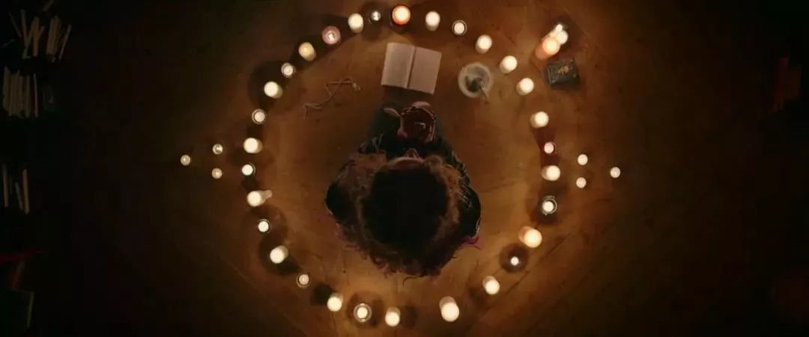
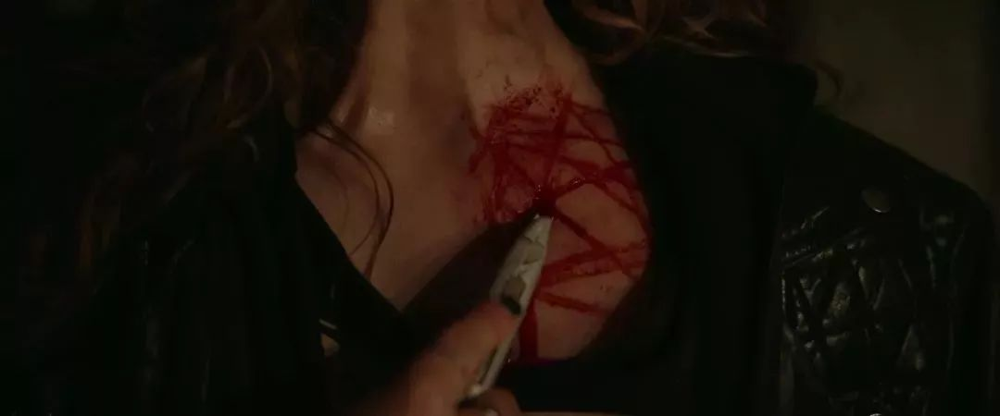

而小儿子杰克，无意中发现家里的羊驼已经被陨石发出的彩光变成了怪兽，他在逃跑时和母亲相撞，两人同时被彩光击中：

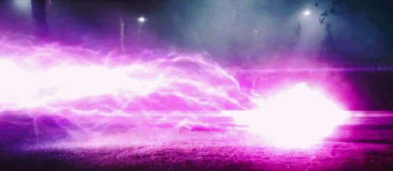

刹那之间，母亲和杰克的身体开始融合，杰克的头从母亲的后背中挣扎着冒了出来。

他们变成了一个恐怖而诡异的连体怪物，身上还不时闪着如陨石般的彩光……至此，这个家庭彻底崩溃了。

讲到这里，我们不难看出本片实际上讲的是一家人在外星物质的侵入下，慢慢异化、最终走向毁灭的故事。

而影片最吸引人的地方，就在于这种外星物质不是什么有形的怪物，而是一种绚丽光芒。

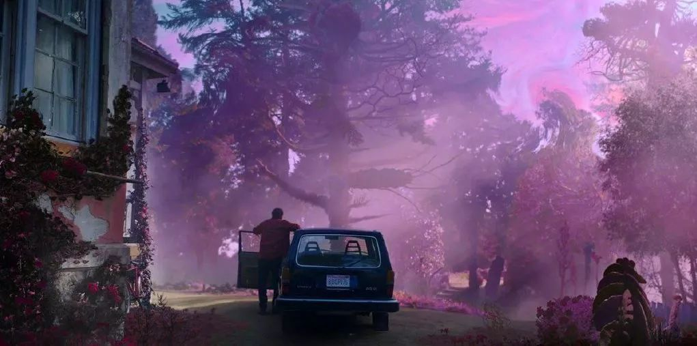

在原著小说中，洛夫克拉夫特将这种“星之彩”形容为“超越空间的色彩”、“在已知光谱之外”，足见其神秘美丽。

然而在耀眼的外表下，它是最为危险的存在，具有蚕食和异化生命的能力。

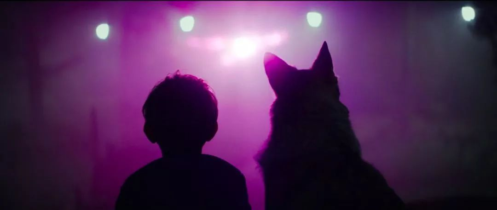

在片中，它不仅把杰克母子变成连体怪，还制造了许多令人惊叹的怪物。

比如，有从井里冒出来、在杰克面前展翅飞走的炫彩螳螂；

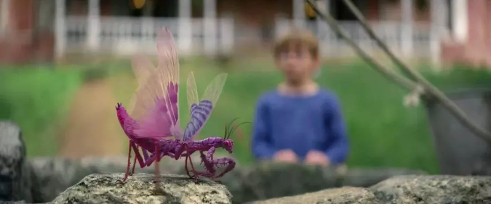

有在雨夜的路中穿过，差点害内森出了车祸的变种怪猫；

还有像异形一样张着血盆大口的连体羊驼怪等等。

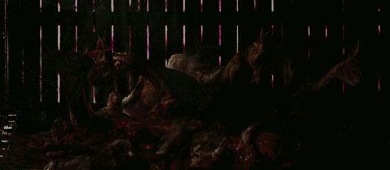
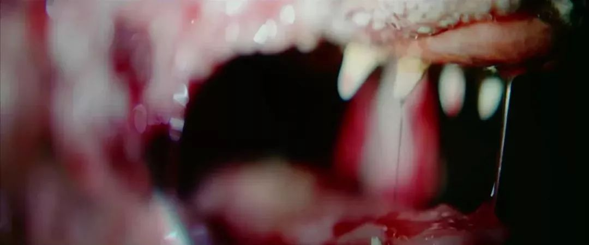

当这些克苏鲁式的怪物与神秘莫测的外星来客结合在一起时，就令人产生了一种本能的好奇与恐惧。

这正是“星之彩”的全部特质，它绚丽璀璨、光耀夺目，像“美丽”的黑洞一样吸引人，同时也潜藏着吞噬一切的邪恶与危险。

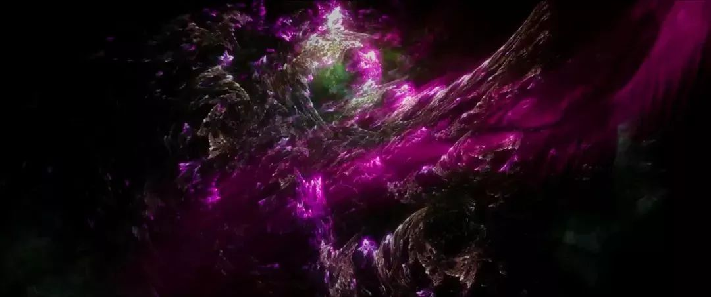

主角一家正是在“星之彩”的诱惑下，不知不觉地被侵蚀、异化，一个接一个变成了可怖的怪物。

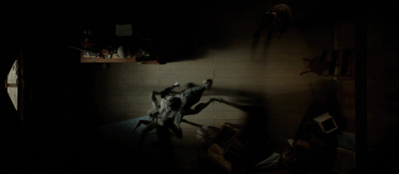

这样的剧情脉络和故事设定，让我想起了2018年的一部科幻惊悚片《湮灭》。

这两部影片有很多相似之处——

《湮灭》也是一道太空光芒把外星生物带到地球，并通过“闪光”的形式对地球生物产生偶发性的基因融合与突变，让人类产生困惑、恐慌，与之对抗。

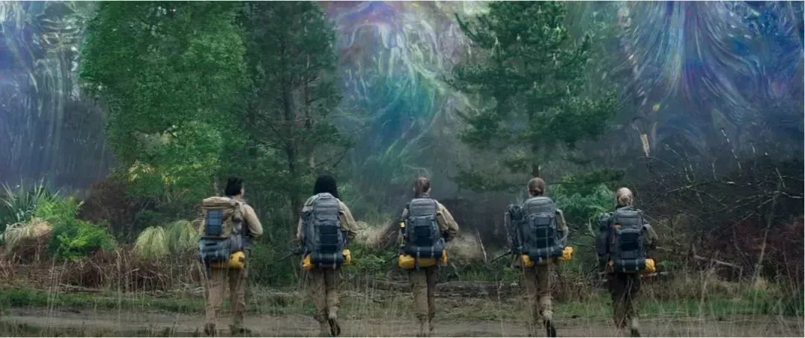

片中让人印象深刻的地方，是在“闪光”的影响下，出现了许多“移花接木”的自然异景和视觉奇观。

有野鹿头上开出桃花，也有人走着走着身上开花结果，变成真正的“植物”人……

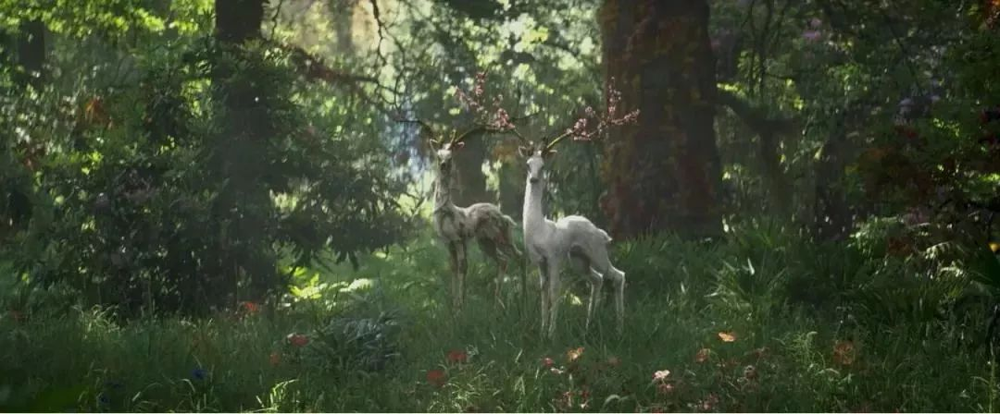
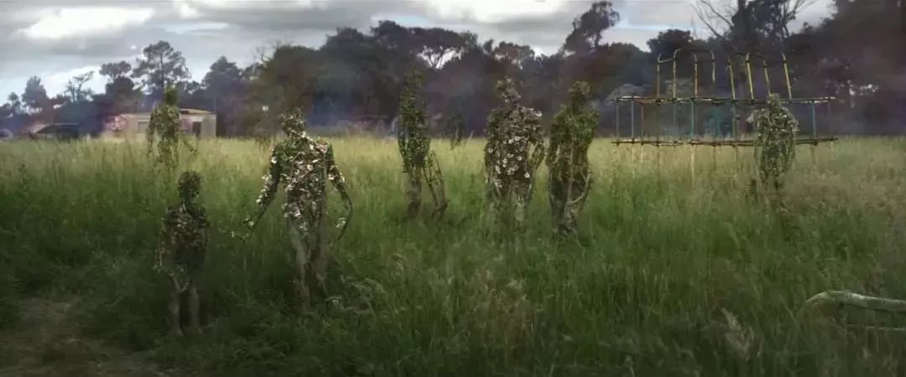

这些景象看起来诡异而震撼，甚至有种巧夺天工的艺术美感，但事实上，它意味着“闪光”在有意识地剥夺地球生物的自然进化权，进而像寄生虫一样消灭人类，湮灭地球上的一切……

因此，《湮灭》本质上讲的是外星力量入侵与人类自毁本能的对抗与相容，探讨的是自然历史的演化，与人类何去何从的终极问题。

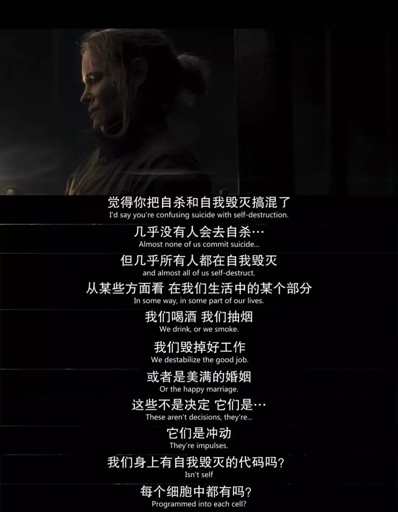

而今天这部《星之彩》，虽然没有《湮灭》看上去那么大气磅礴，但它们的主题内涵却高度一致。

在影片最后，全家人都死去，化为了“星之彩”的一部分。拉温妮亚面带笑容地迎接“星之彩”的吞噬，这恰恰是对人类自我毁灭本能的完美诠释。

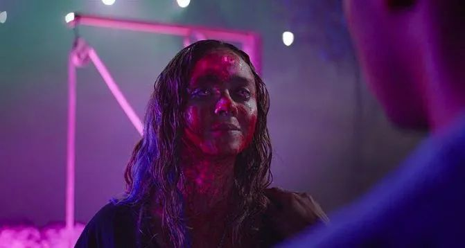

而这一点，影片其实在开场的家庭戏时，就给出了暗示。

一家人晚餐时的画面布局，像极了宗教名画《最后的晚餐》，大家各执一词地冷嘲热讽，表面上却装作若无其事的样子，更说明这个家庭暗流汹涌，已经到了崩溃的边缘。

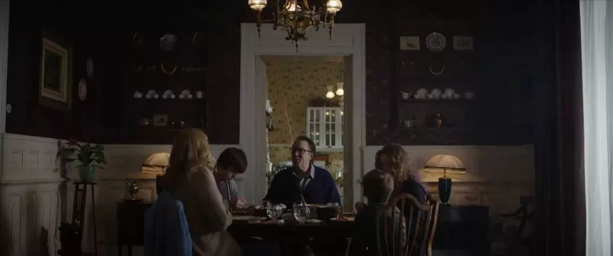

即使没有天降陨石，内森一家还是会因为内部矛盾而关系破裂，最终走向支离破碎。

而这个毁灭的过程，正说明外部灾难通常都是由内部的崩坏开始，正如很多所谓的天灾，也往往都是人祸所致。

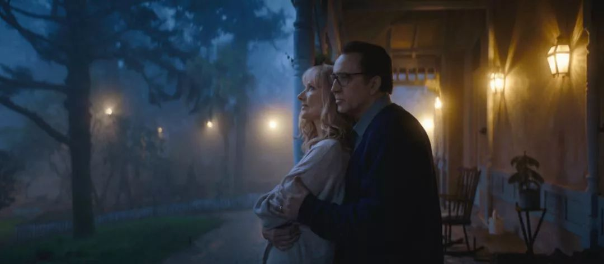

这就是《湮灭》里所说的那段台词：**几乎没有人会去自杀，但几乎所有人都在走向自我毁灭。**

往小了说，家庭矛盾，抽烟酗酒，熬夜赌博等恶习是在毁灭自己；往大了说，残杀动物、砍伐树木，破坏环境，是毁灭人类和自然。

片中也有一些细节表达了直接的批判，比如水源的污染，还有市长不顾生态破坏而大兴土木、修建水坝的举措等等。

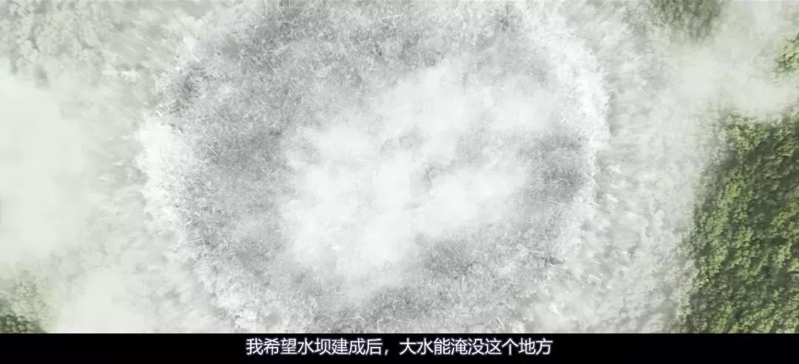

正是这些抽离于剧情之外的细节隐喻，拔高了整部影片的主题表达，让我们能够在猎奇、恐惧与震撼的观影体验中，产生一些对家庭社会和自然生态的思考。

人与人聚集在一起，形成了家庭、社会等大大小小的群体，但比之更大的，是整个生态环境和地球家园。人类生活在地球上，本质上就像病毒寄居在宿主身上一样，如果我们不能找到与自然和谐相处的方式、不加节制地破坏生态，最终很可能就会引得“星之彩”到来。

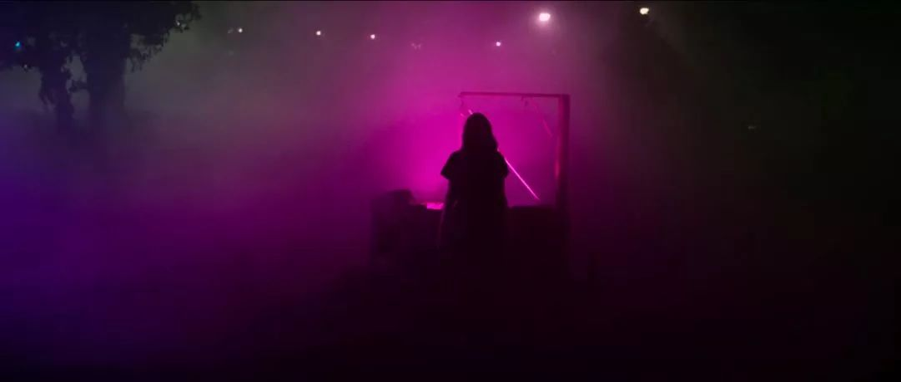

意识到这个事实并不可怕，可怕的是像片中主角一样，什么也不做，自暴自弃地走进那万劫不复的深渊。

**我想，只要我们愿意有所行动，对于人类自己和所处的家园，一切都还为时未晚！**

也许是国内最认真的电影自媒体
长按扫描二维码关注

在看