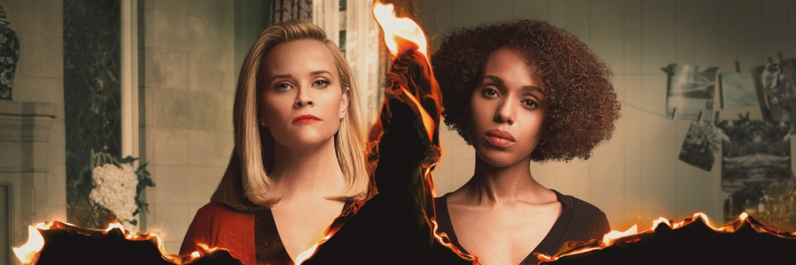
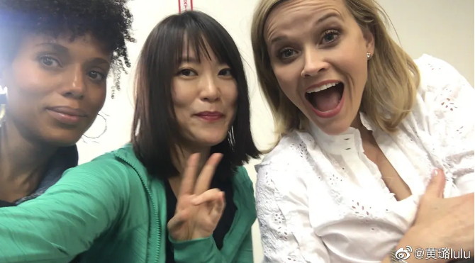
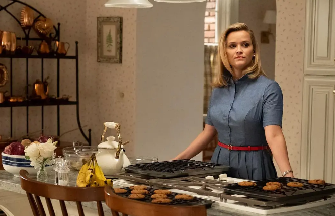
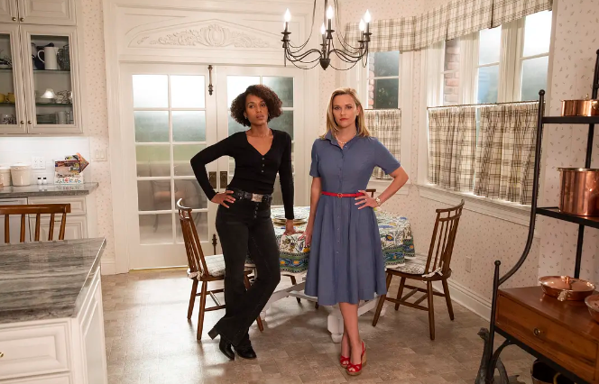
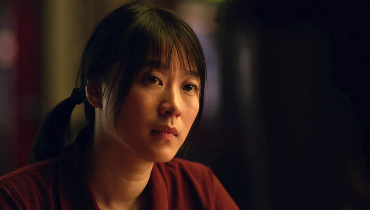

速读摘要

值得一提的是，剧中还有一个戏份颇重的女配角，由内地实力派女演员黄璐饰演。在四个孩子中，最让埃琳娜感到骄傲的是她的大女儿，聪明漂亮又听话，而且像她一样喜欢制定计划，简直就是自己的翻版。米娅虽然摒弃循规蹈矩的物质生活，但又无法忽视，女儿在埃琳娜家确实体验到了家庭的幸福感。这件事将米娅和埃琳娜卷入其中，两人再次站在了对立的两端，米娅决意帮助贝比夺回孩子，而埃琳娜则坚定地站在朋友这边。但现实却是，你必须在有限的人生中做出选择，选择了稳定就必须舍弃一部分自由，要想人生过得容易，最好按照前人总结的经验按部就班地走下去。

原文约 2565  字  | 图片 34 张 | 建议阅读 6 分钟 | [评价反馈](https://static.app.yinxiang.com/embedded-web/clipper/#/Evaluating?d=2020-03-28&nu=ed9f00a3-3374-4160-bbc6-d587d22d5140&fr=myyxbj&ud=58b471&v=2&sig=4FD9E3CD3D0ED119DD98F57EDE113EB4)

##  华人出演的美剧，第一集就烧了起来

原创 有部电影 [有部电影]()**
今天给大家聊一部新出的美剧——**《星星之火》。**

这部剧在播出前，就凭主演阵容博得了一波关注。

两位女主由奥斯卡影后瑞茜·威瑟斯彭和多次获得艾美奖提名的凯丽·华盛顿饰演，从海报和预告就能看出，她们的角色之间势必要展开一场剑拔弩张的对峙。

值得一提的是，剧中还有一个戏份颇重的女配角，由内地实力派女演员黄璐饰演。

黄璐凭借在电影《盲山》中的表演被不少观众熟知，这也是她第一次参与好莱坞制作。因此，剧集开拍时就带动了一波国内影迷的关注。

《星星之火》的故事，发生在上世纪90年代的美国，一个叫西克尔的小镇。

这是一个历史悠久的中产社区，民风保守、秩序井然，社区居民都信奉一条处世哲学：一切都应该制定计划，避免变数和灾难。

生长于斯的女主角埃琳娜，就是这条社区箴言的忠实拥护者。

平日里她极其自律，闹钟一响立刻起床，每天都详细记录自己的体重变化，连喝酒都要用量杯精准把控剂量。

.jpg)

不仅如此，全家人的生活也都被埃琳娜安排得明明白白，彩色便利签是她常用的消耗品，提醒她密切掌握家人的动态。

.jpg)

埃琳娜就像一个统揽全局的指挥官，四个孩子的吃喝拉撒必须指哪打哪，丈夫的性致也必须控制在周三和周六两天。

因为在她看来，所有事情必须经过事先计划，才会更有意思。

.jpg)

在四个孩子中，最让埃琳娜感到骄傲的是她的大女儿，聪明漂亮又听话，而且像她一样喜欢制定计划，简直就是自己的翻版。

.jpg)

相对而言，小女儿伊奇却让她头疼不已。

伊奇是学校的小提琴手，但私下里却喜欢画画和摇滚，她不愿像姐姐一样，任由妈妈把自己打扮成“公主”，而是经常沉浸在自己的世界中。

.jpg)

在埃琳娜井井有条的生活中，伊奇经常给她制造突如其来的灾难。

她想让伊奇披散开长发，觉得这样更漂亮，结果伊奇非但不听话，还任性地烧毁了半边头发；

.jpg)

她想让伊奇脱掉短裤黑丝，换上漂亮的裙子去表演，结果伊奇直接在台上公然做出无声的反抗；

.jpg)

她希望伊奇能多学学姐姐，成为学校里讨人喜欢的校花，但伊奇却因为顶撞老师被罚停课。

.jpg)

因为这些事，埃琳娜不得不抽出更多时间，想办法把女儿拉回“正轨”。

就在这时，一对母女闯入了埃琳娜的生活——米娅和她的女儿珀尔。

.jpg)

米娅是个艺术家，经常辗转各地进行艺术创作，母女俩没有固定的住所。

这种流浪生活，把她们的日常需求压到最低，只有简单的随身行李，经常轻装上阵说走就走。

可以说，米娅就是埃琳娜的反面。她以创作为生，拒绝循规蹈矩，从不追求奢华的物质，在她眼里创作大于一切。

.jpg)

这样一对随遇而安的母女，来到了墨守成规的小镇西克尔，成为了埃琳娜的房客。米娅还充当起埃琳娜一家的钟点工。

两个风格迥异的家庭相遇，让两种不同的生活方式产生了碰撞。

在观看这部剧的时候，你会不由自主地将埃琳娜和米娅这两个母亲相互比较。

面对女儿伊奇的叛逆，埃琳娜苦口婆心地教导她要守规矩，因为这是社会约定俗成的法则；

.jpg)

而面对女儿珀尔抗拒流浪生活的情绪，米娅则教育女儿不懂感恩——**有多少孩子想要体验说走就走的自由生活，只有你做到了。**

.jpg)

从她们教育女儿的方式就能看出，两位女主**一个向往按部就班的安稳，一个崇尚与世无争的自由。**

如此截然相反的观念，导致这两个女性主导的家庭产生交集之后，迎来了一波相互质疑。

米娅在埃琳娜家第一天上岗，就对墙上的家庭计划表露出深深的嫌弃，当她看到埃琳娜把叛逆的伊奇打扮成了洋娃娃，甚至会流露出失望和怜悯之意。

.jpg)

而埃琳娜得知米娅为了艺术创作，经常身兼几份零工，无法陪伴珀尔，也开始旁敲侧击地提醒米娅的教育方式有问题。

.jpg)

随着往来越来越密切，两个家庭的成员也因此产生了微妙的心理变化，在比较和质疑的过程中，渐渐从对方那里发现了自己不曾拥有的东西。

珀尔慢慢和埃琳娜的孩子们打成了一片，羡慕起这种稳定的生活，也越发抗拒继续流浪，为此和米娅大吵一架；

.jpg)

伊奇在特立独行之余，意外发现米娅正是自己期待已久的那种“酷妈”，所有的“叛逆行为”在她那里反而得到了欣赏。

.jpg)

埃琳娜虽然看不上米娅的流浪生活，但米娅精湛的厨艺却又让她不得不承认，“不靠谱的艺术家”也能具备贤妻良母的特质；

.jpg)

米娅虽然摒弃循规蹈矩的物质生活，但又无法忽视，女儿在埃琳娜家确实体验到了家庭的幸福感。

.jpg)

从这个角度看，两个家庭之间的对比，本质上探讨的是一个更深层的问题——

**大人们应该给孩子创造怎样的条件和环境，才算得上是“称职”？**

**是按部就班地“改造”他们，舍弃一些自由以适应社会竞争；还是任由他们释放内心的渴望，追寻自己想要的生活？**

剧中两个女主的不同立场，最终集中到了黄璐饰演的华人移民贝比的身上。

贝比是米娅在餐馆打工认识的同事，曾经有个女儿，但因为实在无力抚养，不得不把嗷嗷待哺的婴儿遗弃在了消防局。

从那以后，贝比没有一天不后悔自己的决定，她想去寻找女儿，但无奈自己是非法移民，只能作罢。

但巧的是，那个被遗弃的婴儿，后来被埃琳娜的朋友收养了，米娅把这个发现告诉了贝比，结果引发了轩然大波——就在大家为婴儿庆祝生日时，贝比突然现身，要夺回自己的孩子。

.jpg)

这件事将米娅和埃琳娜卷入其中，两人再次站在了对立的两端，米娅决意帮助贝比夺回孩子，而埃琳娜则坚定地站在朋友这边。

剧集的第一集就用倒叙的方式揭晓了这场夺子大战，让所有的矛盾一触即发，有人故意纵火，点燃了埃琳娜家的豪宅……

.jpg)

**值得注意的是，剧名中的“星星之火”，不光指的是埃琳娜家遭遇的这场纵火，也暗喻人们心中那份真实的渴望。**

**每个人在成长过程中，都曾希望将来能够过上自己想要的生活，这种愿望犹如一团火苗在我们心中点燃。**

但现实却是，你必须在有限的人生中做出选择，选择了稳定就必须舍弃一部分自由，要想人生过得容易，最好按照前人总结的经验按部就班地走下去。

至于心中的那团火苗，只能将其熄灭。

.jpg)

剧中的埃琳娜，就是选择把火苗熄灭的那类人。

她曾经是个胸怀壮志的记者，为了工作可以熬夜加班，采访过不少政界名人，凭她的实力，本可以在这个行业大有作为。

然而为了家庭与子女，她不得不舍弃那份心爱的职业，转而给报社兼职，因为老话说“鱼与熊掌不可兼得”。

.jpg)

埃琳娜用“火苗”换来的，是幸福的家庭和漂亮的房子，在当地混得如鱼得水。

这种交换在她看来也很划算，因为自己遵守了“规则”，做出了“正确”的决定，所以才会如此幸福，孩子们也能在她的指导下，沿着这条路健康成长。

.jpg)

相比之下，米娅则是任由“火苗”肆意燃烧的那类人。

她热爱艺术，并为之付出了全部，自由是她最宝贵的财富。即便无法拥有富足的生活，对于这样的选择，她也同样从未有半点迟疑。

这两种生活方式，《星星之火》这部剧和原著小说都没有给出主观的评论，而是让我们同时看到不同的人生选择下，生活会有多少得与失。

**某种程度上说，剧中的两位女主就是现实生活的一体两面，几乎每个人都想活成埃琳娜的样子，拥有难度不高的稳定工作、儿女双全的幸福家庭，在当地办什么事都有自己的人脉；**

**但内心深处，又忍不住想要尝试米娅过的那种生活，可以抛开一切世俗眼光，去追寻自己最渴望的理想。**

**每个人都曾有过“现在的生活就是我想要的吗？”这种疑问，我想，看过这部《星星之火》，或许你就会找到自己的答案。**

也许是国内最认真的电影自媒体
长按扫描二维码关注

在看