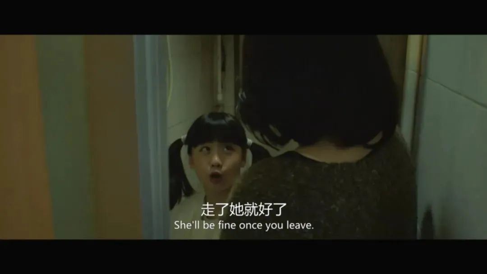

## 让人惊艳的国产伦理片里，有中国最被低估的女演员

原创 有部电影 有部电影 *今天*

最近几年，“原生家庭”这个词在国产影视剧中彻底火了一把。

  

只要在剧情里设置一个对子女无节制讨债、施加精神控制的父母人设，基本就能锁定第二天的热搜，顺带引发网友一阵同病相怜般的热议。

  

  

这种雷同机械的设定，也把“原生家庭”这个词直接带上了贬义。

  

只要提到它，你就会脑补各种闹心的家庭抓马。

  

不过，最近的一部热门国产片，却用另一种方式讲述了一个有关原生家庭的故事——**《春潮》。**

  

  

影片围绕同一屋檐下的三代女性展开。

  

金燕玲饰演的姥姥，年轻时从南方嫁到北方，困难时期吃了不少苦。

  

  

姥姥的前半生，在羞辱的婚姻中度过，丈夫有露阴癖，经常当众被抓流氓，还曾因为嫖娼少给钱，被妓女报警。

  

这种苦日子，让姥姥把人生希望投向宗教信仰，成为了一名虔诚的佛教徒，还在小区里结识了憨厚的老周。

  

  

出门在外，她是热心的居委会大妈，热衷于传播社会正能量；

  

回到家里，她却满腹牢骚、阴晴不定，一想起死去的丈夫就开始谩骂，经常迁怒于“白眼狼”女儿。

  

  

郝蕾饰演的女儿郭建波，性格与母亲截然相反。

  

她是个富有正义感的报社记者，专门跑社会新闻，曾经与艾滋病人同吃同住，是个敢说真话的媒体人。

  

  

但也正因为拒绝圆滑世故，她人到中年都没能坐上主编的位子。

  

她没钱没车没房，女儿还得靠母亲帮衬着抚养，唯一属于自己的一小片天地，就是报社提供的宿舍。

  

在不想回宿舍的夜晚，她则会到P友家里过夜。

  

  

也许因为经济上矮人一等，郭建波从来不对妈妈的指责与谩骂做出回应，总是选择沉默，或者干脆走人。

  

  

在这两个女家长的围绕下，外孙女婉婷从小练就了察言观色的火眼金睛。

  

她被姥姥一手带大，更像是妈妈和姥姥之间紧张关系的缓冲剂。

  

见姥姥骂姥爷的话太难听，她敢回怼“你这么说你丈夫好吗”；看姥姥要对妈妈发火，她就悄悄劝妈妈“你快走吧，走了她就好了，你俩八字不合”。

  

  

婉婷虽然看上去大大咧咧，但内心十分渴望能有一个完整的家庭。

  

尤其是看到同学一家三口、其乐融融的样子，她眼中的羡慕溢于言表。

  

  

这个家庭对她来说，有太多疑问，但婉婷无法从姥姥和妈妈那里问出答案，只能一次次地表达对妈妈缺席自己成长的小小不满。

  

  

可以说，光是这些日常生活中勾勒出来的细节，就足以看出祖孙三代之间的矛盾由来已久。

  

海报上那句**“你和母亲的关系，决定你和世界的关系”**，正是道出了原生家庭对于个人的影响。

  

  

值得注意的是，《春潮》在表现原生家庭这个话题时，并没有采用电视剧里那种夸张的模式。

  

影片甚至没有多少煽动情绪的戏码，而是通过对日常生活的刻画，展现这个屋檐下暗潮涌动的家庭关系。

  

其中最具代表性的情节，都发生在饭桌上。

  

影片开场不久，家里来了姥姥的教友，饭桌上姥姥回忆起了苦日子，说婉婷就是她此生欠下的债。

  

  

古灵精怪的婉婷趁机接话：那你还不对我好点，考个99分都要挨你的骂。

  

没想到，这话直接戳到了姥姥的怒点——嫌我对你不好，那你走啊，天天伺候你还伺候出这么多意见。你妈把我当傻子，你也把我当傻子？

  

  

这时镜头给到挨骂的母女俩——

  

**大的抬抬眼，继续低头吃饭；**

  

**小的则娴熟地跟客人打圆场：你看，又发飙了……**

  

  

另一处饭桌上的戏，发生在姥姥和老周完婚后。

  

为了打破陌生感，老周率先夸起了郭建波，说她的新闻报导句句在理，是个出色的记者。

  

  

结果还没夸完，姥姥就开始指桑骂槐——**这算什么记者，拿着国家的工资，吃着国家的粮，还要批评揭露国家的阴暗面。**

  

做人就要懂得感恩，不然真的连畜生都不如。

  

  

接着姥姥又想起了丈夫的黑历史，当着家人面开始了一通数落。

  

镜头里的郭建波，依旧是低眉顺眼、不做反驳，自顾自地吃着饭。

  

  

眼看气氛越来越糟糕，婉婷起身故意弄洒了牛奶，这才打破了阴阳怪气的氛围，趁机劝妈妈赶紧回宿舍躲清静……

  

  

仅仅这两场戏，就足以勾勒出祖孙三代之间的关系。

  

在最能体现中国家庭关系的饭桌上，金燕玲和郝蕾之间一热一冷的碰撞，生动诠释了母女俩截然不同的愤怒——

  

**一个是多年压抑后的外放张扬，一个是即将爆发前的克制隐忍。**

  

  

这样的剧情，其实更加贴近现实。

  

生活中没有多少家庭是整天鸡飞狗跳的，更多时候，是一方对另一方的压制或容忍。

  

对于夹在两代人之间的女主郭建波，导演在人物刻画方面有意做了留白，片中没有交代婉婷的生父是谁，就连郭建波和P友之间的互动，也全程无对白。

  

  

但正是这种留白，让观众体会到郭建波体内的叛逆感——**母亲越是想要维持生活的表面和谐，她就越要用实际行动，把社会最糟糕的一面展现给母亲。**

  

母亲烧掉父亲仅有的遗物，她就毫不客气地打翻母亲的佛经。

  

  

可以说，在刻画原生家庭这个层次上，《春潮》已经远远领先于同题材影片，它的优势正来源于真实。

  

影片取景于真实的生活场景，姥姥家的那套房子，就是导演生活过的大姨家，画面中的一切，都充满了她的成长痕迹。

  

房间内的布局和周遭的环境，也能顺利唤起北方孩子们的儿时记忆。

  

  

即便空间狭小，影片的摄影还是下足了功夫，充分利用构图去渲染人物之间的心理距离。

  

  

在人物刻画方面，导演也深知郝蕾的表演特色，开场两个场景，没用多少对白，就勾勒出郭建波的性格特征。

  

她报道了一则性侵女童的案件，采访嫌疑人时，对方振振有词地坚称女童们是**“自愿的”**，郭建波二话不说把自己的包砸向对方，上前又补了一记响亮的耳光。

  

  

采访结束后，她回到母亲家中，发现街坊四邻正在排练节目，心烦意乱的她去厨房抽烟，结果被母亲骂了句“有毛病”，她转身就把烟头怼进了母亲准备好的饺子皮里……

  

**在外嫉恶如仇，对内无声反抗**，正是郭建波的真实写照。

  

  

不过，《春潮》并不是一部完美的电影。

  

导演在刻画祖孙三代人关系的同时，插入了不少超现实段落，比如郭建波总是遇见一个长发女子阴魂不散地出现在身边，又比如她曾梦见母亲是一只黑羊，惨叫着被一众医护人员捆绑拖走……

  

  

这些情节，你可以理解为郭建波的内心世界，母亲的精神压迫，已经给她造成了不可磨灭的心理伤害。

  

但这些段落，在我看来其实有点鸡肋。

  

一方面，以郝蕾的演技，完全不需要超现实段落去助攻，她已经很好地诠释出了郭建波复杂的内心世界。

  

  

另一方面，它们打乱了原本就有点松散的叙事结构，也消减了片中营造的真实气息。

  

影片另一个美中不足的地方，是导演对结尾的处理。

  

姥姥因为一次争吵，发病住院。

  

在她昏迷时，沉默良久的郭建波对着窗外夜色，道出了苦水——**她一直都憎恨母亲，反而是被称作“臭流氓”的父亲，给了她最宝贵的亲人之爱。**

  

  

这段独白长达7分多钟，一口气补全了前面剧情里对郭建波的留白。

  

虽然郝蕾的表演仍旧无可挑剔，但台词实在过于书面化，透出些许遗憾和尴尬。

  

  

而且这份突如其来的信息量，也让影片的留白丧失了意味，结尾的隐喻更是变得寡淡起来——

  

那股暗潮涌动的水流逐渐没过了郭建波生活过的地方，水流也许是她的释怀，也许是她最后的愤怒，也或许是她想要冲淡过往的渴望。

  

  

**不过即便如此，《春潮》仍是近期最出色的国产电影。**

  

在讲述原生家庭故事这方面，导演进行了一些新的尝试，郝蕾和金燕玲这个母女组合的出色演绎，也值得一看。

  

**即便它有瑕疵，但我们可以从中看到国产电影的进步，也可以看到还有许多电影人，在努力讲述着普通人的故事。**

