## 这部温情催泪弹，诉说的是父辈的爱情与浪漫

原创 有部电影 有部电影 *今天*

家庭与婚姻，似乎是中外电影都很热衷的一个永恒话题。  

  

去年就有好几部口碑佳作，中国有《地久天长》，美国有《婚姻故事》，韩国有《82年生的金智英》。

  

最近，我又看到一部英国影片，聚焦中年夫妇的恩爱日常，拍得细腻感人——**《普通之爱》。**

  

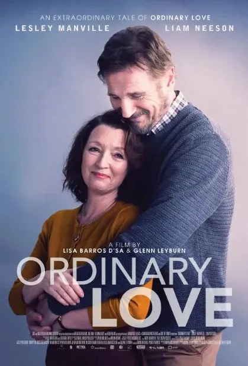

  

影片由“飓风大叔”连姆·尼森主演，这次他依旧在拯救家人，只不过画风大不相同。

  

片中，他饰演的汤姆和妻子琼是一对普通的中年夫妇。

  

二人都已退休，生活节奏安稳闲适，平时在家就看看电视、拌拌嘴。

  

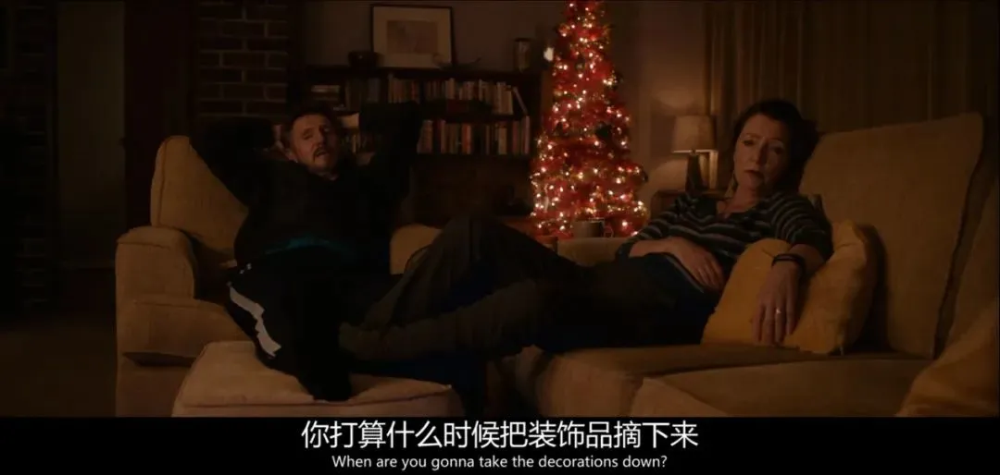

  

每天早晨，他们都会手牵手出去散步。

  

两人还有个仪式化的小浪漫，就是必须要走到桥头的一棵小树旁，绕一圈再返回。

  

从相处的状态来看，他们依然很恩爱。

  

  

一天晚上，琼在洗完澡后发现胸部有个肿块，汤姆嘴上安慰说没事，但还是带着妻子一起去医院做了检查。

  

没想到，一查就发现琼得了乳腺癌。

  

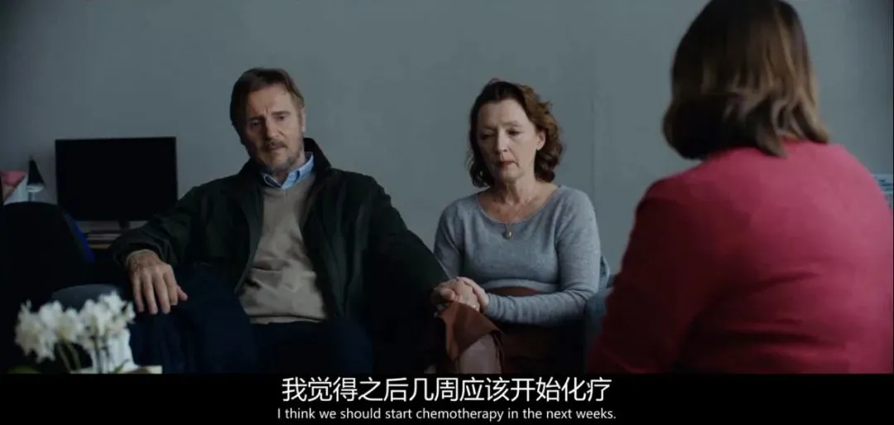

  

这个噩耗，让夫妇俩都有点措手不及。

  

他们聪明可爱的女儿黛比，也是在上中学时不幸因病去世的。

  

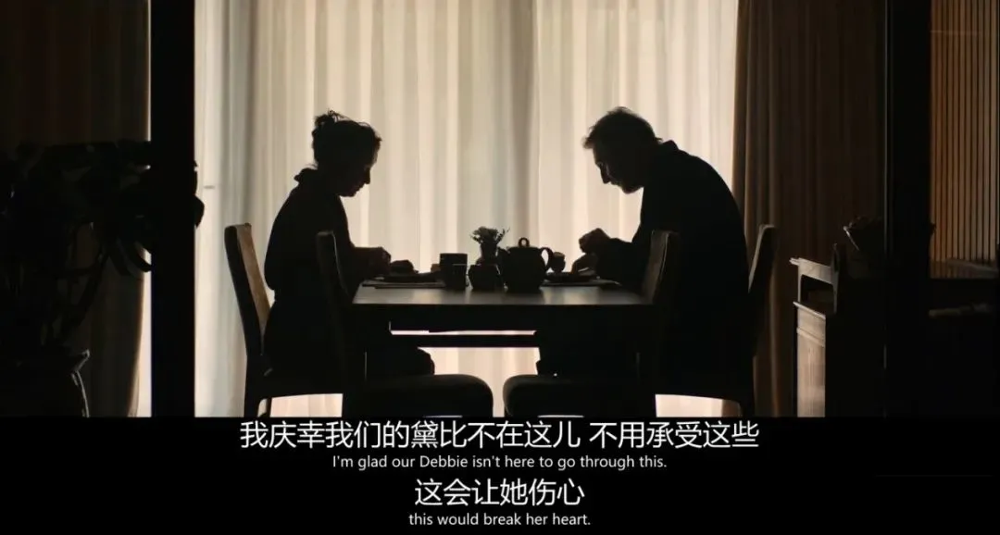

  

按照医生的指示，琼先要做手术摘除肿瘤，再进行各项检查、化疗，必要时还需要切除双乳……

  

一想到这些，她就感到担心和害怕，而汤姆则显得很沉稳，他不断安慰妻子，表示不管干什么他都会陪在身边。

  

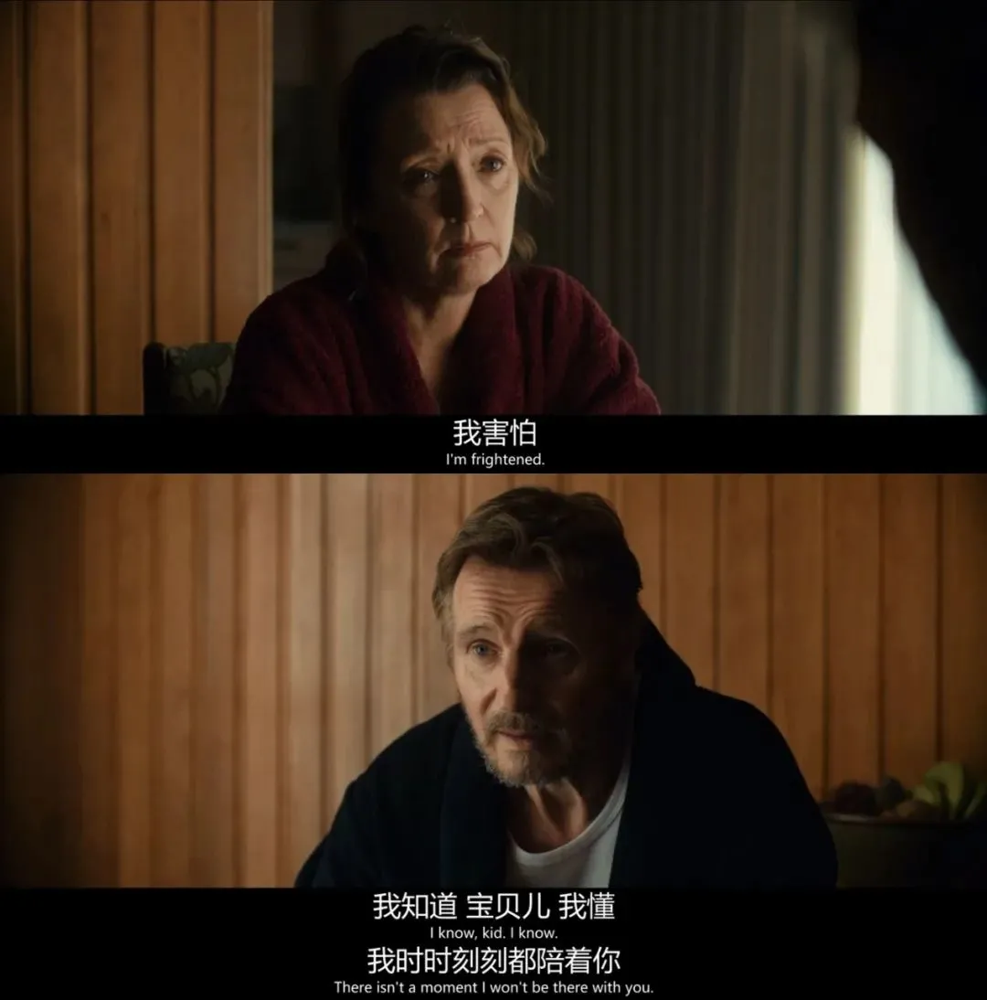

  

不巧的是，第一次手术那天，刚好是黛比的生日。

  

以往的这一天，夫妇俩会到墓园去看望女儿。这次，汤姆决定去医院陪妻子。

  

但琼却坚持让他到墓园去，还叮嘱他为自己的缺席向女儿道歉，并且千万不能告诉女儿自己生病了。

  

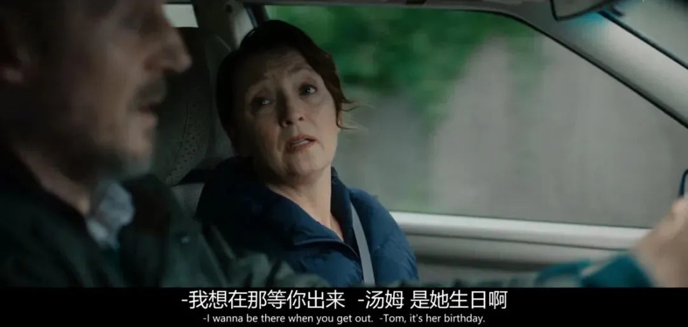

  

拗不过妻子，汤姆只好先把琼送到医院，然后独自来到墓园。

  

这时我们才发现，外表高大威猛的汤姆，其实一直都在妻子面前佯装坚强。

  

在女儿的墓前，他才显露出软弱的一面，把自己的担忧焦虑一一向女儿哭诉出来。

  

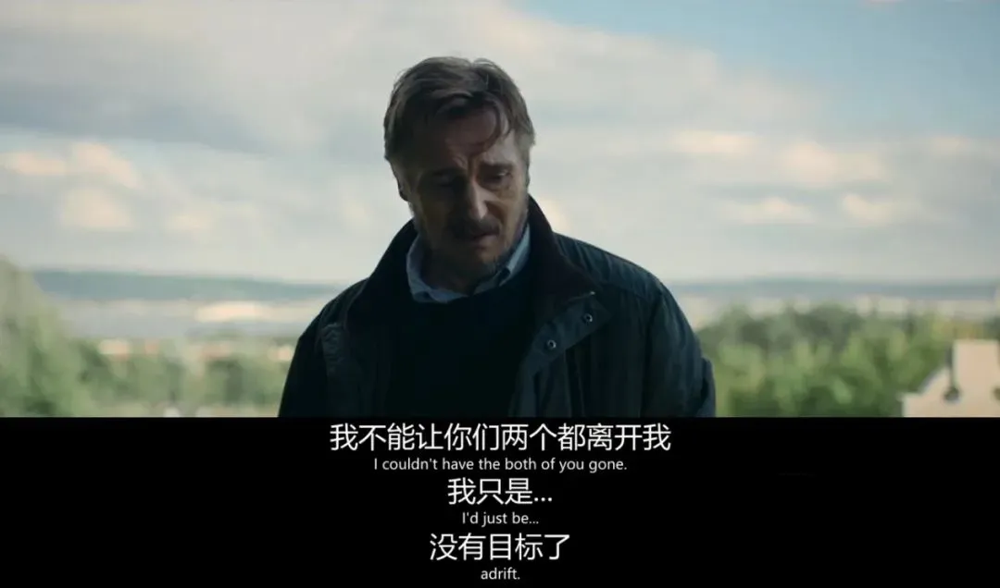

  

另一边，琼在手术中也遇到了突发状况，肿瘤比医生先前的判断要大不少，手术也复杂耗时得多。

  

在昏迷之际，琼梦到了自己在火车上焦急地寻找，而丈夫在车下不断离自己远去的情景。

  

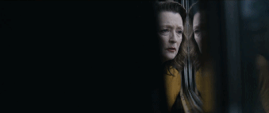

  

虽然这场手术还算顺利，但医生接着又告诉他们，有一些微小的癌细胞无法扫描出来，要想根除只能进行化疗，而且还要进行全身的脏器检查，以防癌细胞扩散。

  

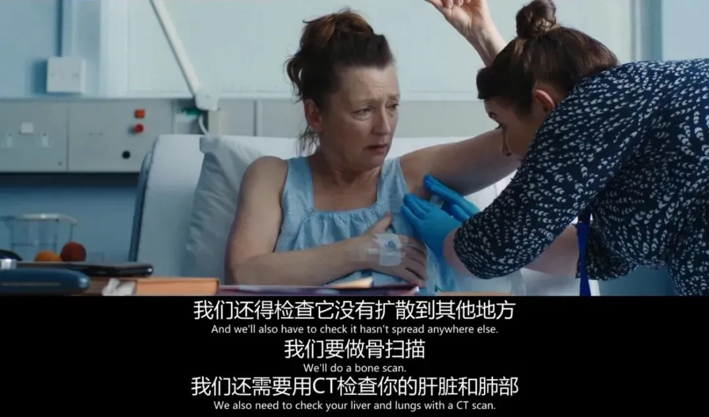

  

这基本上就宣告琼不得不跟癌症来一场痛苦的持久战了。

  

在这之后，夫妇二人对病症的态度，也发生了微妙的变化——汤姆变得比琼更加忧虑和敏感。

  

正是这个变化，让人发现汤姆对琼的爱，远比我们想象的还要深沉浓烈。

  

比如，他会经常抱怨医生这没做好、那没做好，有时还会当面质疑医生；

  

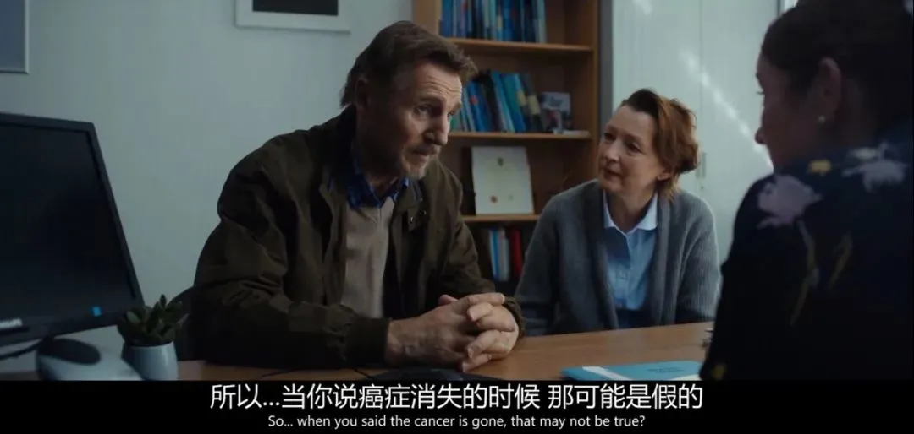

  

比如，由于忙碌和疏忽导致家里的金鱼死掉了，汤姆伤心地大哭了一场，但为了不让妻子分心，他又偷偷买回了一条金鱼。

  

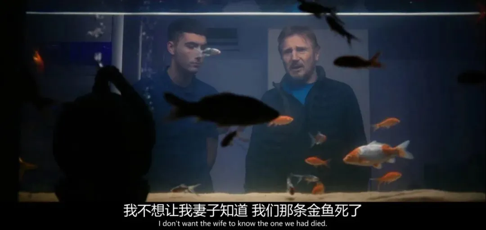

  

不难发现，本片的基调虽然有些忧伤，但通过两人共同抗癌的过程，让人看到了这对中年夫妇相爱相守的那份真情。

  

正如片名“普通之爱”所描述的，发生在汤姆和琼身上的故事，完全就是普通恋人遇到共同的难题时，也会做出的最真诚动人的反应。

  

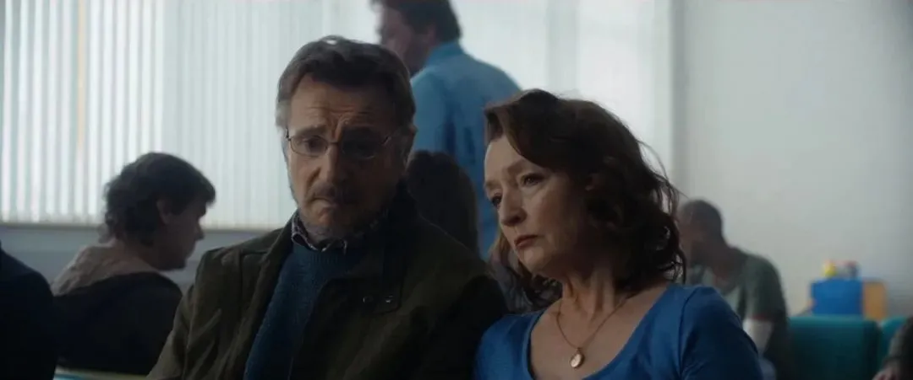

  

面对这场突如其来的病症打击，他们也不总是那么恩爱有加，很多时候都难免有摩擦和争吵。

  

比如，当汤姆不停质问医生时，琼就把他狠批一顿，让他在医院少说话，免得暴露自己智商，搞得别人尴尬。

  

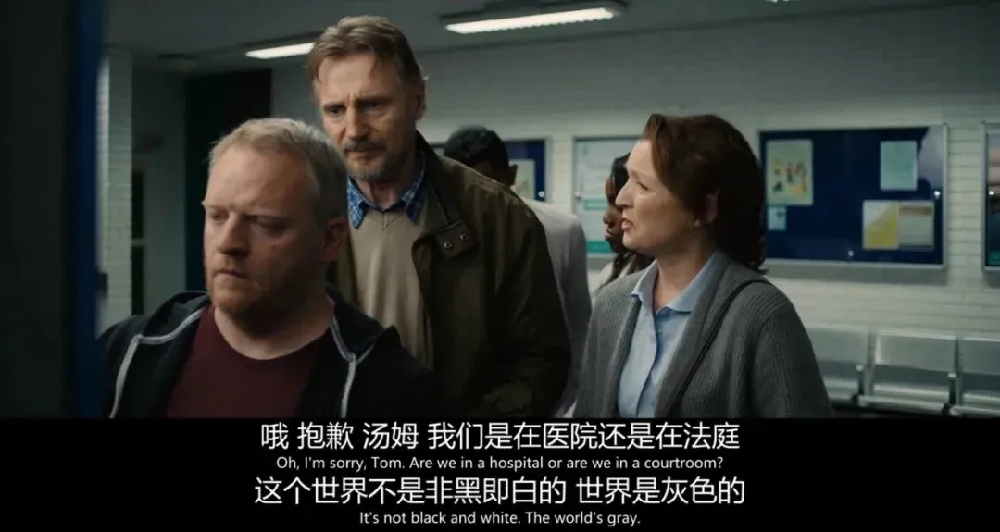

  

比如，琼在化疗后身体虚弱，情绪也暴躁易怒，因此跟汤姆大吵一架。

  

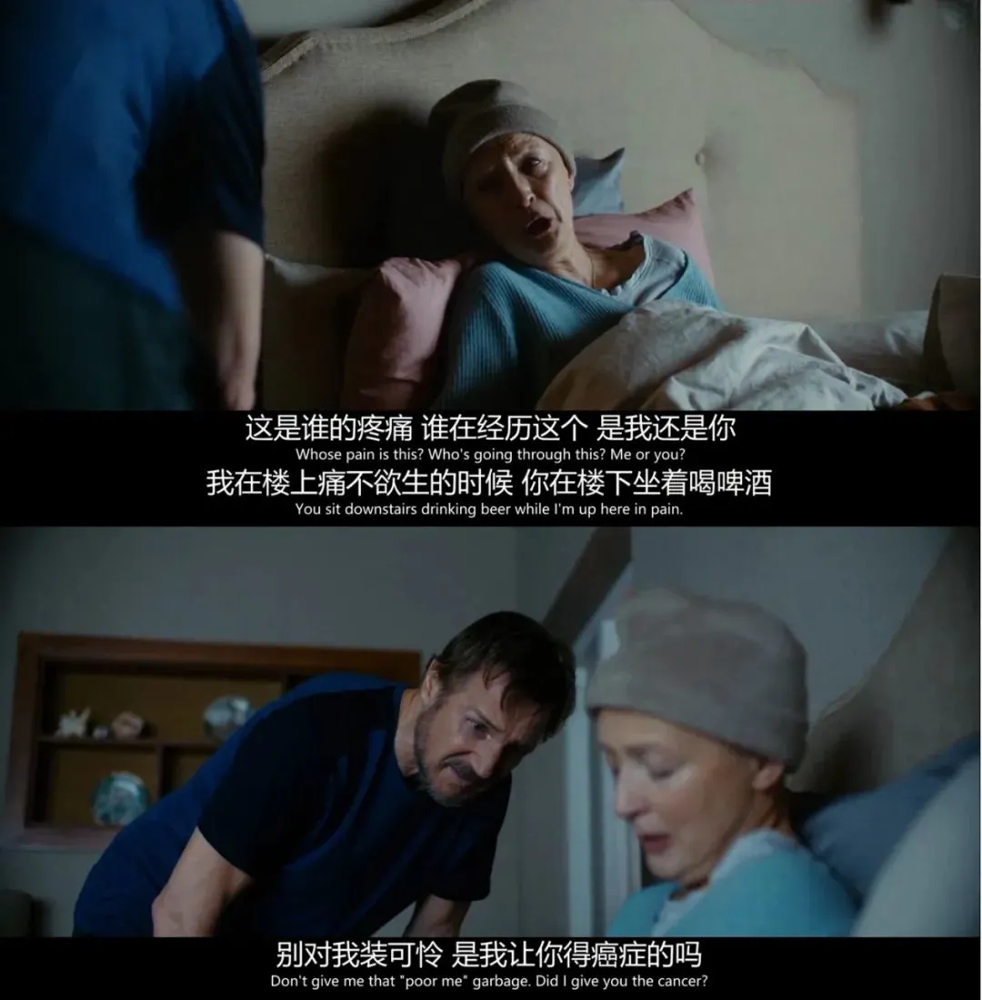

  

其实，不光在病痛之时，即便日常生活中，夫妻吵架拌嘴都是很平常的事情。

  

而这场突如其来的癌症，也意外地让两人的爱情收获了一次升华——他们都更加深切地意识到自己无法失去对方，从而更加珍惜互相拥有的每一天。

  

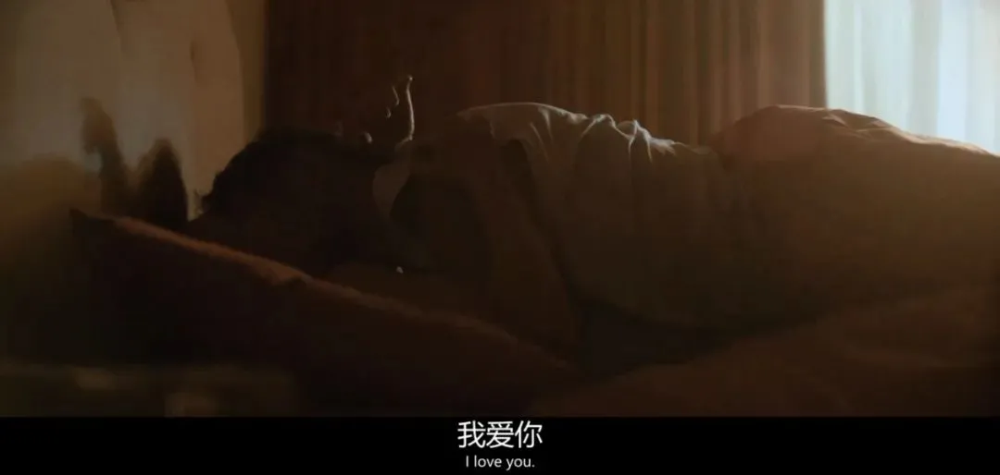

  

不管从何种角度来看，这样的婚姻都足够令人钦羡。

  

尽管遭受了丧女和癌症的双重打击，他们依然能够深爱彼此，活成了爱情本来的美好模样。

  

琼在跟病友聊天时还回忆说，一开始她认为癌症会改变自己生活的状态，但经历过后才知道原来并没有。

  

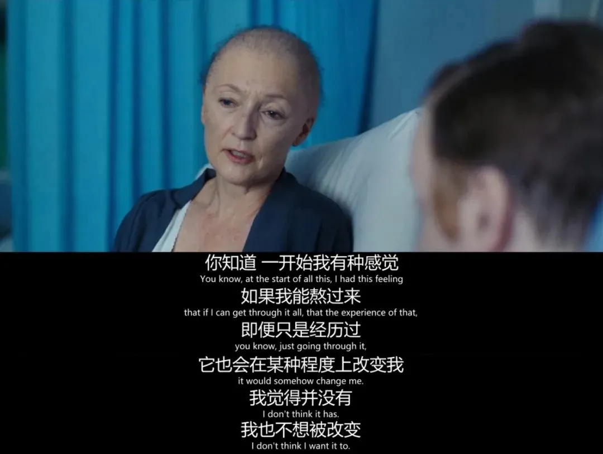

  

她的心态的确变得更坚强了，而生活状态却一如往常的平静、幸福和甜蜜。

  

她和汤姆之间还是会说一些俏皮情话，来制造小浪漫；

  

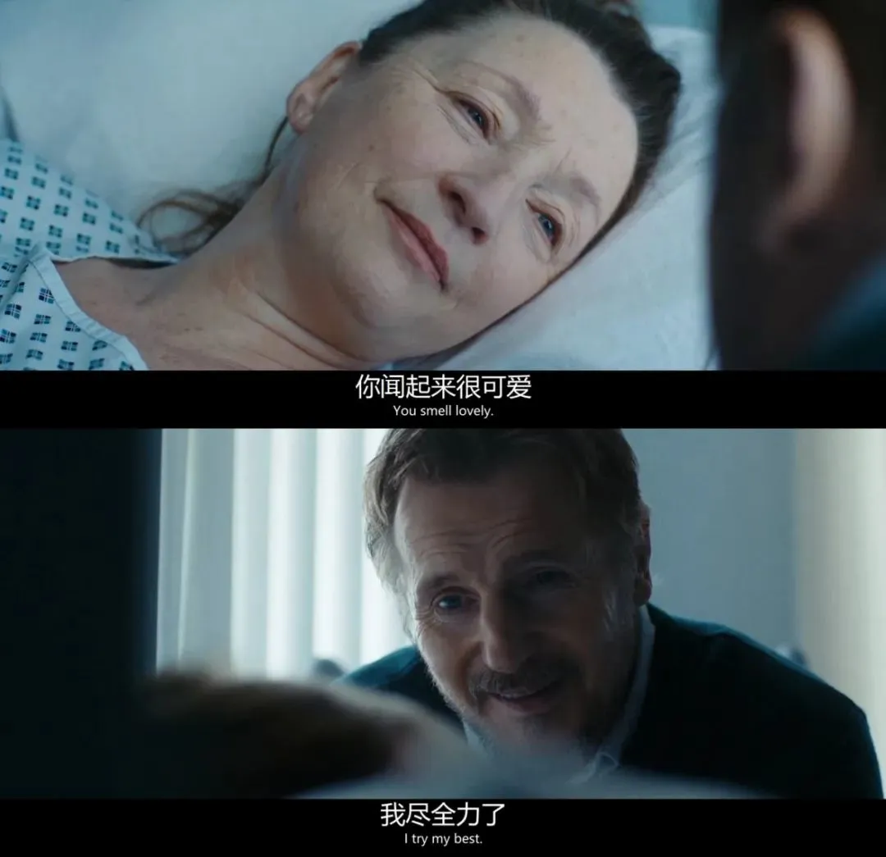

  

每天早晨也依然雷打不动地手牵手出门散步，绕树而返。

  

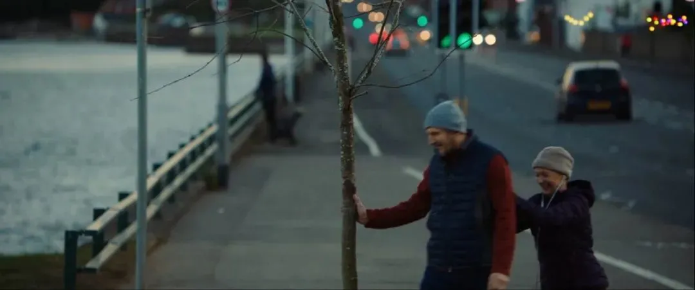

  

值得一提的是，影片除了向观众呈现中年夫妇的恩爱日常，还借由对病人、家属和医生的描绘，探讨了医患关系的“天然”矛盾和对生命无常的无限感慨。

  

那种点到为止的刻画，既不刻意也不煽情，可以说非常有代入感。

  

汤姆刚去医院时，就显露出明显的抵触情绪，忍不住吐槽医院总让人感到压抑。

  

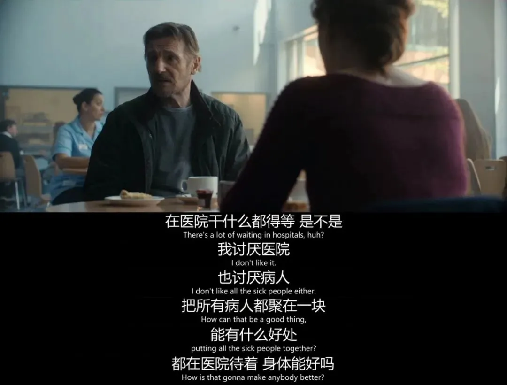

  

后来得知切除手术成功后仍要化疗时，他更是不耐烦地质疑医生，怪罪他们说话模棱两可，有故意误导之嫌。

  

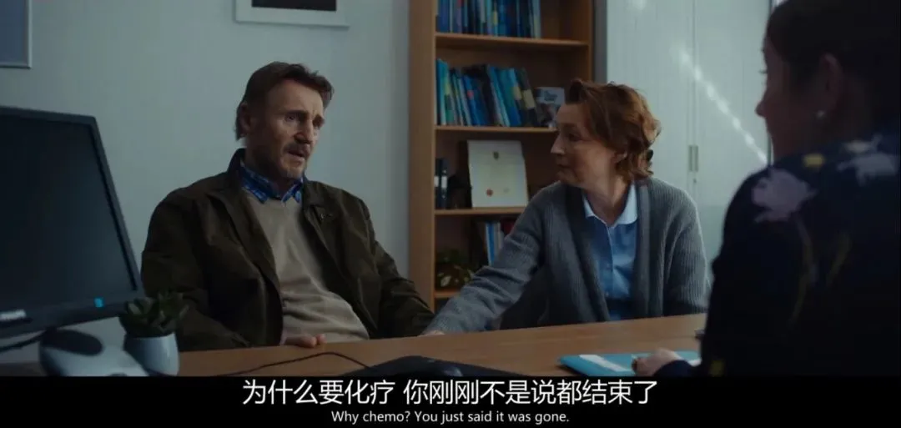

  

汤姆对医院的偏见和对医生的质疑，某种程度上也代表了许多普通人的态度。

  

而这种困惑，既来自医患之间超越服务和利益的复杂关系，也来源于普通人对医疗知识的一知半解，以及对医生职业的误解。

  

这让我想起韩剧《请回答1988》里的一段情节——

  

剧中狗焕的哥哥正峰，要做心脏起搏器换电池的手术，一家人都非常担心。

  

不过，他们听说这只是个简单手术，因此想从医生那儿得到确切的“安慰”。

  

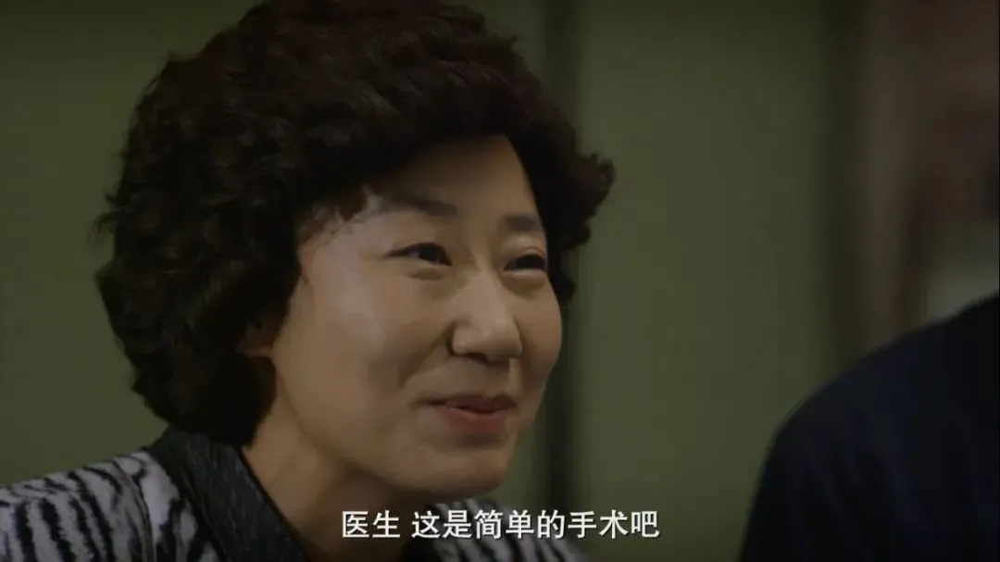

  

没想到医生严肃地表示，世界上没有简单的手术，一切都要动刀后看实际情况才能知道。

  

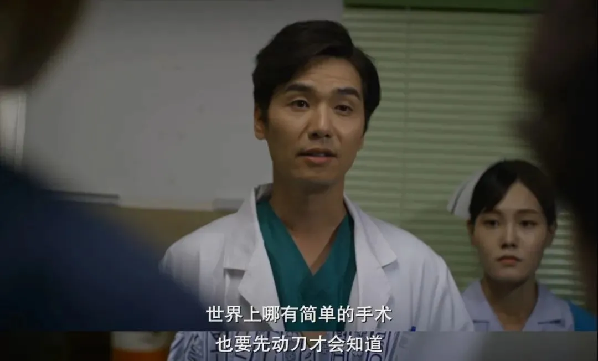

  

这时，狗焕的爸爸又试探性地追问，都说这手术一小时就能搞定，应该不会有危险。

  

可医生却不接话，反而再次强调“手术的事情没有百分之百”，让一家人更担心了。

  

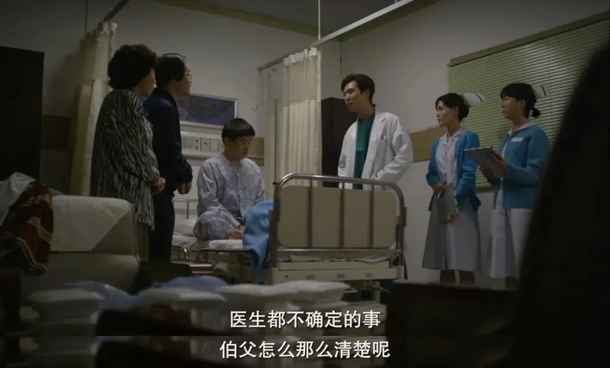

  

乍一看，医生的严谨似乎有些不近人情，但我们都知道，这正是负责任的医生在专业技能和职业道德上应有的表现。

  

后来，医生看到狗焕妈妈过分担心，忍不住上前安慰时，反而说了一个职业医生不应该说的话。

  

正是这前后反差的专业与“不专业”，深入地体现了这位医生的温暖、敬业和超越职业道德的人性光辉。

  

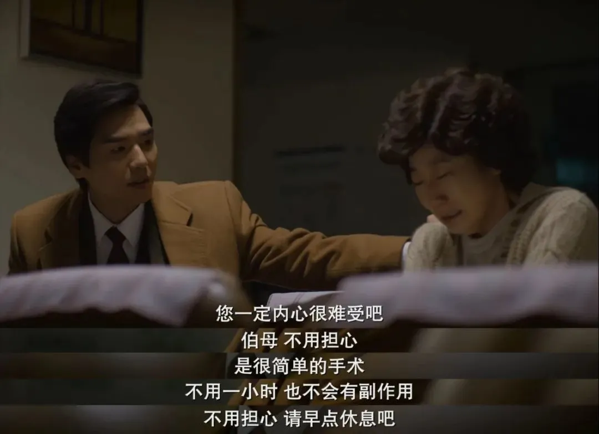

  

在医院里，我们往往对病患和家属的痛苦感同身受，却很难设身处地体会医务人员的辛劳和不易，每一位病人都让他们挂心，每一次手术都是生死考验。

  

他们既要专心致志地应对病情，又要思忖纠结怎么和病人、家属沟通，多少人情冷暖和人间大爱，都藏在其中。

  

在这部影片的最后，琼的病情已经好转，虽未完全康复，但汤姆也转变了态度，甚至喜欢待在医院里静静地看医生给妻子做治疗。

  

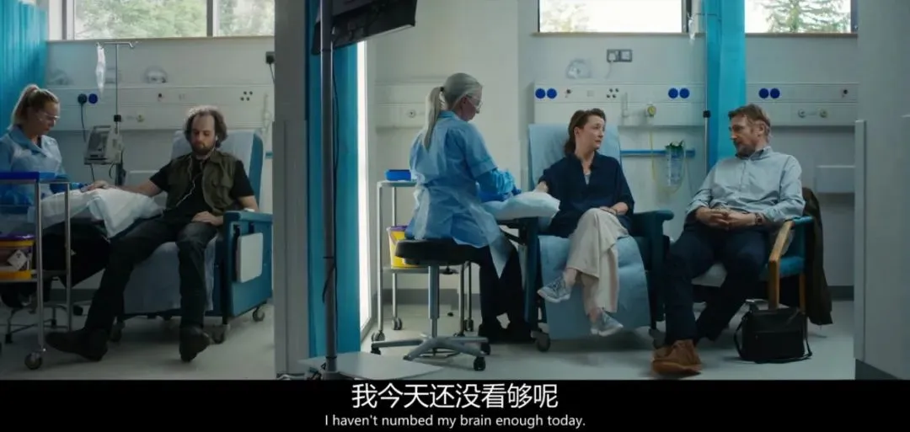

  

我想，这份理解的默契，应该是医患关系最好的一个状态吧。

  

**如果大家都能有这份体谅和包容，相信很多医患矛盾、时常见诸报端的伤医事件，也都会越来越少。**

  

**尤其在当下这个全民抗疫的时期，我们为生命的平凡脆弱而感叹，也被爱与责任的壮烈伟大而振奋鼓舞。**

  

**就像汤姆和琼一样，当所有这些普通之爱凝聚在一起，没有什么会扛不过去！**

  

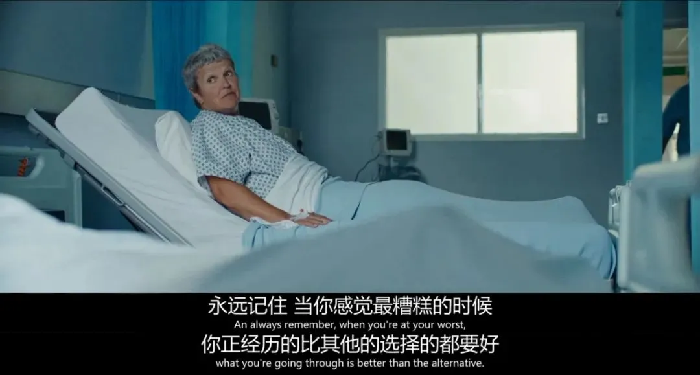

 