##  这部残酷的硬核纪录片，不打马赛克会没命

原创 有部电影 [有部电影]()**
前段时间，我给大家聊过一部纪录片《冰上火》，不仅探讨了全球变暖问题，还让我们看到影帝莱昂纳多·迪卡普里奥作为制片人，致力于环保事业的另一面。

而最近，又出了一部由他担任制片的纪录片**《暗海》**，剧情跌宕起伏，堪比商业大片。

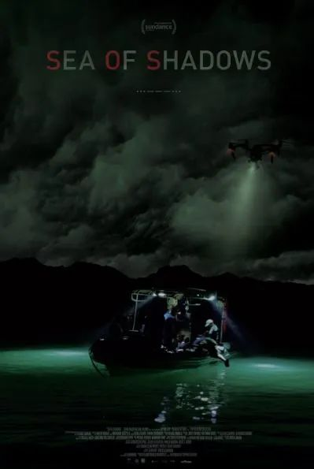

影片开场就是一场惊险的夜间海上追逐战，虽然拍摄和剪辑方式采用了好莱坞套路，但镜头中的一切都是100%真实发生的。

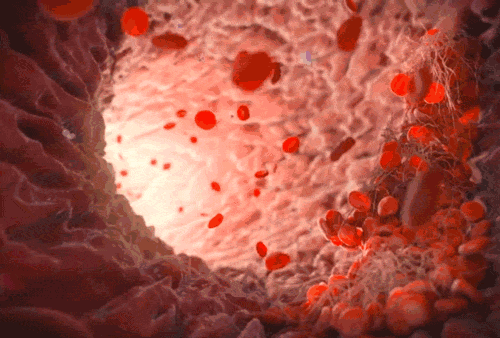

片中很多关键人物的出镜，出于保护原因，也都打上了厚厚的马赛克，还做了变声处理。

而这一切的起源，要从一种名叫小头鼠海豚的生物说起。

它们于1950年被科学家发现，是目前世界上最小的鲸豚类哺乳动物，也是加利福尼亚湾北部的特有物种。

小头鼠海豚生性害羞、头脑聪明，拥有一张辨识度极高的可爱面孔。

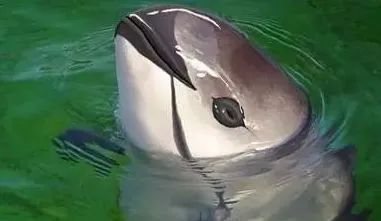

然而如今，小头鼠海豚的数量急速锐减，只剩下不到15只，走到了灭绝的边缘。

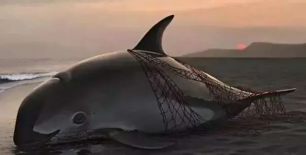

他们濒临灭绝的原因，跟某些咱们国人推崇的一种食物密切相关——花胶。

花胶由各类鱼鳔制作而成，在不法商人的炒作下，这种蛋白质含量和牛肉干差不多的食物，被严重夸大了药用价值。

坊间甚至还流传一种荒谬的说法，说以国家二级保护动物黄唇鱼的鱼鳔制作而成的花胶最为顶级。

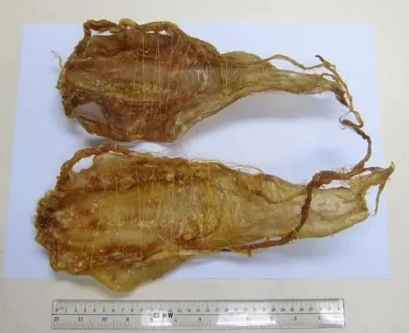

自从我国禁止黄唇鱼商业性捕捞后，国内的花胶市场就出现了供给缺口。

一些利欲熏心的人，盯上了黄唇鱼的替代品——墨西哥的加利福尼亚湾石首鱼，开始进行有组织的跨国走私活动。

大批墨西哥渔民加入到捕杀石首鱼的行列，一个完整的石首鱼鱼鳔，流入国内的价格能飙升到25万美元。因此，石首鱼鱼鳔也被称为“海上海洛因”。

这种集中撒网的暴行，不仅让生长周期长的石首鱼数量锐减，也让同样在此生存的小头鼠海豚被牵连其中。

因为个头与石首鱼不相上下，它们经常被刺网困住，葬身大海。

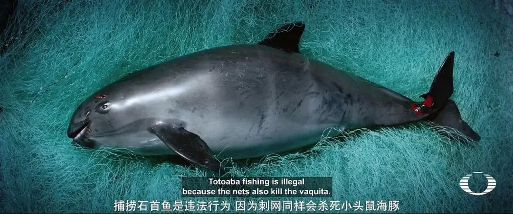

毫不夸张地说，正是部分国人的口腹之欲和盲目跟风，造成了地球另一端深海里的悲剧。

意识到保护物种的任务迫在眉睫，墨西哥政府联合国外科学家团队，开展起拯救现存小头鼠海豚的行动。

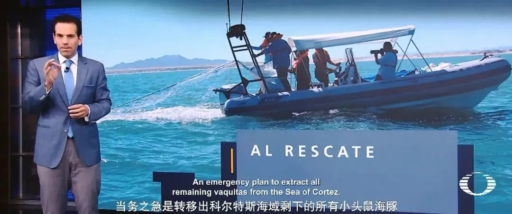

这个行动的设想，是把捕鱼活动密集海域的小头鼠海豚通通圈养起来，等国家全面禁止了捕鱼行为，再将它们放归大海。

然而这个想法实行起来十分困难，因为小头鼠海豚神出鬼没，挨个找到它们就要花费很大精力。即便科学家们发现了小头鼠海豚的踪迹，在捕捉中也极容易造成误伤。

比如片中拍到的一次行动，就阴差阳错地导致一只小头鼠海豚意外死亡。这次失败也让整个转移计划彻底取消。

之后，墨西哥政府又联合海洋守护者协会，开始集中驱逐非法渔民，收集海域中的刺网。

这个计划虽然声称有海军保驾护航，但危险系数也很高。

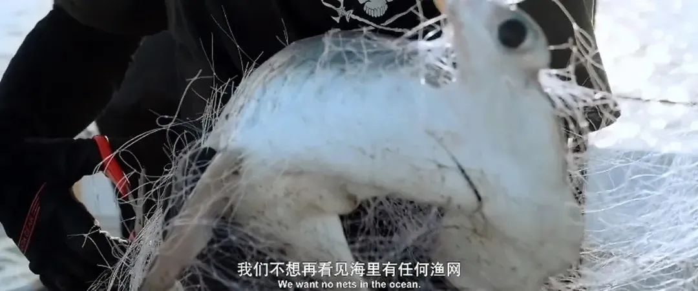

在一次行动中，海洋守护者协会出动无人机，对夜间非法捕鱼的渔民进行警告驱逐，但没想到渔船弃网后，直接冲着他们而来。

考虑到渔民可能携带了武器，工作人员立刻向墨西哥海军求助，双方展开了激烈的追逐战，这便是我们开头看到的那一幕。

在渔船侥幸逃跑后的第二天，摄制组在捕鱼活动最频繁的圣费利佩，恰巧发现了那艘船，几个渔民正打算再次出海收网。

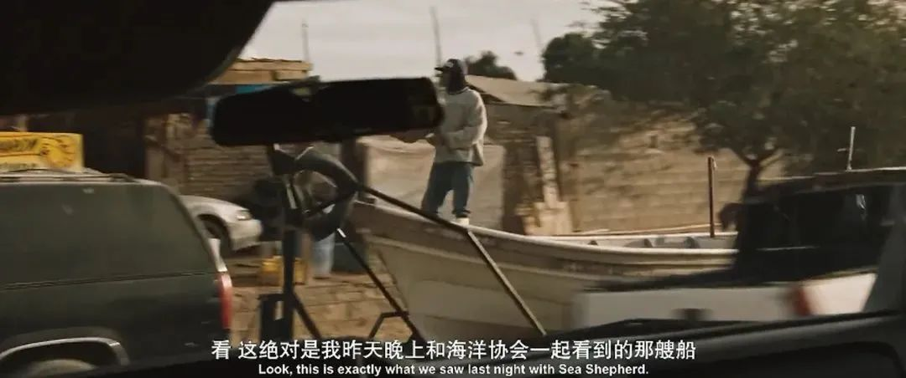

令人震惊的是，就在渔民们明目张胆地出海时，墨西哥海军就在现场，却并没有打算出动制止。

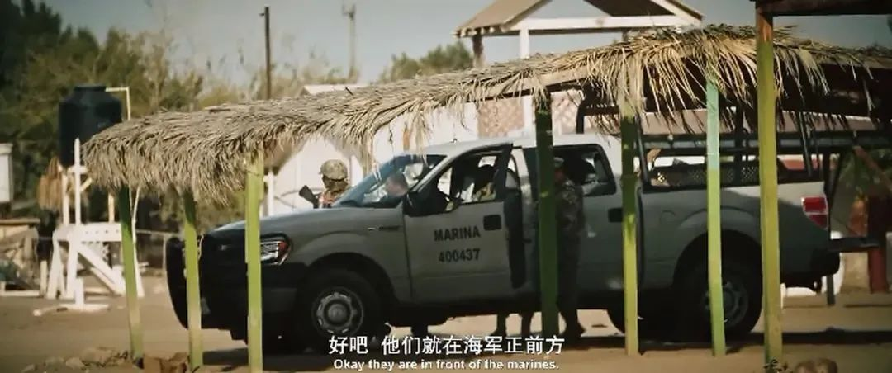

实际上，墨西哥已经形成了完整的石首鱼鱼鳔走私链条。

黑手党大肆拉拢当地的渔民进行非法捕捞，收获的鱼鳔高价卖给当地华人商贩，从中牟取暴利。

即便在这过程中，有渔民遭到举报被逮捕，没过几天也会以各种理由被无罪释放，因为当地的警察早就被黑手党收买，成为走私活动的帮凶。

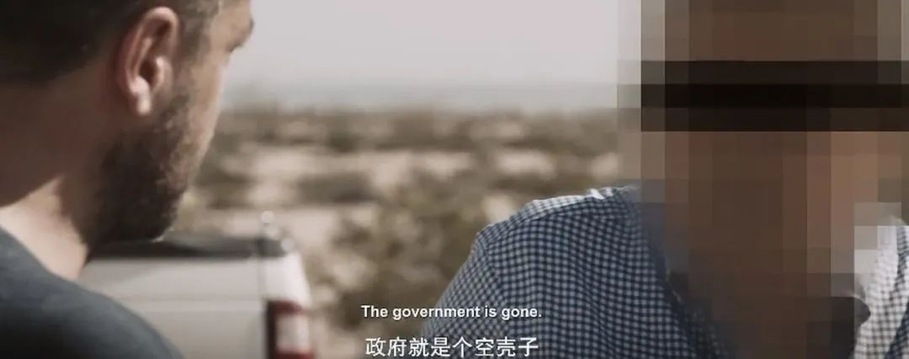

所以，尽管政府发布了各种禁令，还是会有大批渔民为了金钱利益，站在黑手党这一边，甚至公然阻拦巡逻船，与军队发生正面冲突。

看到这里我们会发现，《暗海》这部纪录片所展示的，并非只有濒危物种岌岌可危的生存现状，还揭露了表象下的深层问题。

走私活动之所以屡禁不止，正是因为腐败的权力机构，也是这利益链条上的重要一环。

这并不是什么虚构的政治惊悚片剧情，而是正在发生的现实。

值得一提的是，我们之所以能看到片中那些珍贵的真实镜头，得益于国际地球联盟（Earth League International），及其首席执行官安德里亚·克罗斯塔。

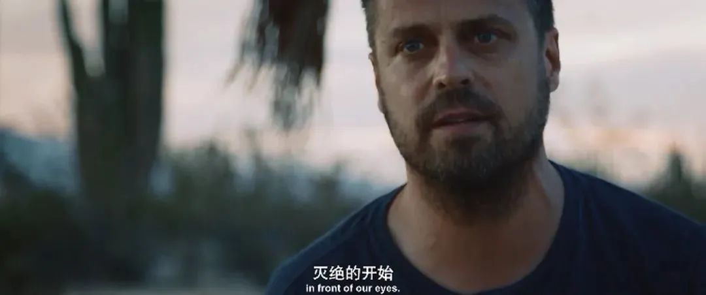

这个组织是致力于保护野生动物、海洋和森林的情报机构，经常对非法野生动物交易、环境犯罪组织、腐败政府官员展开调查。

在安德里亚看来，小头鼠海豚濒临灭绝的现状，需要的绝不仅仅是一个保护计划，而是要想办法摧毁整个非法交易链条。

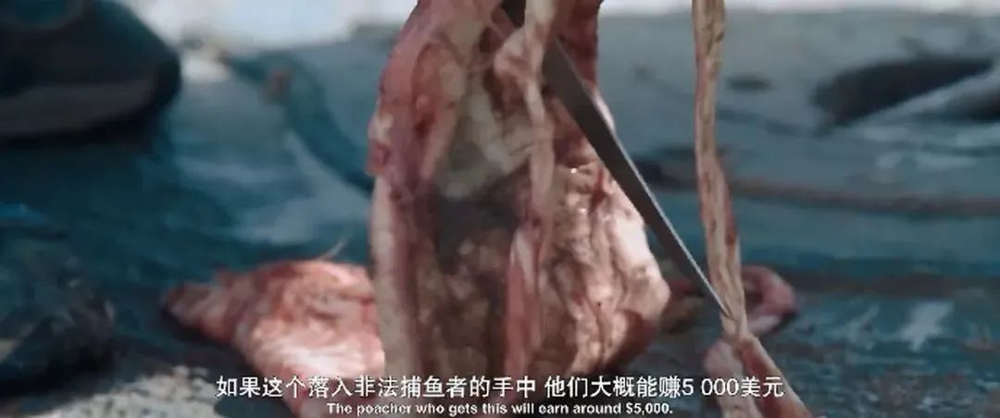

在搜集证据的过程中，他发现当地掌控非法捕捞的，是一个叫奥斯卡·帕拉的黑帮老大，他通过放贷的方式，强制渔民出海捕捞石首鱼。

但捕捞所得的利润，并非全部归渔民，因为当地警察会根据黑手党给的消息去抢劫渔民。

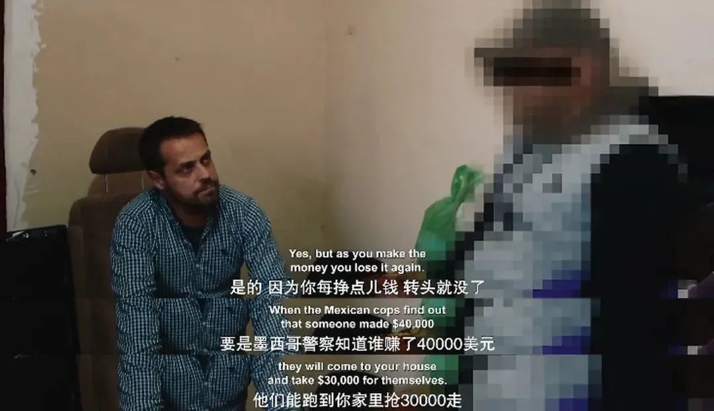

让人意想不到的是，这个奥斯卡·帕拉，其实早就上了海军的缉拿名单，但由于种种原因，一直没有被逮捕。

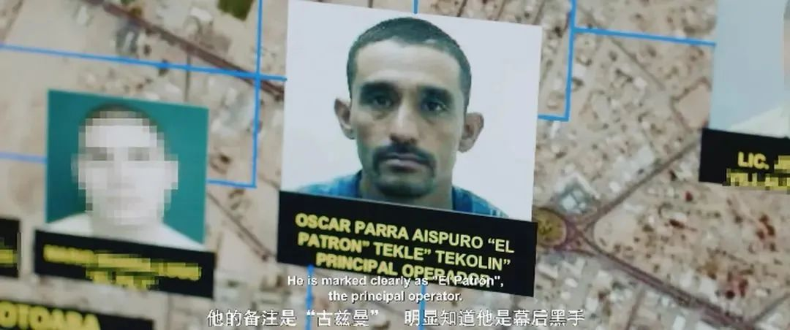

对此，安德里亚采访了掌控当地警察和海军的上校，质问他既然知道谁是走私的幕后黑手，为什么不实施抓捕。

而这个上校特别老练地打着太极，说海军可能存在疏忽，但情况一直在改善。

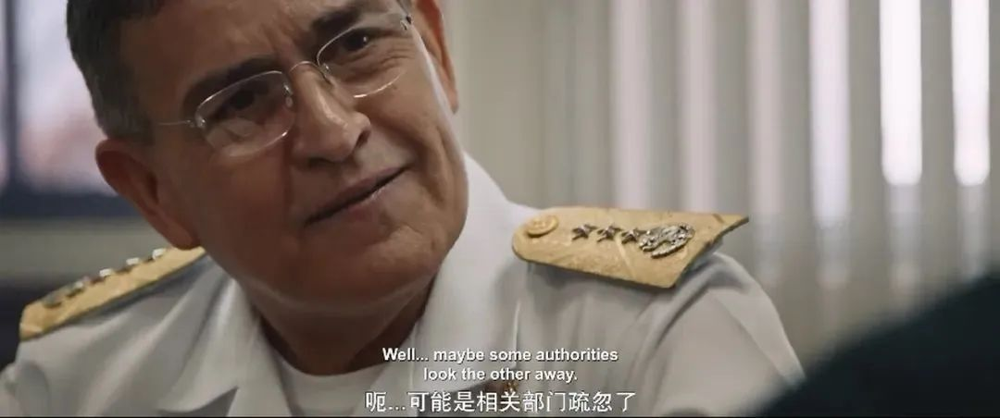

之后他还通过媒体，宣称海军拥有地面装置、飞机和无人机等最先进的技术，用以打击石首鱼非法交易。

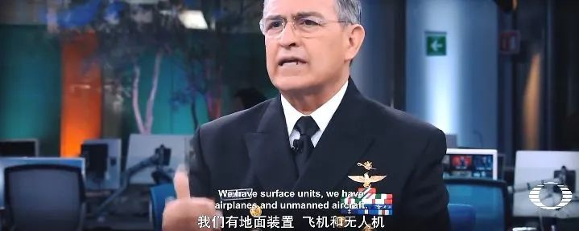

但实际上，无人机的确出动了，只不过监控对象不是非法捕捞的渔民，而是像安德里亚这样的调查者。

安德里亚等人的调查和拍摄计划，多次因为头顶飞来的无人机而被迫终止。

从那以后，安德里亚意识到要终止石首鱼的非法走私，最有效的手段就是摧毁当地的中国交易团伙。

通过线人的情报，他们终于取得了一个中国走私犯的信任，打入了交易环节。

片中呈现的这几段偷拍录像，也是唯一一段我们无需字幕就能听懂的段落。

被打了马赛克的走私犯，用清晰的汉语夸夸其谈——石首鱼是先运到香港，再运到内地，这生意特别适合洗钱。

随后，线人在一个华人掌管的仓库里，拍到了决定性的证据——那里储存着大批已经晒干的石首鱼鱼鳔，等待买家非法携带至中国境内。

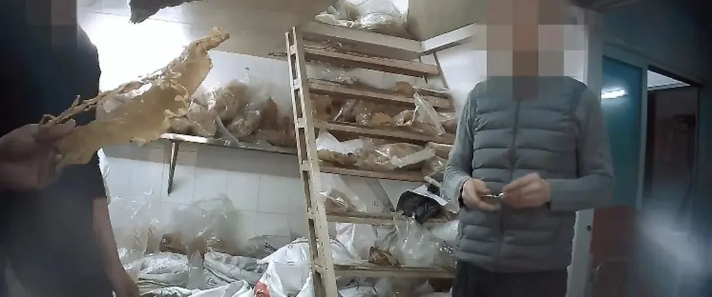

说实话，眼看着这些利欲熏心的人，在镜头前毁掉国人的声誉，给地球环境和野生动物带来灾难，我感觉坐立难安。

片中唯一值得欣慰的是，安德里亚之后将这些证据公布给了权威媒体，通过舆论给墨西哥政府施压，并把掌握的所有情报都提供给了中国政府，用以彻底摧毁这条肮脏的交易链。

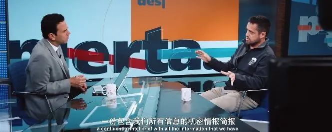

而在影片之外，我们也看到了这样的国内新闻——

2018年2月，上海海关在机场查获石首鱼鱼鳔351只，价值224万余元，两名涉案人员分别被判处有期徒刑7年、8年；

同样是2018年，江门、南宁海关缉私局，抓获犯罪嫌疑人16名，查获加利福尼亚石首鱼鱼胶2621只，查证涉嫌走私鱼胶15955只，总计价值约8.49亿元；

2019年，成都海关在双流机场截获石首鱼鱼鳔91个，案值约1164万元……

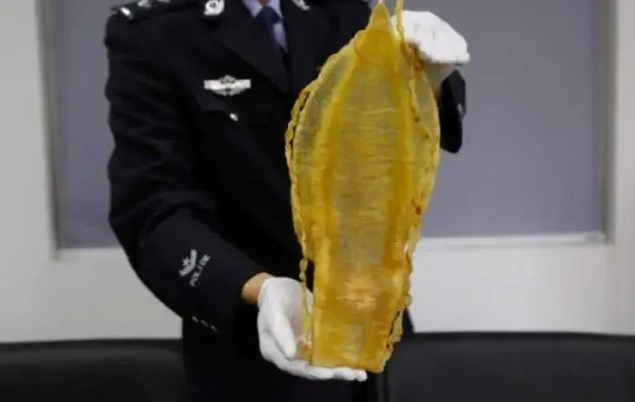

也许，这些数字只是走私活动的冰山一角，但亡羊补牢总好过冷眼旁观。只有从根源上遏止了买卖，才能终止深海里残忍的杀害。

而这也正是《暗海》这部纪录片所想要表达的主题。

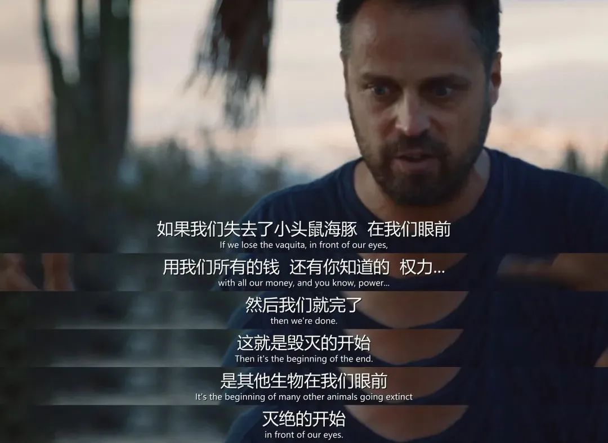

**地球上的每个物种都是生态链上的一环，人类并非凌驾于自然的统治者，一时的利欲熏心和贪婪索取会引发蝴蝶效应，最终结果只能是人类的灭亡。**

**再不管住贪婪的嘴，这个过程会更加加速地到来。**

也许是国内最认真的电影自媒体
长按扫描二维码关注

在看