##  妻子被性侵后，他的选择出人意料

原创 有部电影 
今天给大家聊一部冷门新片——**《最漂亮的一对》。**

影片的男女主角马尔特和丽芙，是一对恩爱夫妻，两人在同一所中学当老师。

在外人看来，他俩天生一对、心有灵犀，丽芙只需一个眼神，马尔特就能知晓妻子内心在想什么。

然而，一次度假时的遭遇，彻底改变了这对夫妻的人生。

当时是在海滩，夫妻俩被迷人的景色吸引，情不自禁地做起了爱做的事，结果一不留神被三个路过的年轻人看到。

当时他俩都没在意，匆匆穿好衣服就离开了。

谁料三个年轻人之后一直在暗中尾随，并闯入了他们租住的民宿。

马尔特认为这几个人只是喝多了，一时起了歹念，于是配合地交出了贵重物品，希望他们赶紧走人。

但没想到，为首的金毛却拿刀威胁，提出了更加过分的要求：

在三人的殴打和胁迫下，夫妻俩被迫脱光衣服，听从对方的摆布。

金毛在酒精的作用下侵犯了丽芙……

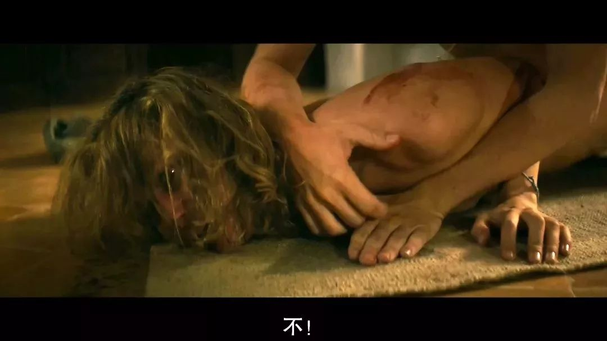

这件事给夫妻俩造成严重的心理创伤，花了两年时间才从阴影中走出来。

但值得庆幸的是，两人依旧相濡以沫。

对于那三个年轻人的恶行，他们没有报警，只想彻底忘掉过去的伤痛，重新开始生活。

但谁也没想到，就在两人鼓起勇气迎接新生活时，金毛又出现了——马尔特偶然在路上遇到了他。

马尔特不由自主地尾随其后，他越是看到金毛和女友像普通情侣一样甜蜜恩爱，就越为自己和妻子在这两年中遭受的痛苦愤愤不平。

但遗憾的是，他走着走着就在地铁里把金毛给跟丢了。

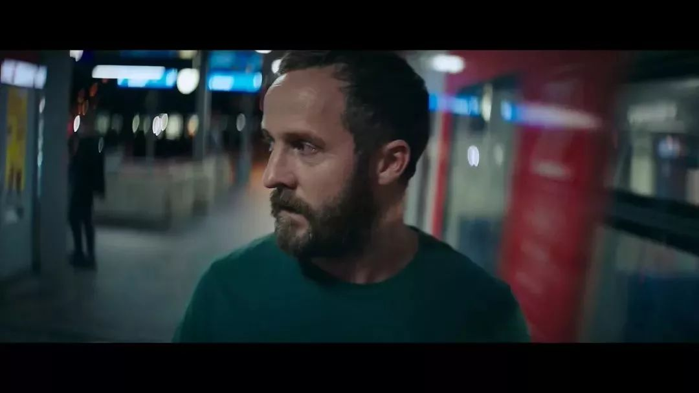

回家之后，马尔特在妻子面前表现得像没事一样。但巧遇金毛已经打破了他内心的平静。

于是，他开始在跟丢的地铁站守株待兔，甚至带着学生的作业，去地铁站里办公……

而这种走火入魔的寻人方式，真的让他等到了金毛。

第二次尾随，马尔特发现金毛不光有女友，还住在一处不错的公寓里，过着逍遥自在的二人世界。

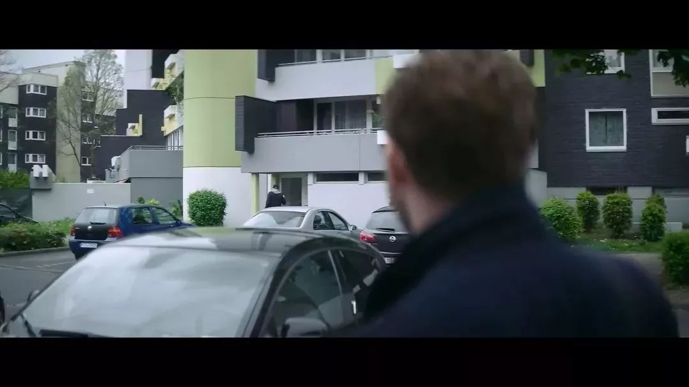

鬼使神差地，马尔特有一次趁他们不在家，直接破门而入。

他观察着房间里的一切，努力想象房主是个什么样的人。

然而眼前看似平常的房间，让他越来越悲伤——正是这样一个看似平常的人，狠狠伤害了他和妻子。

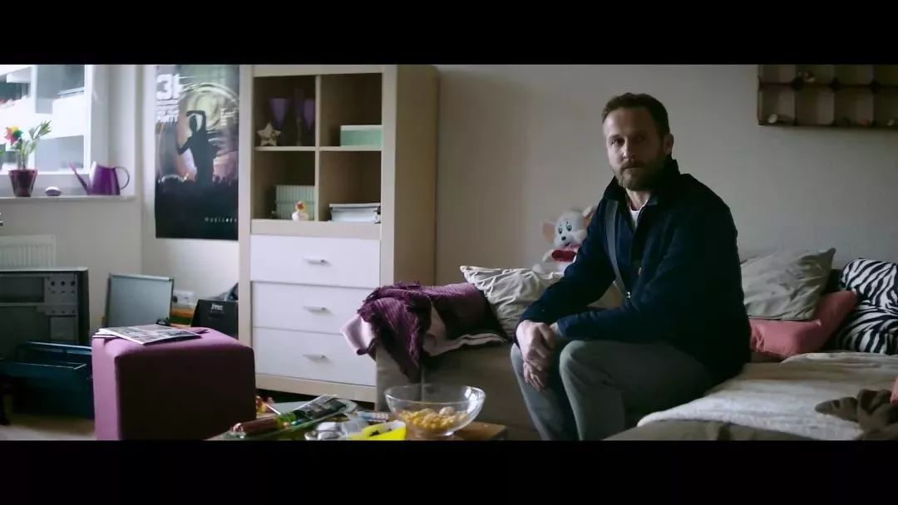

就这样，马尔特在这间公寓里漫无目的地待了大半天。

没想到刚要离开时，却恰好撞见了回家的金毛。

对方一眼就认出了马尔特，转身撒腿就跑，尽管马尔特拼尽全力追上了金毛，但无奈对方人高马大，不仅挣脱了束缚，还对马尔特拳打脚踢，扬言要是再纠缠，就直接杀了他。

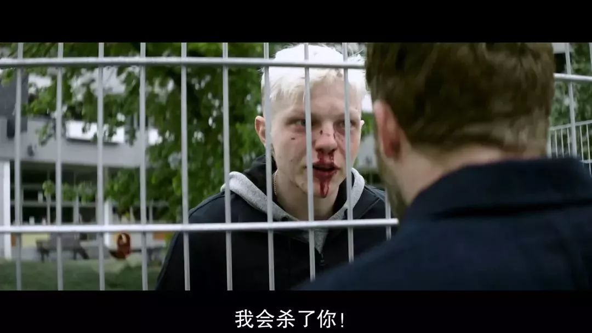

脸上挂彩的马尔特回到家中，再也无法向丽芙隐瞒这一切。

在好奇心的驱使下，两人第二天一起尾随金毛上班，结果发现他工作的地点，居然是自己经常光顾的家具店……

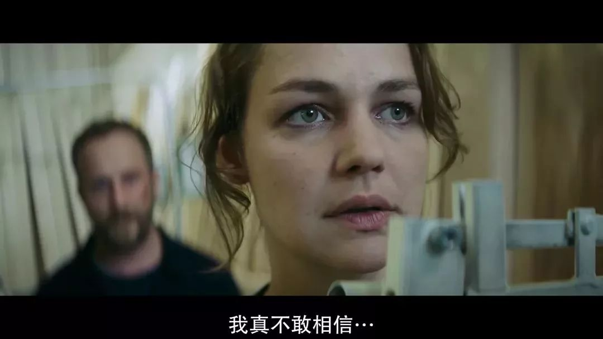

原来这几年里，罪犯一直就在自己身边。这对夫妻想要摆脱他和那段痛苦的回忆，似乎再也不可能了。

两人想到了报警，但咨询律师才发现，这时报警太晚了——

他们没有DNA等铁证，要想给金毛定罪，只能通过寻找别的证据。

而且当年的金毛还未成年，即便夫妻俩打赢了官司，金毛顶多受到拘留、社区服务等比较轻的惩罚。

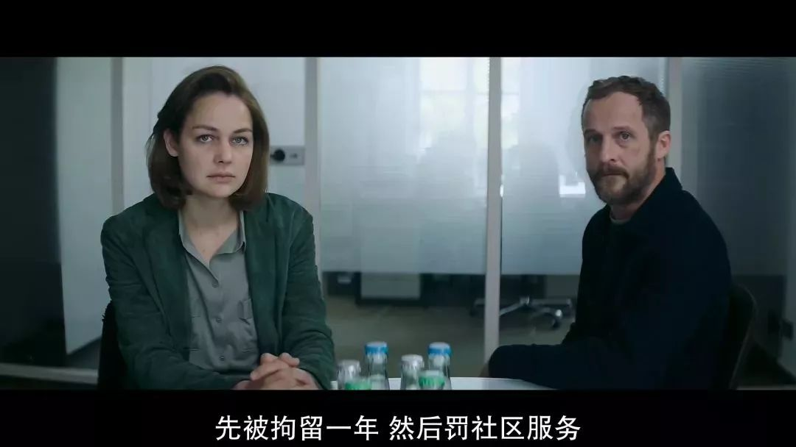

考虑了几天后，丽芙仍然决定彻底把金毛忘记，还说大不了以后不去他工作的那家店，况且金毛现在也有了女朋友，不会去到处强暴别人了……

**看到这里，估计小伙伴们都对丽芙的脑回路感到不解，为什么当年被殴打侵犯后不报警，为什么现在发现了罪犯，仍要选择原谅和忘记？**

的确，按照很多同类电影的套路，主角在遭遇过这种悲惨经历后，通常会在压抑过后选择复仇。

比如裴淳华主演的《无人查收》，讲的就是女主角在遭遇强暴、生活被毁后，选择向罪犯复仇的故事。

在这部电影里，女主角遭遇强暴康复后，不时去监狱探望强奸自己的罪犯，她向对方反复表明，自己已经解开了心结。

甚至在对方出狱后，她还不顾家人反对，跟罪犯成为了知心朋友，俨然得了斯德哥尔摩综合征一般。

直到影片高潮段落，女主角把罪犯骗到家中，才露出复仇的真面目，将罪犯杀之后快。

再比如“世界十大禁片”里的《我唾弃你的坟墓》，也是这么一个血腥暴力的女性复仇故事。

这部电影一再被翻拍的主要原因，就是人们都愿意看到罪犯得到相应的惩罚。

而今天聊的《最漂亮的一对》，却没有走这个套路。

但在我看来，这部电影的剧情比任何复仇电影都更加真实和犀利，它从受害者的角度，讲述了一个创伤后如何复原的故事。

这个过程比我们想象中还要困难。

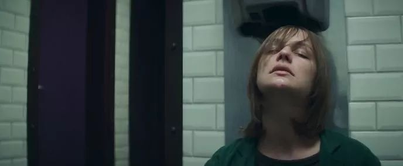

实际上，夫妻俩当初没有选择立刻报警，是受到了“受害者有罪论”的影响——

他们不断反思自己：如果当初没在海边放飞自我，就不会被那三个年轻人围观；如果他们回家时提高警惕，就不会轻易被人尾随闯入……

在很长一段时间里，夫妻俩都深陷于这个念头中，认为是自己给了罪犯可乘之机。

换成我们更熟悉的说法，就是“苍蝇不叮无缝的蛋”。

因此，他们的康复治疗，从某种程度上说，是在试图原谅自己的过错，金毛只是一个模糊的、无关紧要的小人物。

然而两年之后，当金毛再次出现时，他们才发现事实并非如此。

当他们看到金毛像普通人一样和女友快乐逍遥，对过去的一切也毫无愧疚，表面的平静便瞬间被打破。

马尔特变得顽固又冲动，脾气阴晴不定，当着学生的面拿桌椅撒气。擅自去找金毛对质失败后，他又把负面情绪发泄给了拳击陪练，差点把人给打伤。

丽芙则变得更加纠结，她不仅梦见金毛是自己班上的学生，还意识到之前所谓的原谅别人，不过是给自己的安慰剂，并没有治好自己心里的伤痛，只是让自己学会逃避。

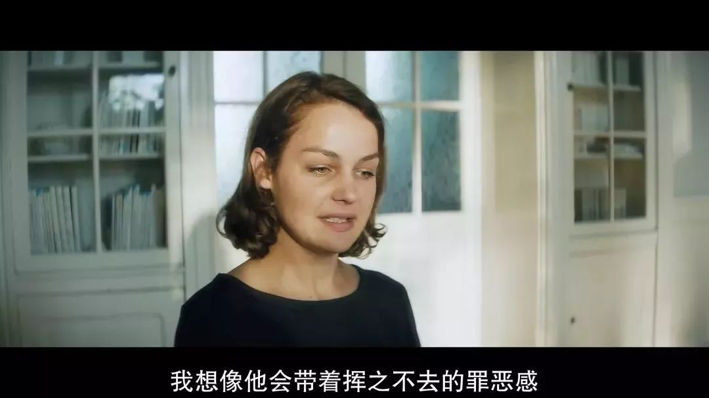

原本相互扶持的夫妻俩，也因为这无形的压力产生了争执，丽芙开始责怪马尔特不该去找金毛，把自己的生活搅得一团糟。

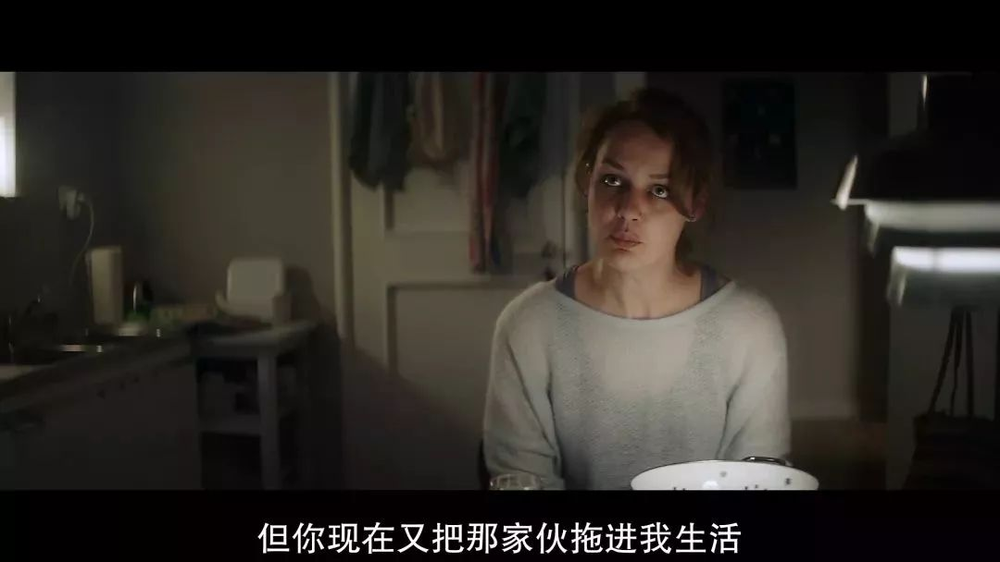

可以说，影片前三分之二的剧情是十分压抑的。
**
**
**但正是男女主角这段压抑的心路历程，才让我们意识到，创伤可以修复和愈合，但无法掩盖和粉饰。**

因此，影片也并未将情绪一直压抑到底。

意识到生活出现问题的夫妻俩，先是向金毛的女友曝光了他的黑历史，然后又一块去找金毛对质，说要去报警，要让金毛去监狱里忏悔。

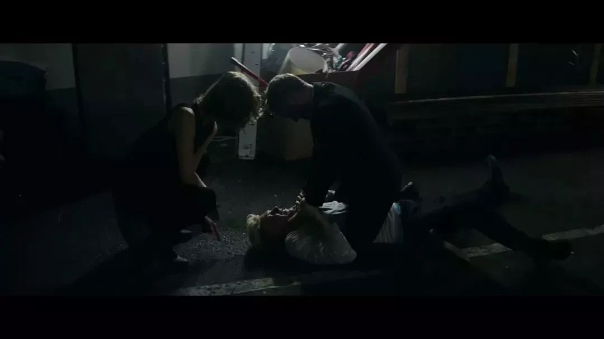

这一次，马尔特没有给金毛还手的机会，夺下了他手中的刀，把他按倒在地。

但没想到松手之后，金毛喘了口气，依旧满不在乎地说——到底要我忏悔什么？

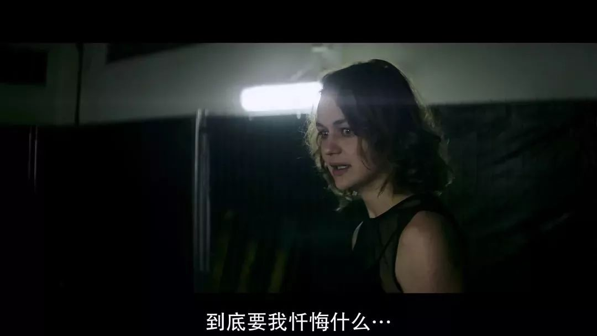

听到这话，丽芙抓起地上的刀子，直接捅向了金毛。

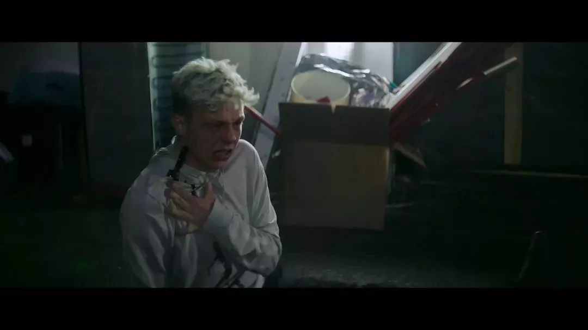

影片结尾，夫妻俩把金毛送去医院后，满身疲惫地回到了家中。想到过去两年经历的一切，他俩一时兴起，砸坏了家中所有的东西，大肆发泄了一通。

只不过这一次，在一片残败不堪的房间里，两人终于露出了解脱的笑容。

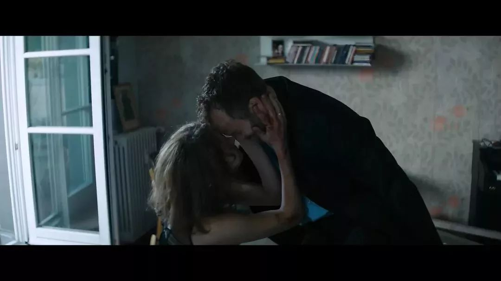

这个戏剧化的结尾，也正是影片想要传达给我们的主题。

在生活中，我们经常被这样教育：**当遭遇某种劫难，留下了巨大的伤疤后，与其沉溺于伤痛带来的痛苦，不如彻底忘记过去。**

**但实际上，忘记过去的最关键的一步，是承认伤疤的存在，拒绝粉饰和逃避。****就像片中的心理医生所说，只有将过去扭转为正向经验，所谓的宽恕和原谅才称得上有用。**

