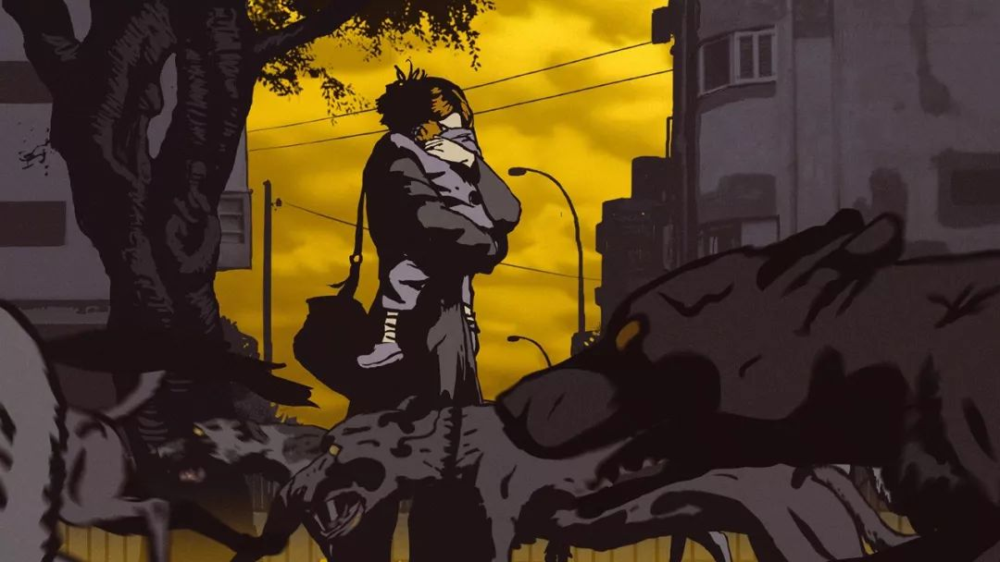
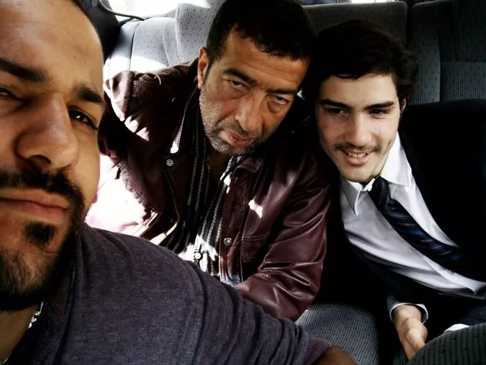
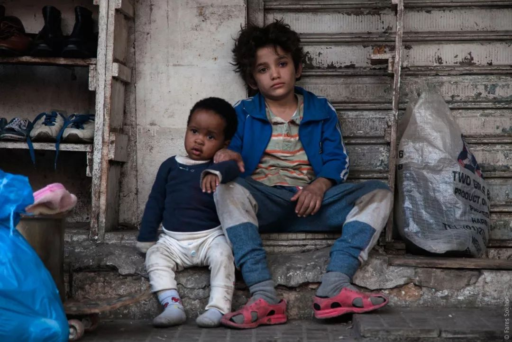
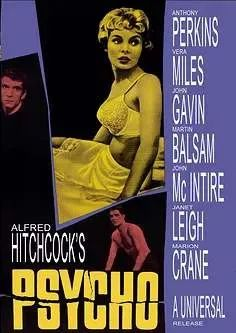
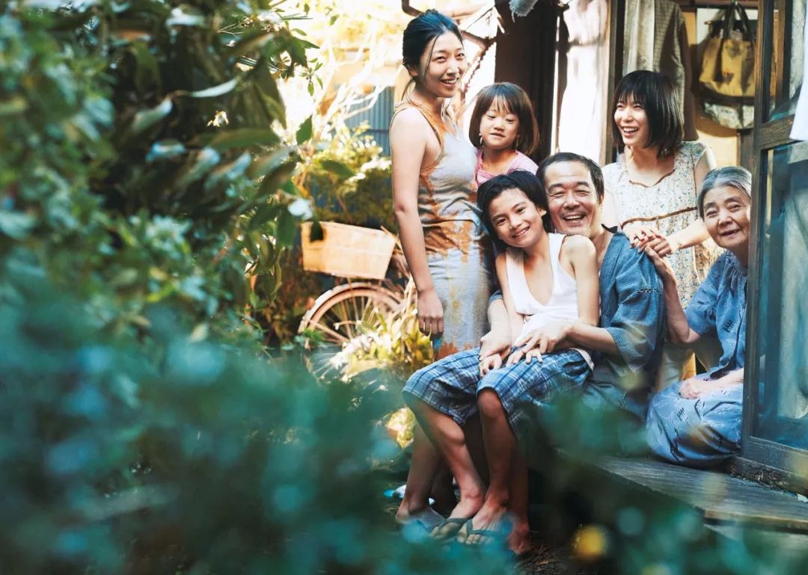
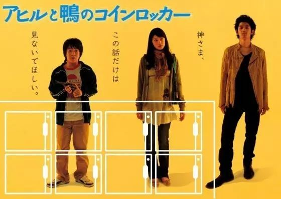
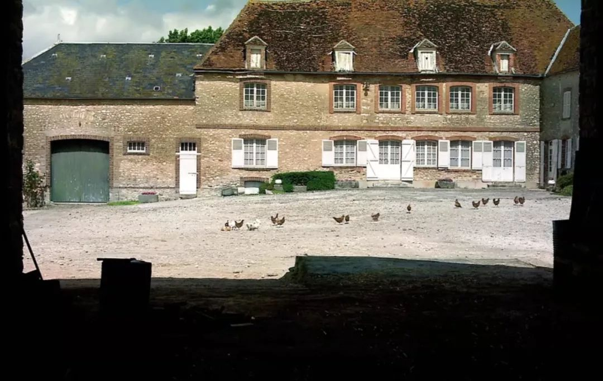
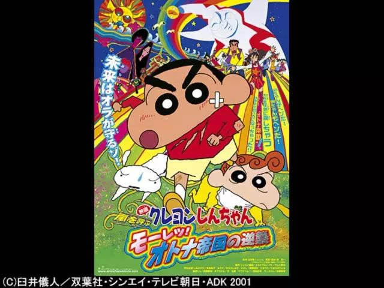
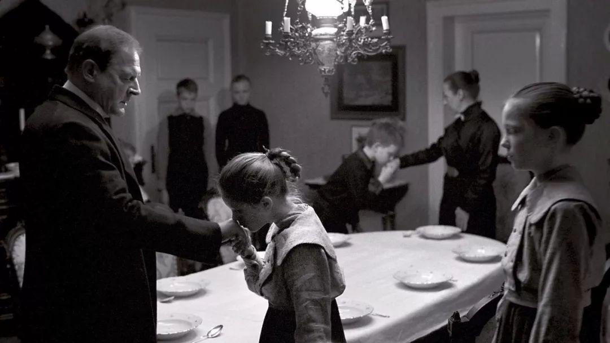

速读摘要

就在这一天，宽子和儿子的平静生活，被一个特别的闯入者打破——江户时代的武士，木岛安兵卫。在街边巧遇安兵卫的母子两人，好心收留了他，不仅请他吃晚饭，宽子的儿子还跟他分享了最爱吃的布丁。对于"双职工"的家庭现状，宽子打算找安兵卫商量，没想到安兵卫反倒劝她辞职做家庭主妇，因为自己的薪水完全足够养活全家人。不过也恰恰是这个插曲，让宽子明白了真相——安兵卫劝她辞职，并非出于旧时代的大男子主义，而是他特别珍惜那个工作机会。

原文约 2388  字  | 图片 39 张 | 建议阅读 5 分钟 | [评价反馈](https://static.app.yinxiang.com/embedded-web/clipper/#/Evaluating?d=2020-03-20&nu=d8acc1b4-eabb-4006-a64e-2f5e57a0fc5d&fr=myyxbj&ud=58b471&v=2&sig=92628ACB72A370248B2DD7B902987B6E)

##  单身辣妈遇上岛国武士，这片看得让人流口水

原创 有部电影 [有部电影]()**

在家隔离的这段时间，相信不少小伙伴都跟风尝试做了一些网红美食，忙得不亦乐乎：从炸鲜奶、做凉皮，到蒸蛋糕、炸油条……总之，在丰富生活的同时，也成功让自己贴了几层膘。

今天就应个景，给大家聊一部美食片，它融合了家庭和奇幻元素，看完让人倍感温暖——**《月代头布丁》。**

影片的女主宽子，是个朝九晚五的上班族，也是个单身妈妈。

在经历过丧偶式育儿后，她果断和丈夫离了婚，独自带着儿子生活。

不过，尽管她努力尝试工作生活两不误，每天还是过得手忙脚乱。

早上的闹钟根本叫不醒她，只能起床后草草拿速冻食品，给儿子当午餐便当。

白天她既要应对阴阳怪气的上司，又要硬着头皮无视加班的同事，准时打卡下班去接儿子回家。

至于日常家务，已经被她忽略不计，房间里乱得非常任性随意。

不过就在这一天，宽子和儿子的平静生活，被一个特别的闯入者打破——江户时代的武士，木岛安兵卫。

没错，这是个从江户时代莫名其妙穿越到现代社会的武士。

据安兵卫所说，他穿越前正在向一尊地藏菩萨许愿，突然脚边涌出泉水，将他慢慢淹没，等他回过神来，已经身处现代社会。

在街边巧遇安兵卫的母子两人，好心收留了他，不仅请他吃晚饭，宽子的儿子还跟他分享了最爱吃的布丁。

初来乍到的安兵卫对一切都感到恐慌不已，却唯独对这个奇妙的甜品赞不绝口。

起初，宽子以为他可能有精神疾病，建议他去找警察，说不定就能找到回家的路。

可没想到过了几天，她又遇见了安兵卫——

他在街头及时阻止了一起车祸，救下了宽子的儿子。可宽子发现安兵卫整个人变得蓬头垢面、饥肠辘辘，比之前还要糟糕。

作为感谢，宽子收留了安兵卫，还抽时间带着儿子一块帮他寻找回家的路。

然而安兵卫记忆中家的位置，如今已经是一片高楼大厦。唯一能依靠的线索，就是尽快找到穿越时祭拜的那尊地藏菩萨。

眼看一时半会无法回家，安兵卫便恳求宽子收留自己。

作为交换，他答应承包所有家务，这样既报答了宽子，又能让她专心工作。

从这之后，安兵卫身为武士的那种执着认真，全都用在了家务上。

他通过电视节目，解锁现代生活的各项技能，认真记笔记总结经验，丝毫不敢怠慢。

没过多久，他真的改善了宽子家的日常生活——

宽子早上不再睡过头，每天都会被安兵卫准时叫醒；

起床后也不用手忙脚乱地准备儿子的便当，还能享用安兵卫准备的精致早餐；

就连接送儿子的任务，也被安兵卫承包下来。

有了这个“贤内助”，宽子得以全情投入到工作中，能力得到全面施展，一路晋升成了主管。

某种程度上说，安兵卫的存在，也填补了这个家庭中父亲的位置。

他会拿出武士的姿态，教导宽子的儿子，要懂得尊重长辈，说话要懂礼貌，做错事要道歉；

也会亲自教他剑道，培养他男子汉的一面。

在孩子生病时，安兵卫如同父亲一般予以贴心的照顾，缓解他的孤独感。

可以说，安兵卫和宽子母子组成了一个特殊的家庭。

他在这个过程中，也逐渐适应了现代生活，甚至向宽子的儿子发誓，此生再也不使用武士刀。

从故事来看，这部《月代头布丁》虽然有个穿越的设定，但是特别有日式家庭戏的质感，很多情节并没有戏剧化的矛盾关系，但细微之处却透露出生活的小情趣。

尤其是片中安兵卫解锁各种家务技能的段落，通过日常生活场景和主角严肃的解说旁白，形成一种让人微微一笑的反差萌。

也正是凭借武士的这股认真劲，安兵卫找到了人生的新目标——西点制作。

这项技能所要求的细致和精准，完全就是他的专长。

一次偶然，安兵卫参加了“爸爸手工蛋糕大赛”，没想到一路过关斩将，凭借作品“飘雪江户城”拿到了冠军，还得到知名主厨的赏识，比赛结束就获得了一份高薪工作。

不过，这份工作也打破了原来的平衡。

上班后的安兵卫，在家的时间越来越少，宽子的儿子因为孤单，开始后悔让安兵卫去参加比赛。

对于“双职工”的家庭现状，宽子打算找安兵卫商量，没想到安兵卫反倒劝她辞职做家庭主妇，因为自己的薪水完全足够养活全家人。

没想到，这直接触到了宽子的怒点，让她想起上一段糟糕的婚姻，一气之下将安兵卫赶走。

结果，宽子的儿子得知安兵卫不再与自己生活，一时冲动偷偷离开幼儿园，打算劝他回来，搞得大人们各种寻找，好在最终有惊无险。

不过也恰恰是这个插曲，让宽子明白了真相——**安兵卫劝她辞职，并非出于旧时代的大男子主义，而是他特别珍惜那个工作机会。**

实际上，安兵卫在江户时代，是被编入“小普请”的武士，没有实际工作，俸禄也比较低。这种混吃等死的日子，让年轻力壮的他感到十足煎熬。

有天他听说有一个工作机会，于是去拜访管事。

在路上，他请求地藏菩萨保佑，哪怕只有一次，也要让他找到工作，没想到刚许完愿，菩萨就把他传送到了现代日本……

直到后来被宽子收留，解锁了西点制作技能，通过比赛得到了工作机会，他才明白这些都是菩萨的安排……而自己的愿望真的实现了，所以才会对工作机会倍感珍惜。

这次意外穿越的经历，也让安兵卫彻底明白，能不能重回江户时代已不重要，重要的是找到内心最在乎的人。

值得一提的是，影片之所以叫“月代头布丁”，是因为在片中仅出现三次的布丁，虽然看似普通，却被赋予了新的含义。

片中第一次出现布丁，是在安兵卫被宽子收留时。

那个布丁里包含的是宽子和儿子对他的慷慨和善意，安兵卫对于甜品的赞美，也象征了江户时代与现代社会的文化碰撞。

而布丁第二次出现，是宽子的儿子发烧生病时，眼看孩子身体虚弱又不肯吃饭，安兵卫就亲自做了一份布丁，没想到让宽子的儿子食欲大开。

这段情节里，安兵卫毕恭毕敬地献上布丁的神态，仿佛在表明布丁里包含的，是他身为武士的忠诚品质。

至于第三次出现，则到了影片的结尾。

就在安兵卫下定决心，不再刻意寻找回到江户时代的方法时，他意外地再次被泉水包围，匆匆与宽子他们告别，回到了过去。

而过了没多久，宽子和儿子无意中路过安兵卫所说的家的位置，发现那里有一家古风甜品店，招牌商品便是布丁。

让他们大吃一惊的是，这家老字号的创始人，就是穿越回去的安兵卫。

原来，他回到江户时代后不再做武士，而是转行经商，凭借布丁声名远扬。

他所研制的布丁，正是自己对于宽子母子的承诺——不再使用武士刀，还要做布丁给他们吃。

从这个角度看，《月代头布丁》最巧妙的地方就是用一个穿越故事，给寻常的食物赋予新的感情色彩，它与《深夜食堂》《小森林》等治愈系作品一样，都是通过美食传递人们的情感和日常生活中的情趣。

**食物对于我们来说，已经不仅仅是果腹之物，美食之所以称为美食，是因为其中也包含了我们通过嗅觉和味觉形成的美好回忆。**

**现在被疫情隔离在家的我们，之所以无限怀念跟三五好友喝酒撸串吃火锅的时光，正是因为那些美食，融进了我们对于滋味生活的热爱和向往。**

也许是国内最认真的电影自媒体
长按扫描二维码关注

在看