速读摘要

今天再来安利一部分数够高、篇幅够长的新出韩剧——《机智医生生活》。剧中延续《请回答1988》"四男一女"的配置——五位主角虽然年过四十、性格各异，但却是一帮志同道合、感情深厚的至交好友。比如作为职业病之一，医生们不仅听不得救护车的鸣笛声，也不能忍受别人把各种死法挂嘴边。所以在发现安正元把救护车音效设为铃声时，其他主角瞬间被吓到原地弹起。第一集里，有位名叫敏英的三岁女童身患重症，经过多次抢救不见好转，还变得愈发脆弱和痛苦。

原文约 2240  字  | 图片 33 张 | 建议阅读 5 分钟 | [评价反馈](https://static.app.yinxiang.com/embedded-web/clipper/#/Evaluating?d=2020-03-29&nu=0aba8bc2-7bac-4801-8a67-9646eadfcfb5&fr=myyxbj&ud=58b471&v=2&sig=B7400051CD0F66CFD456BD8E0C620B1D)

##  豆瓣9.4，年度爆款剧来了！

原创 有部电影 
不久前跟大家分享网飞丧尸剧《王国》第二季时，好多小伙伴都表示盼了一年才等来六集，分再高也不够看的。

所以今天再来安利一部分数够高、篇幅够长的新出韩剧——**《机智医生生活》。**

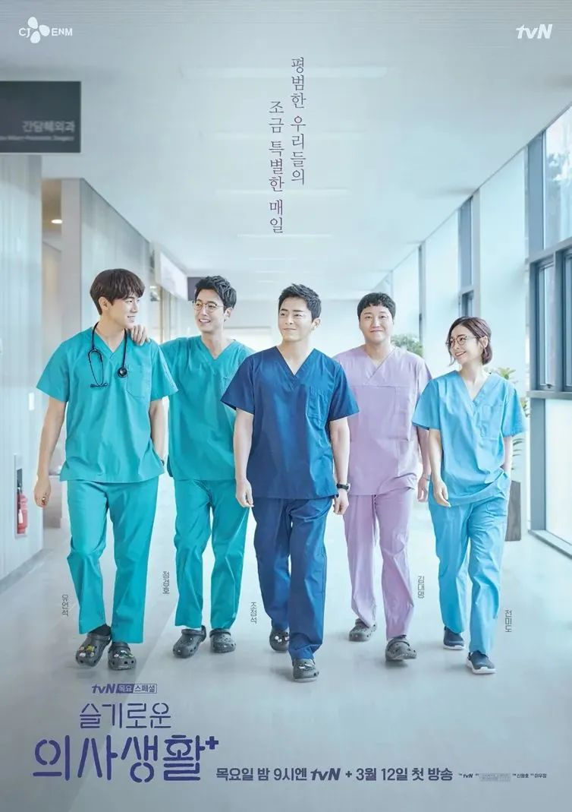

看海报和剧名就知道，这是一部以急诊室为背景的医疗剧，讲的是医生、护士和患者之间，围绕着生命拼死奋斗的温馨故事。

别看医疗题材很常见，但这部剧中上至导演编剧、下至主演配角，全都非常有排面——

导演申源浩，拍过大名鼎鼎的《请回答》系列和《机智牢房生活》，不出手则已，一出手就是9+分爆款；

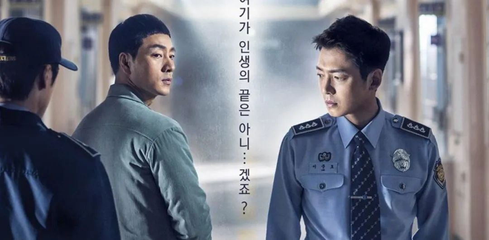

编剧李有静，跟申源浩是老搭档，《请回答》系列就是她的作品，多少观众常年都在盼她出新作。

这俩人凑在一块不仅为成片质量上了双保险，也为本剧奠定了悲喜交织、群像为主的两大基调。

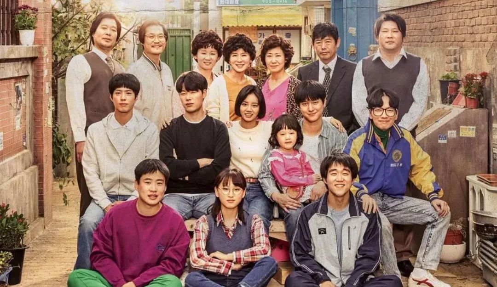

演员阵容方面，曹政奭、全美度都是专业音乐剧出身，表演基本功扎实；郑京浩、柳演锡则是颜艺俱佳的韩流男主担当。

就连剧中的配角及客串，也大多是荧幕熟脸，还有不少跟申导合作过的老戏骨赶来助阵。

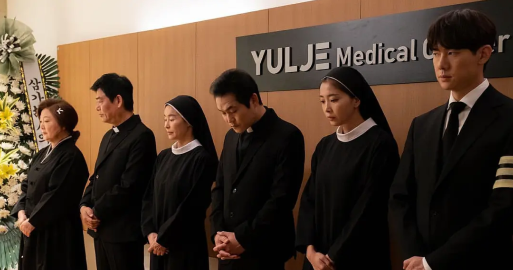

最近，这部《机智医生生活》一开播就在豆瓣开出了9.4分的口碑。

这个分数相比《请回答1988》仅差0.3分，跟《机智牢房生活》打成平手，可以说是直接预订了本年度的爆款。

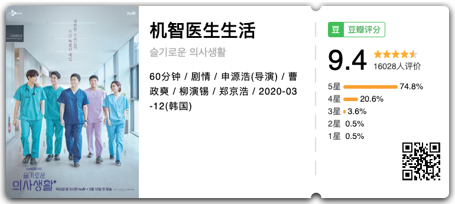

剧中延续《请回答1988》“四男一女”的配置——五位主角虽然年过四十、性格各异，但却是一帮志同道合、感情深厚的至交好友。

20年前，他们一起从首尔大学医学科毕业，如今又是同一家医院、不同科室的教授级医师。

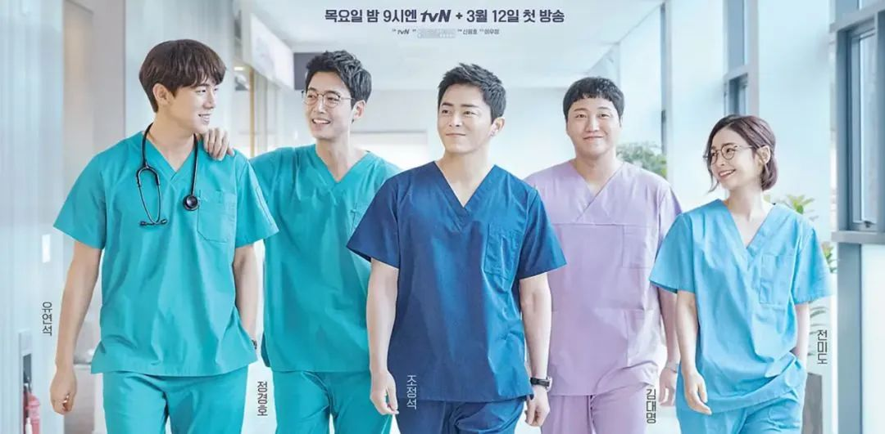

其中，就职于肝胆胰外科的李翼俊，明明聪明绝顶能学会玩，还是主角中唯一结婚生子的人，但偏偏在生活中最为中二。

第一集刚出场，他就因为不小心把儿子涂满强力胶的头盔戴在头上，不得不顶着黑武士造型去医院就诊。

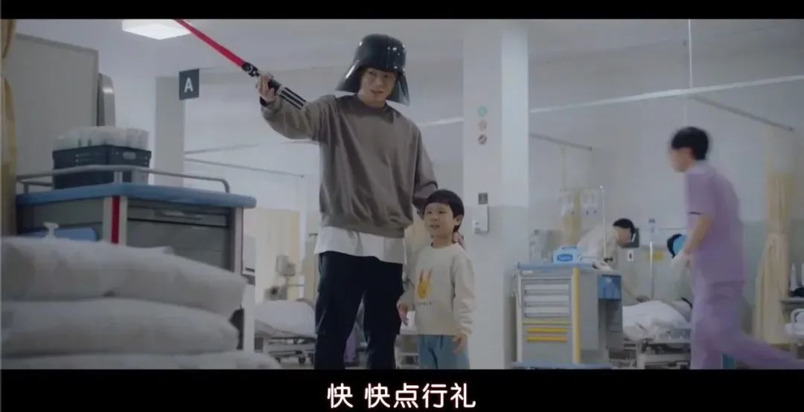

没想到，他正好赶上了一场器官移植手术，缺主刀医生。

眼见病患要错过最佳治疗时机，李翼俊经不起朋友的“坑蒙拐骗”，只好帽子未脱就走进手术室，忙活了一整晚。

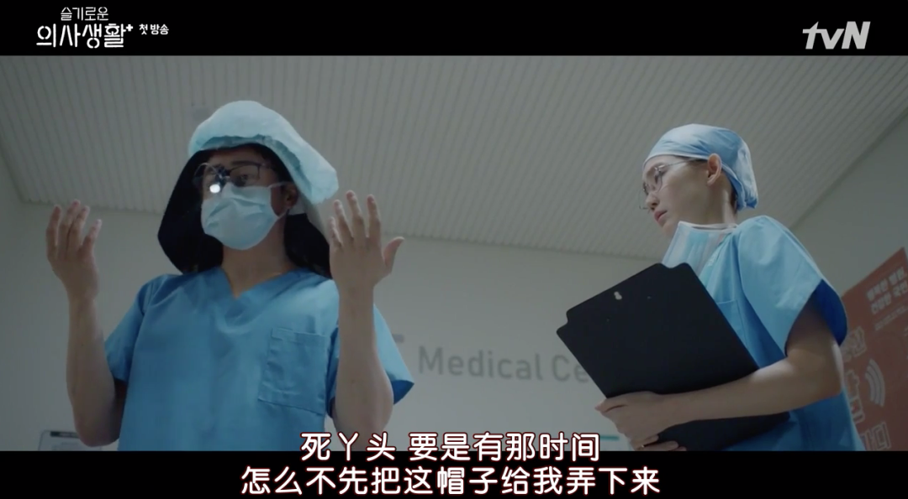

就职于神经外科的女主蔡颂华，因为精力过于旺盛，被同事后辈们称为“鬼医”。

除了承担所属科室的大量手术任务，她还要为学生授课、审阅论文、参加学会，甚至连周末也安排了登山和露营活动。

但即便如此，当她得知主任为博出名抢走她的病患，又不顾病人安危，想要挑战跨领域手术时，她选择了主动深藏功与名，以助手的身份代劳。

就职于妇产科的梁硕亨，是一个深度社恐+大龄妈宝男。

虽然医术高超、内心温暖，但他除了随时把妈妈挂嘴边、事事都打电话汇报之外，对待其他陌生人，则是能不交流就不交流。

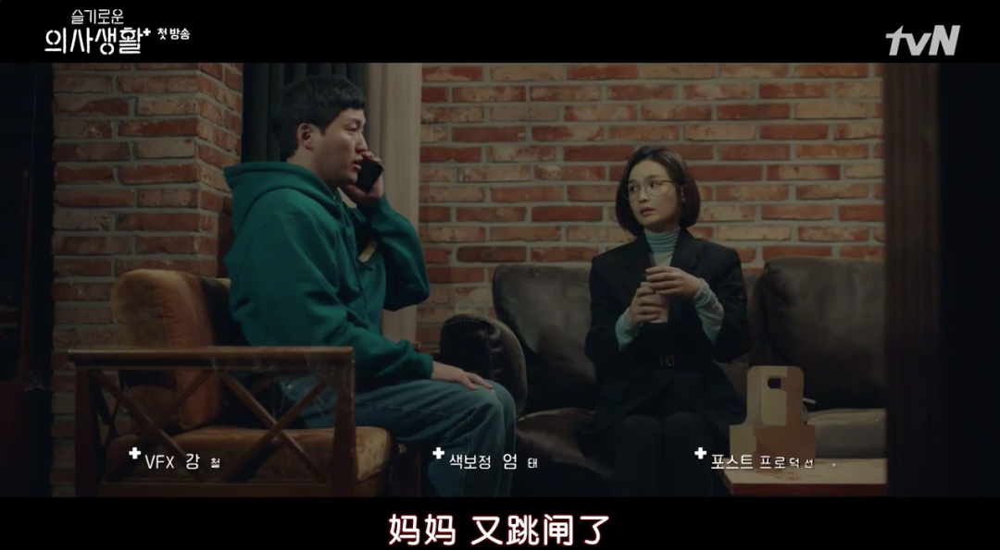

就职于胸外科的金俊菀，在前两集里戏份不多，但看得出他不仅业务精湛、对工作负责，对待朋友也非常上心。

在发现蔡颂华的男票劈腿后，他没有当面戳穿，而是让渣男亲自道歉说明事实，将伤害降低到最小值。

而就职于儿科的安正元，看上去是一位温柔善良、行事低调的暖男医生。

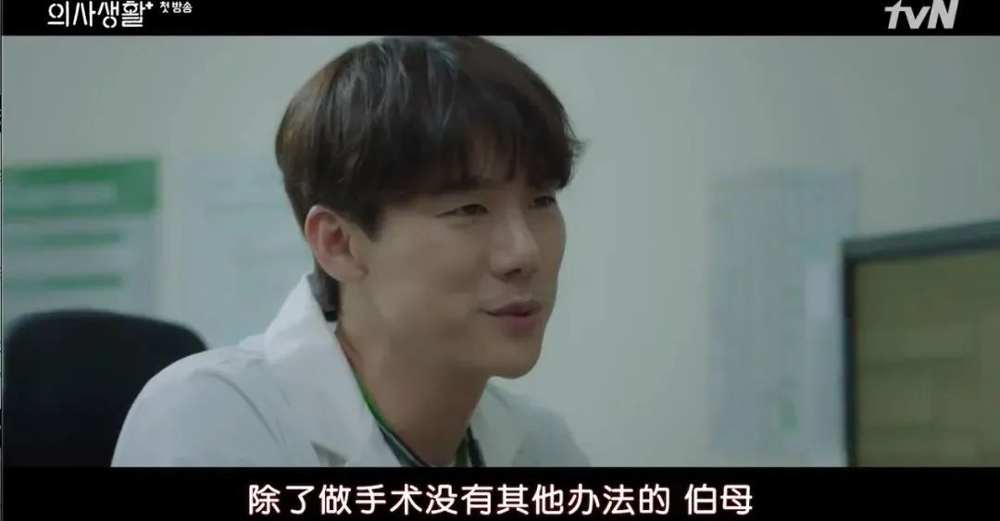

他用自己的收入成立了一个“长腿叔叔”匿名基金，专门为看不起病的孩子们提供帮助。

因为共情能力实在太强，他动不动就为病患去世痛苦自责到怀疑人生，甚至萌生了改行做神职人员的念头。

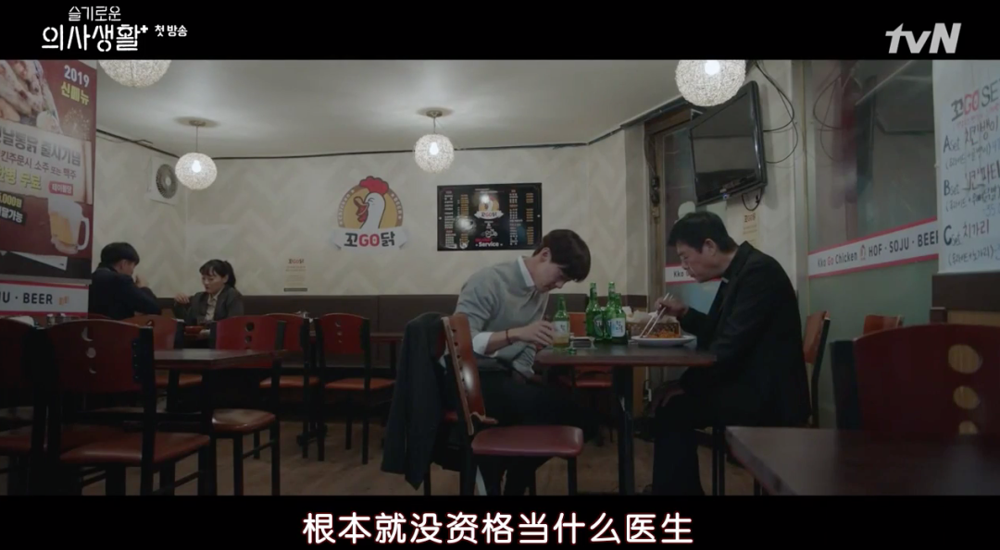

直到医院所属财团的会长去世，安正元的秘密身世才被揭开——原来他是财团的法定继承人、已故会长的小儿子。

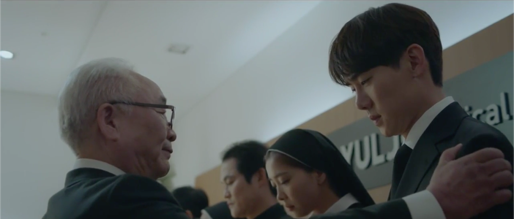

为了能专注治病救人，他放弃了医院在内的大部分遗产，只保留VIP病房的运营及收入支配权。

如此一来，安正元一边将五人帮召集起来，组成随叫随到的VIP医疗团队；一边将病房赚来的收入，继续用于救助社会上的弱势群体。

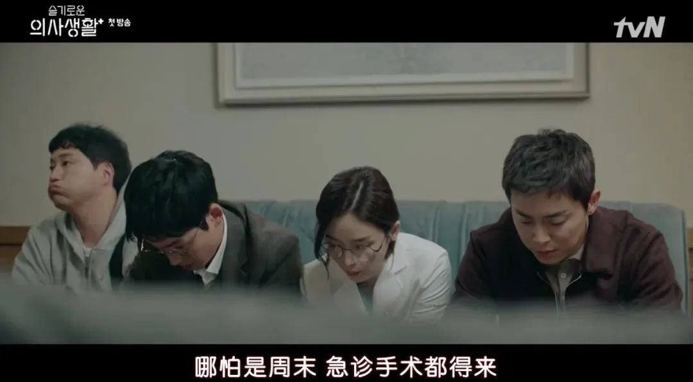

至此不难看出，这部剧并没有突出治疗过程的惊险复杂，或是将主角打造成妙手回春的高冷杰克/玛丽苏，而是力图通过以点带面的细节描绘，将医生主角们真实的工作生活、喜怒哀乐呈现出来，在同类题材中堪称一股清流。

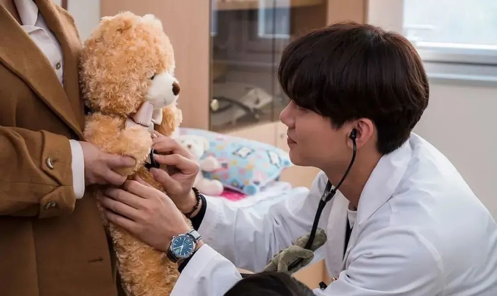

比如作为职业病之一，医生们不仅听不得救护车的鸣笛声，也不能忍受别人把各种死法挂嘴边。

所以在发现安正元把救护车音效设为铃声时，其他主角瞬间被吓到原地弹起。

一边惊呼“吓死宝宝了”、“心脏差点跳出来”，一边一本正经地相互指责，不该把别人的病痛当玩笑讲。

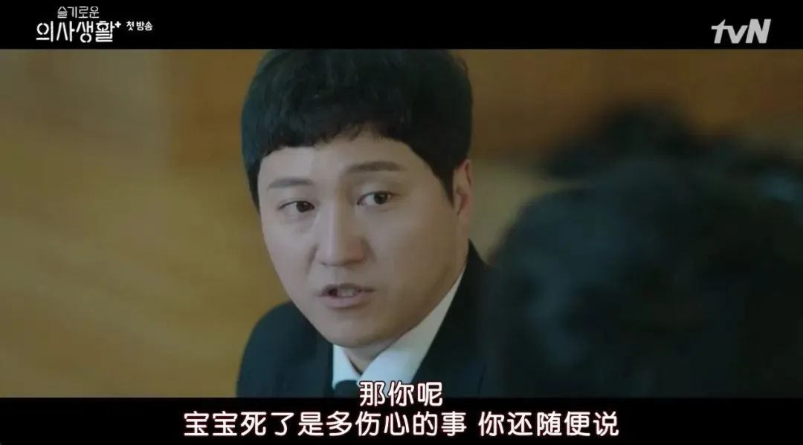

还比如，安正元一开始提出组建VIP医疗队，要求24小时随叫随到、全年365天无休，当场遭到其他人的强烈抗议。

但当大家得知“年薪加倍”时，立马愉快地在金钱面前折了腰，一边迫不及待签写合同，一边抱怨“金主爸爸”不早说涨工资。

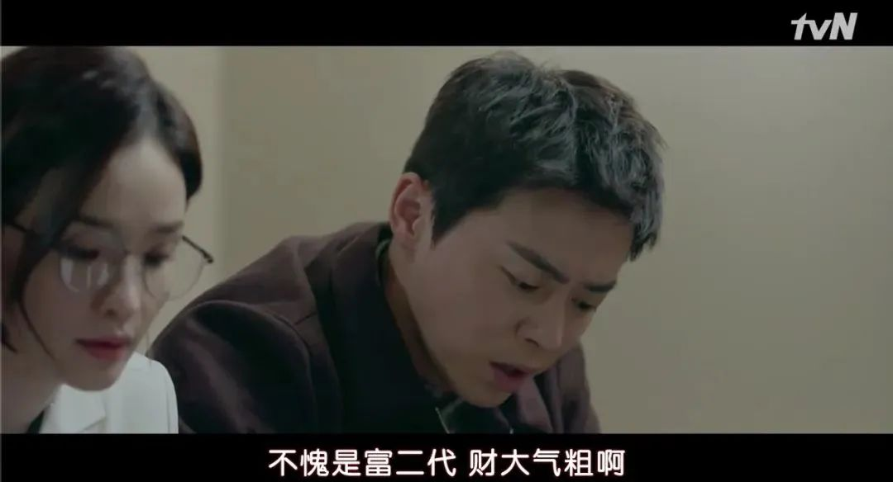

除了刻画主角在职场上的医生形象外，导演和编剧还通过不同时间线的跳转，让观众看到他们在珍贵的友情岁月中，一路相互陪伴、见证彼此的成长。

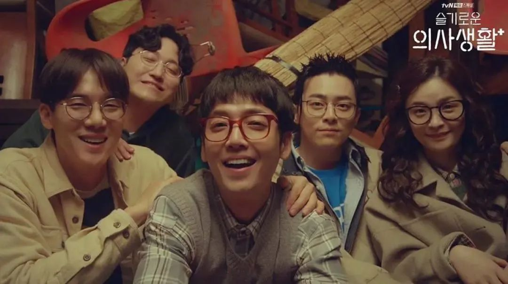

值得一提的是，剧中还出现了各种《请回答1988》式喜剧元素，诸如每逢尬点的鸡叫声，以及必不可少的“猜老公”环节，为追剧增添了不少乐趣和悬念。

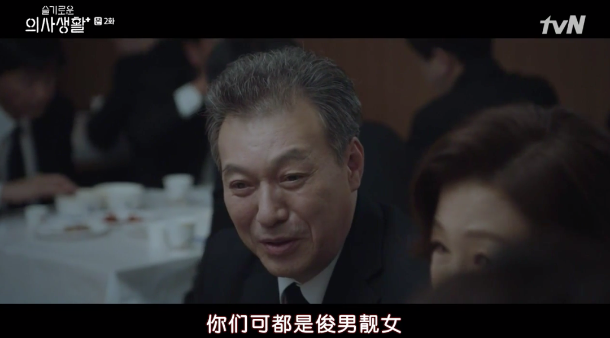

而这种正经中不乏沙雕的人物设定，不仅消解了医疗题材的严肃压抑，也使得观众摒弃对医生及医患矛盾的成见，从悲喜交织的故事中获得温暖治愈。

第一集里，有位名叫敏英的三岁女童身患重症，经过多次抢救不见好转，还变得愈发脆弱和痛苦。

而患者母亲却坚决不肯放弃治疗，一会质疑安正元的处方变来变去，一会又指责住院医师不够用心，总是在换药时伤到孩子皮肤。

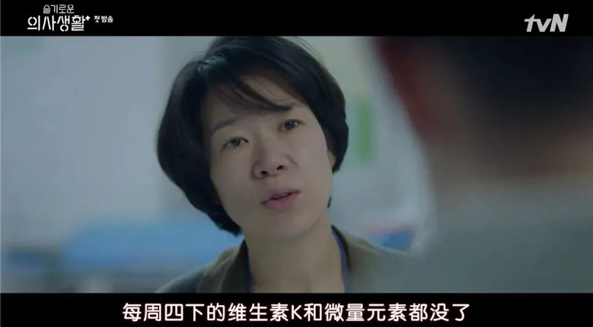

最终，敏英没有撑过抢救。

就在大家以为要迎来狂风暴雨时，患者母亲却一反常态地没有大吵大闹，她忽然意识到，是自己的不甘心让女儿备受煎熬，也让医生们付出了太多辛劳。

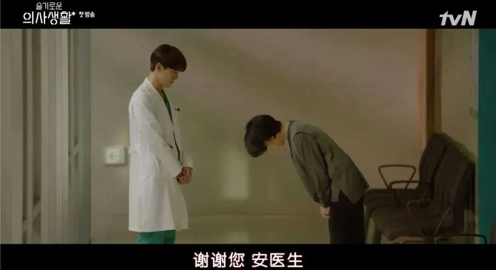

还有位家属，一边是儿子急需肝移植，一边是母亲患上恶性肿瘤，她每天奔波于不同病房不说，还得抽空去给婆婆和巨婴丈夫做饭。

这种常人难以忍受的压力和痛苦，让她一度在蔡颂华面前崩溃痛哭。

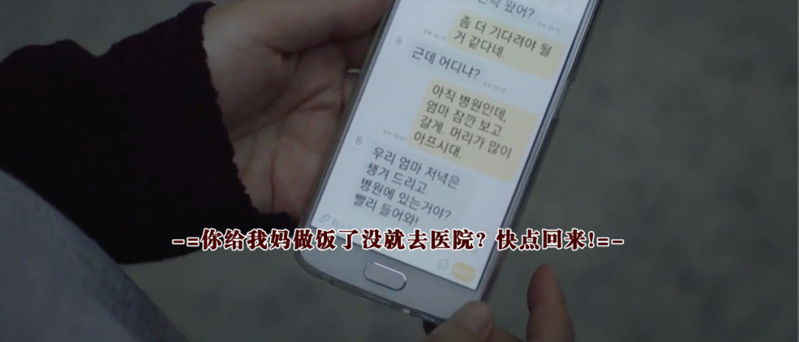

但好在天无绝人之路，最终她的儿子等来了移植肝源，母亲经过活检确诊，也幸运地处在可治疗阶段。

于是，上一秒还在哭诉命运不公的她，下一秒又破涕为笑，感谢医生让自己成为“全天下最有福气的人”。

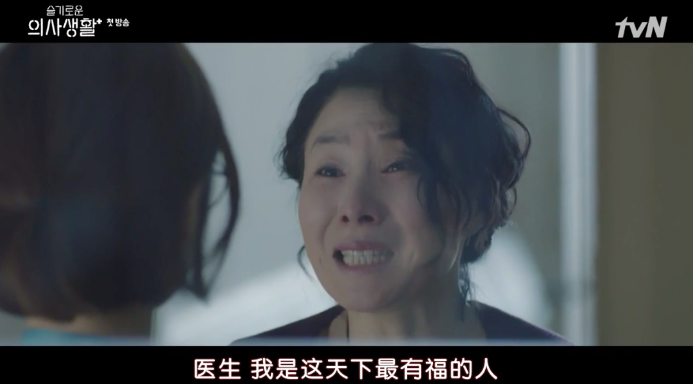

这些场景虽然看似戏剧性十足，但现实中真正关乎生死、牵动人心的，又何尝不是那些瞬息万变的转机。

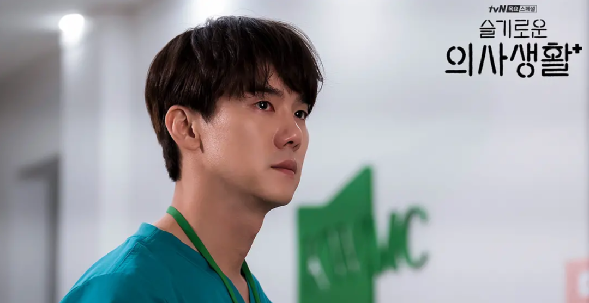

**更重要的是，这部剧没有为了增加可看性，故意夸大医患矛盾、制造医疗悲剧，让观众看得义愤填膺又槽点满满；而是像剧名“机智医生生活”所形容的那样，将人性中最美好的温暖与善意，通通融入到琐碎又日常的医疗细节里，让观众在真实的感动中大哭大笑。**

**我想，这种真诚而充满人情味的创作态度，不仅是“请回答”及“机智”系列备受欢迎的原因，也是大多数观众对影视作品最基本的诉求吧。**

