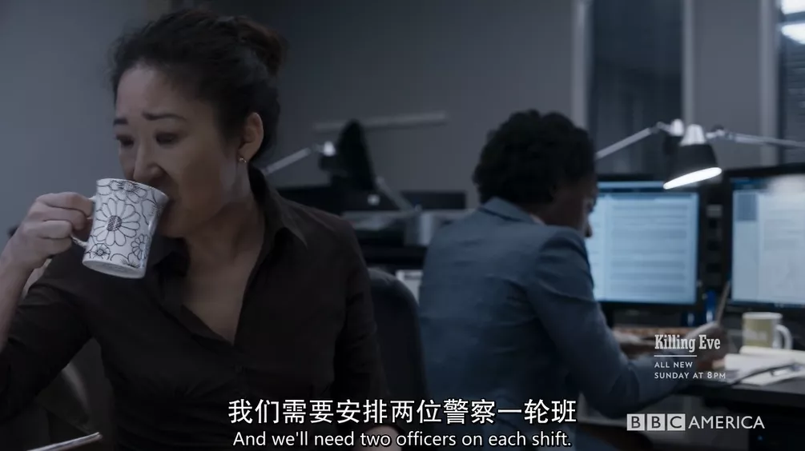
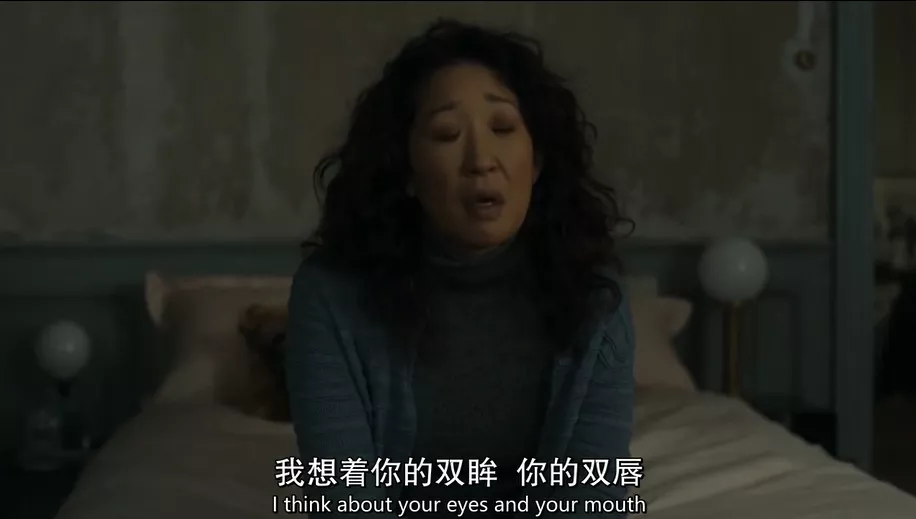

## 成人版猫鼠游戏，香艳刺激大尺度

原创 有部电影 有部电影 *今天*

昨天给大家聊了刚刚回归的神剧《傲骨之战》，今天要说的这部，也同样是个口碑超神的人气爆款——**《杀死伊芙》。**

  

  

这部剧走红国内的社交网络，不仅因为剧情高能，更因为去年，吴珊卓凭借第二季里的表演摘得金球奖视后，创造了亚裔演员的历史。

  

  

不过当时许多网友都把关注点放在外貌上，不是调侃她是“女版林永健”，就是质疑她之所以能拿奖，是“迎合了西方对亚裔的刻板印象和种族歧视”。

  

但其实只要看过《杀死伊芙》，就会知道这个奖她拿得绝对实至名归。

  

  

值得一提的是，这部剧的另一位女主演朱迪·科默，也在同年的艾美奖上封后。

  

可以说，《杀死伊芙》是妥妥的“双视后”配置，不仅阵容吸睛，更呈现出一种棋逢对手、相得益彰的精彩局面。

  

  

剧中，吴珊卓饰演的女主伊芙，原本是军情五处的内勤特工，学过犯罪心理学，直觉敏锐，对研究变态杀手格外感兴趣。

  

但她现在的工作机械又乏味，无非是在办公室整理资料，或给上司比尔跑跑腿，跟朝九晚五的社畜没啥区别。

  

  

此外，伊芙还嫁给一位老实巴交的数学老师尼科，俩人连开玩笑都不在一个点上。

  

伊芙整天就琢磨着“怎么不留痕迹地杀人”，张嘴就能报出一整套高端操作，而尼科除了在旁边表示赞叹，发表不出任何意见。

  

  

不过，这种乏味日子没持续太久，她就接手了一桩俄罗斯政客被杀案，负责政客女票（也是目击证人）的安保工作。

  

通过凶手在街头刺破股动脉的作案手法，伊芙认定对方是一个专业女刺客。

  

但奇怪的是，任务负责人咬定凶手是个男的。

  

  

为了弄清真相，伊芙决定自己调查。

  

她擅自跑到医院里询问政客女票，但对方精神受创，且只会说波兰语，她只好将问话过程偷录下来，然后找一个波兰男孩当翻译。

  

但万万没想到，就在她离开病房去厕所的一刻功夫，证人、警员、医护就被集体屠杀，现场惨不忍睹。

  

  

这件事直接导致伊芙被军情五处开除。

  

但就在失业的当晚，军情六处俄罗斯办事处的冷血女强人卡罗琳，突然找到了她。

  

  

原来，伊芙在调查政客被杀案时，对近年来的类似案件进行了系统分析。

  

她怀疑那个女刺客受雇于跨国犯罪组织，并已成功刺杀多位有影响力的大人物，诸如意大利黑手党领袖、法国某政党赞助人等等。

  

对方可能会说多种语言、极具杀戮天赋，甚至具有变态暴力倾向。

  

  

而卡罗琳不仅认同伊芙的推断，还着手组建了一个地下特工小组，交由她来指挥。

  

随后，伊芙将老上司比尔、同事埃琳娜纳入麾下，再加上卡罗琳的儿子、天才黑客肯尼一起，迅速展开了进一步的调查。

  

  

就在这期间，伊芙突然想起政客女票被杀的当晚，自己曾在卫生间碰见一名女护士，但对方并不在医院员工名单上。

  

那么她是谁呢？

  

  

没错，她就是本剧的另一位女主，也是伊芙正在追捕的女刺客奥克萨娜。

  

  

奥克萨娜从小在俄罗斯长大，由于母亲过早离世、父亲是个酒鬼家暴男，很早就出现暴力倾向和反社会人格。

  

她曾经过失杀害一名未成年人，两度纵火、多次盗窃，还因为爱慕一个女老师，杀害并阉割了对方的老公。

  

后来被神秘组织“十二门徒”招募，受训成为职业女刺客，在上线康斯坦丁的管理下，替组织杀人来换取报酬。

  

  

虽说这种俄罗斯少女受训杀人的设定，早有各种特工电影珠玉在前，漫威一姐“黑寡妇”也是这么个出身——

  

  

但奥克萨娜的独特之处就在于，她不但没走上“改邪归正”的道路，反而靠着变态乖张的性格让人心驰神往。

  

一方面，她冷血又暴力，毫无同情心和同理心，无论目标是谁都使命必达，甚至会即兴发挥创造力，把花式杀人当作一种享受。

  

  

当街割破股动脉、将发簪插入眼睛、化身女护士施虐或用伪造香水引发窒息等等，脑洞操作层出不穷。

  

  

另一方面，她过得极其随心随性，不受道德与法律约束，只要是自己渴望的，无论是人是物都要占为己有。

  

比如她对奢侈品牌情有独钟，每次收到报酬就会血拼一把，有时边行刺还边惦记着人家的高级床单。

  

  

总之，要是被这种性格的人惦记上了，想摆脱估计只能自杀了事。

  

但偏偏，这种倒霉事就被女主碰上了——自从两人在医院里多看了对方一眼后，奥克萨娜就一直对伊芙念念不忘。

  

得知对方是负责追捕自己的特工后，她更是兴致盎然，对伊芙产生了浓烈的兴趣。

  

  

随后，她又是高调制造杀人案引发调查，又是偷走行李箱窥视对方，还霸总上身地寄去奢侈品衣服，公然向伊芙发起挑（调）衅（戏）。

  

  

最后，玩腻了你追我赶的猫鼠游戏，她干脆亲自登门与伊芙对峙。

  

正因为这种生性凉薄又为所欲为的玩味人设，让观众对奥克萨娜又爱又恨，甚至亲切地称呼她为“小变态”。

  

  

说到这里不难看出，《杀死伊芙》是一部融合了犯罪、悬疑、惊悚、爱情、黑色幽默等众多元素的谍战剧，镜头尺度也张扬跋扈，刺激着观众的肾上腺素。

  

值得一提的是，在以往的同类题材作品中，不论女特工还是女杀手，这类角色通常会被塑造成一种或性感或冷艳的形象，“好看”却并不生动。

  

  

但在《杀死伊芙》中，无论是伊芙、奥克萨娜，还是军情六处的卡罗琳等女性角色，都并非男性欲望的投射，而是真正具有独立性的“主体”。

  

  

说到这里，不得不提本剧第一季的首席编剧，她正是《伦敦生活》的“菲编”，菲比·沃勒-布里奇。

  

《杀死伊芙》并非原创剧本，而是改编自英国作家卢克·詹尼斯的小说，主要人物原本大多是男性，在菲编的掌舵下，才脱胎换骨成如今的模样。

  

  

剧中的这些主要角色，虽然立场有别，但无一不是业务精湛、智勇双全，具有强大的生存能力与独特的处世哲学。

  

她们一方面取代了男性在谍战题材中向来的主导地位，另一方面又在杀伐决断的同时，也兼具细腻机敏、温柔坚韧等女性特质。

  

  

其中最让人上头的，自然要属两位女主。

  

她们一个凭实力逆袭职场、成为揭露跨国犯罪的关键性人物；��个技能超群、杀人如同探囊取物，本该势不两立、你死我活。

  

**但两人骨子里又互为镜像，一个向往刺激、不满足于按部就班的生活；另一个却在刀尖舐血的生活中渴望安稳，想要与爱人白头偕老。**

  

  

这也使得两人产生了一种惺惺相惜的默契。她们越是被彼此吸引而无法自拔，越是让这场互为猎物的猫鼠游戏，充满一触即发的情感张力。

  

在第一季结尾，俩人刚并肩躺在床上互诉衷情，伊芙就为了给老上司报仇，捅了奥克萨娜一刀；

  

  

而在第二季里，为爱化身线人的奥克萨娜，在得知伊芙不肯一同私奔后，也毫不犹豫地给她来了一枪。

  

这种字面意义的“相爱相杀”，以及对边缘人性的挖掘刻画，也是这部剧口碑走高、拥趸无数的原因之一。

  

  

除了“双女主博弈”的主线之外，剧中不断引发国际争端的“十二门徒”，以及潜藏在各国情报机构中的成员身份，同样牵扯着观众的好奇心——

  

比如奥克萨娜的上线康斯坦丁，居然就是卡罗琳多年以来的情人+线人，这背后隐藏了什么内情？

  

  

前两天，《杀死伊芙》第三季回归，才播出一集就刷新口碑，在豆瓣拿到9.1的高分，让期待多时的剧迷们放了心。

  

  

虽然剧情承接上一季，但这部剧每季只有8集，即便之前错过，现在跳坑也为时不晚。
