速读摘要

凭借着凹凸有致的身材和惊人的美貌，她定档主演了大火的HBO新剧——权游前传。其中有一个65岁的网友，眼周肌肤也产生了惊人的变化!大夏天的去旅游之后皮肤被晒得又干又黑，回来敷这一片简直像久旱逢甘霖，揭开就有饱满透亮的婴儿肌!和品牌方争取了一波折扣，新人还有更低价，超划算的!这就是为什么自然兰能获得日本JFRL盖章认证的原因吧!

原文约 2138  字  | 图片 39 张 | 建议阅读 5 分钟 | [评价反馈](https://static.app.yinxiang.com/embedded-web/clipper/#/Evaluating?d=2020-03-25&nu=e9a9808e-a010-4994-adbd-cd118a5f811c&fr=myyxbj&ud=58b471&v=2&sig=BA2E3BF25BEB677684CAECB37442CBDB)

##  51岁“少女”火了，被6000万网友捧上天：看她这张脸，谁还敢叫阿姨？

自然兰 
岁月是把杀猪刀，但时光却格外优待美人。

比如这位看起来才20多岁的神仙姐姐，竟然已经51岁了！！

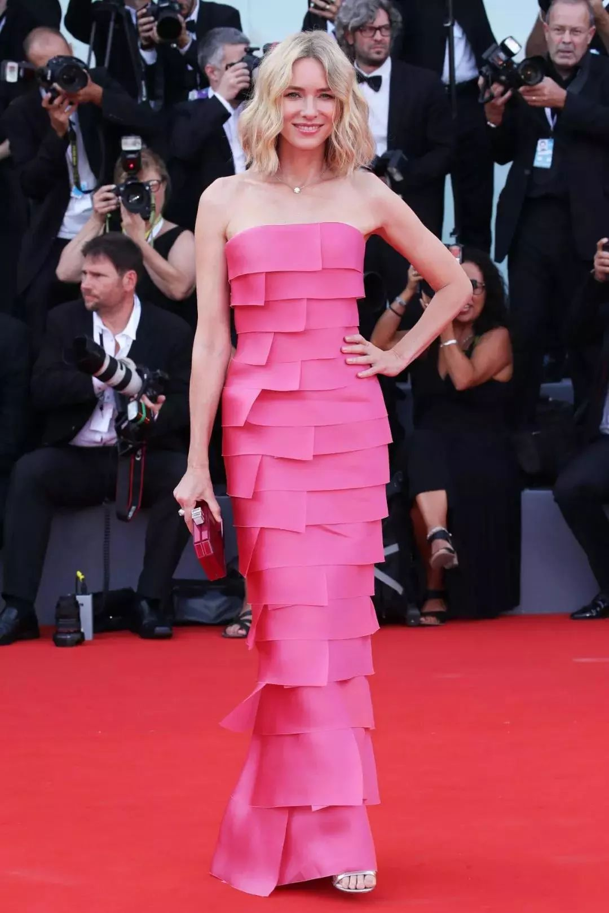

她就是传奇的“不老女神”，也是电影《金刚》的女主角——娜奥米·沃茨。

她51岁的照片一经曝光，就震惊了整个澳洲。

连公认对明星最毒舌的外媒，都吹起了她的彩虹屁，纷纷称她为“51岁的少女”。

凭借着凹凸有致的身材和惊人的美貌，她定档主演了大火的HBO新剧——权游前传。

看看这初恋般的笑容，试问谁能把她和一个广场大妈的年纪联系在一起？！

难怪很多人都说：“看她一眼，就入了魂。”

因为她十年如一日的不老神颜，娜奥米成了人人艳羡的冻龄女神，不少女性都想扒出她的护肤秘诀。

在ins里，这位神仙姐姐就大方地分享了自己的保养日常：

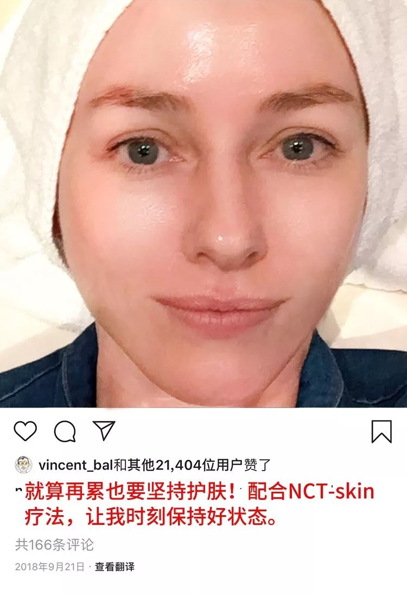

NCT-skin疗法？这是什么鬼？

**  **** ****1**** ****  **
**澳洲神奇冻龄术**
**40000+人见证换脸奇迹**

我上网查了很多资料（快要瞎了），原来**NCT-skin**，英文为New Collagen Treament-skin，翻译过来就是NCT胶原蛋白疗法（以下简称NCT胶原疗法）的意思。

因为效果不错，它在澳洲很受追捧。媒体**《每日邮报》**还专门报道了它：

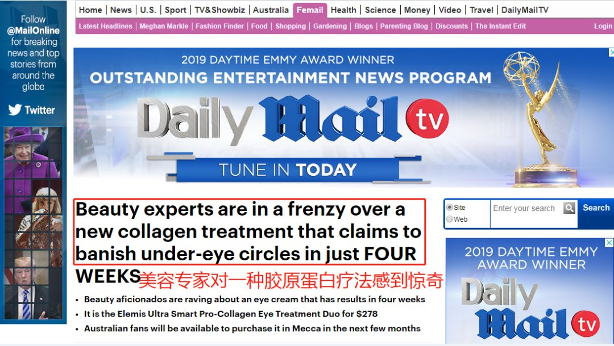

这则新闻一经刊载，网友们就争先恐后跟上这股冻龄风潮，**效果简直逆天了！！**

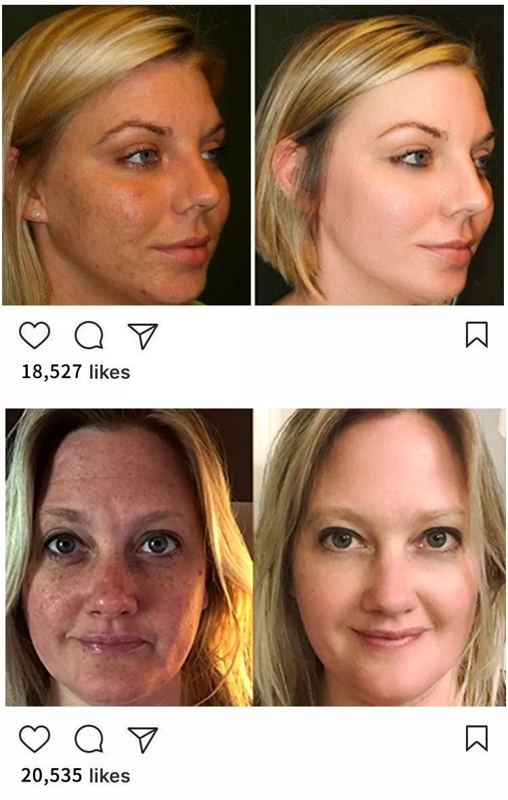

其中有一个**65岁**的网友，眼周肌肤也产生了惊人的变化！看看这效果：

↓↓
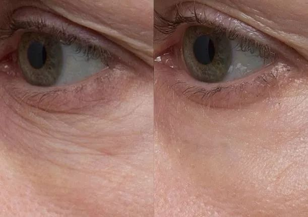
*（65岁的Emma眼下**皱纹对比）*

体验过的人，无不赞叹惊呼：

**“太神奇！法令纹说淡就淡”**
**“感觉脸上变得嘭嘭紧实！”**
**“素颜出门完全不虚！”……**

这种冻龄术很快从澳洲疯传了出来，相继传到韩国、日本。还有杂志专门报道：

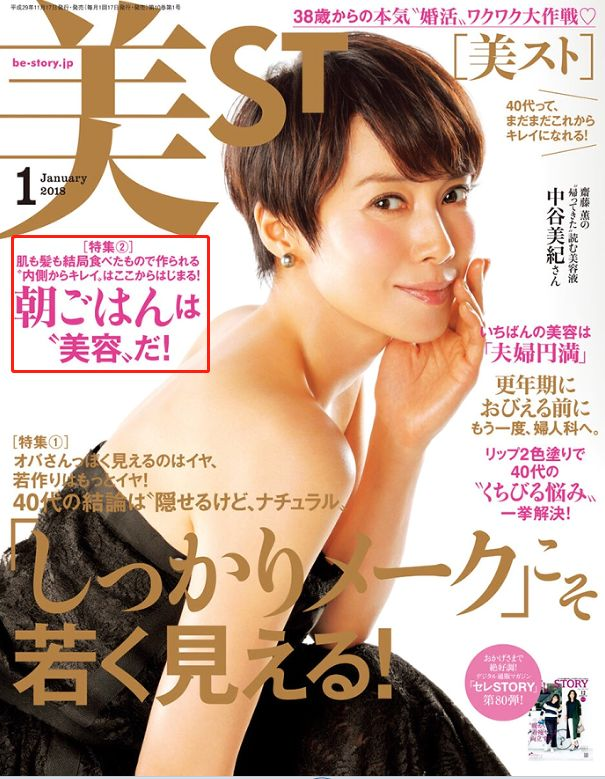

国内网友当然也不甘落后！我随机截取了几篇网友的体验反馈↓↓

**  **** ****“像魔法一样”**
天生黄黑皮，坚持一直敷，
脸色变得更加通透有神采了，
再也不是暗黄疲倦的样子，痘印也淡了不少！

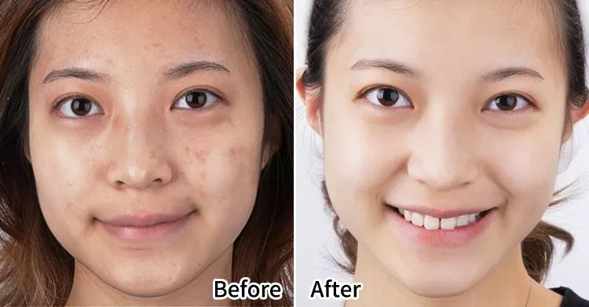

**  **** ****“效果堪比医美”**
用掉几盒后，皮肤就像打了水光针一样！
变得白嫩光滑，少女感满满。
同事以为我偷偷做了医美~

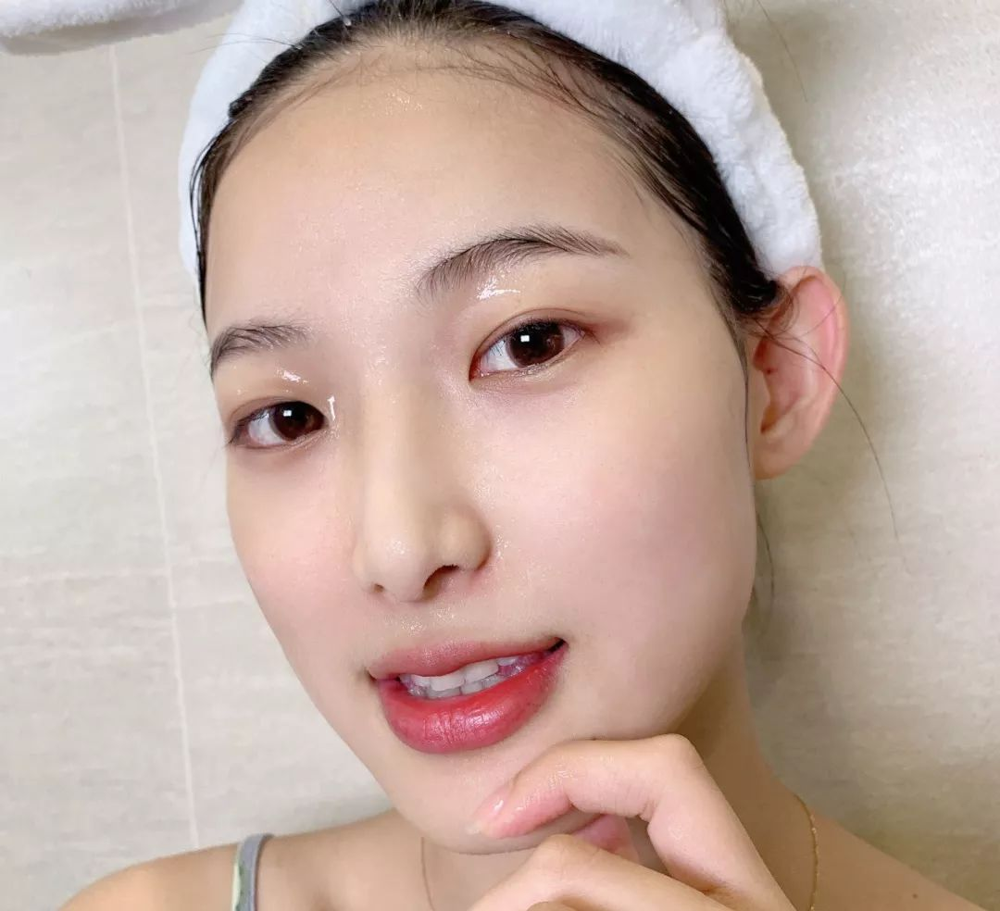

**  **** ****“年轻了不少”**
遇到它，超级感谢！
生完孩子的暗沉黄气都不见了，
轮廓变得饱满紧致，脸色也更有神采了！
老公说我看起来年轻了不少！

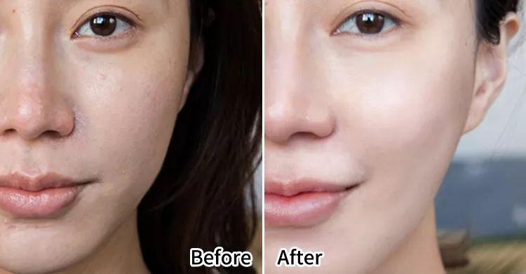

   **2**
**火爆国内美妆圈**
**用过的人都说：“太神奇了！”**

很快，因为澳洲NCT胶原疗法的走红，国内也掀起了一股胶原蛋白狂潮。
小红书、抖音等各大平台都在跟风尝试，连**大美人王鸥**，也抵挡不了它的诱惑。
前阵子她在巴厘岛旅游的时候，就给网友分享了一款她**每天都在用的NCT胶原蛋白面膜：**

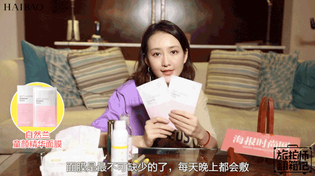

还有**娃娃脸女神薛凯琪**，她在节目中自曝是童颜面膜的忠实粉丝：

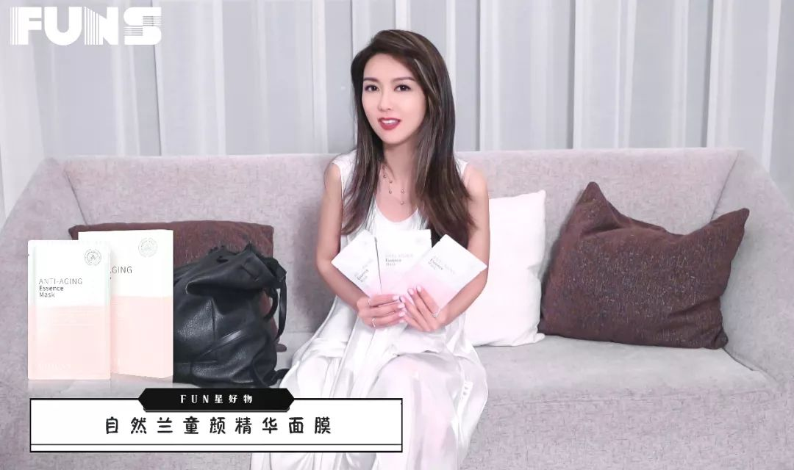

**中法混血超模Adrianne Ho**，在走秀前也会敷上一片，keep住自己的好状态！

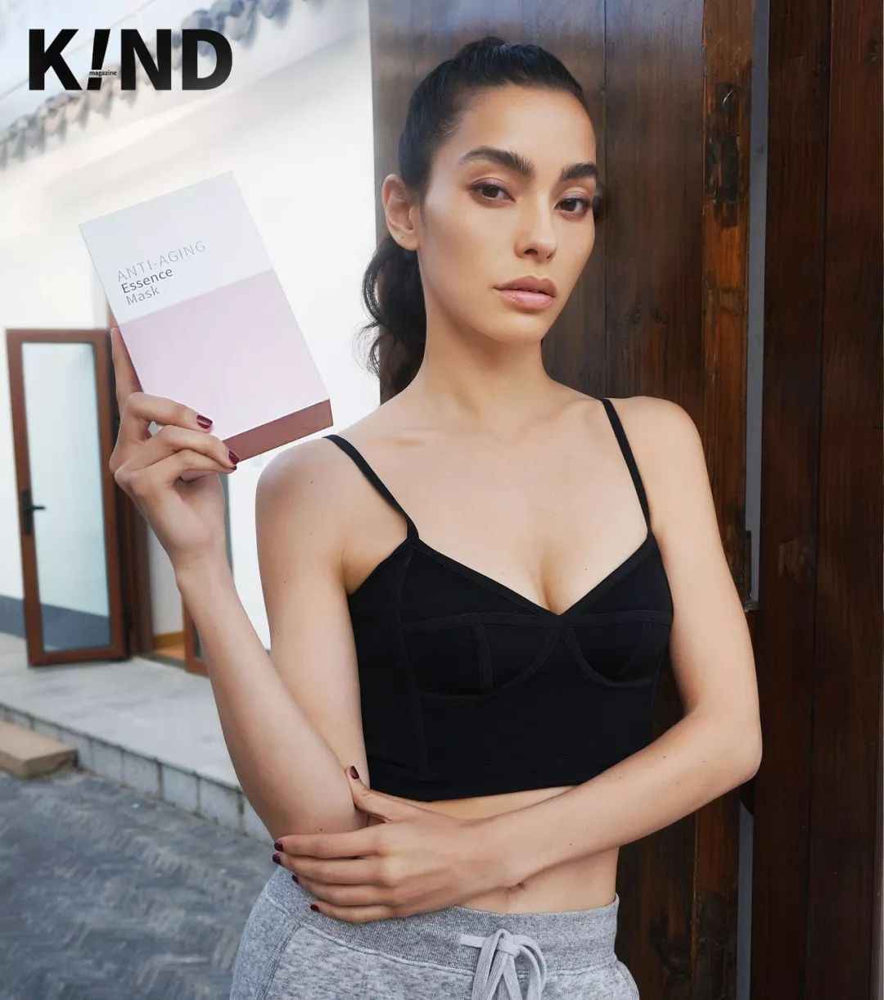

还有**影后张静初**，连拍戏都不忘带上它，是真爱粉无疑了！

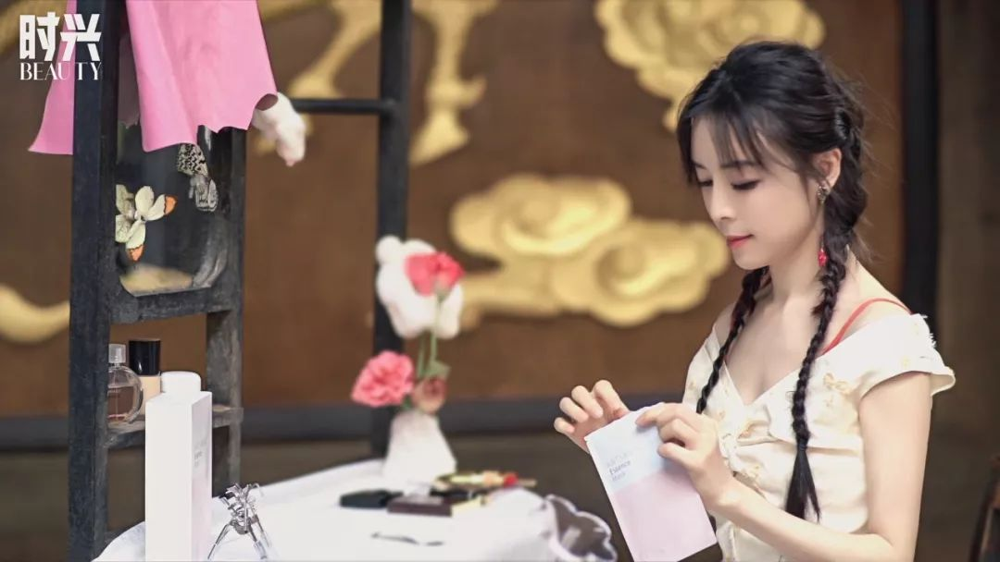

眼尖的小编一眼就认出，这不是在小红书上超火的网红面膜吗？？
 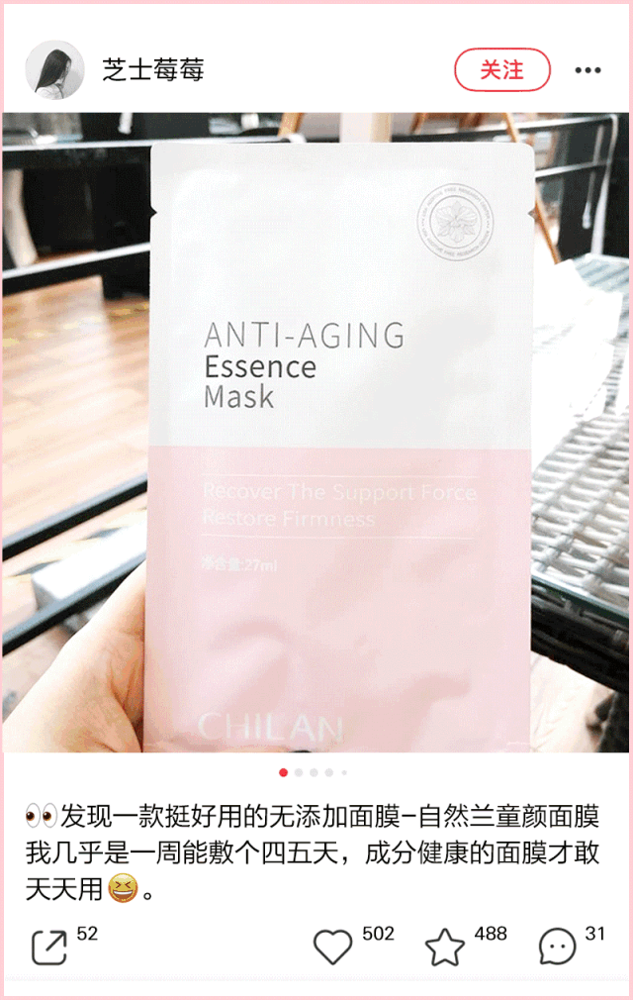

喏，就是它，CHILAN家的童颜精华面膜☟☟

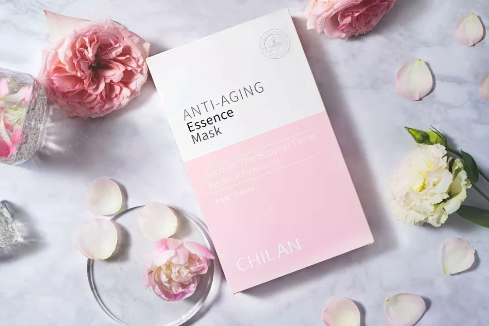

瑞丽杂志今年的**“年度护肤人气奖”单品**，就颁给它了。

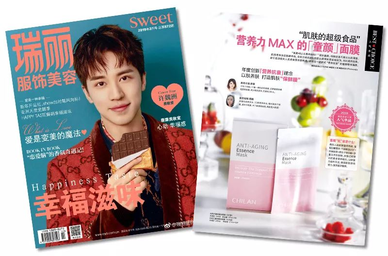

我估摸了一下，能从**一众品牌**中厮杀出来夺得大奖的面膜，肯定不简单！

这么多明星、媒体都为它疯狂打call的面膜，小编有点心动了。

 ** ****  **** ******3******** ********  ****
**亲测：敷上它
**
**每个毛孔都嘭弹透亮，嫩到发光**

经不住诱惑的小编，即使吃土也要抢先到手评测一下啦~

包装是粉白色系，清新自然，一下子就抓住了老阿姨的少女心。

打开之后，是它的特有**双重包装**，隔绝了灌装时外包装的油墨污染，洁净程度让强迫症本编超满意！

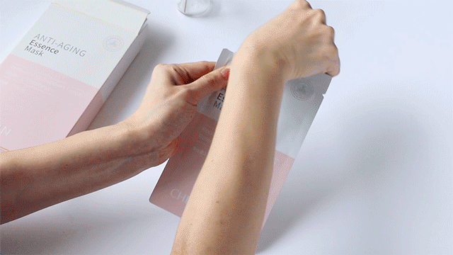

面膜液有足足**27ml**，超大份的满足感。

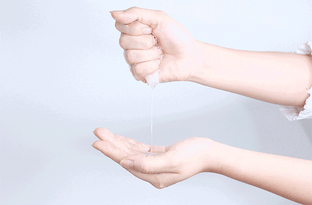

膜布不薄不厚刚刚好，很柔软，叭叽一下贴到手上超舒服~

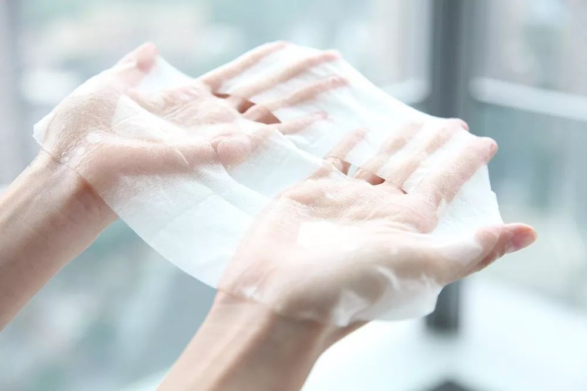

超薄进口天丝材质，**上脸犹如第二层肌肤。**

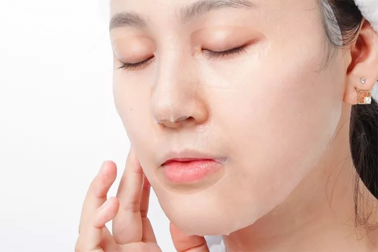

大夏天的去旅游之后皮肤被晒得又干又黑，回来敷这一片简直像久旱逢甘霖，**揭开就有饱满透亮的婴儿肌！**

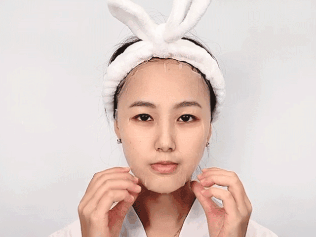

用手机拍摄近看，原本的干纹、毛孔都隐形了。**整张脸细嫩柔滑，每个毛孔都blingbling闪着光。**

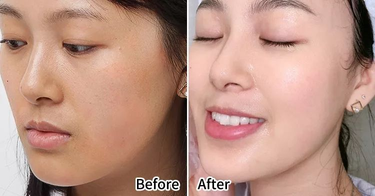

连续敷上几个周期，**皮肤水润细嫩，像剥了壳的鸡蛋，我终于可以素颜上街了呜呜！**

介绍给30多岁的同事，她也说效果很不错。

原来有点松弛的暗黄脸，**变得紧致弹滑，比她用过的很多大牌都有效↓↓**

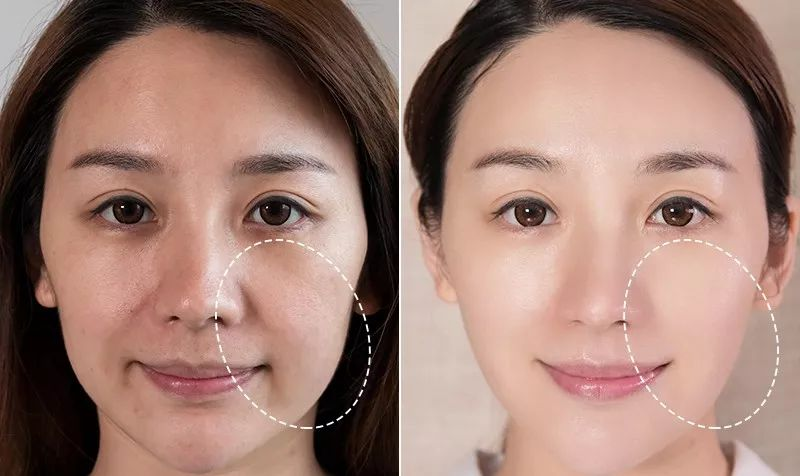

对付痘印也很有效，同事小A专门用它来消灭痘痘和痘印，后来的她再也没有长痘烦恼了！

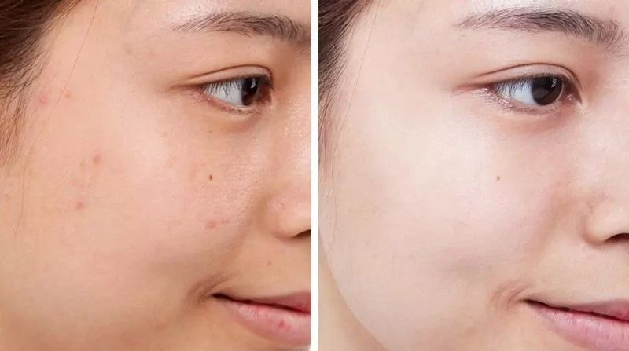

很快，这款面膜成了办公室小姐妹人手一盒的新宠~真的好用，赶紧囤起来！！

和品牌方争取了一波折扣，**新人还有更低价**，超划算的！

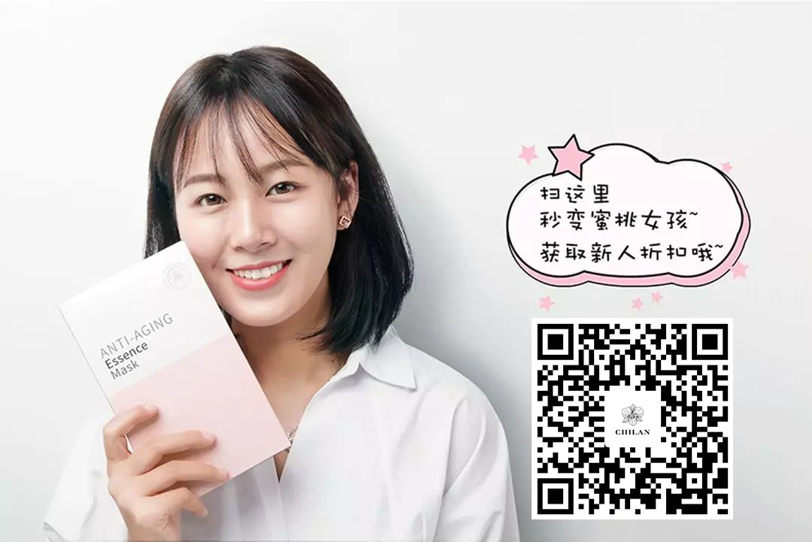

   **4**
**深扒成分：**
**15分钟嫩到爆水
**

说到成分，就不得不提这款面膜比较特别的一点。

据说它倡导**“以肤养肤”**理念，采用的全是“类人皮营养素”，**即模仿肌源营养，促进胶原蛋白生成。**

因此它也有一个别称，叫**“人皮面膜”。**

瑞丽网也认可这种护肤理念，还在网站首页整版介绍了它：

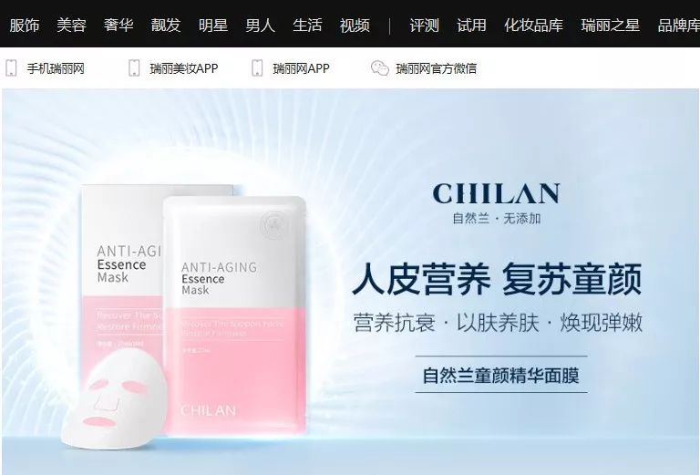

单个拎出来，都是实打实的贵价成分，一点都不来虚的：

**水解胶原**：鼎鼎大名的“皮肤软黄金”，能渗透肌底，让皮肤澎润细嫩；
**透明质酸**：小分子透明质酸，肌肤大口喝饱水；
**寡肽-1**：修护界种子选手，痘坑、痘印、泛红敏感对它都是小菜一碟。

一滴就能让肌肤pong一下弹嫩起来：

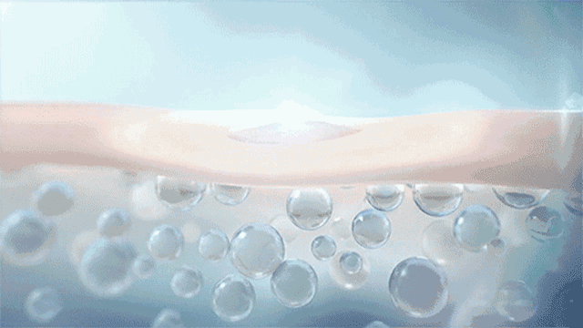

因此，敷上它之后**见效超快**，有网友试用后反馈：**“感觉皮肤回到了少女时期，即使熬夜也能水光透亮！”**

我随机截取了几个，你们感受一下画风↓↓↓

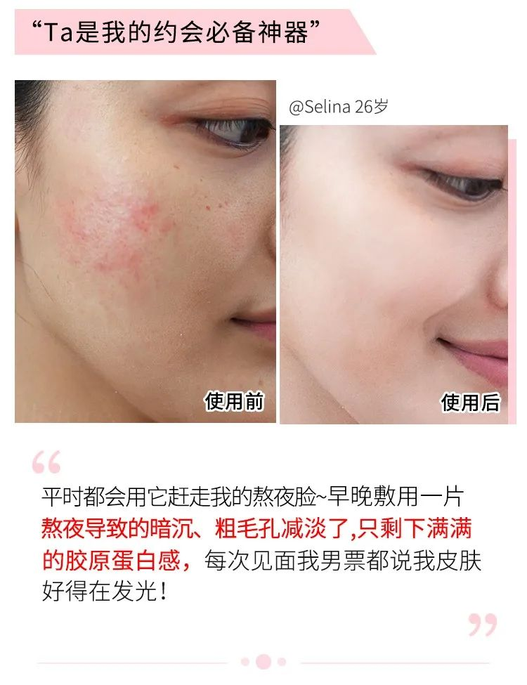
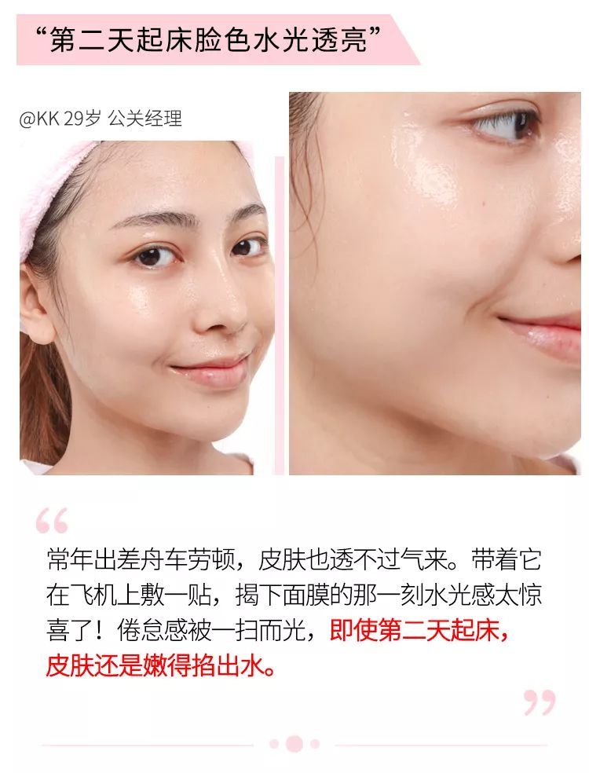

   **5**
**孕妇、敏感肌福音**
**护肤界的无添加大佬**

自然兰的生产线，总结起来就一个词：**复杂。**

*“每一片面膜在诞生之前，都要经历6道除菌工艺，168小时恒温培养，720小时静置，和3次灯检。”*

作为一只在护肤行业摸爬滚打多年的小编，如此严谨的生产线太少见了。这就是为什么自然兰能获得**日本JFRL**盖章认证的原因吧！

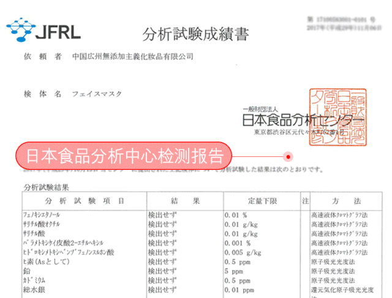

JFRL可是日本检测超严格的机构，通过这个检测的国内企业，我查过了——**不到5家。**

而他们家光是关于“无添加”这一技术，就有不少盖章**。**

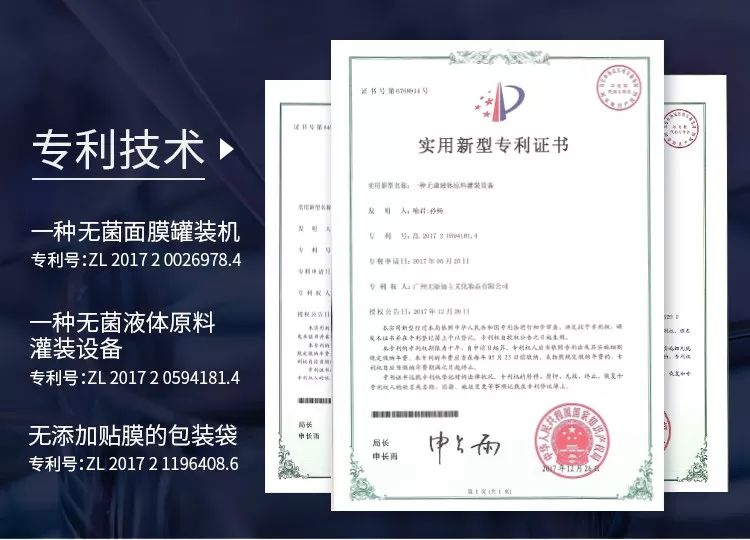

堪比太空舱的100级生产空间，也能感受到自然兰对产品的用心。

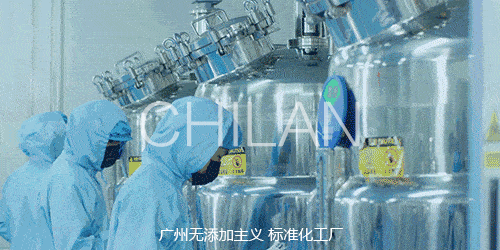

因此，自然兰的产品，可以放心囤！孕妇和敏感肌的小可爱们，也都可以用起来哦~

