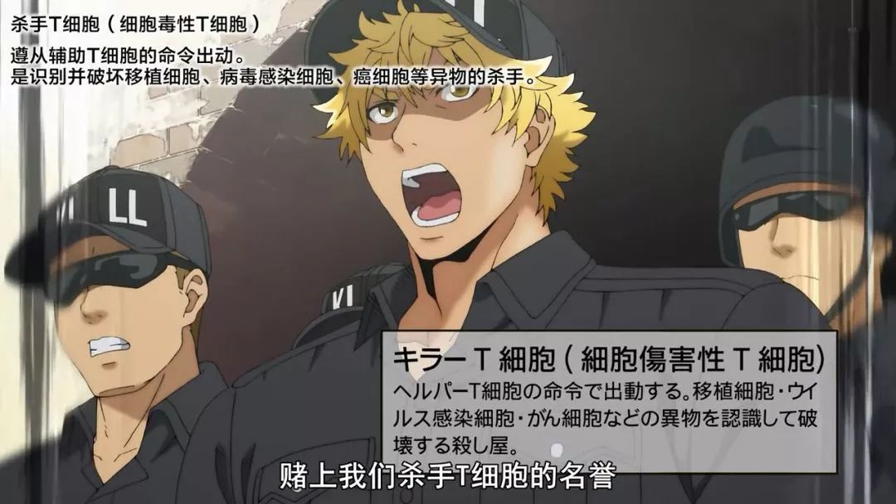
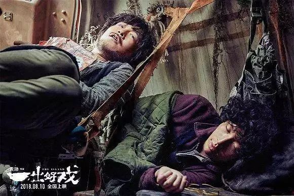
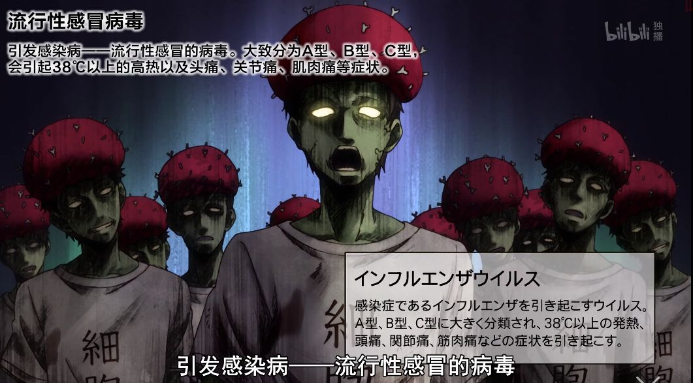

##  R级黄暴污的金酸梅电影，真就那么差吗？

原创 有部电影 
前段时间大家都在讨论奥斯卡奖，其实今年的金酸梅奖也引发了一波关注。

在今年的金酸梅名单里，出现了一个叫“最差肆无忌惮漠视人命和公共财产”的奇葩奖项，《小丑》光荣入选……

这个奖项虽然有点好笑，但从这一点就能看出，金酸梅的讽刺意味，其实远远大于对影片质量的严肃评价。

而且，每个人对电影的评价标准本来就不同，别人的最差，说不定就是你心中的最佳。

比如今天聊的这部电影，也曾经被提名为“金酸梅最差影片奖”。但影片好不好，还真是要看过才知道——**《欢乐时光谋杀案》。**

这部电影最特别的地方，在于它是一部真人和布偶结合的影片，片中的洛杉矶，是一个人与布偶和谐共存的城市。

男主角菲尔就是一个蓝色布偶，他曾经当过警察，如今是一名私家侦探。

这天刚开门营业，菲尔就接到了一单生意。

一个名叫桑德拉的女布偶，自称收到勒索信，想请菲尔前去调查。

根据勒索信上不同寻常的剪报字体，菲尔顺藤摸瓜来到了当地的情趣用品店，想根据杂志购买记录，寻找新的线索。

可万万没想到，就在他查记录的功夫，店里发生了惨烈的一幕：一个黑衣人忽然闯入，枪杀了所有在场的布偶，枪枪爆头，不留活口。

作为命案现场的唯一证人，菲尔见到了这辈子最不想见的人——女警探康妮。

他们之前是警察搭档，后来因为菲尔退出警界，两人产生嫌隙，一言不合就撂狠话。

在菲尔看来，这次布偶枪杀案是一起早有预谋的袭击。

而没过多久，又一起命案印证了他的推断——过气布偶明星拉瑞，遭遇三条狗入室分尸，惨死在自己的豪宅中。

巧的是，拉瑞和之前死在店里的兔子布偶，都是90年代人气布偶剧《欢乐时光》的演员。

也就是说，凶手的目标很可能是要把“欢乐时光帮”给团灭。

考虑到凶手还会继续行凶，警方要求菲尔作为顾问，和康妮搭档调查这起连环凶杀案。

随后，他们去了“欢乐时光帮”的经济公司，看过合同后，他们推断凶手很可能就是“欢乐时光帮”成员之一，他为了独吞合约酬劳，企图杀掉其他人。

之后，菲尔和康妮开始挨个寻找“欢乐时光帮”的其他成员。

但诡异的是，他们的调查速度总是比凶手慢一步。之后又发生了三起命案，凶手每次都是速战速决地爆头，搞得菲尔他们措手不及。

而且因为每次命案发生时，菲尔都恰巧在现场，FBI便认定菲尔有重大嫌疑……

看到这里，估计很多小伙伴已经看出这部电影的剧情有点似曾相识。

这种真人与布偶结合的设定，很容易让人联想到1988年的动画电影《谁陷害了兔子罗杰》。那部电影的故事也发生在美国洛杉矶，同样构建了一个人类和卡通人物共存的世界观。

更巧的是，《谁陷害了兔子罗杰》讲的也是一起凶杀案，主角罗杰掉入了凶手布下的陷阱，涉嫌情杀。

唯一能够证明他清白的，便是做过警察的私家侦探……

相似的故事设定，让人难免会把两部电影放在一起对比。30多年前让动画和真人同框叫创新，而在技术突飞猛进的当下，这样的设计似乎有点偷懒。

因此，国外影评人对《欢乐时光谋杀案》的评价分为两个极端——

《卫报》说它是一盘似曾相识的大杂烩，让人看了感到绝望；

《好莱坞报道者》却认为，作为喜剧，它出色地完成了让人发笑的任务。

客观来说，《欢乐时光谋杀案》最大的缺点就是黄暴段子用得太过头，尤其是影片开场不久的情趣用品店里的戏份，连字幕都有点不忍直视。

这种级别的黄暴，很多人看了都不太适应，很多网友都不相信，这部电影还是华谊兄弟投资的……

但在我看来，**《欢乐时光谋杀案》尽管台词黄暴，故事的核心却并不轻浮。**

片中的洛杉矶，看似是一个人类和布偶和谐共存的乌托邦城市，但实际上布偶顶多算“二等公民”，人类对他们的歧视，渗透到了生活的方方面面。

比如在街头就能看见，一帮孩子霸凌布偶街头艺人，凭借身体优势对他恶意羞辱；

在警察眼里，布偶天生带有“犯罪基因”，对布偶搜身临检已成了家常便饭；

更不用说日常生活中，人类对于布偶的语言羞辱了。

从这里就能看出，片中对布偶群体的区别对待，影射的就是现实生活中的偏见和歧视。

而除了针砭时弊之外，《欢乐时光谋杀案》对于人物性格的刻画也精准到位。

在片中，有些布偶为了摆脱糟糕的生存环境，通过不同方式寻求人类的认同感。

比如前面提到的过气布偶明星拉瑞，当年走红时，他还是标准的蓝皮肤、呆萌的圆鼻子，是无数观众的童年回忆；

而如今，拉瑞为了让自己看上去更像个“人”，不惜去做了皮肤漂白，还换上了一个仿真鼻子。

他口口声声说布偶无需否认自己的身份，但内心已经产生了认同焦虑。

同样想要寻找认同感的，还有男主角菲尔。

他当年是唯一一个成功当上警察的布偶，希望通过工作，向世人证明布偶也可以像人类一样成就大事业。

然而，在一次执行任务时，菲尔开枪射偏，没能打中布偶歹徒，反而害得路人躺枪、康妮受伤。

这个失误给了媒体大做文章的机会，政府迫于压力紧急颁布了“飞利浦准则”，从此严禁布偶当警察。

从那以后，菲尔变得生无可恋，认为布偶永远无法在人类世界出人头地。

而他的消极态度，也彻底激怒了搭档康妮，两人从此分道扬镳。

实际上，康妮之所以对菲尔心怀怨念，也源自那次事故。

当时她受伤严重，需要立刻进行手术，但情况紧急，菲尔把她送去了最近的布偶医院。

最终，康妮被移植了布偶肝脏，神奇地活了下来。但这个身体变化，让她一度自我怀疑，也切身感受到了布偶在日常生活中遭遇的歧视。

**从这个角度看，《欢乐时光谋杀案》绝非只有黄暴污，它所讨论的正是当下社会的偏见与歧视，以及人们的身份认同问题。**

而菲尔和康妮再次联手破案，某种程度上说，也是他们完成自我蜕变的过程。

在被FBI锁定为嫌疑人后，康妮意识到案情复杂，想办法带着菲尔逃出了警局。他们必须赶紧查清楚“欢乐时光帮”仅存的两个成员。

然而等他们赶到对方住处时，发现那对夫妻已经惨遭毒手。

更糟糕的是，他们还没来得及找到凶手的踪迹，就被FBI堵在了门口。

很明显，这个凶手并非像他们之前推理的那样，是某个“欢乐时光帮”成员。他的目标也并非只有金钱，而是想把所有黑锅都甩到菲尔身上……

坦白来说，看这部电影前，我对它的预期并不高，甚至觉得布偶角色会让影片显得孩子气。

但看过之后才发现，它其实是妥妥的少儿不宜，对白黄暴无下限，脑洞猥琐无边际。

值得一提的是，这部电影拍起来并不容易，与《泰迪熊》系列不同的是，片中布偶的动作并非特效，而是由布偶师来完成的。

每个布偶角色背后，其实都藏着一群“绿巨人”帮手……

而在布偶师的操控下，布偶们也因为各种细微的动作被赋予了丰富的性格，显得既生动又可爱。

**就像我在开头说的，每个人对电影的评价，都会不可避免地带上主观色彩。****不管是对“神片”不感冒，还是看“烂片”看得津津有味，都没有什么问题。**

**但所有评价的前提，是必须完整地看过电影，因为这才是对电影工作者最大的尊重。**

